# C++学习笔记

## 前言：

- 所有课程课件
- 本笔记
- vscode的work工作目录
- GitHub和gitee的提交
- 面经
- 纸质笔记
- 现代C++32讲
- .......

## 右值引用

常考：什么是左值，什么是右值？什么是左值引用？什么是右值引用？

左值引用就是左值的引用，右值的引用就是对于右值的引用。

左值引用通常避免对象的拷贝（函数传参数，函数返回值）；

C++11的右值引用通常应用于：移动语义，完美转发，


前置自增自减就是左值；

后置自增自减是右值中的纯右值，是纯右值的还有字面值，返回非引用的函数调用（比如fun();）；

**为什么后置自增自减是纯右值？**

C++11引入了一个新的值类型：将亡值；

**将亡值：**


引用的目的是修改变量值，而const 左值引用const 左值引用可以引用右值，但不能修改这个右值；所以引入了右值引用；

右值引用可以引用左值，但要使用std::move（）；

你如果实现了移动构造和移动赋值构造，那么纯右值将变为将网址，并调用这两个函数，否则调用拷贝构造；

引用声明就得初始化；

移动语义：不必重新构造资源，而是把另一个对象的资源复用一下从而生成新的对象；有了移动构造就不必拷贝构造了；

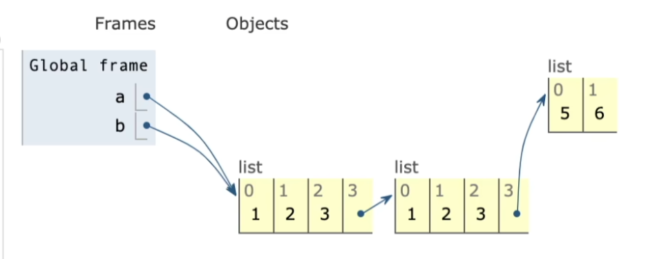

这是浅拷贝（任意一个对象修改值，则另一个对象都会受影响）；

深拷贝就是重新开空间，而移动语义是直接复用另一个对象的资源；比如，本地服务器对象连接了数据库，这个不用了，另一个想用，此时重新连接太费事了，直接移动语义一下，相当于复用了上一个连接；

STL也实现了各种接口，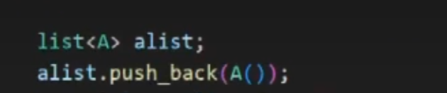

上述代码，A()作为一个右值，调用后会进入类A的A(A&&)函数，然后将A的资源移动到alist中。

完美转发：
主要和函数模板搭配使用；

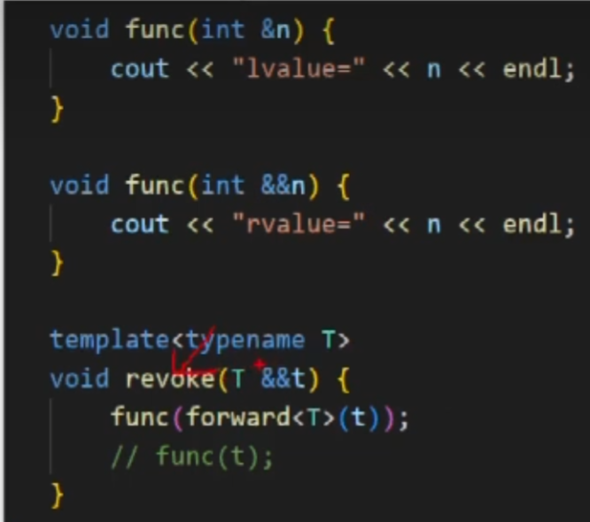

即：将函数的右值引用参数完美转发到函数内嵌套调用的函数中去；

此处的完美转发不仅能把参数成功地转发给下一层函数，还能保证参数的左右值属性不变；

```
移动语义是 C++11 里引入的一个重要概念;
```


右值引用解决左值引用没有解决的：局部对象或者变量返回（内置类型还好，最大就是double，但自定义就很大了），

- 

左值我们可以获取它的地址，左值引用就是给左值取别名（引用），左值引用既可以引用左值，也可以引用右值，后者得const；


&&就是右值引用，函数的值返回就是右值；右值引用就可以给右值取别名，左值引用只有const时才可以给右值引用；

右值引用可以给move的左值取别名；

const T&可以引用左和右值；void fun(const int & ref);

总之：&一般引用左值，要引用右值，请加const；&&一般引用右值，要引用左值，请move左值；

左右值引用区分的原因场景：


（ret1之于s1是深拷贝，是不同的地址；而ret2之于s1+！是移动拷贝，因为后者是将亡值，ret2继承了它的空间；）

如果你想要把s1给废了，即想继承它，可以bit::string res_of_s1 = move(s1);


总之，右值引用解决左值引用的问题，后者减少了拷贝（函数传引用参数，函数传引用返回），但左值引用不能解决：函数内部对象的引用返回，


到了C++11：


（在str析构之前就把资源转移给valStr（移动构造）然后再去析构）；相当于编译器把return str;->return move(str);str是左值，他给move了；


（如果传左值，走左边，因为右边的话，你得move）

（如果传右值，走右侧，注：左侧因为加了const所以也可以，但编译器会匹配右侧，没有右侧则匹配左侧）；


轻易move左值，可能那个左值就没了，再访问是UB；

比如：


前者就是没了，但是后者还在；

move是库中的方法，返回值是右值；


（左为C++11，右为C++11）；


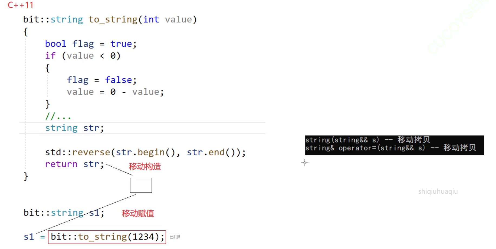

（C++11）

C++98则会拷贝构造+拷贝赋值；

【注】相同的拷贝构造or拷贝赋值才会优化；一次拷贝构造+拷贝赋值不会优化；


const&可以延长生命周期，否则他只有波浪线那一行的生命；


## 完美转发（引用折叠）

何为折叠：&&->&，你传右值就是&&，传左值就折叠为&


完美转发不会使转发转早；forward<T>(x);

详见下图：避免因为转发过早导致调用了深拷贝而不是移动拷贝；


下图示例：添加了forward<T>();后，你传右值就是移动拷贝了，那个深拷贝是push_back(s1);


总结：加了forward<T>()后会保持变量原有属性；

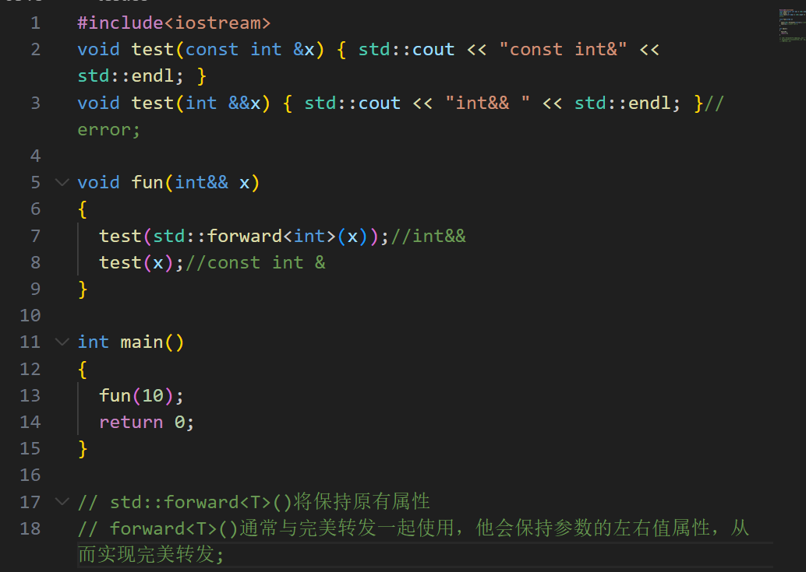

## 成员函数


（左值s1调了默认生成的拷贝构造，move（s1）后变为右值，所以调用了移动构造）；左值进不了T&&那个移动构造，只能调用默认生成的拷贝构造；

总之，移动构造函数是一种特殊的默认构造函数，接收右值引用作为参数，偷取另一个对象的资源；

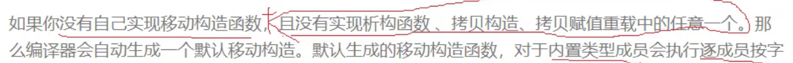

（这样的原因是编译器认为你如果实现了以上的那四个的任意一个，他就认为这是一个深拷贝，那么它就不会自己实现了，因为深拷贝如果要写为移动构造的话，开发者写更好）；

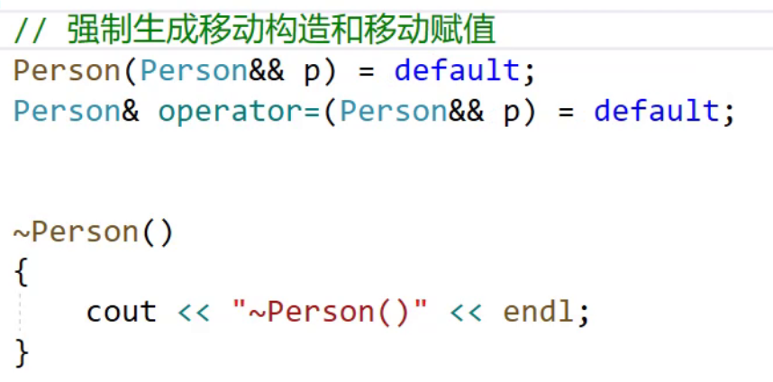

（当实现了析构函数后，移动构造和移动赋值就不再生成，但你还想要，就可以Person(Person&&other） = default;

Person& operator=(Person&&) = default;

有时我们不希望对象被拷贝（单例模式or I/O流），你可以设为私有，或者：

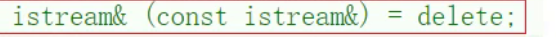


（因为你不写的话，会生成默认的拷贝构造，所以直接delete，）

final会让类不能被继承or重写；

override是检查你有没有重写；

纯虚函数强制让子类重写虚函数；

抽象类无法实例化对象；

## 委托构造

尝试使用委托构造但造成歧义：


```
int main()
{
	Person("zhangsan");//error;
}
```

因为此时调用两个都可以，编译器报错不知道调用哪个；

所以：
```
class Person
{
	Person(const chat* name="", int age)
	:age_(age),name_(name){}
	Person(const chat* name="")
	:Person(name,18){}
};
```

这样去掉缺省参数就可以了；

总之：委托构造：构造函数复用其他的构造函数，但不推荐使用；

## 可变参数模板


（C语言就有）；


（C++增加了模板可变参数）；


底层是怎么做到的呢？
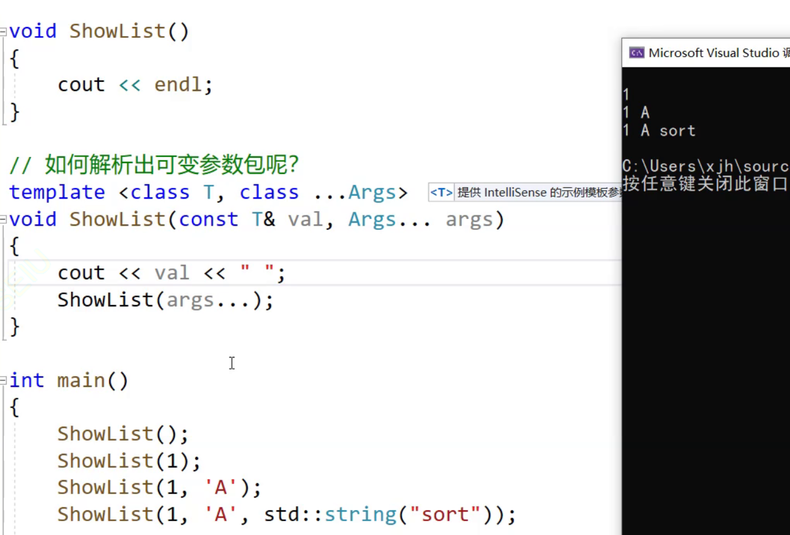

（递归推到思维）；

或者可以理解：
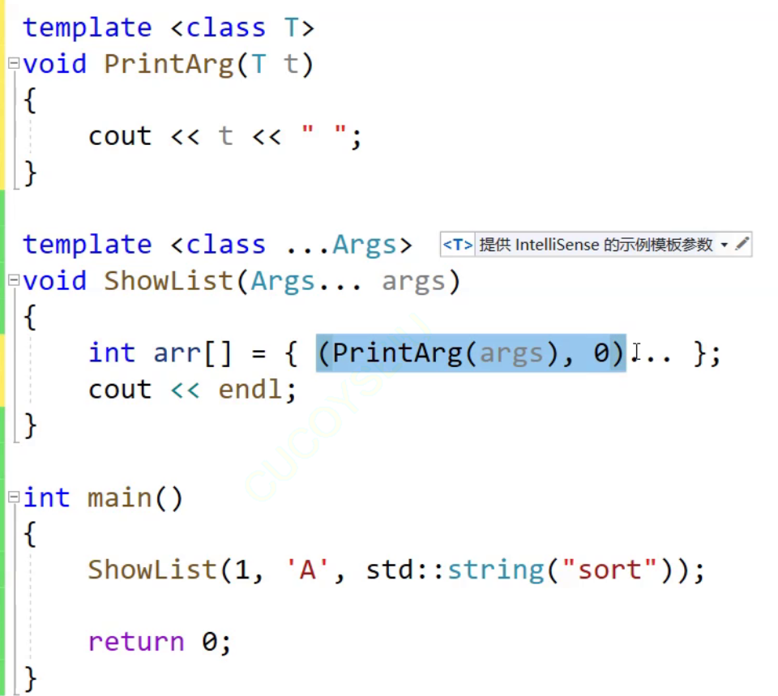

（这个逗号后面的0才是真正放在arr数组中的，只不过是借助printargs函数推演出我们要的参数来并打印；

也可以让PrintArg(){return 0;}然后去掉逗号的0；

参数包代表0-n个参数；

可变参数模板会应用在线程库或其他的库中；

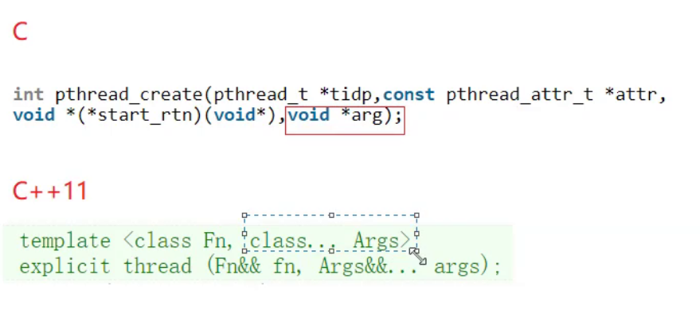

（用到了&&引用折叠，你传左值or右值均可）；

STL容器中都有emplace系列；

他和push_back几乎一样：


前者是先构造一个匿名对象，然后移动构造转移资源，后者是直接构造；

如果是日期类的话，那就区别不大，它是浅拷贝；


emplace_back是可变参数包，一直定位new.....;

总的来说：emplace_back略优于push_back;

## Lambda

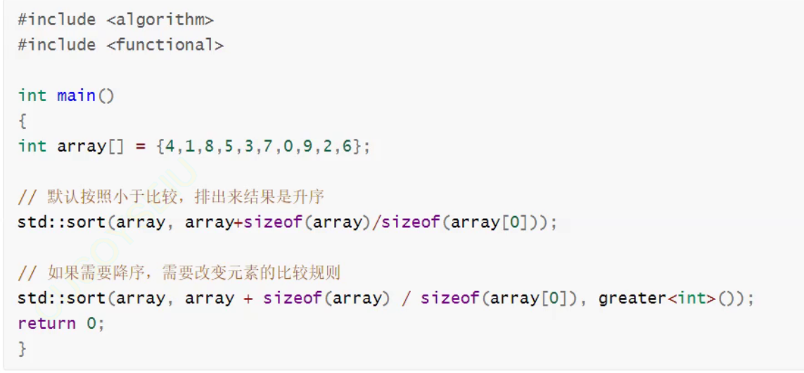


comp可用仿函数，函数指针...

lambda语法：

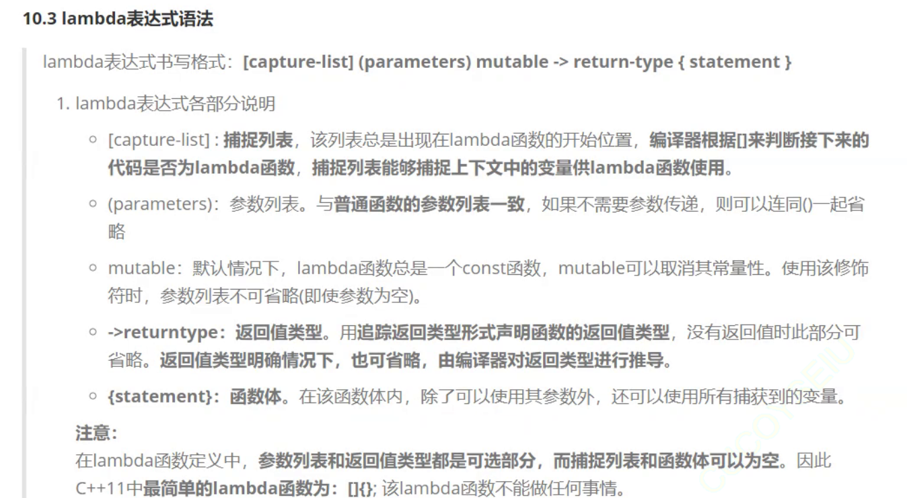


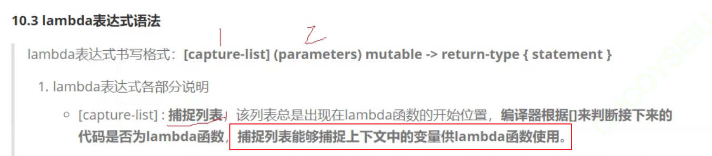

```
auto add_mod = [](int a,int b)->int{return a+b;};
cout<<add_mod(1,2)<<endl;//3
```

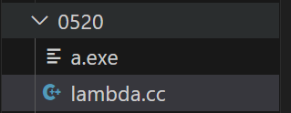

全缺省和无参的不可以重载，编译器不知道调用哪个；

windows（C++98）不能用POSIX的线程库（就是那个线程库pthread库），但是Linux可以用;如果想实现一个同时支持Linux和windows的代码，

只能条件编译了；


C++11就可以用thread库了（封装的）；

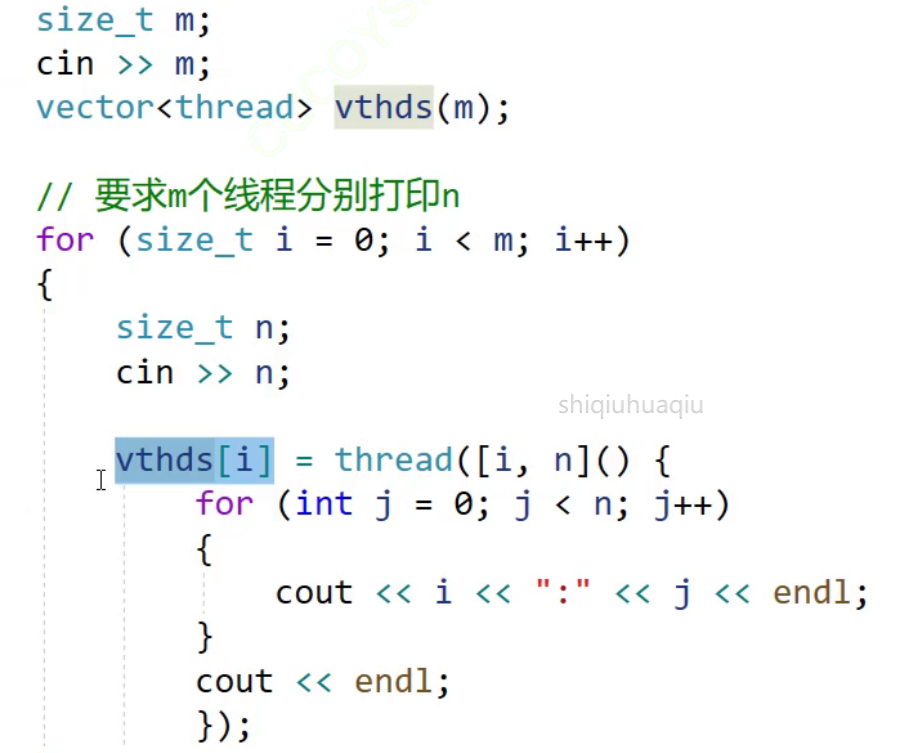

```
for(auto& e: vthds)e.join();
<以上2个图片代码中，利用Lambda表达式构造thread对象，然后把它移动构造给vthds[i]>
```

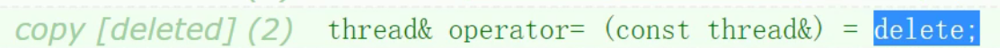

(线程对象不支持拷贝，所以你这样写不对：

```
for(auto e:vthds)e.join();
```

lambda不能互相赋值：因为他的底层是仿函数的类or可以理解为匿名函数，然后你捕获的变量会被当成参数传给类，这个lambda的类型就是那个类，那个类是个空类大小是1；

底层：
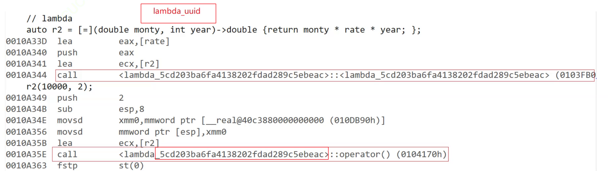

lambda可以捕获父作用域的变量，好像现在爷作用域也可以了？

## 包装器

对于可调用对象（lambda 函数指针，仿函数.....）进行封装

头文件：#Include<functional>


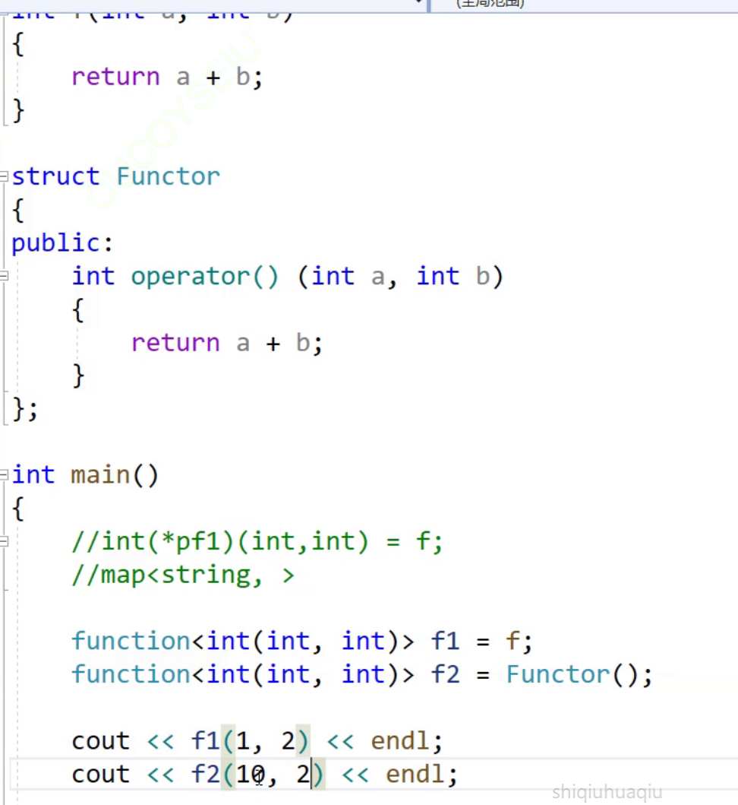

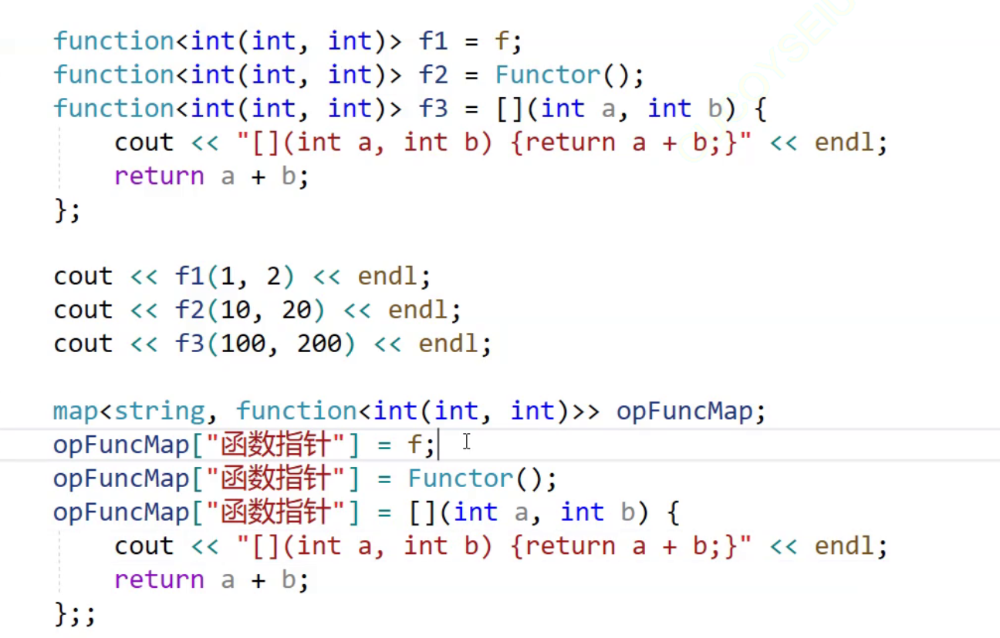

(包装器也可以作为类型参数传入)；


（这样就可以调用了）；

一个题用包装器解决：
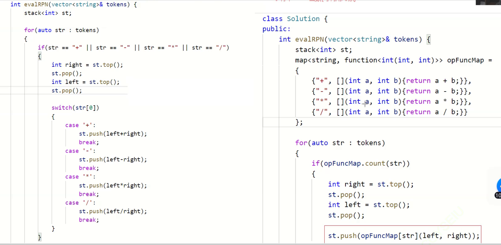

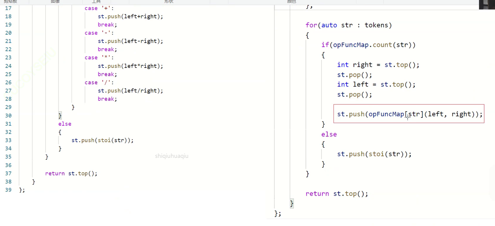

总之：包装器可以包装普通函数orlambdaor仿函数；


如上，包装静态成员函数；

```
class Plus
{
public:
	Plus(int v):_rate(v){}
	int plusi(int a,int b){return a+b;}
```


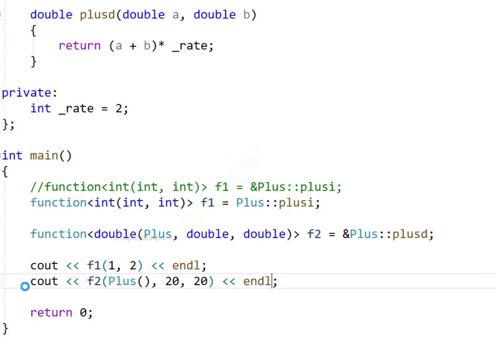

如果你是静态成员函数，请加类域；如果是成员函数请加&＋类域+对象（因为成员函数有this指针），调用时请构造匿名对象或者使用有名对象；

右值（匿名对象）不能被取地址，左值（有名对象），所以：


（写为指针后（意思是用指针调用成员函数），但写为取地址匿名对象（右值不能取地址）就用不了了）；

前面写为对象，是让对象调用成员函数；

## C++线程库


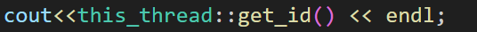

（使用this_thread类中的get_id()来打印线程id，即哪个线程执行这个代码，就打印出了它的id），this_thread是一个namespace;

不能使用线程对象直接调用get_id();如thread t; t.get_id();


（vthds是一个vector<thread>,在for循环中打印这个线程id并sleep一秒）；注：threa库中休眠比Linux复杂；


休眠200毫秒；

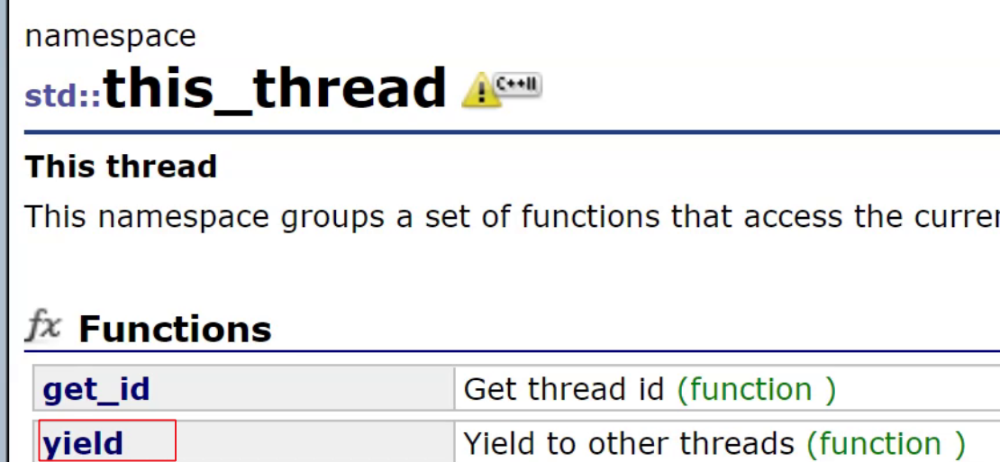

（yield可以让出时间片，常用于无锁编程）；


（Linux中的CAS的原子操作，它记录下它初次访问的值，操作完成后再回来看那个值与我初次见面时一样不，若一样，把操作结果付给他，反之重新操作）；

C++11对于windows中的CAS的接口做了封装；

CAS即硬件同步原语；对于这种需要原子的操作也可以用锁实现；当然，锁很重，所以有时无锁编程；

类似需要原子操作的情景还有：在尾部插入值；

静态区是共享的，函数参数这些栈上的东西不一样，地址不一样；比如你把mutex写在了局部，那就无法实现多线程编程；

```
//global
mutex mtx;
//接下面的代码
```


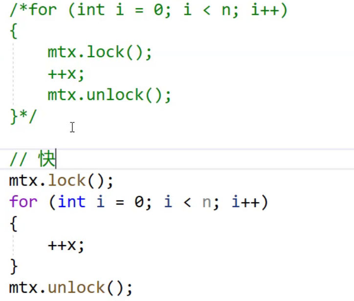

（下面更快：上面频繁加解锁，下面直接加锁后加完再出来解锁），而且上面代码可能睡眠时把锁带走了。

```
int x = 0;
```


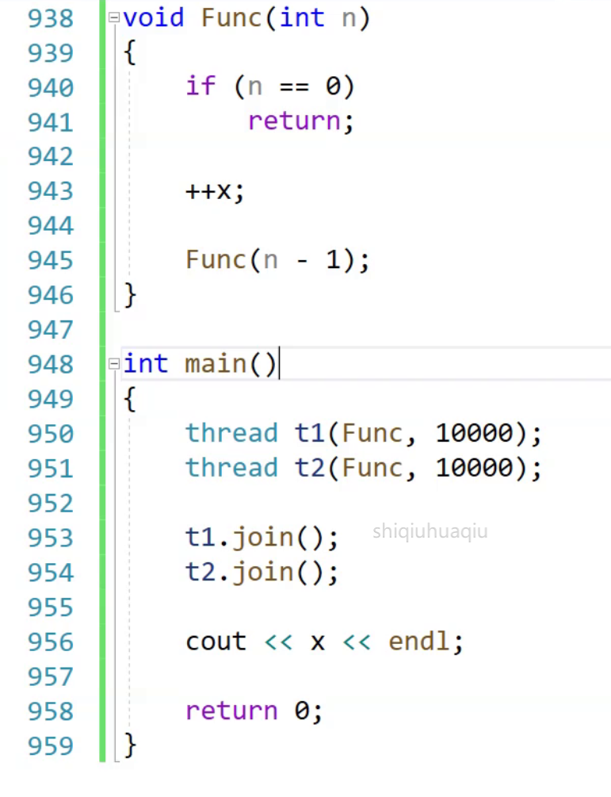

（栈爆了，但是release下就还好）；

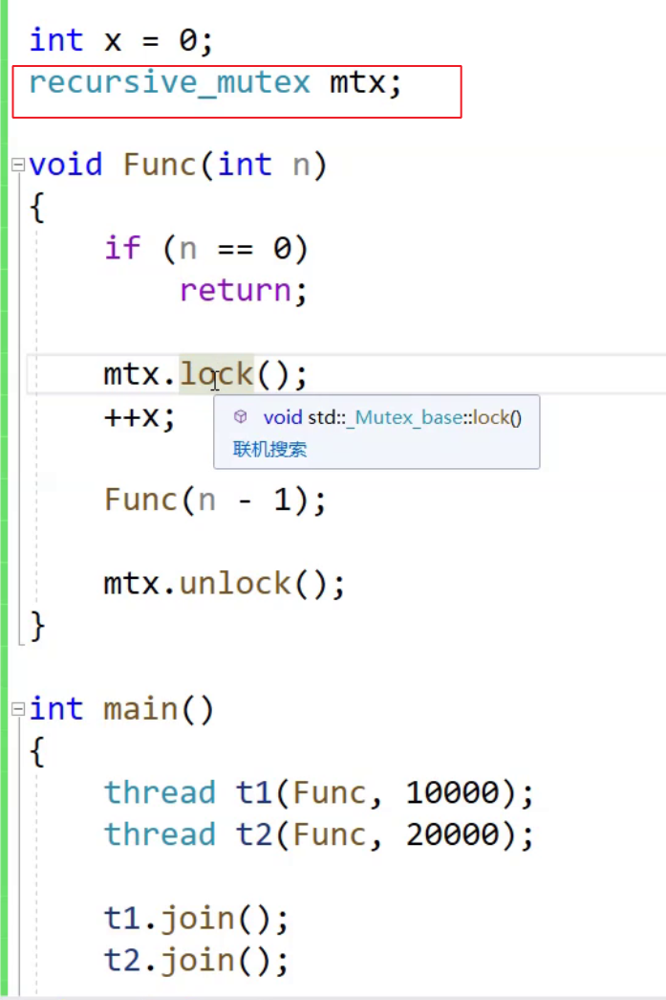

（递归锁：常用于递归中加锁，避免死锁）；

加解锁中间如果抛异常了，那么也会阻塞其他线程，解决方法：

```
template<class Lock>
class LockGuard
```


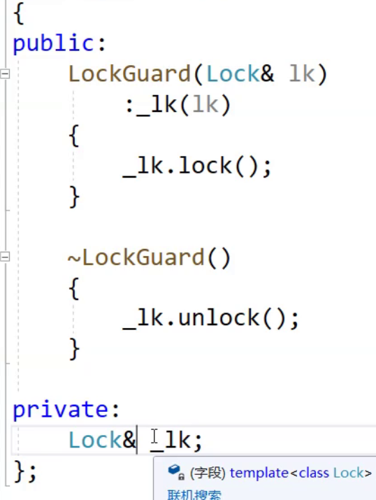


即使用RAII思想，让对象帮我们加锁，如果中间出了异常，离开这个函数，就会释放锁；

【注】：引用必须在初始化列表初始化；


（库中实现了lock_guard）:


还有unique_lock


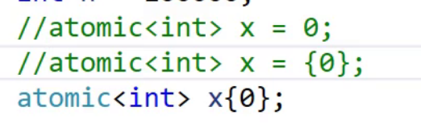

有了std::atomic后，你++x也是原子的，底层是CAS硬件实现；

——————————————————————————————————————————————————————————

条件变量不是线程安全的，要与锁配合；

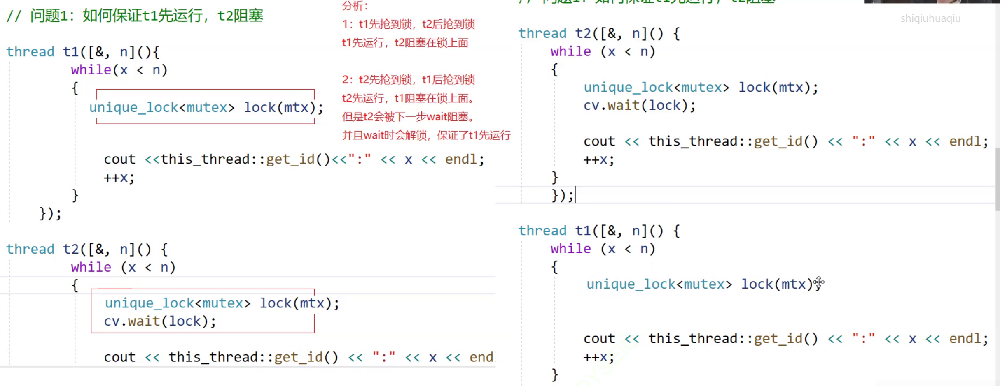

（使用条件变量与锁配合，让t1先运行），在t1先运行后，还要此后实现两者交替运行一次，

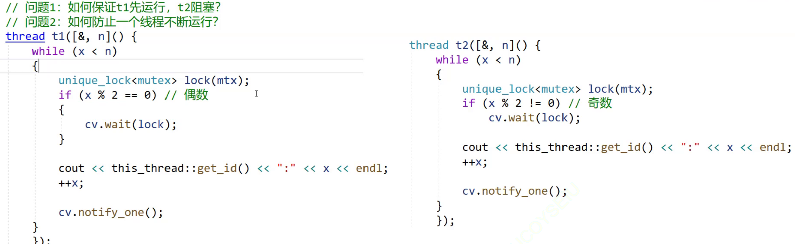


（lock是局部变量，一次{}后就析构了；进入while条件进行判断，然后再次抢锁）；

另外可以使用：


（更换if判断）：

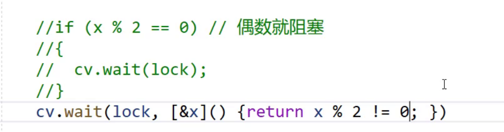

同理，t2代码：


——————————————————————————————————————————————————

## std::bind


利用bind调整参数顺序，其中_1和2是占位符，在库里面声明的；

他就像适配器一样，是一层封装；

不写auto：


除了调整参数顺序还可以调整个数（在封装成员函数时很有用）：

-——————————————————————————————————————


//...

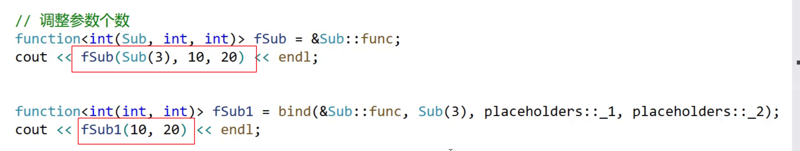

---------------------------------------------------


(还可以绑死第二个参数）；

## 异常

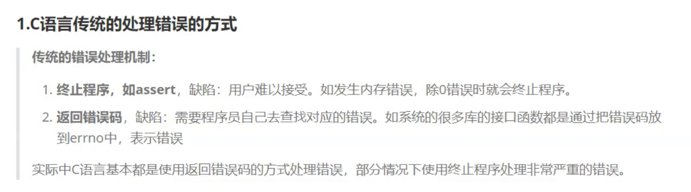

错误码的本质是错误的编号，C++扩展了C，它搞了一个抛出异常+捕获异常；


触发throw，不在那里的函数返回，直接跳回catch{}内；另外，throw什么类型，catch的（）中要匹配，比如throw"haha";

那么catch(const char* str){cout<<str<<endl;}

try与catch是配对的；

跳的时候是距离它更近的那个catch块**且**catch（）中的类型是一样的那里；如果有极端情况：没有任何一个catch（）中匹配，那就说明你这个异常没有捕获，所以直接出事了，什么错误就出什么事情；

catch只有异常捕获后才进入catch块；另外，无论异常是否抛出，完事儿后从catch那里的下一条语句执行；

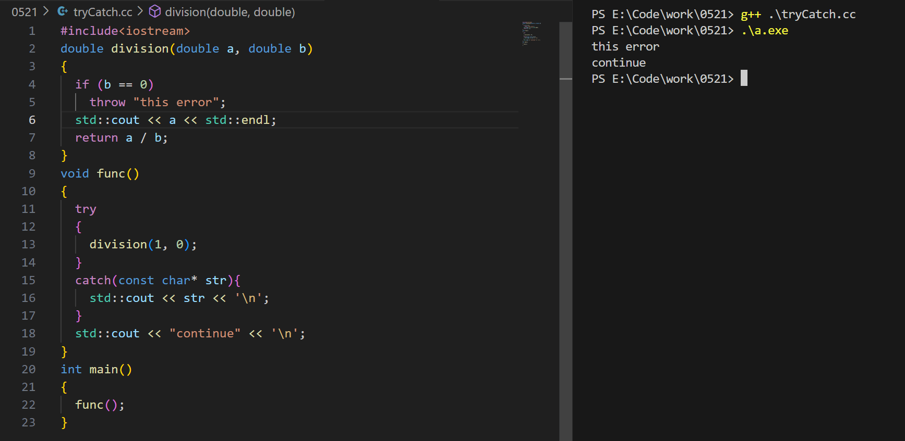

(回来后，这个continue还是打印的)，但是throw后的代码就不打印了；比如那里的a；

记住：catch后面还有（）别忘了；

————————————————————————————————————————


catch中你捕获时，你要让这个throw抛异常时返回一个对象（本质是这个对象的拷贝，所以你throw时可以直接throw匿名对象），对象带着错误信息编号和错误信息；你在catch（）中用const T&捕获，并从这个对象中暴露出来的函数中得到错误信息+错误信息编号；

如下：


——————————————————————————————————————————————————————


（**模板和万能引用（引用折叠）相配合**，编译器推演有一个过程）；

———————————————————————————————————————————————————————————


(使用...来接受所有异常，一般放到最后，防止前面有漏掉的异常，这样也方便程序员检查，另外也因为漏掉的异常将导致程序终止，我们不想这样)；

【exception】【名词】【异常】

————————————————————————————————————————————————————————————

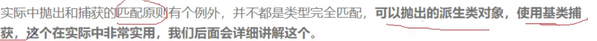

派生类到基类的类型转换是正常的，所以这里用到了继承和多态，有利于各种类型的错误原因阐述；

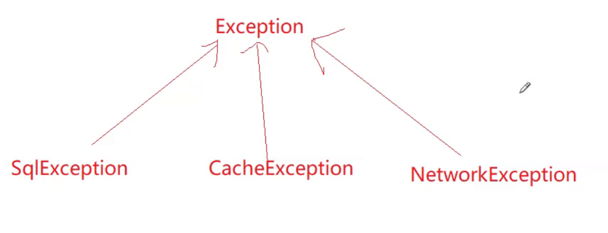

抛子类，catch这里用父类接受就行了;

另外：你如果
```
catch(const Derived&){}
catch(const Base&){}
```

即父类子类都捕获了，那么它会走近的；但实际中一般不同时写

————————————————————————————————————————————————————————————


上图是库中的exception结构，其中new调用operator new，如果申请内存失败就会抛std::bad_alloc;

比如越界就抛std::out_of_range;

总之，exception中的成员函数很多都是virtual的，这样就让子类自己根据需要实现，利用了多态；

————————————————————————————————————————————————————————————

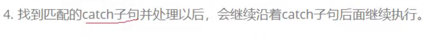

————————————————————————————————————————————————————————————


如果division出错了，那么就不会执行delete []array;从而memory leak;所以要try一下cout<<division()<<endl;然后紧接着catch(){};

这样，catch处理后，仍然执行delete[] array;

-----------------------------------------------------------------------------------------------------------------------------------------------------------------------------------

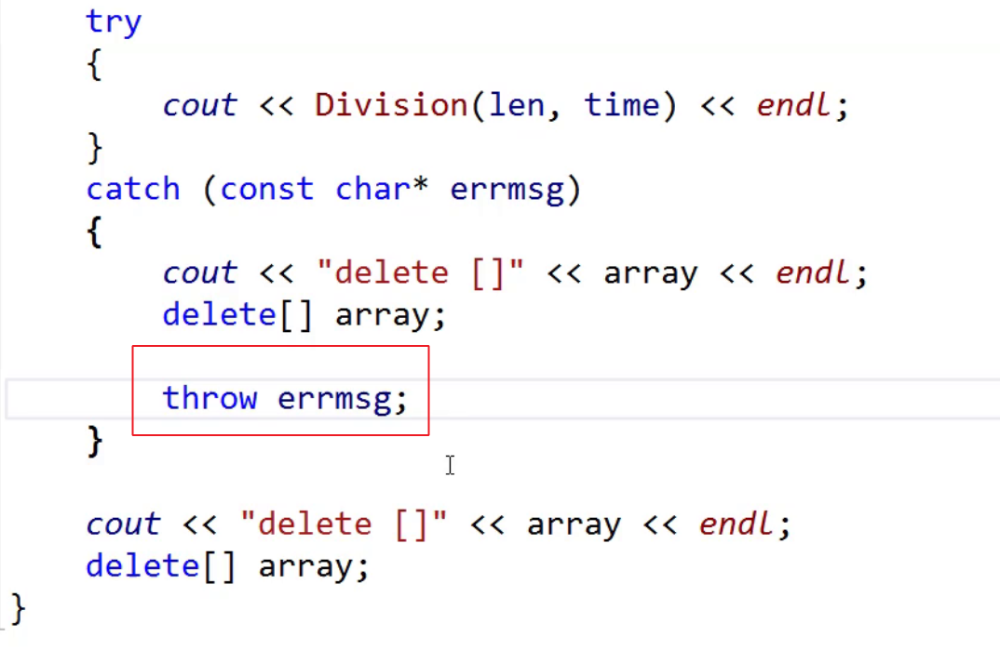

(异常的重新抛出：再捕获异常后，执行相关释放资源代码后，然后再抛一个异常)；


（但是上面的这个无法完全catch到所有的异常类型，所以我们搞了一个...来捕获，然后执行资源释放代码，atch内再抛出去）

————————————————————————————————————————————————————————————

异常规范or异常声明（可以不给，给了可阅读性强）：


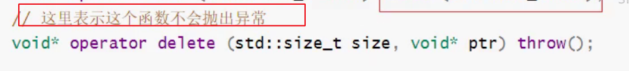

C++98如上，C++11如下，做出了简化，并兼容98：
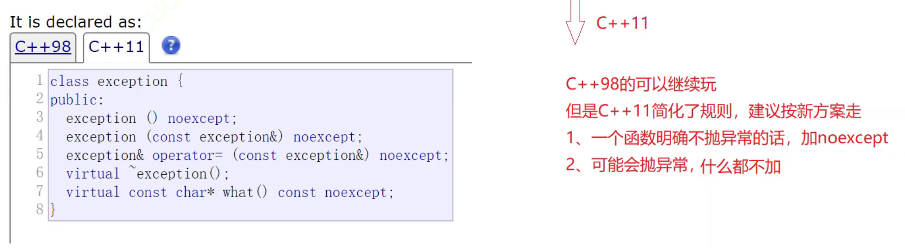

————————————————————————————————————————————————————————————

C语言搞的errno太low了，C++搞了一个异常，一般都是抛对象；

异常会让程序的执行流发生巨大变化，可能会造成内存泄漏等异常安全问题；

特别是调用其他人的库时，你不知道它抛不抛异常or加解锁问题，所以C++11搞了一个：异常规范：noexcept（不跑一场写一下）；另外还有RAII来解决（比如智能指针）；在MSVC中，你注了noexcept但是抛了异常，就会warning，可惜间接地（函数里套函数，被套的函数抛异常，而套的函数注noexcept）抛异常是不会检测到的。所以见到noexcept不能就完全相信他不会抛异常；

另外：加了noexcept之后，如果出现异常，那你用try catch（）{}就无法完成捕获，异常的产生直接终止掉程序；

————————————————————————————————————————————————————————————————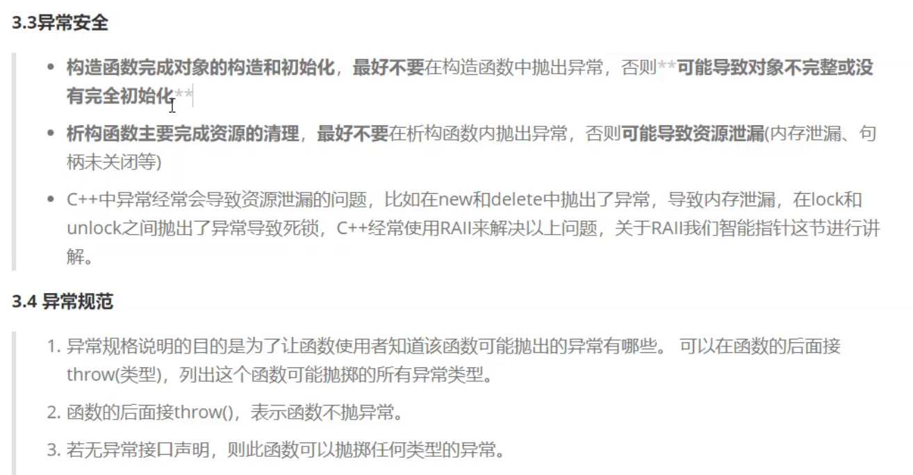

即：析构or构造一般不要抛异常；C++中这种配对的都不应该异常：new/delete+malloc /free +fopen /fclose(资源描述符被用完了)+lock /unlock;

公司中最难查的问题是偶现的问题......

- 异常的优点：

相比C语言的errno，会清楚描述错误比如你是SQL语句出错了.....甚至堆栈调用等，从而更好定位bug；

相比errno的层层返回，异常会直接跳执行流；

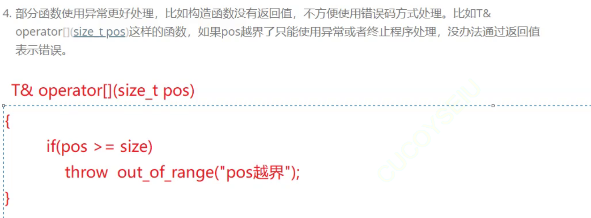

（你用异常就可以，但是assert就在release就不行）

- 异常的缺点：
  执行流乱跳；比如你打个断点，但是因为程序异常而执行流已经走了；

———————————————————————————————————————————————————————————

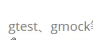

前者是单元测试后者是打桩测试的库，会用到异常；

——————————————————————————————————————————————————————————

java是跑在虚拟机之上的，它有垃圾回收机制.....而C/C++是直接跑在OS之上的；

好多公司看不上标准库的异常体系，会自己实现；


## 智能指针


上图：如果p1失败，那会直接抛，但如果p2抛，那你就得delete p1;了，如果有很多这样的配对，那就麻烦了，但你如果不管就会memory leak；Windows和Linux都会有内存泄漏检测工具，但其实这是亡羊补牢，所以我们需要直接在代码中就写正确，即智能指针；

```
template<class T>
class SmartPtr
{
	public:
		SmartPtr(T*ptr):_ptr(ptr){}
		~SmartPtr(){delete _ptr}
		T& operator*(){return *_ptr;}//when Smart<int等内置类型> p1; *p1...
		T* operator->(){return _ptr;}//when SmartPtr<自定义> p1;   p1->...
private:
		T* _tr;
};
```


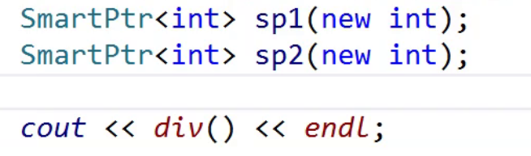

这是RAII的思想（利用对象的生命周期管理资源）；


RAII是一种思想(构造函数拿到资源，析构函数释放资源)，smart pointer是其产物，有点像LoakGuard;

————————————————————————————————————————————————————————————


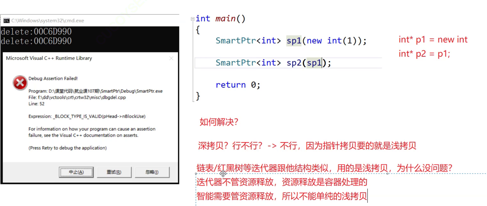

```
//C++98搞了一个auto_ptr来解决拷贝问题：
~auto_ptr()
{
	if(_ptr)
	{
		delete _ptr;
	}
}//这样实现比不判断空指针好一点；
```


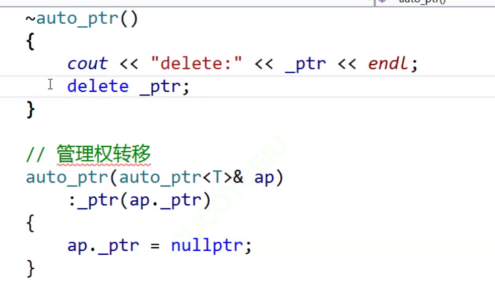

（可以这样实现，但被拷贝的这个auto_ptr在拷贝后会悬空（nullptr）,如果再解引用了这个空悬指针就麻烦了）；

————————————————————————————————————————————————————————————

在C++11之前，又出了一个boost库（体验服）；

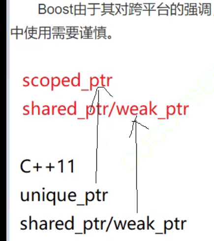

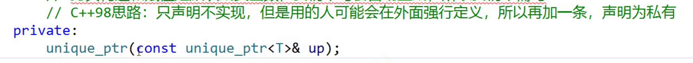

unique_ptr是防拷贝的，用C++98是如上实现的；


C++11有了之后，则是如上；

但是仍然有许多需要拷贝的问题：所以有了shard_ptr:
总之，不拷贝用unique_ptr，要拷贝用shard_ptr，永远不用auto_ptr;

如何实现shard_ptr:


不能用static int,因为静态成员变量，属于所有类的对象；


所以需要对象出来时就跟一个计数，即类的构造函数；


shard_ptr的浅拷贝和构造析构如上；

shared_ptr的赋值运算符重载：


（当然还要防止自己给自己赋值以及不是同一个指针，但其实管理同样的资源，所以我们用_ptr的地址来确定）；

————————————————————————————————————————————————————————————

thread这里引用传参必须加ref，否则会报错，这与thread底层实现有关，因为通过打印p的地址，我们发现是不一样的，按理说引用就应该地址一样，所以说记得写ref它是库的一个函数，但有些编译器你不写ref也能编过；

————————————————————————————————————————————————————————————————————


由于对于pcount的加减应该是线程安全的，所以我们引入了锁，当然这个锁就像pcount一样，我们shared_ptr中存储的是它的地址，多个对象指同一个资源，它们的锁应该是同一个锁，从而让他们去抢，从而线程安全；在构造函数时new一个mutex；

当然了，=这里也需要修改，即拷贝时你得把锁的地址拿过来；

但又有新的问题：你这个锁是new出来的，所以在最后一个shared_ptr离开的时候你应该把锁也释放了，但：


你把锁释放了，怎么unlock呢？


- 面试时，手撕shared_ptr;

————————————————————————————————————————————————————————————

shared_ptr本身是线程安全的，它的加减是加锁了的，但是它管理的资源不一定是安全的，因为这个资源的加减有可能是没有加锁的；

所以你使用shared_ptr出现问题，有可能是你的资源有问题；

shared_ptr有循环引用问题：shared_ptr指向的资源之间互相有智能指针指向彼此时，出现资源析构不掉的情况，从而memory leak;


怎么解决？用weak_ptr,它负责解决shared_ptr的循环引用；


链表中相邻节点之间的连接用weak_ptr而非shared_ptr；


weak_ptr指向资源，但是不增加引用计数；也就是说2个Listnode之间是weak_ptr了，而不是shared_ptr了；

————————————————————————————————————————————————————————————


weak_ptr的简单实现如上；

------------------------————————————————————————————————————————————————————————

```
class Date
{
	int month;int year;int day;
	~Date(){}//如果你不写析构函数，他就不会崩，因为他认为不析构无所谓你都没写；
};
int main()
{	
	shared_ptr<Date> sp(new Date[10]);
}
```


new []这种在上述代码中，会多开4个字节，存储你new了多少对象，但是没写析构他就不会多开，从而造成崩溃；？？？？？？？

所以需要定制删除器，本质是一个可调用对象，比如函数指针，or仿函数orlambda；


!

为什么要有删除器呢？因为shared_ptr在析构时候不知道怎么删除，有的是堆上的数组，有的是文件（你总不能delete吧，应该fclose）;


```
//使用一波shared_ptr<FILE> p+自定义删除器；
#include <memory>
#include <cstdio>

int main()
{
  // 打开文件并检查是否成功
  FILE *file = fopen("test.cpp", "w"); // 注意这里使用 "w" 模式来写入文件
  if (!file)
  {
    // 处理文件打开失败的情况，例如输出错误信息
    perror("Failed to open file");
    return 1;
  }

  // 使用自定义删除器创建 shared_ptr
  std::shared_ptr<FILE> p(file, fclose);

  // 现在可以安全地使用 p 进行文件操作
  const char *content = "#include <iostream>\n\nint main() {\n    std::cout << \"Hello, world!\" << std::endl;\n    return 0;\n}\n";
  if (fprintf(p.get(), "%s", content) < 0)
  {
    // 写入文件失败，处理错误
    perror("Failed to write to file");
    return 1;
  }

  // 文件会在 shared_ptr p 的析构函数中自动关闭
  return 0;
}
```


它会以正确的方式打开文件并写点东西，然后在智能指针析构时fclose；

————————————————————————————————————————————————————————————


库中的删除器是如上实现的；

自己要实现：

首先明白核心目的：在shared_ptr析构时调用一个包装器（比如里面放的函数指针或者lambda）去把资源释放了；

shared_ptr加一个function<void(D*)>并缺省给一个啥也不做的lambda，在你利用上述图片中的样子传一个函数对象过来时，把类del传给包装器，然后在最后一个shared_ptr析构时把shared_ptr里的资源指针_ptr指针转移到包装器里删除，下述代码会直接调用合适的函数对象来释放资源；————————————————————————————————————————————————————————————————————————

注：在shared_ptr中，如果面试遇到循环引用问题，把listnode的shared_ptr互相指向来讲出来即可，从而转到weak_ptr上；

-————————————————————————————————————————————————————————————————————

## 特殊类设计

- 设计一个类不能被拷贝

我们知道：你不实现，编译器会帮你实现，所以我们得自己声明一下，但防止有人在外边实现，所以直接设置为私有，C++11可以delete；

- 设计一个类只能在堆上创建对象


但是它避免不了拷贝构造：


所以还需要禁掉拷贝构造：
```
  HeadOnly(const HeadOnly &) = delete;
```

- 设计一个只能在栈上创建的;公有的static getobj()函数....

- 设计一个类不可以继承；finial或者私有构造函数;

## 设计模式

就像是《孙子兵法》；

单例模式：想让一个对象全局（一个进程）只有一个，比如线程池；

单例模式的两种实现方式之饿汉模式or懒汉模式

```
//饿汉模式+懒汉模式
#include<iostream>
#include<vector>
#include<string>
using namespace std;
class Singleton
{
public:
  static Singleton* getInstance()
  {
    return _ptr;
  }

  void Add(const string&s)
  {
    _v.push_back(s);
    for(auto & e:_v)
    {
      std::cout << e << " ";
    }
    std::cout << '\n';
  }
private:
  Singleton()//构造函数私有化
  {
  }
  int _x;
  vector<string> _v;
  static Singleton *_ptr;//类内声明，类外定义
};
Singleton *Singleton::_ptr = new Singleton;
int main()
{
  Singleton::getInstance()->Add("hanhao");
  Singleton::getInstance()->Add("hello");
}
// 饿汉模式;保证了多线程看到同一资源;但是一上来就创建了对象;对标懒汉模式(第一次调用getInstance时创建对象)如下：
static Singleton *getInstance()
{
  if (_ptr == nullptr)
  {
    _ptr = new Singleton;
  }
  return _ptr;
}
```


饿汉是全局的初始化，不存在线程安全问题，因为main还没有启动，不存在多线程；而懒汉是在static Singleton* getInstance()中new的，存在多线程竞争问题，所以需要加锁，而编写多线程代码往往比较难；


 有的时候会忘记调用delInstance();从而无法持久化，所以：


类外：SingleInstace::GC SingleInstance::gc;

这个静态对象要调用析构函数，从而间接调用了delInstance();比如：


【注】：饿汉or懒汉都要把拷贝构造delete掉：T&(const T&) = delete;

——————————————————————————————————————————————————————————

指针式内置类型，没有析构，无论它是static的还是什么；


懒汉的另一种实现如上；即局部的静态，另外它在main结束后会自动调用析构函数，不用我们的gc；但也有问题：多线程调用就有问题；如下：


————————————————————————————————————————————————————————————————

## 类型转换

C的隐式类型转换+强转


——————


这个会出问题在pos==0时；

C++搞了4个转换：


- static_cast


- reinterpret_cast

- const_cast

  

  volatile const int a = 2;之后答案就是3 3，他要求你从内存取数据；

  

- dynamic_cast(C++独有)；

  


dynamic_cast用于子指针或引用转为父的指针或者引用；


dynamic_cast会先检查你指向父类还是子类：


如上，如果这个指针指向父类，想转为子类指针，那就不成功，返回0；反之成功，而强转则没有这个检查，所以说不安全；

另外：dynamic_cast要用，父类得有虚函数；

## RTTI


## I/O流

C语言的scanf和printf无法很好打印自定义类型；

C++做了不少工作；


cstrl+z+\n会给cin的errno设置，从而while跳出去；


cin可以做while的条件判断，它实现了：


如上，cin实现了自定义类型转内置类型；


-——————---————————————————————————————————————————————————————————

单参数构造函数支持隐式类型转换：


要实现，则：


——————————————————————————————

但explicit opearator int (){}就不行了；

——————————


————————————————————————————————————————————————————————


否则会崩掉，因为：


即string有析构函数；

——————————————————————————————————————————————————————————————

C++的二进制读写+文本读写；

C++比C强在文本读写（任何类型，转为字符串）；


————————


————————————提取者如下：


## 空间配置器


内存池一般都存在内碎片+外碎片；

## 复习-容器


string:
c_str

to_string

stoi

reverse/resize(开空间+初始化)/reserve（开空间）

sub_str

queue:

queue.front()queue.back()empty size

stack:
stack.top

priority_queue:
push/pop

top()

bitset:
set

reset

test


## 复习-迭代器

可能是指针，也可能是封装的指针，让我们可以简单地访问容器；


## 复习-STL算法

序列式容器：vector，list，deque

关联式容器：unordered_xxx,set,map;

sort

stable_sort


find

unique

next_permutation/prev_permutation


——————————


前者是从左往右看起，这个值应该放在哪里；后者是从右往左看，这个值应该放在哪里；

————————————


？？？？？

——————————


——————

一个类重载了operator()就是仿函数；对象就可以像函数那样用；

——————

说说你眼中的STL、六大组件、之间的关联关系；

## 面试

- leetcode也要常去；
- 
- 


- **先**系统复习一波（比如先看自己的笔记），**再去**教务网的面经；

- 系统复习：思维导图（看看自己学了点什么）；
- 在备战秋招时，千万不要忘记算法题，
- 博客
- C++orLinux中是有几个重点章节的，必须重点复习，形成博客；
- 笔试强训要回看，不然做了等于白做；
- 有些面经是研究生的面经，别走偏了；
- 
- 秋招投递简历，应该记录下来，录音+自己的面经+投递日程+面试日程；
- 算法题部分：笔试强训+剑指offer+坚持
- 算法题每天都应该写+分门别类写；

## 复习-C++

、


- 类和对象

C语言的指针，指针数组，数组指针，memcpy......

用C++实现stack就是对于C的stack的封装；

构造-析构

拷贝构造-拷贝赋值

移动构造-移动赋值

还有它们什么情况下默认生成；

空类的大小为什么是1；

this指针，存在于栈上，是隐含的形参；

选择题-对象大小计算；

哪些运算符不能重载？

初始化列表初始化，比如哪些成员必须在初始化列表初始化？

static成员；

友元；

匿名对象；

- 模板

模板：函数模板（推演实例化）+类模板（显式实例化）；

模板原理；

非类型模板参数；


为什么模板不支持分离编译；

- 继承和多态

举例你写过的多态代码；

菱形继承是什么？会遇到什么问题？怎么解决？

菱形继承的虚继承如何实现？注：这与多态的那个虚不一样；

多态的条件和原理；

- 异常与I/O流

errno与异常；

io流会写代码即可；

- 类型转换

dynamic_cast.......那三个

- C++11

右值引用；它与左值引用区别，它是如何减少拷贝的；看一下push_back的右值引用参数实现（cplusplus）；

to_string的传值返回；

结合右值引用谈完美转发；

lambda的实现原理（仿函数）；写一个lambda；

**智能指针（重点+模拟实现（比如shared_ptr））;**

定制删除器；

- 拓展学习

现代C++，并发编程实践；

## 复习-数据结构


算法题：


**B树系列在高阶数据结构，看数据库之前把这个看了；**

**网络编程很重要：**


排序->快排+堆排序+归并排序;

快排什么时候最坏？怎么优化？怎么写非递归的；

它的复杂度，它的稳定性；

图的最短路径算法等三个算法，djstala;

扩展：
LRUcache；

并查集；

跳表；

字典树；

线段树；

**排序+搜索式数据结构最常考的；**

## 优先级队列

仿函数又叫函数对象；

std::priority_queue是STL中的，底层是堆；


（仿函数控制，默认是less即大根堆）；

通过给这个priority_queue类传一个模板参数，整个类都可以用；

## 杂乱

```
int main() {
	int arr[] = { 1,5,9 };
	int* p = arr;
	int res = *p++;//后置自增高于解引用，但后置自增有滞后性
	std::cout << res << std::endl;//1
	std::cout << *p << std::endl;//5
	for (int i = 0; i < 3; i++) {
		std::cout << arr[i] << " ";
	}
	std::cout << std::endl;//1  5  9
	return 0;
}
```


### ODR

C/C++中有一个重要概念：ODR （one definition tule problem），即在整个程序中，每个实体（变量、函数、类）只能有一个定义；

具体规则：只在一个源文件定义，但可以在不同的源文件多次声明；

如果违反规则，则有未定义问题；

如何避免？使用#ifdef #endif #ifndef  extern等；

```
//headr.h
#ifndef HEADR_H
#define HEADR_H
extern int x;
#endif

//file1.cc
#include "header.h"
int x = 10;

//file2.cc
#include "header.h"
//不必再定义
```

## extern

```
//add.h
extern inline int add(int x,int y){
	return x+y;
}
```

## 图论C++（0913中秋节开始看杨老师的回放）

### 财大24-05-12第一课：

C++包括：

- 基础部分（封装/继承/多态）

- STL

- C++11标准（智能指针/thread库为核心）


中级课程持续2个月；

***

初始化方案：


三种。等号，括号，花括号；C++中，使用花括号初始化不用管它是数组，变量，结构体；int b();被认为是一个声明；

花括号如果啥也不填写，就是0，无论结构体，数组，变量，对象；

***

C++语言标准：


***

监视：当程序打好断点然后F5，或者不打断点直接F10，然后此时在下图位置找监视窗口；


***


***

C++标准库不会有.h这种；

#include<stdio.h>与#include<cstdio>等价；在.c文件中，需要前者写法，在.cpp/.cc中，两种均可，我们推荐后者；

C11是微软搞的，只能在win中跑，其他系统不一定跑过，像我们使用的scanf_s就是C11；

C++11在win和Linux都可以编译；

***

stderr没有缓冲区，stdout有缓冲器，遇到'\n'刷新；clog有无缓冲则与系统有关；

***

键盘输入：hanxian  hello然后你scanf("%s",str);cin>>str;也一样；

要想把这一行都读进去：

```
const int len = 128;
char str[len]{};
cin.getline(str,len);//默认遇到'\n'结束且不读入回车；
//cin.getline(str,len,'#');//遇到#结束；
```


***

const贯穿在C++语法；

变量：可读可写；const变量：只读；

vs2019对于.c文件按照c的方式编译，.cpp则按照C++编译；


预编译处理头文件和宏替换，编译则是生成汇编语言，这几个都是文本文件，.o是乱码如果你打开的话；

数据区：全局变量+静态局部变量；

栈区：局部变量；

程序运行时，才会分配这个地址空间；

```
#include<stdio.h>
int main(){
	const int a = 10;
	int *p = (int*)&a;
	int b = 0;
	*p = 100;
	b = a;
	printf("%d %d %d\n",a,b,*p);
}
```

这段代码写在.cpp文件中，a作为const变量将在编译时被替换为10，所以b=a；其实就是b = 10;打印出10.你调试时用的是源码，所以监视的时候看到了修改后的100被赋给了b；但其实人家在编译阶段就被改变了；

这段代码写在.c文件中，就不会发生这样的事情；


Ctrl+K转到反汇编，我们可以看到b = a;这一句确实被替换为了[b] = 0Ah;a的十六进制恰好就是A；


.c中，我们不再演示；

总之，c和C++中，const修饰是不一样的；后者在编译时遇到常变量后会替换掉（long long ,short ,int 等）；

***

***


正是因为c编译没替换const，导致这段代码不通过；

***

```
int a{9};
int b{10};
const int*p1 = &a;
*p1 = 8;//error;
p1 = &b;//correct;

int*const p2 = &a;
p2 = &b;//error;
*p2 = 7;//correct;

const int* const p3 = &a;
p3 = &b//error;
*p3 = 2;//error
```

总之：const 修饰谁你就往后看，他如果落在✳的左边，那么解引用就不行，也就是不能改值；如果落在✳右边，p的左边，那么就是p不能改变，也就是指向不能改变；

***


***

凡是未初始化的全局变量（包括结构体）都是0；

***


在c中需要加struct，在cpp中不用加；

***


对于内置类型，只要你用const修饰，请你立刻初始化；无论全局局部；

对于自定义结构体，用const修饰，全局默认是0，局部是随机值；具体还要看main函数中有没有用；


***


前者是可以通过的，后者不行；

***

引用和古代的号，字一样；

***

字面常量不存在空间：int a = &10;//error;

***

&的左边是类型，右边是标识符，则&是引用，而不是取地址；

***

### 理工24-06-29lambda表达式

C++11引入Lambda表达式，它相当于一个不具名的函数；

```
int fun(int a, int b) { return a + b; }
int main() {
	auto fp = [](int val)->int{return val + 10; };
	cout << typeid(fp).name() << endl;
	int ret = fp(100);
	cout << ret << endl;
	ret = [](int a, int b)->int {return a + b; }(10,20);//我们将[](int a, int b)->int {return a + b; }可以整体当作fun，那么fun(10,20)相当于调用了这个函数;
	int ret2 = fun(29 ,11);//上述lamdbda就像是调用函数一样;
	cout << ret << endl;
	cout << ret2 << endl;
	return 0;
}
```


***

```
int main() {
	auto fp = [](int a) {return a + 1; };
	cout << fp(2) << endl;
}
```

可以把->和返回类型一起省略，或者像前面一样直接都写上；

***


注意：只有调用（也就是加上括号后）才是真正被调用；

***


这种就得写上类型了；

***


连参数列表都省略了，因为没参数；

***


全局变量不存在捕获概念；

***


func函数中的lambda可以捕获定义在它之前的局部变量，局部对象，形参。但是其他函数以及定义在他之后的变量和对象它是捕获不了的；

***

```
class Int {
private:
	int val;
public:
	Int() :val(0) {
		cout << "默认构造函数" << endl;
	}
	Int(const Int& other)
		:val(other.val) {
		cout << "拷贝构造函数" << endl;
	}
	Int(int x) :val(x){
		cout << "带参数的构造函数" << endl;
	}
	~Int() {
		cout << "析构函数" << endl;
	}
	Int(Int&& other)
		:val(other.val) {
		cout << "移动构造" <<this<< endl;
		other.val = -1;
	}
	Int& operator=(Int&& other) {
		if (this != &other) {
			this->val = other.val;
			other.val = -1;
		}
		cout << "赋值运算符重载" << endl;
		return *this;
	}
	Int Add(const Int& x)const {
		int val = x.val + this->val;
		return Int(val);		
	}
	void Print() const {
		cout << "val is " << this->val << endl;
	}
	void SetVaule(int x) {
		this->val = x;
	}
};
int func(int a, int b) {
	Int it(10);
	auto fa = [=](int x, int y)->void {
		it.Print();
		//it.SetVaule(100);
		//a += b;//Lambda表达式改为了=，表示按值捕获，而不是按照引用，副本具有常性，不可修改，但是可以打印;
		cout << x << " is x and y is  " << y << endl;
	};
	int c = 10;
	it.Print();//
	cout << "a= " << a << endl;//
	fa(12, 23);//
	it.Print();//
	cout << "a= " << a << endl;//
	return 0;
}
int func2(int a, int b) {
	Int it(10);
	auto fa = [&](int x, int y)->void {
		it.Print();
		it.SetVaule(100);
		a += b;
		cout << x << " is x and y is  " << y << endl;
	};
	int c = 10;
	it.Print();//
	cout << "a= " << a << endl;//
	fa(12, 23);//
	it.Print();//
	cout << "a= " << a << endl;//
	return 0;
}
int main() {
	func(12, 23);
	cout << endl;
	func2(10, 20);
	return 0;
}
```


Lambda表达式定义完我并没有调用，但是函数走过去调用了拷贝构造函数，原因：系统看到你是按值捕获且Lambda用到了局部对象，所以它在你**定义**调Lambda的时候**就调用**了拷贝构造函数，同样，程序结束也得**调用析构**函数来析构这个对象；如果你在Lambda没用到，他就不调用拷贝构造；

此外，由于是按值捕获，所以不像按引用捕获那样可以修改局部变量/对象/参数的值；

***


对于上述代码，你可以使用关键字mutable，这样你在调用拷贝构造函数生成副本之后还可以对于**副本**进行修改；

总之，Lambda的捕获列表告诉了你想要的一切，你按引用捕获，你就该修改修改，该打印打印，但是按值捕获，只能打印，要修改可以，只能修改副本且加mutable；

***


定义fa时调用两次拷贝构造，程序结束时调用两次析构，当然了，a b两个对象的构造和析构自不必说；

***


我们在带参数的构造函数前添加explicit关键字，那么就防止了隐式类型转换：从等号右侧的int转为等号左侧的Int；

隐式类型转换有时可能会出现难以察觉的转换从而引入bug；

那么怎么在不去掉explicit关键字的条件下，还可以使用Int a = 10;这种写法？


即在Int中添加：
```
static create(int x){
	cout<<"静态工厂方法"<<endl;
	return Int(x);
}
```

***


注意上面这种写法（这叫做表达式类型捕获），v1仍然是a的副本，他的改变不影响a，但是v2是b的引用，改变牵动着b的心；当然了，你对于副本的改变要添加mutable；

***

```
class Int {
private:
	int val;
public:
	Int() :val(0) {
		cout << "默认构造函数" << endl;
	}
	Int(const Int& other)
		:val(other.val) {
		cout << "拷贝构造函数" << endl;
	}
	 Int(int x) :val(x){
		cout << "带参数的构造函数(" <<this<<")"<< endl;
	}
	~Int() {
		cout << "析构函数(" <<this<<")"<< endl;
	}
	Int(Int&& other)
		:val(other.val) {
		cout << "移动构造" <<this<< endl;
		other.val = -1;
	}
	Int& operator=(Int&& other) {
		if (this != &other) {
			this->val = other.val;
			other.val = -1;
		}
		cout << "赋值运算符重载" << endl;
		return *this;
	}
	Int Add(const Int& x)const {
		int val = x.val + this->val;
		return Int(val);		
	}
	void Print() const {
		cout << "val is " << this->val << endl;
	}
	void SetVaule(int x) {
		this->val = x;
	}
	static Int create(int x) {
		cout << "静态工厂方法" << endl;
		return Int(x);
	}
	Int operator+(const Int& other)const {
		cout << "operator +" << endl;//使得Int类型之间可以相加
		return Int(other.val + val);
	}
	Int operator+(int x)const {
		return Int(x + val);//使得int可以和Int相加
	}
	friend Int operator+(int x, const Int& other) {
		cout << "friend Int operator+" << endl;
		return Int(x + other.val);
	}
	Int operator*()const {
		cout << "operator *" << endl;
		return *this;//支持解引用
	}
	friend std::ostream& operator<<(std::ostream& os, const Int& other) {
		cout << "opeartor <<" << endl;
		os << other.val;
		return os;
	}
};
int main() {
	cout << "lambda" << endl;
	auto important = std::make_unique<Int>(1);
	cout << "******" << endl;
	auto add = [v1 = 1, v2 = std::move(important)](Int x, Int y)->Int{
		cout << "*v2="<< * v2 << endl;
		cout << "_______" << endl;
		return x + y + v1 + (*v2);//为了支持int和Int的加法，以及对于Int的解引用，以及下面对于Int类型的cout，我们在Int类中实现了很多重载;
	};
	cout << "&&&&&&&&" << endl;
	cout << add(3, 4) << endl;
	//cout << "Main::*v2= " << *v2 << endl;//v2在离开Lambda后被销毁;
	cout << "important=" <<important << endl;//important在经过std::move那里后被置为空指针
	cout << "%%%%%%%%" << endl;
}
//unique_ptr的所有权从important转移到了v2，这是通过unique_ptr的移动构造函数完成的，此后important变为NULL，v2指向了那个对象，
//unique_ptr是独占所有权的指针，不能被复制，只能被移动，使用 std::move 允许我们在不复制的情况下转移 unique_ptr 的所有权。
//这种技术常用于将独占资源的所有权转移到闭包中，使得 Lambda 可以在以后的某个时间点使用这个资源，同时确保资源的正确管理和释放。这是 C++ 移动语义的一个强大应用，允许我们高效且安全地处理独占资源。
```


注意：这涉及到复杂的C++对象声明周期管理，比如add(3,4)返回一个创建的临时对象，它被用作90行cout的参数，endl被输出，刷新流，90行整个表达式执行完毕，此时010FF7C0被销毁；

***

***


上上面是表达式捕获，上面是泛型捕获；

***


28行：Lambda表达式是按照值捕获的，m_real的值被修改了，按理来说并不能真正修改（甚至是在不加关键字mutable的情况下）；


要做到不修改m_real，我们可以这么做：


this指针本身常性，func函数加了const表示要求this指针的指向为常，所以m_real不可被修改；

***


参数这里加了const表示的是it不能被改变，包括it这个对象的任何值，但是val是可以改变的；

***


***


***

```
struct Stu {
	string name;
	int age;
	string sex;
};
void Print(vector<Stu> svec) {
	for (const auto& e : svec) {
		cout << e.name << " " << e.age << " " << e.sex << endl;
	}
	cout << endl;
}
int main() {
	vector<Stu> svec;//容器中放的是对象，就可以用lambda表达式进行一些操作；
	svec.push_back({ "aanxian",14,"man" });
	svec.push_back({ "danxian",13,"woman" });
	svec.push_back({ "danxian",13,"woman" });
	svec.push_back({ "danxian",13,"woman" });
	svec.push_back({ "danxian",13,"woman" });
	svec.push_back({ "danxian",13,"woman" });
	svec.push_back({ "hanxian",12,"man" });
	sort(svec.begin(), svec.end(), [](const Stu& a, const Stu& b)->bool {
		return a.age < b.age;
		});
	Print(svec);
	string id;
	cout << "id>" << endl;
	cin >> id;
	auto p = find_if(svec.begin(), svec.end(), [&id](const Stu&s)->bool {
		return s.name == id;
		});
	if (p == svec.end()) {
		cout << "NOT FIND" << endl;
	}
	else {
		cout << p->age << " " << p->name << " " << p->sex << endl;
	}
	return 0;
}
```


***

```
struct Score {
	string id;
	int a;
	int b;
	int c;
};
void Print(vector<Score>& vec) {
	for (const Score& e : vec) {
		cout << "id:" << e.id << " a: " << e.a << " b: " << e.b << " :c " << e.c << '\n';
	}
	cout << '\n';
}
int main() {
	vector<Score> vec;
	vec.push_back({ "2021030453", 99, 85, 60 });
	vec.push_back({ "2021030454", 99, 85, 60 });
	vec.push_back({ "2021030455", 97, 80, 61 });
	vec.push_back({ "2021030456", 96, 82, 62 });
	vec.push_back({ "2021030457", 96, 81, 60 });
	vec.push_back({ "2021030458", 97, 80, 64 });
	vec.push_back({ "2021030459", 93, 79, 65 });
	sort(vec.begin(), vec.end(), [](const Score&p,const Score& q)->bool {
		//method 1:
		return (p.a > q.a) || (p.a == q.a && p.b > q.b) || (p.a == q.a && p.b == q.b && p.c > q.c);
		//method 2:
		//if (p.a != q.a)return p.a > q.a;
		//if (p.b != q.b)return p.b > q.b;
		//return p.c > q.c;
		});
	Print(vec);
}
```


***

### 工业24-07-11C++类型复习


进入到主函数之前，首先构建全局对象（全局变量，全局数组），在main函数结束时将b析构掉，整个程序结束时析构ac；

***


在普通函数不能使用冒号（又叫初始化列表），只有构造函数（默认构造函数，拷贝构造，移动构造等）才可以这样干；

原因如下：


对于内置类型而言，两种写法没区别，但是对于自定义类型，前者是初始化（生来百万富翁），后者是赋值（通过艰苦奋斗后称为百万富翁）；

在构造函数中已经”生“过（也就是初始化）一次了，然后你在setvalule函数中使用初始化列表又”生“了一次；我们不允许对已经存在的实体重复构建，我们只允许你在大括号内对value的值更改；

总之，我们仅允许构造函数使用初始化列表；

编译器要估算给你一个函数分配多大栈帧空间，但是此时如果你还没有调用构造函数的话，那么你的空间中是没有对象的，只有构造时，经过初始化列表:value（x)，然后对成员初始化，这才是构建对象，然后程序会进入构造函数的大括号内；

***


why?The answer is:


总结：

普通对象可以调用常方法，也可以调用普通方法；

常对象只能调用常方法，而不能调用普通方法，；

***


const是修改this指针的，你类的成员函数都有this指针，这个全局函数没有this指针，它不属于任何类型；

***

成员方法如果不去修改调用者的成员值的时候应该尽可能使用const修饰，这样可以使得成员方法更加通用，且保证函数内不修改调用者的成员的值；

如下：无论你是常对象还是普通对象，均可调用：


***


C语言作用域：全局+函数内+块，C++加了一个类作用域；上述函数参数名与类的成员名命名相同，由于就近原则，参数的value在函数内把类的value给隐藏了。


***

vs2022的优化太强，我们无法将代码与C++的规则关联；

***


都是赋值方式初始化对象；

***

定义：要分配内存的，设计：不分配内存空间；所以我们常说设计一个类型Int；

***

拷贝构造函数：使用一个对象初始化另一个对象；如果类型设计时没写拷贝构造，系统提供缺省的拷贝构造（按位拷贝）；


拷贝a的大小也就是4字节；

***


***


结果：


这就是构造函数的第三个责任:类型转换,x会被用于构建一个不具名的临时对象

***


***

***


第二个图：90被传入构造函数，构建不具名对象，然后operator=的参数左值引用了这个不具名对象，在operator=内部对a的成员修改，然后再销毁临时对象；不具名：右值：常引用可以引用右值，常饮用既可以引用左值，又可以右值；所以第一个图那个x是左值，非const引用引用不了；

***


把临时对象（也就是it）的value给调用者也就是*this;

***


当程序有operator=函数时，a = b本质是operator(&a,b);

**Int类中，成员函数都有Int* const this；调用者的地址会被this指向；**

***


防止自赋值；

***

如何做到连续赋值：


***


逗号表达式的值是逗号右边的值，也就是y，所以a = (x,y)相当于 a = y;利用 整形y去构建临时对象是不行的，因为Int中构造函数要求有两个参数；

怎么办？


***

***


前者是强转，后者是构建临时对象。这不一样；

***


***


***

T& fun(){};//是否可以返回T的引用，取决于此函数结束，该变量是否还在，比如它是属于某个对象的；

***


***

但是加上const就不行了：


所以：


**注：他们调用的函数是不同的；**

此外：


如上，这样做使得const对象可以被修改，这破坏了const的规则；

***

拷贝构造函数的调用时机：一个对象初始化另一个对象+返回值类型+值类型作为参数......


***

### 工业24-07-28C++友元和静态

我是你的友元，我就可以访问你的非公有成员；反之不行；

友元不具有传递性，继承性。这就是友元的三个特点；

友元：可以访问某个类所产生对象的非公有成员；

第一种：外部函数


***


error：自上而下编译不认识Test；


函数没有实现；

此时我们改变func函数参数类型：


你使用了非指针或引用，便报错，因为我们自上而下编译无法确定这个it对象的大小；

但是你使用指针或者引用就可以，因为成员函数有this指针（void func(Test* const this）;)this是一个指针，32位64位系统下大小确定，所以我们就知道分配多少大小了；


前面只有Test的声明，但不知道Test有哪些数据成员；所以报错：未定义Test；

于是，我们将func的实现放在Test定义之下：


显示无法访问private：


成功！

以上就是第二种友元：一个类中的成员函数是另一个类的友元；（记得加上Object::）；

***

第三种友元：类友元：


这下Object的对象即可访问Test的非公有成员；

PS：friend位置任意，private或者public或者protected；

PS：友元破坏了类的封装性（外部只能访问公有方法改变私有属性）；

PS：公有成员，外部可以访问，友元自不必说；

***


extern告诉编译器，g_max在另一个文件下定义；

但是static修饰的g_max只能在yhp.cpp使用；你在maintest.cppextern是不行的，会报错；

***

总之：

C中：

static可以修饰全局变量+局部变量，它们一旦被修饰，都放在.data区；

前者：只可以在本文件使用，extern也不行；

后者：第一次初始化后不再初始化，这是持久性；

static还可以修饰函数，只在当前文件有效，多文件无效；

C++中，static既可以修饰类的属性，也可以修饰方法，重要地，static修饰方法没有this指针；

***


1：add是一个静态函数，仅本文件使用；

2：fun返回const int*；

3：func只能在本文件使用，返回const int*类型；

const作用于类型，static作用于函数；

***

```
class A{
	public:
	int fun()const;//放在后面表示this指针为常量指针而不是返回const int
}
```

***


进入大括号后，我们就认为成员已经构建完毕了，你赋值就完事了；所以我们应该把num放在初始化列表中；

普通的value可以在初始化列表初始化，也可以在{}内赋值；

const的num必须在初始化列表初始化，不可以再{}；

***

```
class A{
private:
	static int num;//声明
}
```

num不属于任何一个A的对象；他被共享；


静态成员必须在**类外**初始化；而不应该在初始化列表初始化；

```
int A::num  =0;//定义
```

静态成员是和类关联的，而不是和对象关联；前者可以用对象访问也可以用类名访问；

另外：该num作用域是类域；


如上，num只有一份，所以obja等的大小均为四字节；

***


```
cmake && make  //若CMakeList.txt不在当前，请cmake ..
```

CMake直接帮你把Makefile写好了；我去；

***


利用static可以知道创建对象的个数以及销毁了几个对象；

***


***


模板推演出了三段代码；

***


具体地：


总之：
图一模板实例化两个，各有一个num；

图二模板实例化一个，只有一个num；

特别地，static在模板中会“分裂”。具体看代码，要特别注意；

静态成员不能在构造函数初始化。

***

静态成员函数没有this指针（访问不了非静态成员，只能访问静态成员），非静态成员函数有this指针（里面可以访问非静态成员和静态成员）；

静态方法用const修饰就落空了，没有this指针；

静态方法在类外定义时要去掉static关键字。

静态方法/成员，如果是公有的，都可以使用类加四个点访问，反之如果是保护甚至私有，那么就不可以访问；


***


static +变量（非const） 在类外初始化，在类内声明；

static const+整形（int char longlong short）可以在类内声明类外初始化。或者直接类内声明初始化；

如果是一个static const double或者指针或者数组等等等等就得类外初始化，类内声明；

***


error：会无线循环下去；


这样就可以；objx只有一个；

***


构造函数私有，这样就确保了单例模式？


事实证明，上述方法有漏洞，毕竟你暴露了拷贝构造函数；


这样就确保了单例模式的饥汉模式；

另外：删除赋值构造函数的方法：
```
Object& operator=(const Object&) = delete;
```

### 理工24-06-16

***


Int有移动构造，构造，析构；


如上图，双端队列deque的对象有一个二级指针，指向一个指针数组，每一个指针指向Int对象的数组；它会尽量往中间靠，防止你前插要移动，增加消耗；你可以想象从头往一个数组中放值然后头插；

此外：你可以使用迭代器，


将每一个对象，拷贝构造给it，打印完，销毁；

所以请:
```
for(const auto& it:ique){};
```

***

emplace_back是原位构造，它不存在push_back创建对象，移动构造，销毁对象这三步走；只有创建对象一步；

***

vector<Object>增容的话，消耗巨大，所以vector和deque可以配合使用（TODO）？


***

list：双向链表


deque和vector没有remove，因为前两者要求数据紧凑，你remove开销太大；

unique之前要排好序，否则不连续的相同的值不会被删除；

list自己有sort；

****

实现一个Int包装类，写好所有的构造析构函数，往vector中添加删除元素，可以模拟不同操作的消耗；

***

vector.reserve比不reserve消耗更小；

***


***

vector<Object>sort的时候开销巨大，排序时，要调用移动构造+赋值；

而list<Object>sort时候没消耗，他只是改变pre和next的值；

在list排序后再导入到vector；

如果你要对容器频繁插入删除，请用list；频繁查询，请用vector；

***

面试题：关于STL？

什么场景使用vector list？

这块儿多看面经。

***

优先级队列底层是vector；

***

一个数组中放Obj对象，我们要排序消耗巨大，我们可以使用指向对象的指针，然后不停对指针变量改动值；

***

map(底层是红黑树，初始化的时候就已经按照key排好了，所以查询很方便)；

```
#include<map>
struct Stu {
    string name;
    int age;
    string sex;
};
int main() {
    map<string, Stu> mmap;
    mmap["2021"] = Stu{ "hanxian",29,"man" };
    mmap["1989"] = Stu{ "lifang",89,"woman" };
    mmap["1990"] = Stu{ "lisi",78,"man" };
    mmap["1978"] = Stu{ "wang",14,"woman" };
    mmap["1978"] = Stu{ "wangli",78,"man" };
    for (const auto& pp : mmap) {
        cout << pp.first << "][" << pp.second.name << "][" << pp.second.age << "][" << pp.second.sex << '\n';
    }
    string key;
    while (cin >> key, key != "end") {
        auto pp = mmap.find(key);
        if(pp!=mmap.end())//如果是end，则没找到
        cout << pp->first << "][" << pp->second.name << "][" << pp->second.age << "][" << pp->second.sex << '\n';
        //not pp->first() pp->second();
    }
}
```


还可以使用[]:


***

但是使用[]有一个问题：
如果key不存在于map中，那么他就把key插入map中；


如上，我们查询了一个1976，发现不在mmap中，但1976被插入进去了；

所以尽量用find；

***

mutable修饰成员，那么const方法就可以修改了；


***

模板+仿函数：


***


50行那里就是仿函数，系统提供的仿函数在该头文件中；

***


iimap[]返回引用（就是某个数出现次数的引用），然后你对他+=1；这样就统计出了每个数出现的次数；如果哪个数没出现过，他就添加到红黑树中，并调用默认构造函数初始化；


**我们如果想要按次数排序呢？而不是按照0-19排序；**


***


***


***


这三个方法用于一致性哈希，即负载均衡；


迭代器失效？

Lambda表达式与仿函数？

哪些函数都有this指针？

构造函数的任务都有啥？创建对象+初始化对象的数据成员+类型转换；

指针和引用的区别？


​					
