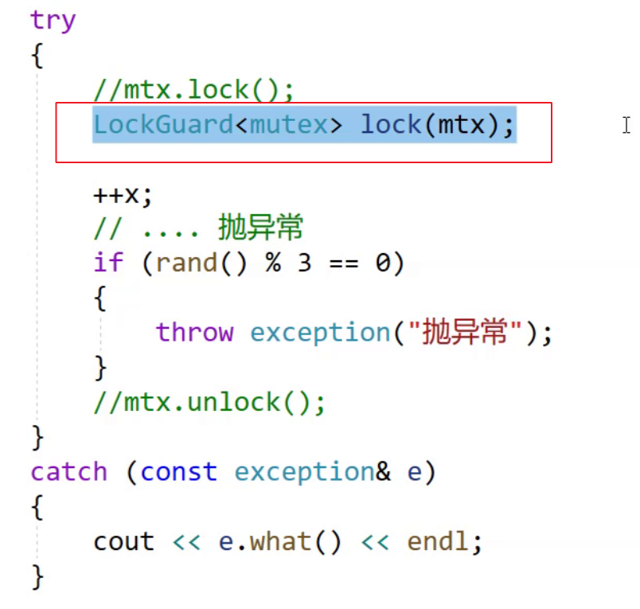
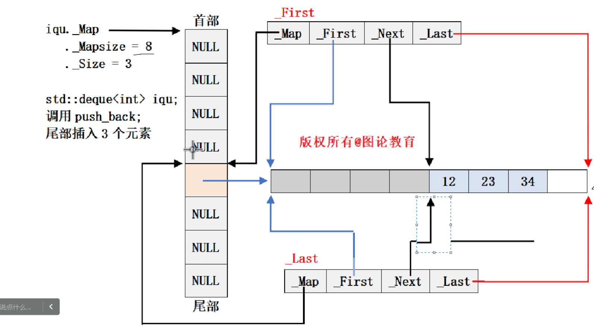
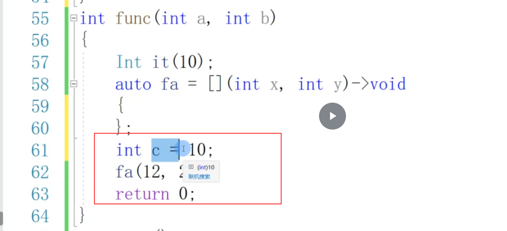
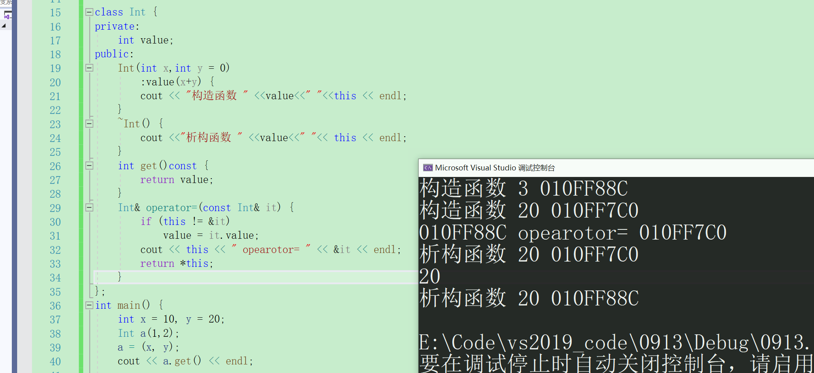
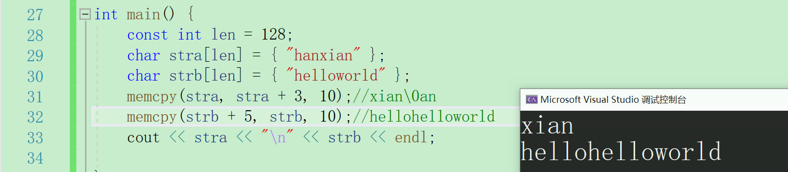
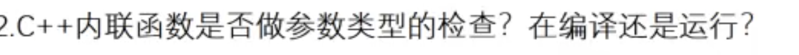
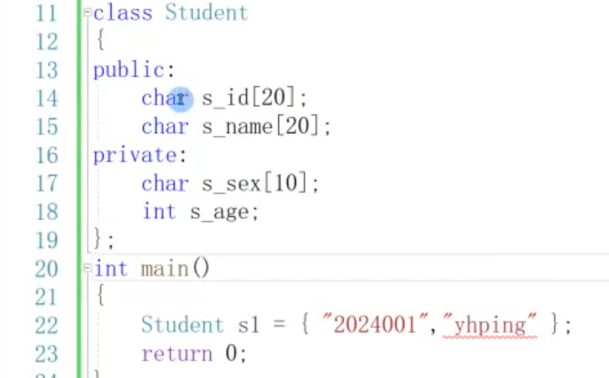
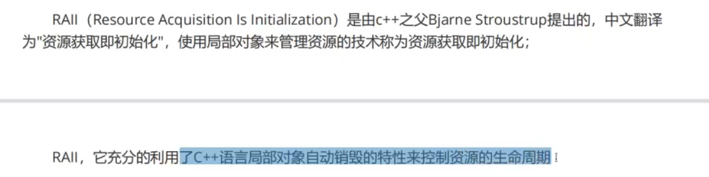

# C++学习笔记


## 前言：

- 所有课程课件
- 本笔记
- vscode的work工作目录
- GitHub和gitee的提交
- 面经
- 纸质笔记
- 现代C++32讲
- .......

## 右值引用

常考：什么是左值，什么是右值？什么是左值引用？什么是右值引用？

左值引用就是左值的引用，右值的引用就是对于右值的引用。

左值引用通常避免对象的拷贝（函数传参数，函数返回值）；

C++11的右值引用通常应用于：移动语义，完美转发，


前置自增自减就是左值；

后置自增自减是右值中的纯右值，是纯右值的还有字面值，返回非引用的函数调用（比如fun();）；

**为什么后置自增自减是纯右值？**

C++11引入了一个新的值类型：将亡值；

**将亡值：**


引用的目的是修改变量值，而const 左值引用const 左值引用可以引用右值，但不能修改这个右值；所以引入了右值引用；

右值引用可以引用左值，但要使用std::move（）；

你如果实现了移动构造和移动赋值构造，那么纯右值将变为将网址，并调用这两个函数，否则调用拷贝构造；

引用声明就得初始化；

移动语义：不必重新构造资源，而是把另一个对象的资源复用一下从而生成新的对象；有了移动构造就不必拷贝构造了；


这是浅拷贝（任意一个对象修改值，则另一个对象都会受影响）；

深拷贝就是重新开空间，而移动语义是直接复用另一个对象的资源；比如，本地服务器对象连接了数据库，这个不用了，另一个想用，此时重新连接太费事了，直接移动语义一下，相当于复用了上一个连接；

STL也实现了各种接口，

上述代码，A()作为一个右值，调用后会进入类A的A(A&&)函数，然后将A的资源移动到alist中。

完美转发：
主要和函数模板搭配使用；


即：将函数的右值引用参数完美转发到函数内嵌套调用的函数中去；

此处的完美转发不仅能把参数成功地转发给下一层函数，还能保证参数的左右值属性不变；

```
移动语义是 C++11 里引入的一个重要概念;
```


右值引用解决左值引用没有解决的：局部对象或者变量返回（内置类型还好，最大就是double，但自定义就很大了），

- 

左值我们可以获取它的地址，左值引用就是给左值取别名（引用），左值引用既可以引用左值，也可以引用右值，后者得const；


&&就是右值引用，函数的值返回就是右值；右值引用就可以给右值取别名，左值引用只有const时才可以给右值引用；

右值引用可以给move的左值取别名；

const T&可以引用左和右值；void fun(const int & ref);

总之：&一般引用左值，要引用右值，请加const；&&一般引用右值，要引用左值，请move左值；

左右值引用区分的原因场景：


（ret1之于s1是深拷贝，是不同的地址；而ret2之于s1+！是移动拷贝，因为后者是将亡值，ret2继承了它的空间；）

如果你想要把s1给废了，即想继承它，可以bit::string res_of_s1 = move(s1);


总之，右值引用解决左值引用的问题，后者减少了拷贝（函数传引用参数，函数传引用返回），但左值引用不能解决：函数内部对象的引用返回，


到了C++11：


（在str析构之前就把资源转移给valStr（移动构造）然后再去析构）；相当于编译器把return str;->return move(str);str是左值，他给move了；


（如果传左值，走左边，因为右边的话，你得move）

（如果传右值，走右侧，注：左侧因为加了const所以也可以，但编译器会匹配右侧，没有右侧则匹配左侧）；


轻易move左值，可能那个左值就没了，再访问是UB；

比如：


前者就是没了，但是后者还在；

move是库中的方法，返回值是右值；


（左为C++11，右为C++11）；


（C++11）

C++98则会拷贝构造+拷贝赋值；

【注】相同的拷贝构造or拷贝赋值才会优化；一次拷贝构造+拷贝赋值不会优化；


const&可以延长生命周期，否则他只有波浪线那一行的生命；


## 完美转发（引用折叠）

何为折叠：&&->&，你传右值就是&&，传左值就折叠为&


完美转发不会使转发转早；forward<T>(x);

详见下图：避免因为转发过早导致调用了深拷贝而不是移动拷贝；


下图示例：添加了forward<T>();后，你传右值就是移动拷贝了，那个深拷贝是push_back(s1);


总结：加了forward<T>()后会保持变量原有属性；


## 成员函数


（左值s1调了默认生成的拷贝构造，move（s1）后变为右值，所以调用了移动构造）；左值进不了T&&那个移动构造，只能调用默认生成的拷贝构造；

总之，移动构造函数是一种特殊的默认构造函数，接收右值引用作为参数，偷取另一个对象的资源；


（这样的原因是编译器认为你如果实现了以上的那四个的任意一个，他就认为这是一个深拷贝，那么它就不会自己实现了，因为深拷贝如果要写为移动构造的话，开发者写更好）；


（当实现了析构函数后，移动构造和移动赋值就不再生成，但你还想要，就可以Person(Person&&other） = default;

Person& operator=(Person&&) = default;

有时我们不希望对象被拷贝（单例模式or I/O流），你可以设为私有，或者：


（因为你不写的话，会生成默认的拷贝构造，所以直接delete，）

final会让类不能被继承or重写；

override是检查你有没有重写；

纯虚函数强制让子类重写虚函数；

抽象类无法实例化对象；

## 委托构造

尝试使用委托构造但造成歧义：


```
int main()
{
	Person("zhangsan");//error;
}
```

因为此时调用两个都可以，编译器报错不知道调用哪个；

所以：
```
class Person
{
	Person(const chat* name="", int age)
	:age_(age),name_(name){}
	Person(const chat* name="")
	:Person(name,18){}
};
```

这样去掉缺省参数就可以了；

总之：委托构造：构造函数复用其他的构造函数，但不推荐使用；

## 可变参数模板


（C语言就有）；


（C++增加了模板可变参数）；


底层是怎么做到的呢？


（递归推到思维）；

或者可以理解：


（这个逗号后面的0才是真正放在arr数组中的，只不过是借助printargs函数推演出我们要的参数来并打印；

也可以让PrintArg(){return 0;}然后去掉逗号的0；

参数包代表0-n个参数；

可变参数模板会应用在线程库或其他的库中；


（用到了&&引用折叠，你传左值or右值均可）；

STL容器中都有emplace系列；

他和push_back几乎一样：


前者是先构造一个匿名对象，然后移动构造转移资源，后者是直接构造；

如果是日期类的话，那就区别不大，它是浅拷贝；


emplace_back是可变参数包，一直定位new.....;

总的来说：emplace_back略优于push_back;

## Lambda


comp可用仿函数，函数指针...

lambda语法：


```
auto add_mod = [](int a,int b)->int{return a+b;};
cout<<add_mod(1,2)<<endl;//3
```


全缺省和无参的不可以重载，编译器不知道调用哪个；

windows（C++98）不能用POSIX的线程库（就是那个线程库pthread库），但是Linux可以用;如果想实现一个同时支持Linux和windows的代码，

只能条件编译了；


C++11就可以用thread库了（封装的）；


```
for(auto& e: vthds)e.join();
<以上2个图片代码中，利用Lambda表达式构造thread对象，然后把它移动构造给vthds[i]>
```


(线程对象不支持拷贝，所以你这样写不对：

```
for(auto e:vthds)e.join();
```

lambda不能互相赋值：因为他的底层是仿函数的类or可以理解为匿名函数，然后你捕获的变量会被当成参数传给类，这个lambda的类型就是那个类，那个类是个空类大小是1；

底层：


lambda可以捕获父作用域的变量，好像现在爷作用域也可以了？

## 包装器

对于可调用对象（lambda 函数指针，仿函数.....）进行封装

头文件：#Include<functional>


(包装器也可以作为类型参数传入)；


（这样就可以调用了）；

一个题用包装器解决：


总之：包装器可以包装普通函数orlambdaor仿函数；


如上，包装静态成员函数；

```
class Plus
{
public:
	Plus(int v):_rate(v){}
	int plusi(int a,int b){return a+b;}
```


如果你是静态成员函数，请加类域；如果是成员函数请加&＋类域+对象（因为成员函数有this指针），调用时请构造匿名对象或者使用有名对象；

右值（匿名对象）不能被取地址，左值（有名对象），所以：


（写为指针后（意思是用指针调用成员函数），但写为取地址匿名对象（右值不能取地址）就用不了了）；

前面写为对象，是让对象调用成员函数；

## C++线程库


（使用this_thread类中的get_id()来打印线程id，即哪个线程执行这个代码，就打印出了它的id），this_thread是一个namespace;

不能使用线程对象直接调用get_id();如thread t; t.get_id();


（vthds是一个vector<thread>,在for循环中打印这个线程id并sleep一秒）；注：threa库中休眠比Linux复杂；


休眠200毫秒；


（yield可以让出时间片，常用于无锁编程）；


（Linux中的CAS的原子操作，它记录下它初次访问的值，操作完成后再回来看那个值与我初次见面时一样不，若一样，把操作结果付给他，反之重新操作）；

C++11对于windows中的CAS的接口做了封装；

CAS即硬件同步原语；对于这种需要原子的操作也可以用锁实现；当然，锁很重，所以有时无锁编程；

类似需要原子操作的情景还有：在尾部插入值；

静态区是共享的，函数参数这些栈上的东西不一样，地址不一样；比如你把mutex写在了局部，那就无法实现多线程编程；

```
//global
mutex mtx;
//接下面的代码
```


（下面更快：上面频繁加解锁，下面直接加锁后加完再出来解锁），而且上面代码可能睡眠时把锁带走了。

```
int x = 0;
```


（栈爆了，但是release下就还好）；


（递归锁：常用于递归中加锁，避免死锁）；

加解锁中间如果抛异常了，那么也会阻塞其他线程，解决方法：

```
template<class Lock>
class LockGuard
```




即使用RAII思想，让对象帮我们加锁，如果中间出了异常，离开这个函数，就会释放锁；

【注】：引用必须在初始化列表初始化；


（库中实现了lock_guard）:


还有unique_lock


有了std::atomic后，你++x也是原子的，底层是CAS硬件实现；

——————————————————————————————————————————————————————————

条件变量不是线程安全的，要与锁配合；


（使用条件变量与锁配合，让t1先运行），在t1先运行后，还要此后实现两者交替运行一次，


（lock是局部变量，一次{}后就析构了；进入while条件进行判断，然后再次抢锁）；

另外可以使用：


（更换if判断）：


同理，t2代码：


——————————————————————————————————————————————————

## std::bind


利用bind调整参数顺序，其中_1和2是占位符，在库里面声明的；

他就像适配器一样，是一层封装；

不写auto：


除了调整参数顺序还可以调整个数（在封装成员函数时很有用）：

-——————————————————————————————————————


//...


---------------------------------------------------


(还可以绑死第二个参数）；

## 异常


错误码的本质是错误的编号，C++扩展了C，它搞了一个抛出异常+捕获异常；


触发throw，不在那里的函数返回，直接跳回catch{}内；另外，throw什么类型，catch的（）中要匹配，比如throw"haha";

那么catch(const char* str){cout<<str<<endl;}

try与catch是配对的；

跳的时候是距离它更近的那个catch块**且**catch（）中的类型是一样的那里；如果有极端情况：没有任何一个catch（）中匹配，那就说明你这个异常没有捕获，所以直接出事了，什么错误就出什么事情；

catch只有异常捕获后才进入catch块；另外，无论异常是否抛出，完事儿后从catch那里的下一条语句执行；


(回来后，这个continue还是打印的)，但是throw后的代码就不打印了；比如那里的a；

记住：catch后面还有（）别忘了；

————————————————————————————————————————


catch中你捕获时，你要让这个throw抛异常时返回一个对象（本质是这个对象的拷贝，所以你throw时可以直接throw匿名对象），对象带着错误信息编号和错误信息；你在catch（）中用const T&捕获，并从这个对象中暴露出来的函数中得到错误信息+错误信息编号；

如下：


——————————————————————————————————————————————————————


（**模板和万能引用（引用折叠）相配合**，编译器推演有一个过程）；

———————————————————————————————————————————————————————————


(使用...来接受所有异常，一般放到最后，防止前面有漏掉的异常，这样也方便程序员检查，另外也因为漏掉的异常将导致程序终止，我们不想这样)；

【exception】【名词】【异常】

————————————————————————————————————————————————————————————


派生类到基类的类型转换是正常的，所以这里用到了继承和多态，有利于各种类型的错误原因阐述；


抛子类，catch这里用父类接受就行了;

另外：你如果
```
catch(const Derived&){}
catch(const Base&){}
```

即父类子类都捕获了，那么它会走近的；但实际中一般不同时写

————————————————————————————————————————————————————————————


上图是库中的exception结构，其中new调用operator new，如果申请内存失败就会抛std::bad_alloc;

比如越界就抛std::out_of_range;

总之，exception中的成员函数很多都是virtual的，这样就让子类自己根据需要实现，利用了多态；

————————————————————————————————————————————————————————————


————————————————————————————————————————————————————————————


如果division出错了，那么就不会执行delete []array;从而memory leak;所以要try一下cout<<division()<<endl;然后紧接着catch(){};

这样，catch处理后，仍然执行delete[] array;

-----------------------------------------------------------------------------------------------------------------------------------------------------------------------------------


(异常的重新抛出：再捕获异常后，执行相关释放资源代码后，然后再抛一个异常)；


（但是上面的这个无法完全catch到所有的异常类型，所以我们搞了一个...来捕获，然后执行资源释放代码，atch内再抛出去）

————————————————————————————————————————————————————————————

异常规范or异常声明（可以不给，给了可阅读性强）：


C++98如上，C++11如下，做出了简化，并兼容98：


————————————————————————————————————————————————————————————

C语言搞的errno太low了，C++搞了一个异常，一般都是抛对象；

异常会让程序的执行流发生巨大变化，可能会造成内存泄漏等异常安全问题；

特别是调用其他人的库时，你不知道它抛不抛异常or加解锁问题，所以C++11搞了一个：异常规范：noexcept（不跑一场写一下）；另外还有RAII来解决（比如智能指针）；在MSVC中，你注了noexcept但是抛了异常，就会warning，可惜间接地（函数里套函数，被套的函数抛异常，而套的函数注noexcept）抛异常是不会检测到的。所以见到noexcept不能就完全相信他不会抛异常；

另外：加了noexcept之后，如果出现异常，那你用try catch（）{}就无法完成捕获，异常的产生直接终止掉程序；

————————————————————————————————————————————————————————————————

即：析构or构造一般不要抛异常；C++中这种配对的都不应该异常：new/delete+malloc /free +fopen /fclose(资源描述符被用完了)+lock /unlock;

公司中最难查的问题是偶现的问题......

- 异常的优点：

相比C语言的errno，会清楚描述错误比如你是SQL语句出错了.....甚至堆栈调用等，从而更好定位bug；

相比errno的层层返回，异常会直接跳执行流；


（你用异常就可以，但是assert就在release就不行）

- 异常的缺点：
  执行流乱跳；比如你打个断点，但是因为程序异常而执行流已经走了；

———————————————————————————————————————————————————————————


前者是单元测试后者是打桩测试的库，会用到异常；

——————————————————————————————————————————————————————————

java是跑在虚拟机之上的，它有垃圾回收机制.....而C/C++是直接跑在OS之上的；

好多公司看不上标准库的异常体系，会自己实现；


## 智能指针


上图：如果p1失败，那会直接抛，但如果p2抛，那你就得delete p1;了，如果有很多这样的配对，那就麻烦了，但你如果不管就会memory leak；Windows和Linux都会有内存泄漏检测工具，但其实这是亡羊补牢，所以我们需要直接在代码中就写正确，即智能指针；

```
template<class T>
class SmartPtr
{
	public:
		SmartPtr(T*ptr):_ptr(ptr){}
		~SmartPtr(){delete _ptr}
		T& operator*(){return *_ptr;}//when Smart<int等内置类型> p1; *p1...
		T* operator->(){return _ptr;}//when SmartPtr<自定义> p1;   p1->...
private:
		T* _tr;
};
```


这是RAII的思想（利用对象的生命周期管理资源）；


RAII是一种思想(构造函数拿到资源，析构函数释放资源)，smart pointer是其产物，有点像LoakGuard;

————————————————————————————————————————————————————————————


```
//C++98搞了一个auto_ptr来解决拷贝问题：
~auto_ptr()
{
	if(_ptr)
	{
		delete _ptr;
	}
}//这样实现比不判断空指针好一点；
```


（可以这样实现，但被拷贝的这个auto_ptr在拷贝后会悬空（nullptr）,如果再解引用了这个空悬指针就麻烦了）；

————————————————————————————————————————————————————————————

在C++11之前，又出了一个boost库（体验服）；


unique_ptr是防拷贝的，用C++98是如上实现的；


C++11有了之后，则是如上；

但是仍然有许多需要拷贝的问题：所以有了shard_ptr:
总之，不拷贝用unique_ptr，要拷贝用shard_ptr，永远不用auto_ptr;

如何实现shard_ptr:


不能用static int,因为静态成员变量，属于所有类的对象；


所以需要对象出来时就跟一个计数，即类的构造函数；


shard_ptr的浅拷贝和构造析构如上；

shared_ptr的赋值运算符重载：


（当然还要防止自己给自己赋值以及不是同一个指针，但其实管理同样的资源，所以我们用_ptr的地址来确定）；

————————————————————————————————————————————————————————————

thread这里引用传参必须加ref，否则会报错，这与thread底层实现有关，因为通过打印p的地址，我们发现是不一样的，按理说引用就应该地址一样，所以说记得写ref它是库的一个函数，但有些编译器你不写ref也能编过；

————————————————————————————————————————————————————————————————————


由于对于pcount的加减应该是线程安全的，所以我们引入了锁，当然这个锁就像pcount一样，我们shared_ptr中存储的是它的地址，多个对象指同一个资源，它们的锁应该是同一个锁，从而让他们去抢，从而线程安全；在构造函数时new一个mutex；

当然了，=这里也需要修改，即拷贝时你得把锁的地址拿过来；

但又有新的问题：你这个锁是new出来的，所以在最后一个shared_ptr离开的时候你应该把锁也释放了，但：


你把锁释放了，怎么unlock呢？


- 面试时，手撕shared_ptr;

————————————————————————————————————————————————————————————

shared_ptr本身是线程安全的，它的加减是加锁了的，但是它管理的资源不一定是安全的，因为这个资源的加减有可能是没有加锁的；

所以你使用shared_ptr出现问题，有可能是你的资源有问题；

shared_ptr有循环引用问题：shared_ptr指向的资源之间互相有智能指针指向彼此时，出现资源析构不掉的情况，从而memory leak;


怎么解决？用weak_ptr,它负责解决shared_ptr的循环引用；


链表中相邻节点之间的连接用weak_ptr而非shared_ptr；


weak_ptr指向资源，但是不增加引用计数；也就是说2个Listnode之间是weak_ptr了，而不是shared_ptr了；

————————————————————————————————————————————————————————————


weak_ptr的简单实现如上；

------------------------————————————————————————————————————————————————————————

```
class Date
{
	int month;int year;int day;
	~Date(){}//如果你不写析构函数，他就不会崩，因为他认为不析构无所谓你都没写；
};
int main()
{	
	shared_ptr<Date> sp(new Date[10]);
}
```


new []这种在上述代码中，会多开4个字节，存储你new了多少对象，但是没写析构他就不会多开，从而造成崩溃；？？？？？？？

所以需要定制删除器，本质是一个可调用对象，比如函数指针，or仿函数orlambda；


!

为什么要有删除器呢？因为shared_ptr在析构时候不知道怎么删除，有的是堆上的数组，有的是文件（你总不能delete吧，应该fclose）;


```
//使用一波shared_ptr<FILE> p+自定义删除器；
#include <memory>
#include <cstdio>

int main()
{
  // 打开文件并检查是否成功
  FILE *file = fopen("test.cpp", "w"); // 注意这里使用 "w" 模式来写入文件
  if (!file)
  {
    // 处理文件打开失败的情况，例如输出错误信息
    perror("Failed to open file");
    return 1;
  }

  // 使用自定义删除器创建 shared_ptr
  std::shared_ptr<FILE> p(file, fclose);

  // 现在可以安全地使用 p 进行文件操作
  const char *content = "#include <iostream>\n\nint main() {\n    std::cout << \"Hello, world!\" << std::endl;\n    return 0;\n}\n";
  if (fprintf(p.get(), "%s", content) < 0)
  {
    // 写入文件失败，处理错误
    perror("Failed to write to file");
    return 1;
  }

  // 文件会在 shared_ptr p 的析构函数中自动关闭
  return 0;
}
```


它会以正确的方式打开文件并写点东西，然后在智能指针析构时fclose；

————————————————————————————————————————————————————————————


库中的删除器是如上实现的；

自己要实现：

首先明白核心目的：在shared_ptr析构时调用一个包装器（比如里面放的函数指针或者lambda）去把资源释放了；

shared_ptr加一个function<void(D*)>并缺省给一个啥也不做的lambda，在你利用上述图片中的样子传一个函数对象过来时，把类del传给包装器，然后在最后一个shared_ptr析构时把shared_ptr里的资源指针_ptr指针转移到包装器里删除，下述代码会直接调用合适的函数对象来释放资源；————————————————————————————————————————————————————————————————————————

注：在shared_ptr中，如果面试遇到循环引用问题，把listnode的shared_ptr互相指向来讲出来即可，从而转到weak_ptr上；

-————————————————————————————————————————————————————————————————————

## 特殊类设计

- 设计一个类不能被拷贝

我们知道：你不实现，编译器会帮你实现，所以我们得自己声明一下，但防止有人在外边实现，所以直接设置为私有，C++11可以delete；

- 设计一个类只能在堆上创建对象


但是它避免不了拷贝构造：


所以还需要禁掉拷贝构造：
```
  HeadOnly(const HeadOnly &) = delete;
```

- 设计一个只能在栈上创建的;公有的static getobj()函数....

- 设计一个类不可以继承；finial或者私有构造函数;

## 设计模式

就像是《孙子兵法》；

单例模式：想让一个对象全局（一个进程）只有一个，比如线程池；

单例模式的两种实现方式之饿汉模式or懒汉模式

```
//饿汉模式+懒汉模式
#include<iostream>
#include<vector>
#include<string>
using namespace std;
class Singleton
{
public:
  static Singleton* getInstance()
  {
    return _ptr;
  }

  void Add(const string&s)
  {
    _v.push_back(s);
    for(auto & e:_v)
    {
      std::cout << e << " ";
    }
    std::cout << '\n';
  }
private:
  Singleton()//构造函数私有化
  {
  }
  int _x;
  vector<string> _v;
  static Singleton *_ptr;//类内声明，类外定义
};
Singleton *Singleton::_ptr = new Singleton;
int main()
{
  Singleton::getInstance()->Add("hanhao");
  Singleton::getInstance()->Add("hello");
}
// 饿汉模式;保证了多线程看到同一资源;但是一上来就创建了对象;对标懒汉模式(第一次调用getInstance时创建对象)如下：
static Singleton *getInstance()
{
  if (_ptr == nullptr)
  {
    _ptr = new Singleton;
  }
  return _ptr;
}
```


饿汉是全局的初始化，不存在线程安全问题，因为main还没有启动，不存在多线程；而懒汉是在static Singleton* getInstance()中new的，存在多线程竞争问题，所以需要加锁，而编写多线程代码往往比较难；


 有的时候会忘记调用delInstance();从而无法持久化，所以：


类外：SingleInstace::GC SingleInstance::gc;

这个静态对象要调用析构函数，从而间接调用了delInstance();比如：


【注】：饿汉or懒汉都要把拷贝构造delete掉：T&(const T&) = delete;

——————————————————————————————————————————————————————————

指针式内置类型，没有析构，无论它是static的还是什么；


懒汉的另一种实现如上；即局部的静态，另外它在main结束后会自动调用析构函数，不用我们的gc；但也有问题：多线程调用就有问题；如下：


————————————————————————————————————————————————————————————————

## 类型转换

C的隐式类型转换+强转


——————


这个会出问题在pos==0时；

C++搞了4个转换：


- static_cast


- reinterpret_cast

- const_cast

  

  volatile const int a = 2;之后答案就是3 3，他要求你从内存取数据；

  

- dynamic_cast(C++独有)；

  


dynamic_cast用于子指针或引用转为父的指针或者引用；


dynamic_cast会先检查你指向父类还是子类：


如上，如果这个指针指向父类，想转为子类指针，那就不成功，返回0；反之成功，而强转则没有这个检查，所以说不安全；

另外：dynamic_cast要用，父类得有虚函数；

## RTTI


## I/O流

C语言的scanf和printf无法很好打印自定义类型；

C++做了不少工作；


cstrl+z+\n会给cin的errno设置，从而while跳出去；


cin可以做while的条件判断，它实现了：


如上，cin实现了自定义类型转内置类型；


-——————---————————————————————————————————————————————————————————

单参数构造函数支持隐式类型转换：


要实现，则：


——————————————————————————————

但explicit opearator int (){}就不行了；

——————————


————————————————————————————————————————————————————————


否则会崩掉，因为：


即string有析构函数；

——————————————————————————————————————————————————————————————

C++的二进制读写+文本读写；

C++比C强在文本读写（任何类型，转为字符串）；


————————


————————————提取者如下：


## 空间配置器


内存池一般都存在内碎片+外碎片；

## 复习-容器


string:
c_str

to_string

stoi

reverse/resize(开空间+初始化)/reserve（开空间）

sub_str

queue:

queue.front()queue.back()empty size

stack:
stack.top

priority_queue:
push/pop

top()

bitset:
set

reset

test


## 复习-迭代器

可能是指针，也可能是封装的指针，让我们可以简单地访问容器；


## 复习-STL算法

序列式容器：vector，list，deque

关联式容器：unordered_xxx,set,map;

sort

stable_sort


find

unique

next_permutation/prev_permutation


——————————


前者是从左往右看起，这个值应该放在哪里；后者是从右往左看，这个值应该放在哪里；

————————————


？？？？？

——————————


——————

一个类重载了operator()就是仿函数；对象就可以像函数那样用；

——————

说说你眼中的STL、六大组件、之间的关联关系；

## 面试

- leetcode也要常去；
- 
- 


- **先**系统复习一波（比如先看自己的笔记），**再去**教务网的面经；

- 系统复习：思维导图（看看自己学了点什么）；
- 在备战秋招时，千万不要忘记算法题，
- 博客
- C++orLinux中是有几个重点章节的，必须重点复习，形成博客；
- 笔试强训要回看，不然做了等于白做；
- 有些面经是研究生的面经，别走偏了；
- 
- 秋招投递简历，应该记录下来，录音+自己的面经+投递日程+面试日程；
- 算法题部分：笔试强训+剑指offer+坚持
- 算法题每天都应该写+分门别类写；

## 复习-C++

、


- 类和对象

C语言的指针，指针数组，数组指针，memcpy......

用C++实现stack就是对于C的stack的封装；

构造-析构

拷贝构造-拷贝赋值

移动构造-移动赋值

还有它们什么情况下默认生成；

空类的大小为什么是1；

this指针，存在于栈上，是隐含的形参；

选择题-对象大小计算；

哪些运算符不能重载？

初始化列表初始化，比如哪些成员必须在初始化列表初始化？

static成员；

友元；

匿名对象；

- 模板

模板：函数模板（推演实例化）+类模板（显式实例化）；

模板原理；

非类型模板参数；


为什么模板不支持分离编译；

- 继承和多态

举例你写过的多态代码；

菱形继承是什么？会遇到什么问题？怎么解决？

菱形继承的虚继承如何实现？注：这与多态的那个虚不一样；

多态的条件和原理；

- 异常与I/O流

errno与异常；

io流会写代码即可；

- 类型转换

dynamic_cast.......那三个

- C++11

右值引用；它与左值引用区别，它是如何减少拷贝的；看一下push_back的右值引用参数实现（cplusplus）；

to_string的传值返回；

结合右值引用谈完美转发；

lambda的实现原理（仿函数）；写一个lambda；

**智能指针（重点+模拟实现（比如shared_ptr））;**

定制删除器；

- 拓展学习

现代C++，并发编程实践；

## 复习-数据结构


算法题：


**B树系列在高阶数据结构，看数据库之前把这个看了；**

**网络编程很重要：**


排序->快排+堆排序+归并排序;

快排什么时候最坏？怎么优化？怎么写非递归的；

它的复杂度，它的稳定性；

图的最短路径算法等三个算法，djstala;

扩展：
LRUcache；

并查集；

跳表；

字典树；

线段树；

**排序+搜索式数据结构最常考的；**

## 优先级队列

仿函数又叫函数对象；

std::priority_queue是STL中的，底层是堆；


（仿函数控制，默认是less即大根堆）；

通过给这个priority_queue类传一个模板参数，整个类都可以用；

## list(就业)

1.分析下述代码，看看为啥不结束。提示：使用调试看it即可；

```
#include<iostream>
#include<list>
using namespace std;
void test1() {
    list<int> L;
    for (int i = 0; i < 10; i++) {
        L.push_back(i + 78);
    }
    for (auto& e : L) {
        cout << e << " ";
    }
    auto it = L.begin();
    while (it != L.end()) {
        if (*it == 80) {
            L.insert(it,666);
        }
        else {
            it++;
        }
    }

    cout << endl;
}
int main() {
    test1();
}
```

解释：L.insert(it,666);之后it仍然指向80，然后it++让他滚去下一个；

当找到值为80的元素并插入666时，迭代器 `it` 没有更新。这导致了一个无限循环，因为 `insert` 操作后，迭代器仍然指向值为80的元素。在 std::list 中，`insert` 操作不会使迭代器失效。

2.这个代码试图测试list的sort与库中的sort（借助vector）速度差距：在debug版本下边测试不明显，但是release是相当明显。这说明debug打了太多调试信息；在linux下默认编译出来就是release版本，要debug请加参数

```
#include<iostream>
#include<list>
#include<vector>
#include<algorithm>
#include<time.h>
using namespace std;
void test1() {
    list<int> L1,L2;
    vector<int>V;
    const int NUM = 1000000;
    V.reserve(NUM);

    srand(time(nullptr));
    for (int i = 0; i < NUM; i++) {
        auto e = rand() % 100000;
        L1.push_back(e);
        L2.push_back(e);
    }

    int begin1 = clock();
    L1.sort();
    int end1 = clock();
    cout << end1 - begin1 << endl;

    int begin2 = clock();
    for (auto& e : L2) {
        V.push_back(e);
    }
    sort(V.begin(), V.end());
    size_t i = 0;
    for (auto& e : L2) {
        e = V[i++];
    }
    int end2 = clock();
    cout << end2 - begin2 << endl;

}
int main() {
    test1();
}
```

这是AI的代码：

```
#include <iostream>
#include <list>
#include <vector>
#include <algorithm>
#include <ctime>
#include <chrono>

using namespace std;
using namespace std::chrono;

void test1() {
    const int NUM = 1000000;
    const int RANGE = 1000000;
    const int RUNS = 5;

    double list_total = 0, vector_total = 0;

    for (int run = 0; run < RUNS; ++run) {
        list<int> L1, L2;
        vector<int> V;

        // 生成随机数据
        srand(time(nullptr) + run);  // 每次运行使用不同的种子
        for (int i = 0; i < NUM; i++) {
            auto e = rand() % RANGE;
            L1.push_back(e);
            L2.push_back(e);
        }

        // 测试 list sort
        auto start = high_resolution_clock::now();
        L1.sort();
        auto end = high_resolution_clock::now();
        list_total += duration_cast<milliseconds>(end - start).count();

        // 测试 vector sort（不包括拷贝时间）
        V.assign(L2.begin(), L2.end());
        start = high_resolution_clock::now();
        sort(V.begin(), V.end());
        end = high_resolution_clock::now();
        vector_total += duration_cast<milliseconds>(end - start).count();
    }

    cout << "Average list sort time: " << list_total / RUNS << " ms" << endl;
    cout << "Average vector sort time: " << vector_total / RUNS << " ms" << endl;
}

int main() {
    test1();
    return 0;
}
```

下面为它的源码：
```
#include<iostream>
#include<map>
#include<list>
#include<vector>
#include<string>
#include<algorithm>
using namespace std;
#include <random>


void test_op(){//测试list.sort和将数据copy到vector后std::sort()再copy回来的性能差距
	srand(time(0));
	const int N = 10000000;
	vector<int> v;
	v.reserve(N);
	list<int> lt1;
	list<int> lt2;
	std::random_device rd;  // 获取一个随机数引擎
	std::mt19937 gen(rd());  // 使用种子初始化一个随机数引擎
	std::uniform_int_distribution<> dis(1, 100); // 生成1到100之间的均匀分布随机数
	for (int i = 0; i < N; ++i)
	{
		int e = dis(gen);
		lt1.push_back(e);
		lt2.push_back(e);
	}
	// 拷贝到vector排序，排完以后再拷贝回来
	int begin1 = clock();
	// 先拷贝到vector
	for (auto& e : lt1)
	{
		v.push_back(e);
	}
	sort(v.begin(), v.end());
	// 拷贝回去
	size_t i = 0;
	for (auto& e : lt1)
	{
		e = v[i++];
	}
	int end1 = clock();

	int begin2 = clock();
	lt2.sort();
	int end2 = clock();

	printf("vector+list:sort:%d\n", end1 - begin1);
	printf("list sort:%d\n", end2 - begin2);
}
/*vector+list:sort:11471
list sort:17801*/

int main() {
	test_op();
}
```


***

***

***

list的合并：


上面代码如果merge之前不sort的话，就会出错。[merge函数是专门针对有序链表的]

***

我们自己实现一个自定义排序函数，并使用新的链表来存储排序后的节点：


603行也可以使用res.sort();

***

list的unique去重也得排序后：
```
void test1() {
    list<double> l1, l2;
    l1.push_back(20.233);
    l1.push_back(20.233);
    l1.push_back(20.233);
    l1.push_back(12.360);
    l1.push_back(45.12);

    l2.push_back(78.958);
    l2.push_back(102.23);
    l2.push_back(102.23);
    l2.push_back(102.23);
    l2.push_back(41.120);

    l1.sort();
    l2.sort();
    l1.unique();
    l2.unique();
    cout << "l1: ";
    for (auto& e : l1) {
        cout << e << " ";
    }
    cout << endl << "l2: ";
    for (auto& e : l2) {
        cout << e << " ";
    }

    cout << endl;
}
```

list的remove
```
void test1() {
    list<double> l1, l2;
    l1.push_back(20.233);
    l1.push_back(20.233);
    l1.push_back(20.233);
    l1.push_back(12.360);
    l1.push_back(45.12);

    l2.push_back(78.958);
    l2.push_back(102.23);
    l2.push_back(102.23);
    l2.push_back(102.23);
    l2.push_back(41.120);

    //remove=find+erase
    l1.remove(45.12);
    l2.remove(45);
    cout << "l1: ";
    for (auto& e : l1) {
        cout << e << " ";
    }
    cout << endl << "l2: ";
    for (auto& e : l2) {
        cout << e << " ";
    }

    cout << endl;
}
```

list的splice（转移/粘接）：


直接把参数中那个链表的节点拿走，给到调用者，但是参数中的那个链表并不会被销毁，只剩一个头结点；

他还有其他重载版本，除了上述的全部转移，还可以转移一个，可以转移一个区间；

string早于STL，它的源代码不在STL源码中，在标准库；

```
l1.insert(l1.end(), 30.23);//l1.push_back(30.23);
通过源码发现，push_back调用了insert
```

库中的代码看起来是需要技巧的，不能一行一行来看，要跳着看；

在使用模板的时候要特别注意那个<T>，有时候会忘掉，不妨typedef一下：


***

list的iterator能是一个节点的指针？不行，它解引用访问不到val，再者它的存储不是连续的；

C++中，单参数的构造函数支持隐式类型转换；

***

我们使用STL是碰不到对应的数据结构中的节点的，我们只能使用迭代器，迭代器相当于做了一层封装。如下：Node就是list的节点，我们不希望任何人碰到这个，所以我们写为私有，但是有人想问我iterator可以用吗？当然可以，你要使用迭代器遍历我的list，修改我的node都可以，所以iterator写为public；此外，范围for又是对于iterator的封装！你写好iterator之后，自然就可以使用范围for了，后者其实就是一个语法糖，底层还是iterator；


****

*******

list.erase()返回指向下一位置的迭代器，传入的参数也是迭代器：


***

*****

******

list的模拟实现中：


list中装的是A对象。

```
void test() {
		list<A> lt;
		lt.push_back(A(1, 1));
		lt.push_back(A(2, 2));
		lt.push_back(A(3, 3));
		lt.push_back(A(4, 4));
		auto it = lt.begin();
		while (it != lt.end()) {
			cout << it->_a << " " << it->_b << endl;
			//本质是cout<<it->->_a<<" "<<it->->_b<<endl;但为了重载函数的可读性，编译器做了优化
			//it->返回对象的地址（const或非const），得到地址后再去利用“地址->内容”的方式访问_a和_b
			++it;
		}
//具体看代码https://blog.csdn.net/kitesxian/article/details/142477463?sharetype=blogdetail&sharerId=142477463&sharerefer=PC&sharesource=kitesxian&spm=1011.2480.3001.8118
```


## deque（图论）

1.随机迭代器能做的事：


可以利用遥控器的例子来想象；

2.deque为什么不像vector一样有data？




push_back(这是尾插，用_Last):


_Map是<T**>,这个数组中的元素是<T※>,右边横着的是<T>比如int等；

如果这一横行满了，


_Next刚开始指向56前面那里，然后你Push_back_Next往后移动；一直移动，只要放满了：


它会把这四个往上移动，给他腾出来一个int*来指向一个横行；

如果一直push，然后就满了，然后就（对于int*这个map）扩容，然后把这个8个指针移动到尽可能中间的位置；


同上，push_front是一样的；

所以，deque没有data，vector有data，前者实际上是没有连续存储的；

***


deque不像vector满了就扩容，前者是分块管理的，只需要拷贝指针来指向你之前的空间即可，所以对象的位置不变，所以在包装类push_back时，你会发现，后者有太多拷贝构造；

**自己实现一下**；

***


它会调用缺省构造函数填充这10个空间，然后析构；

deque也一样；

***

vector.reserve可以预开辟空间，deque没有这个，原因是没必要，后者满了会扩容的，所以没必要预扩容；

vector和deque最开销大的还是insert，相比vector的连续空间，后者开销更大：


但是你会发现：


它会把4 2前移，而不是将后面一堆数据往后移，可见他会在底层计算，所以我们在1000个元素中在500中插：


****

***

双端队列增容不移动对象，所以你如果不知道对象个数多少，就先放到deque中，计算deque的size，然后把对象移动到vector中；因为vector的不断扩容是开销大的；


***

## list（图论）

面试：为什么list用不了算法库中的排序，因为我们通过源码可知：源码的sort中有两个指针相减的操作，但我们同时也知道list是不连续存储的，具体表述就是：

- **`std::sort` 算法要求随机访问迭代器：** 随机访问迭代器可以进行任意位置的跳转、算术运算（如指针相减），这些操作对于快速排序等算法至关重要。
- **`list` 提供的是双向迭代器：** 双向迭代器只能向前或向后移动，不能进行随机访问。

**具体来说：**

- **`std::sort` 的实现原理：** 许多排序算法，比如快速排序，需要能够快速随机访问数组中的元素。通过指针相减，可以计算出两个元素之间的距离，从而实现快速划分。
- **`list` 的存储方式：** `list` 的元素存储在不连续的内存块中，每个元素都有一个指向前一个元素和后一个元素的指针。这种存储方式虽然方便插入和删除，但无法通过简单的指针算术来访问任意位置的元素。

那么list自己的sort是怎样的呢？

- **特殊化实现：** `list` 的 `sort` 函数是专门为链表这种数据结构设计的。它通常采用**归并排序**这种稳定的排序算法，这种算法对于链表来说比较高效，因为链表的插入和删除操作相对较快。
- **避免随机访问：** `list` 的 `sort` 函数在实现时，会充分利用链表的特性，避免进行随机访问，从而提高排序效率。
- list的sort为list量身定制。

***


list的迭代器是双向迭代器，不是随即迭代器，list的每个节点是单独申请的，不连续；

这几个容器的同样迭代方式：for(auto& e:xxxx){}

还有一个：auto it = xx.begin();

while(it!=xx.end()){//...  ++it;}

但是对于vector和deque来说，it还可以随机加，如:it+=10;只要不越界就行；

对于list，it++可以，it+=1;不行；？

迭代器分类：
每一层都可以向上兼容：


***


2^32就是4G，就是虚拟空间的大小，ivec一下子能申请这么多，所以这是假的。另外，像deque这些还有表头信息，list还有pre和next占用空间，所以不太可能有这么大；

物理内存如果是8G，请问malloc最大可以申请多少？深信服

***

vector如果pop_back一下，请问那个空间会释放吗？不会，空间还会在，vector申请的是连续空间，不能用完一个就释放一个；

vector有100万个空间，删除到10个，此时空间还有100万，请问怎么缩减到10？resize和交换？

list如果pop_back一下，空间就释放了，它的节点是单独申请的；

deque如果pop_back一下，可能会释放，可能不会，要看那一行是否还有元素；

算法库中的search是二分搜索，find是依次搜索；

算法库中的sort只能对deque和vector排序，但不能对于list排序：


这个迭代器应该是随即迭代器；你list是双向迭代器；

***

***

list有自己的排序。他并不会移动对象得位置，只会移动next和pre，所以list的sort前后啥也没有；

vector排序就不是这样，不断析构，构造...........

总之，对于自定义类型，list效率不错；

***

vector和deque都可以根据迭代器erase，list可以根据值来删除；

前者可以这样：


即：把val对应的迭代器找到，然后erase；

***

list有一个unique，它会删掉连续的重复的数字（只剩余一个），排序之后再unique，否则不能完全删掉，因为他不连续；


即：list去重之前先排序；另外：删掉某个元素后，那个节点也会释放；

***

vector作任何插入和删除，都会迭代器失效，其实我们知道：vec运行时是否扩容影响着迭代器失效，但这是不确定的，我们赌不起；所以我们认为任何插入和删除都认为迭代器失效；有人可能会提前reserve好空间，但是程序运行起来是不确定的，我们仍然不能赌；

***

vector删除也会引起迭代器失效，删除会引起空间缩容，可能就会收缩到你迭代器指向的位置；

***

面试：list vector 使用场景？


list因为要存储pre和next，所以空间利用率低，另外因为它的频繁申请与释放造成内存碎片；


list底层是在堆上申请的，有可能在碎片中申请，所以不能保证先申请你就地址低，后申请就地址高；所以list的next可能就不在本节点内存周围，你CPU不应该把某个节点的周围内容也放在缓存中，因为next不一定在某个节点的周围。而对于vector来说，它的下一个就是真正的隔壁；

list如何解决内存碎片？内存池（有内碎片（给你的内存可是你用不到（如何解决？把池的内存分的细一点，8字节的，9字节的，10字节的，但是有内存对齐问题导致访问速度下降的问题）））或者提前申请大内存？


***

list插入不会引起失效，因为它的节点是个“死人”；

list删除除非删除了迭代的位置，否则也不会失效

***


***

map底层是红黑树，然后会问到哪里还用过红黑树，epoll，然后问epoll用红黑树做了什么？

***


epoll_wait对应list，epoll_ctl对应红黑树；

红黑树搜索是logN的，poll底层是数组？查询时logN的；

## map

insert  输入一个pair参数

erase，输入一个pair或者迭代器，

find

map支持[]，set却不能


时间复杂度是O(LogN)的；

map内部是依照key的次序来排序的，缺省情况下按照小于；

当key不存在时，你使用operator[]，默认 value与key构造一个键值对然后插入，返回该默认value，而你如果使用at()函数直接抛异常。

```
int main() {
    map<int, double> idmap;
    idmap[1] = 4.15;
    idmap[2] = 45.12;
    idmap[9] = 63.01;
    cout << idmap[8] << endl;//构造<8,0.0>然后插入;
}
```


****

```
int main() {
    map<int, double> idmap;
    idmap[1] = 4.15;
    idmap[2] = 45.12;
    idmap[9] = 63.01;
    idmap.erase(9);
    auto it = idmap.begin();
    idmap.erase(it);
}
```

如上，map.erase既可以传入迭代器也可以传入值；

插入：


insert返回一个pair，所以你先点一下，看访问哪个元素：
你如果点first，你访问到了第一个元素，但是它是一个迭代器，指向一个pair，你又得箭头访问它的first和second；

你如果点second，它是一个bool，直接就访问到了；

默认按照key排序：


这里可以将迭代器 it 理解为指针，使用箭头读取it所指向的pair的first元素和second元素


****

```
//map的insert和at和[]很重要。
int main() {
    map<int, string> ismap;//map的值类型是pair，所以你要打印first和second
    //我们可以使用insert插入数据
    auto ret = ismap.insert(map<int,string>::iterator::value_type(23, "hanxian"));
    cout << ret.second << ret.first->first << ":" << ret.first->second << endl;
    //我们使用范围for，e是map中元素的别名，元素类型是pair
    for (auto& e : ismap) {
        cout << e.first << " " << e.second << endl;
    }
    //我们使用迭代器遍历，你it存储的是一个一个的pair的地址。
    //迭代的过程就是中序遍历红黑树的过程，我们监视【原始视图】时，会发现他确实是树形结构；
    auto it = ismap.begin();
    while (it != ismap.end()) {
        cout << it->first << ":" << it->second << endl;
        ++it;
    }
}
```


图论线下课程：
map底层是红黑树，查询时logN的，这也是epoll比poll快的原因;


AVL和RBT都是BST的变种；

上图为红黑树；


在map中使用带pos的insert没有意义，因为它是自排序的，你想插入pos处，但是是不行的；

insert的返回值：


原来没有，插入成功；反之，失败；insert返回值是一个pair；


at：


返回key对应的value的引用。所以你可以用value类型去接；

2^20=100万；红黑树查询真的快！epoll就是这样干的；


poll底层是链表？


**epoll_create创建一个epoll实例，函数返回一个epoll文件描述符，指向创建的epoll实例，有两个重要的指针，一个指向红黑树（存放所有注册的事件），一个指向双向list（存储就绪的事件）。当网卡接收到外来数据后，拷贝到内核缓冲区然后触发中断，cpu查询红黑树，找到对应节点看是否有这个事件，如果有，添加到list中，然后用户调用epoll_wait后，将内核空间的数据拷贝到用户空间。**

AI的修改：

- **epoll_create创建epoll实例：** 确实会创建一个epoll文件描述符，这个文件描述符指向内核中的一个epoll对象。
- **红黑树和双向链表：** epoll内部主要使用红黑树和双向链表两种数据结构。红黑树用于存储所有注册的事件，保证高效的查找；双向链表用于存储就绪事件，方便遍历和删除。
- **事件触发：** 当网卡接收到数据后，会触发中断，内核会将该事件添加到相应的红黑树节点上，如果该事件被设置了关注，则还会将其添加到就绪链表中。
- **epoll_wait：** 当用户调用epoll_wait时，内核会将就绪链表中的事件拷贝到用户空间。

### 需要补充和修正的地方：

- **中断处理：** 中断处理的过程比您描述的要复杂一些。中断处理程序会检查中断来源，如果是网卡中断，就会将接收到的数据拷贝到内核缓冲区，并更新相关的socket接收缓冲区指针。然后，中断处理程序会唤醒等待处理该事件的进程或线程。
- **红黑树节点：** 红黑树中的每个节点对应一个文件描述符，节点中存储了该文件描述符所关联的事件类型（读、写、异常等）。
- **就绪链表：** 就绪链表中的节点包含了就绪事件的信息，例如文件描述符、事件类型等。
- **epoll_wait的返回值：** epoll_wait的返回值表示就绪事件的数量，而不是直接返回内核空间的数据。
- **epoll的两种工作模式：** epoll有LT（Level Triggered）和ET（Edge Triggered）两种工作模式，它们在触发事件的时机和处理方式上有所不同。

### 总结

您的描述对epoll模型的核心概念理解得比较到位。epoll的高性能主要得益于以下几点：

- **红黑树：** 提供高效的查找和插入操作，使得在大量文件描述符中查找就绪事件变得非常快速。
- **就绪链表：** 方便管理就绪事件，避免了对所有文件描述符进行线性扫描。
- **事件驱动：** epoll采用事件驱动的机制，只有当事件发生时才会通知用户空间，避免了不必要的系统调用。
- **内核态和用户态的交互优化：** epoll在内核态和用户态之间的数据拷贝次数较少，减少了系统开销。

### 进一步学习

如果您想更深入地了解epoll，可以参考以下方面：

- **epoll的两种工作模式（LT和ET）的区别**
- **epoll的性能优化**
- **epoll在实际应用中的使用场景**
- **epoll与select/poll的对比**

**如果您有其他关于epoll的问题，欢迎继续提问。**

**另外，我建议您尝试自己实现一个简化的epoll模型，这有助于您更深入地理解其原理。**

*********

*********

**********


也就是说：at找到了返回，反之抛异常；

[]:


若有，返回T&，反之，添加一个节点到map的红黑树，但value将调用默认构造赋值（内置类型比如int是0，double是0.00）；这是与异常的不同：即有**插入**的功能；


所以[]的两种作用：插入节点，访问节点；

于是 ismap[90] = "hanxian";这样也可以；ismap[90]返回T的&，然后你把"hanxian"付给他。然后对应的红黑树会进行调整；

红黑树是按照key排序的；

***


查找某个值出现的次数；

***

某文件有大量IP地址，请输出访问次数前十的IP地址；但是要把次数作为Key排序；但是Key可能会重复，但是map不允许key重复，所以我们使用multimap(它允许key重复，但是没有[]访问方式)；

即：


打印的时候反过来；

***

map不允许key重复，multimap允许；map可以[]访问，multimap不行；

***

vector尽量不插入自定义类型。因为自定义类型有构造-赋值-析构等；vector要扩容的，对象析构-移动-赋值.....很麻烦；

但是list deque map都不存在这个问题，list是pre和next的移动，deque也是指针数组的移动，map也是malloc一个节点，然后插进去（也是左孩子右孩子移动）；

***

count：
只能返回0 1；因为map中key不能重复；

find：


map中还有三个比较重要的函数：


后端业务：分发到空闲的server：


1-一致性哈希：将IP地址作为key对server数量取模，来分流；但是取模有可能分流到同一台服务器（比如结果都是2，2就忙死了）；

2-。。。


3-但是如果一台server挂掉，将有另一台server承受，然后后者也挂了.....我们发现这也是有缺点的；

4-将圆上的某些节点均匀映射到这些server：


这个圆等效map；另外这个hash函数也很重要（好的哈希函数可以让输入的值平均地映射到你想要的位置，数学家设计了这些hash函数）


## AVL树

二叉搜索树（BST）：


它是特殊的二叉搜索树。

AVL树，全称Adelson-Velsky and Landis Tree，是一种自平衡的二叉搜索树。它通过在每次插入或删除操作后调整树的结构，确保任意节点的两个子树的高度差的绝对值不超过1。这种平衡特性使得AVL树在查找、插入和删除操作上都具有较高的效率，时间复杂度为O(log n)。

## 红黑树

红黑树也是一种自平衡的二叉搜索树，与AVL树一样，它通过对节点着色（红或黑）和一系列规则来保证树的平衡性。


## set

todo：

**set中的元素不允许修改**？

set的底层存储？

**学一下空间配置器**

**set (InputIterator first, InputIterator last, const  Compare& comp = Compare(), const Allocator& =  Allocator() );**


反向迭代器的使用：

```
    set<int> s{ 4,54,545,48,45,4,5,79 };
    cout << s.empty() << endl;
    cout << s.size() << endl;
    for (auto it = s.rbegin(); it != s.rend(); ++it) {//注意这里是++，++指的是往前走，而不是往右走
        cout << *it << " ";
    }
```

vector list forward_list deque都是**序列式容器**，容器中存储的都是元素本身，而且其底层都是线性数据结构。还有一种是**关联式容器**，他里面存储的是,<key,value>的键值对。关联式容器又分为两种：树形结构（set ,map,multiset,multiamp）(均使用平衡搜索树也就是红黑树作为底层实现)+哈希结构。

set在底层使用红黑树实现的；set中的元素你只能删除或者添加，不能修改；

非常适合去重；

因为底层的实现，所以迭代器并不能简单的加减来移动：

```
void Print(const set<int>& s) {
    for (auto& e : s) {
        cout << e << " ";
    }
    cout << endl;
}
int main() {
    set<int> s{ 4,54,545,48,45,4,5,79 };
    Print(s);
    auto it = s.begin();
    advance(it, 3);//advance 函数用于将迭代器向前或向后移动指定次数。
    //注意不能使用auto it = s.begin()+3;另外就是删除后迭代器会失效，需要重新获取
    s.erase(it);
    Print(s);    
}
```

使用数组构建set，并演示set的自去重：


set不支持[]访问；你可以用范围for或者迭代器去访问：

```
    set<int> s;//set插入时不需要插入键值对，set只存放value，底层是<value,value>
    for (int i = 0; i < 10; i++) {
        s.insert(rand() % 10);//set会自动去重
    }
    set<int>::iterator it = s.begin();
    while (it != s.end()) {//使用set的迭代器遍历set中的元素，可以得到有序序列
        cout << *it << " ";
        ++it;
    }
    cout << endl;
    for (auto& e : s) {
        cout << e << " ";
    }
```


```
#include<set>

set<int> s;

s.insert(val);

s.erase(val);

s.size();

s.find(x);

s.count(x);//要么是1，要么是0

s.empty();

//#include<set>
//#include<iostream>
//using namespace std;
//int main() {
//	set<int> s;
//	s.insert(24);
//	s.insert(241);
//	s.insert(240);
//	s.insert(240);
//	s.insert(240);
//	s.insert(240);
//	s.insert(240);
//	s.insert(240);
//	for (auto i = s.begin(); i != s.end(); i++) {//s!=s.end()
//		cout << *i << " ";
//	}
//	puts("");
//	s.erase(240);
//	cout << s.size() << endl;
//	for (auto i = s.begin(); i != s.end(); i++) {//s!=s.end()
//		cout << *i << " ";
//	}//它会按照大小输出;
//	puts("");
//}
```

set中如果插入重复元素，那么这个元素会被忽略掉，multiset是可以的；

set支持insert logN的，支持find查找，count返回某一个数字的个数；erase，

set最常用的是lower_bound(x)返回大于等于x的最小的那个数的迭代器

upper_bound()返回大于x的最小的那个数的迭代器；


## 杂

### POD


```
#include <iostream>

// 非 POD 类型
struct NonPOD {
    int x;
    NonPOD() : x(42) { std::cout << "NonPOD constructed\n"; }
};

// POD 类型
struct POD {
    int x;
};

int main() {
    // 非 POD 类型
    NonPOD* np1 = new NonPOD;   // 调用构造函数
    NonPOD* np2 = new NonPOD(); // 调用构造函数
    std::cout << "np1->x: " << np1->x << ", np2->x: " << np2->x << std::endl;

    // POD 类型
    POD* p1 = new POD;   // x 的值未定义
    POD* p2 = new POD(); // x 被初始化为 0
    std::cout << "p1->x: " << p1->x << ", p2->x: " << p2->x << std::endl;

    // 数组
    int* arr1 = new int[3];   // 元素未初始化
    int* arr2 = new int[3](); // 所有元素初始化为 0
    std::cout << "arr1: " << arr1[0] << " " << arr1[1] << " " << arr1[2] << std::endl;
    std::cout << "arr2: " << arr2[0] << " " << arr2[1] << " " << arr2[2] << std::endl;

    // 清理
    delete np1; delete np2;
    delete p1; delete p2;
    delete[] arr1; delete[] arr2;

    return 0;
}
```

1. 对于非 POD 类型，`new A` 和 `new A()` 的行为相同，都会调用构造函数。
2. 对于 POD 类型，`new A()` 会进行值初始化，而 `new A` 则不会。
3. 在实际编程中，为了确保一致性和避免未定义行为，建议总是使用 `new A()` 的形式，特别是在处理 POD 类型时。
4. **POD stands for Plain Old Data - that is, a class (whether defined with the keyword `struct` or the keyword `class`) without constructors, destructors and virtual members functions.**

```
//about POD
https://stackoverflow.com/questions/146452/what-are-pod-types-in-c
```

***

### exit and _exit

```
#include <iostream>
#include <cstdlib>
#include <unistd.h>

void exitFunc() {
    std::cout << "Exit function called" << std::endl;
}

int main() {
    std::atexit(exitFunc);

    std::cout << "Starting main" << std::endl;

    // 使用 exit()
     exit(0);  // 这将调用 exitFunc 并刷新输出

    std::cout << "This will not be printed" << std::endl;
    return 0;
}
```

```
#include <iostream>
#include <cstdlib>
#include <unistd.h>

void exitFunc() {
    std::cout << "Exit function called" << std::endl;
}

int main() {
    std::atexit(exitFunc);

    std::cout << "Starting main" << std::endl;

    // 使用 _exit()
    _exit(0);  // 这将立即终止程序，不调用 exitFunc，也不刷新输出

    std::cout << "This will not be printed" << std::endl;
    return 0;
}
```

观察输出结果即可。

```
exit() 和 _exit() 都是用于终止程序执行的函数，但它们在行为和使用场景上有一些重要的区别。让我们详细比较一下：

头文件和标准：
exit(): 定义在 <stdlib.h>（C）或 <cstdlib>（C++）中，是 C 和 C++ 标准库的一部分。
_exit(): 定义在 <unistd.h> 中，是 POSIX 标准的一部分，主要在 Unix-like 系统中使用。
清理操作：
exit(): 执行一系列清理操作，包括：
调用通过 atexit() 或 on_exit() 注册的退出处理函数。
刷新和关闭所有打开的流（如标准输出）。
删除通过 tmpfile() 创建的临时文件。
_exit(): 立即终止程序，不执行任何清理操作。
缓冲区处理：
exit(): 会刷新标准 I/O 缓冲区。
_exit(): 不会刷新任何缓冲区。
静态对象析构：
exit(): 在 C++ 中，会调用全局和静态对象的析构函数。
_exit(): 不会调用任何析构函数。
使用场景：
exit(): 用于正常程序终止，当你需要执行清理操作时使用。
_exit(): 主要用于特殊情况下的快速退出，如在 fork() 之后的子进程中，或需要立即终止程序而不进行清理时。
返回状态：
两者都接受一个整数参数作为退出状态，通常 0 表示成功，非 0 表示错误.
使用 exit() 进行正常的程序终止，特别是当你需要执行清理操作时。
使用 _exit() 在需要立即终止程序而不执行任何清理的特殊情况下，如在 fork() 后的子进程中。
```

***

***

```
https://stackoverflow.com/questions/35088599/what-are-unevaluated-contexts-in-c
```

typeid sizeof decltype noexcept与类型的关系！！！

***

### sanitizer

是的，我非常熟悉 sanitizer。Sanitizer 是一组强大的调试工具，主要用于 C 和 C++ 程序的动态分析。它们由 LLVM 项目开发，并集成到了 GCC 和 Clang 编译器中。Sanitizer 可以帮助开发者发现各种运行时错误，这些错误通常很难通过常规调试方法检测到。

以下是关于 Sanitizer 的一些重要信息：

1. 主要类型的 Sanitizer：

   a) AddressSanitizer (ASan)：检测内存错误，如缓冲区溢出、使用释放后的内存等。
   
   b) MemorySanitizer (MSan)：检测未初始化内存的使用。
   
   c) ThreadSanitizer (TSan)：检测数据竞争和死锁等并发问题。
   
   d) UndefinedBehaviorSanitizer (UBSan)：检测未定义行为，如整数溢出、空指针解引用等。

2. 工作原理：
   Sanitizer 在编译时插入额外的检查代码，这些代码在运行时监控程序的行为。

3. 使用方法：
   通常通过编译器标志启用，例如：
   ```
   gcc -fsanitize=address -g myprogram.c -o myprogram
   clang -fsanitize=address -g myprogram.cpp -o myprogram
   ```

4. 优点：
   - 能够检测到难以通过常规测试发现的错误。
   - 提供详细的错误报告，包括堆栈跟踪。
   - 相比 Valgrind 等工具，运行时开销较小。

5. 缺点：
   - 会增加程序的运行时间和内存使用。
   - 某些 Sanitizer 不能同时使用（如 ASan 和 MSan）。

6. 适用场景：
   - 开发和测试阶段。
   - 集成测试和持续集成流程。
   - 调查难以重现的 bug。

让我给你一个简单的例子，展示如何使用 AddressSanitizer 检测内存错误：

```cpp
#include <iostream>

int main() {
    int *array = new int[10];
    array[10] = 5;  // 越界访问
    delete[] array;
    return 0;
}
```

编译并运行这个程序：

```
g++ -fsanitize=address -g example.cpp -o example
./example
```

你会看到类似这样的输出：

```
=================================================================
==12345==ERROR: AddressSanitizer: heap-buffer-overflow on address 0x603e0000dfd0 at pc 0x55d3e3f6f8b3 bp 0x7ffd3c0d2670 sp 0x7ffd3c0d2660
WRITE of size 4 at 0x603e0000dfd0 thread T0
    #0 0x55d3e3f6f8b2 in main (/path/to/example+0x8b2)
    #1 0x7f7f3e2220b2 in __libc_start_main (/lib/x86_64-linux-gnu/libc.so.6+0x270b2)
    #2 0x55d3e3f6f78d in _start (/path/to/example+0x78d)

0x603e0000dfd0 is located 0 bytes to the right of 40-byte region [0x603e0000dfa8,0x603e0000dfd0)
allocated by thread T0 here:
    #0 0x7f7f3e7ad867 in operator new[](unsigned long) (/usr/lib/x86_64-linux-gnu/libasan.so.5+0x111867)
    #1 0x55d3e3f6f896 in main (/path/to/example+0x896)
    #2 0x7f7f3e2220b2 in __libc_start_main (/lib/x86_64-linux-gnu/libc.so.6+0x270b2)

SUMMARY: AddressSanitizer: heap-buffer-overflow (/path/to/example+0x8b2) in main
Shadow bytes around the buggy address:
...
==12345==ABORTING
```

这个报告清楚地指出了堆缓冲区溢出的位置和原因。

使用 Sanitizer 可以大大提高代码的质量和可靠性，特别是在处理复杂的内存管理和并发问题时。它是现代 C/C++ 开发工具链中不可或缺的一部分。

****

*******

### sizeof的重叠？

**`sizeof` 运算符的准确性：** 当我们使用 `sizeof` 运算符获取一个对象的字节数时，我们希望得到的是这个对象独占的内存空间大小。如果存在重叠，那么 `sizeof` 的结果就会不准确，因为一部分内存可能被多个对象共享：比如**联合体（union）：** 联合体的成员共享同一块内存空间，因此联合体的不同成员就是重叠的。在使用 `sizeof` 运算符时，我们默认假设操作的对象是非重叠的。

***


****

### 大小端and生长方向


### 文件I/Oand标准I/O


```
https://blog.csdn.net/qq_53676406/article/details/129025362
```

文件指针：每打开文件的时候，系统在内存中创建FILE结构体变量，并填充其中的信息（这个打开文件的基本信息），它是一个结构体类型（FILIE（typedef为FILE）），定义在stdio.h中，我们一般使用FILE*（也就是fopen的返回值）来维护这个结构体变量，通过这个变量就可以找到与它关联的文件，fclose可以关闭这个文件；


数组名就是首地址，不用再取地址了；


前面几个是适用于所有流的，不仅仅文件，还有屏幕，键盘，存储设备等；

注意：这里面没有printf，scanf，是f打头的；前两个适用于标准输入输出流；

fread和fwrite是针对文件的，

读或者写之前要fopen，而它的参数根据你接下来要做的事而不同，如上，w是打开文本文件，wb是打开二进制文件；


如上，它是按照二进制方式写的，人读不懂；

fread：


vs中，右键【源文件】-添加【现有项】-可以把已经有的文件，添加到vs版面上来；


C语言进阶！TODO

```
#define _CRT_SECURE_NO_WARNINGS 1
#include<cstdio>
#include<cstring>
struct S {
    int age;
    char arr[10];
}s;
int main() {
    FILE* fp = fopen("test.txt", "w");
    if (fp == NULL) {
        perror("fopen");
        return 1;
    }
    int pos1 = ftell(fp);
    printf("pos1=%d\n", pos1);
    s.age = 90;
    strcpy(s.arr, "hanxian");
    fwrite(&s, sizeof(struct S), 1, fp);//fwrite(&s, sizeof s, 1, fp);
    int pos2 = ftell(fp);
    printf("pos2=%d\n", pos2);
    fclose(fp);
    struct S s2;
    FILE* fp2 = fopen("test.txt", "r");//在进行读检测前请把w模式打开的文件关掉，重新打开文件，不然读出来数据不正确{是因为文件的位置指针已经改变了}
    int pos3 = ftell(fp2);
    printf("pos3=%d\n", pos3);
    fread(&s2, sizeof(struct S), 1, fp2);
    printf("%d %s\n", s2.age, s2.arr);
    int pos4 = ftell(fp2);
    printf("pos4=%d\n", pos4);
    fclose(fp2);
    return 0;
}//这段代码为啥输出16？与结构体对齐有关？
```


流的概念：
数据可能会写在存储设备、网络、屏幕、文件上，他们是不同的，我们程序员不需要懂它们，作为C程序员，我们仅仅关注流，也就是FILE的一个结构体变量他会去维护一个流，这是一种抽象；

而：


每次你上来printf scanf这样，正是因为默认打开了，所以你可以这样操作。


### 堆和栈

```
https://zhuanlan.zhihu.com/p/528715048
```

### 八数码（BFS）

```
https://www.acwing.com/problem/content/video/847/
```

### DS_可视化（?）

```
https://www.cs.usfca.edu/~galles/visualization/Algorithms.html
```


```
int main() {
	int arr[] = { 1,5,9 };
	int* p = arr;
	int res = *p++;//后置自增高于解引用，但后置自增有滞后性
	std::cout << res << std::endl;//1
	std::cout << *p << std::endl;//5
	for (int i = 0; i < 3; i++) {
		std::cout << arr[i] << " ";
	}
	std::cout << std::endl;//1  5  9
	return 0;
}
```


### ODR

C/C++中有一个重要概念：ODR （one definition tule problem），即在整个程序中，每个实体（变量、函数、类）只能有一个定义；

具体规则：只在一个源文件定义，但可以在不同的源文件多次声明；

如果违反规则，则有未定义问题；

如何避免？使用#ifdef #endif #ifndef  extern等；

```
//headr.h
#ifndef HEADR_H
#define HEADR_H
extern int x;
#endif

//file1.cc
#include "header.h"
int x = 10;

//file2.cc
#include "header.h"
//不必再定义
```

### extern

```
//add.h
extern inline int add(int x,int y){
	return x+y;
}
```

### 杂乱


### typedef and using

typedef用法如下：

```
typedef int* PINT;//PINT p = nullptr;
typedef char* PCHAR;//PCHAR p2  = nullptr;
```


C++11中引入了using，用法如下：

```
using u_int8 = unsigned char;
using u_int16 = unsigned short;
```

using还可以和template搭配使用：


using比typedef更灵活；

### 左右值-将亡值


将亡值如果可以取地址，我们称为左值，反之称为右值；

右值和将亡值的引入旨在做好C++面向对象的资源管理，提高性能；


## 图论C++（0913中秋节开始看杨老师的回放）

### 财大24-05-12第一课：

C++包括：

- 基础部分（封装/继承/多态）

- STL

- C++11标准（智能指针/thread库为核心）


中级课程持续2个月；

***

初始化方案：


三种。等号，括号，花括号；C++中，使用花括号初始化不用管它是数组，变量，结构体；int b();被认为是一个声明；

花括号如果啥也不填写，就是0，无论结构体，数组，变量，对象；

***

C++语言标准：


***

监视：当程序打好断点然后F5，或者不打断点直接F10，然后此时在下图位置找监视窗口；


***


***

C++标准库不会有.h这种；

#include<stdio.h>与#include<cstdio>等价；在.c文件中，需要前者写法，在.cpp/.cc中，两种均可，我们推荐后者；

C11是微软搞的，只能在win中跑，其他系统不一定跑过，像我们使用的scanf_s就是C11；

C++11在win和Linux都可以编译；

***

stderr没有缓冲区，stdout有缓冲器，遇到'\n'刷新；clog有无缓冲则与系统有关；

***

键盘输入：hanxian  hello然后你scanf("%s",str);cin>>str;也一样；

要想把这一行都读进去：

```
const int len = 128;
char str[len]{};
cin.getline(str,len);//默认遇到'\n'结束且不读入回车；
//cin.getline(str,len,'#');//遇到#结束；
```


***

const贯穿在C++语法；

变量：可读可写；const变量：只读；

vs2019对于.c文件按照c的方式编译，.cpp则按照C++编译；


预编译处理头文件和宏替换，编译则是生成汇编语言，这几个都是文本文件，.o是乱码如果你打开的话；

数据区：全局变量+静态局部变量；

栈区：局部变量；

程序运行时，才会分配这个地址空间；

```
#include<stdio.h>
int main(){
	const int a = 10;
	int *p = (int*)&a;
	int b = 0;
	*p = 100;
	b = a;
	printf("%d %d %d\n",a,b,*p);
}
```

这段代码写在.cpp文件中，a作为const变量将在编译时被替换为10，所以b=a；其实就是b = 10;打印出10.你调试时用的是源码，所以监视的时候看到了修改后的100被赋给了b；但其实人家在编译阶段就被改变了；

这段代码写在.c文件中，就不会发生这样的事情；


Ctrl+K转到反汇编，我们可以看到b = a;这一句确实被替换为了[b] = 0Ah;a的十六进制恰好就是A；


.c中，我们不再演示；

总之，c和C++中，const修饰是不一样的；后者在编译时遇到常变量后会替换掉（long long ,short ,int 等）；

***

***


正是因为c编译没替换const，导致这段代码不通过；

***

```
int a{9};
int b{10};
const int*p1 = &a;
*p1 = 8;//error;
p1 = &b;//correct;

int*const p2 = &a;
p2 = &b;//error;
*p2 = 7;//correct;

const int* const p3 = &a;
p3 = &b//error;
*p3 = 2;//error
```

总之：const 修饰谁你就往后看，他如果落在✳的左边，那么解引用就不行，也就是不能改值；如果落在✳右边，p的左边，那么就是p不能改变，也就是指向不能改变；

***


***

凡是未初始化的全局变量（包括结构体）都是0；

***


在c中需要加struct，在cpp中不用加；

***


对于内置类型，只要你用const修饰，请你立刻初始化；无论全局局部；

对于自定义结构体，用const修饰，全局默认是0，局部是随机值；具体还要看main函数中有没有用；


***


前者是可以通过的，后者不行；

***

引用和古代的号，字一样；

***

字面常量不存在空间：int a = &10;//error;

***

&的左边是类型，右边是标识符，则&是引用，而不是取地址；

***

### 理工24-06-29lambda表达式

C++11引入Lambda表达式，它相当于一个不具名的函数；

```
int fun(int a, int b) { return a + b; }
int main() {
	auto fp = [](int val)->int{return val + 10; };
	cout << typeid(fp).name() << endl;
	int ret = fp(100);
	cout << ret << endl;
	ret = [](int a, int b)->int {return a + b; }(10,20);//我们将[](int a, int b)->int {return a + b; }可以整体当作fun，那么fun(10,20)相当于调用了这个函数;
	int ret2 = fun(29 ,11);//上述lamdbda就像是调用函数一样;
	cout << ret << endl;
	cout << ret2 << endl;
	return 0;
}
```


***

```
int main() {
	auto fp = [](int a) {return a + 1; };
	cout << fp(2) << endl;
}
```

可以把->和返回类型一起省略，或者像前面一样直接都写上；

***


注意：只有调用（也就是加上括号后）才是真正被调用；

***


这种就得写上类型了；

***


连参数列表都省略了，因为没参数；

***


全局变量不存在捕获概念；

***



func函数中的lambda可以捕获定义在它之前的局部变量，局部对象，形参。但是其他函数以及定义在他之后的变量和对象它是捕获不了的；

***

```
class Int {
private:
	int val;
public:
	Int() :val(0) {
		cout << "默认构造函数" << endl;
	}
	Int(const Int& other)
		:val(other.val) {
		cout << "拷贝构造函数" << endl;
	}
	Int(int x) :val(x){
		cout << "带参数的构造函数" << endl;
	}
	~Int() {
		cout << "析构函数" << endl;
	}
	Int(Int&& other)
		:val(other.val) {
		cout << "移动构造" <<this<< endl;
		other.val = -1;
	}
	Int& operator=(Int&& other) {
		if (this != &other) {
			this->val = other.val;
			other.val = -1;
		}
		cout << "赋值运算符重载" << endl;
		return *this;
	}
	Int Add(const Int& x)const {
		int val = x.val + this->val;
		return Int(val);		
	}
	void Print() const {
		cout << "val is " << this->val << endl;
	}
	void SetVaule(int x) {
		this->val = x;
	}
};
int func(int a, int b) {
	Int it(10);
	auto fa = [=](int x, int y)->void {
		it.Print();
		//it.SetVaule(100);
		//a += b;//Lambda表达式改为了=，表示按值捕获，而不是按照引用，副本具有常性，不可修改，但是可以打印;
		cout << x << " is x and y is  " << y << endl;
	};
	int c = 10;
	it.Print();//
	cout << "a= " << a << endl;//
	fa(12, 23);//
	it.Print();//
	cout << "a= " << a << endl;//
	return 0;
}
int func2(int a, int b) {
	Int it(10);
	auto fa = [&](int x, int y)->void {
		it.Print();
		it.SetVaule(100);
		a += b;
		cout << x << " is x and y is  " << y << endl;
	};
	int c = 10;
	it.Print();//
	cout << "a= " << a << endl;//
	fa(12, 23);//
	it.Print();//
	cout << "a= " << a << endl;//
	return 0;
}
int main() {
	func(12, 23);
	cout << endl;
	func2(10, 20);
	return 0;
}
```


Lambda表达式定义完我并没有调用，但是函数走过去调用了拷贝构造函数，原因：系统看到你是按值捕获且Lambda用到了局部对象，所以它在你**定义**调Lambda的时候**就调用**了拷贝构造函数，同样，程序结束也得**调用析构**函数来析构这个对象；如果你在Lambda没用到，他就不调用拷贝构造；

此外，由于是按值捕获，所以不像按引用捕获那样可以修改局部变量/对象/参数的值；

***


对于上述代码，你可以使用关键字mutable，这样你在调用拷贝构造函数生成副本之后还可以对于**副本**进行修改；

总之，Lambda的捕获列表告诉了你想要的一切，你按引用捕获，你就该修改修改，该打印打印，但是按值捕获，只能打印，要修改可以，只能修改副本且加mutable；

***


定义fa时调用两次拷贝构造，程序结束时调用两次析构，当然了，a b两个对象的构造和析构自不必说；

***


我们在带参数的构造函数前添加explicit关键字，那么就防止了隐式类型转换：从等号右侧的int转为等号左侧的Int；

隐式类型转换有时可能会出现难以察觉的转换从而引入bug；

那么怎么在不去掉explicit关键字的条件下，还可以使用Int a = 10;这种写法？


即在Int中添加：
```
static create(int x){
	cout<<"静态工厂方法"<<endl;
	return Int(x);
}
```

***


注意上面这种写法（这叫做表达式类型捕获），v1仍然是a的副本，他的改变不影响a，但是v2是b的引用，改变牵动着b的心；当然了，你对于副本的改变要添加mutable；

***

```
class Int {
private:
	int val;
public:
	Int() :val(0) {
		cout << "默认构造函数" << endl;
	}
	Int(const Int& other)
		:val(other.val) {
		cout << "拷贝构造函数" << endl;
	}
	 Int(int x) :val(x){
		cout << "带参数的构造函数(" <<this<<")"<< endl;
	}
	~Int() {
		cout << "析构函数(" <<this<<")"<< endl;
	}
	Int(Int&& other)
		:val(other.val) {
		cout << "移动构造" <<this<< endl;
		other.val = -1;
	}
	Int& operator=(Int&& other) {
		if (this != &other) {
			this->val = other.val;
			other.val = -1;
		}
		cout << "赋值运算符重载" << endl;
		return *this;
	}
	Int Add(const Int& x)const {
		int val = x.val + this->val;
		return Int(val);		
	}
	void Print() const {
		cout << "val is " << this->val << endl;
	}
	void SetVaule(int x) {
		this->val = x;
	}
	static Int create(int x) {
		cout << "静态工厂方法" << endl;
		return Int(x);
	}
	Int operator+(const Int& other)const {
		cout << "operator +" << endl;//使得Int类型之间可以相加
		return Int(other.val + val);
	}
	Int operator+(int x)const {
		return Int(x + val);//使得int可以和Int相加
	}
	friend Int operator+(int x, const Int& other) {
		cout << "friend Int operator+" << endl;
		return Int(x + other.val);
	}
	Int operator*()const {
		cout << "operator *" << endl;
		return *this;//支持解引用
	}
	friend std::ostream& operator<<(std::ostream& os, const Int& other) {
		cout << "opeartor <<" << endl;
		os << other.val;
		return os;
	}
};
int main() {
	cout << "lambda" << endl;
	auto important = std::make_unique<Int>(1);
	cout << "******" << endl;
	auto add = [v1 = 1, v2 = std::move(important)](Int x, Int y)->Int{
		cout << "*v2="<< * v2 << endl;
		cout << "_______" << endl;
		return x + y + v1 + (*v2);//为了支持int和Int的加法，以及对于Int的解引用，以及下面对于Int类型的cout，我们在Int类中实现了很多重载;
	};
	cout << "&&&&&&&&" << endl;
	cout << add(3, 4) << endl;
	//cout << "Main::*v2= " << *v2 << endl;//v2在离开Lambda后被销毁;
	cout << "important=" <<important << endl;//important在经过std::move那里后被置为空指针
	cout << "%%%%%%%%" << endl;
}
//unique_ptr的所有权从important转移到了v2，这是通过unique_ptr的移动构造函数完成的，此后important变为NULL，v2指向了那个对象，
//unique_ptr是独占所有权的指针，不能被复制，只能被移动，使用 std::move 允许我们在不复制的情况下转移 unique_ptr 的所有权。
//这种技术常用于将独占资源的所有权转移到闭包中，使得 Lambda 可以在以后的某个时间点使用这个资源，同时确保资源的正确管理和释放。这是 C++ 移动语义的一个强大应用，允许我们高效且安全地处理独占资源。
```


注意：这涉及到复杂的C++对象声明周期管理，比如add(3,4)返回一个创建的临时对象，它被用作90行cout的参数，endl被输出，刷新流，90行整个表达式执行完毕，此时010FF7C0被销毁；

***

***


上上面是表达式捕获，上面是泛型捕获；

***


28行：Lambda表达式是按照值捕获的，m_real的值被修改了，按理来说并不能真正修改（甚至是在不加关键字mutable的情况下）；


要做到不修改m_real，我们可以这么做：


this指针本身常性，func函数加了const表示要求this指针的指向为常，所以m_real不可被修改；

***


参数这里加了const表示的是it不能被改变，包括it这个对象的任何值，但是val是可以改变的；

***


***


***

```
struct Stu {
	string name;
	int age;
	string sex;
};
void Print(vector<Stu> svec) {
	for (const auto& e : svec) {
		cout << e.name << " " << e.age << " " << e.sex << endl;
	}
	cout << endl;
}
int main() {
	vector<Stu> svec;//容器中放的是对象，就可以用lambda表达式进行一些操作；
	svec.push_back({ "aanxian",14,"man" });
	svec.push_back({ "danxian",13,"woman" });
	svec.push_back({ "danxian",13,"woman" });
	svec.push_back({ "danxian",13,"woman" });
	svec.push_back({ "danxian",13,"woman" });
	svec.push_back({ "danxian",13,"woman" });
	svec.push_back({ "hanxian",12,"man" });
	sort(svec.begin(), svec.end(), [](const Stu& a, const Stu& b)->bool {
		return a.age < b.age;
		});
	Print(svec);
	string id;
	cout << "id>" << endl;
	cin >> id;
	auto p = find_if(svec.begin(), svec.end(), [&id](const Stu&s)->bool {
		return s.name == id;
		});
	if (p == svec.end()) {
		cout << "NOT FIND" << endl;
	}
	else {
		cout << p->age << " " << p->name << " " << p->sex << endl;
	}
	return 0;
}
```


***

```
struct Score {
	string id;
	int a;
	int b;
	int c;
};
void Print(vector<Score>& vec) {
	for (const Score& e : vec) {
		cout << "id:" << e.id << " a: " << e.a << " b: " << e.b << " :c " << e.c << '\n';
	}
	cout << '\n';
}
int main() {
	vector<Score> vec;
	vec.push_back({ "2021030453", 99, 85, 60 });
	vec.push_back({ "2021030454", 99, 85, 60 });
	vec.push_back({ "2021030455", 97, 80, 61 });
	vec.push_back({ "2021030456", 96, 82, 62 });
	vec.push_back({ "2021030457", 96, 81, 60 });
	vec.push_back({ "2021030458", 97, 80, 64 });
	vec.push_back({ "2021030459", 93, 79, 65 });
	sort(vec.begin(), vec.end(), [](const Score&p,const Score& q)->bool {
		//method 1:
		return (p.a > q.a) || (p.a == q.a && p.b > q.b) || (p.a == q.a && p.b == q.b && p.c > q.c);
		//method 2:
		//if (p.a != q.a)return p.a > q.a;
		//if (p.b != q.b)return p.b > q.b;
		//return p.c > q.c;
		});
	Print(vec);
}
```


***

### 工业24-07-11C++类型复习


进入到主函数之前，首先构建全局对象（全局变量，全局数组），在main函数结束时将b析构掉，整个程序结束时析构ac；

***


在普通函数不能使用冒号（又叫初始化列表），只有构造函数（默认构造函数，拷贝构造，移动构造等）才可以这样干；

原因如下：


对于内置类型而言，两种写法没区别，但是对于自定义类型，前者是初始化（生来百万富翁），后者是赋值（通过艰苦奋斗后称为百万富翁）；

在构造函数中已经”生“过（也就是初始化）一次了，然后你在setvalule函数中使用初始化列表又”生“了一次；我们不允许对已经存在的实体重复构建，我们只允许你在大括号内对value的值更改；

总之，我们仅允许构造函数使用初始化列表；

编译器要估算给你一个函数分配多大栈帧空间，但是此时如果你还没有调用构造函数的话，那么你的空间中是没有对象的，只有构造时，经过初始化列表:value（x)，然后对成员初始化，这才是构建对象，然后程序会进入构造函数的大括号内；

***


why?The answer is:


总结：

普通对象可以调用常方法，也可以调用普通方法；

常对象只能调用常方法，而不能调用普通方法，；

***


const是修改this指针的，你类的成员函数都有this指针，这个全局函数没有this指针，它不属于任何类型；

***

成员方法如果不去修改调用者的成员值的时候应该尽可能使用const修饰，这样可以使得成员方法更加通用，且保证函数内不修改调用者的成员的值；

如下：无论你是常对象还是普通对象，均可调用：


***


C语言作用域：全局+函数内+块，C++加了一个类作用域；上述函数参数名与类的成员名命名相同，由于就近原则，参数的value在函数内把类的value给隐藏了。


***

vs2022的优化太强，我们无法将代码与C++的规则关联；

***


都是赋值方式初始化对象；

***

定义：要分配内存的，设计：不分配内存空间；所以我们常说设计一个类型Int；

***

拷贝构造函数：使用一个对象初始化另一个对象；如果类型设计时没写拷贝构造，系统提供缺省的拷贝构造（按位拷贝）；


拷贝a的大小也就是4字节；

***


***


结果：


这就是构造函数的第三个责任:类型转换,x会被用于构建一个不具名的临时对象

***


***

***


第二个图：90被传入构造函数，构建不具名对象，然后operator=的参数左值引用了这个不具名对象，在operator=内部对a的成员修改，然后再销毁临时对象；不具名：右值：常引用可以引用右值，常饮用既可以引用左值，又可以右值；所以第一个图那个x是左值，非const引用引用不了；

***


把临时对象（也就是it）的value给调用者也就是*this;

***


当程序有operator=函数时，a = b本质是operator(&a,b);

**Int类中，成员函数都有Int* const this；调用者的地址会被this指向；**

***


防止自赋值；

***

如何做到连续赋值：


***


逗号表达式的值是逗号右边的值，也就是y，所以a = (x,y)相当于 a = y;利用 整形y去构建临时对象是不行的，因为Int中构造函数要求有两个参数；

怎么办？


***

***


前者是强转，后者是构建临时对象。这不一样；

***


***


***

T& fun(){};//是否可以返回T的引用，取决于此函数结束，该变量是否还在，比如它是属于某个对象的；

***


***

但是加上const就不行了：


所以：


**注：他们调用的函数是不同的；**

此外：


如上，这样做使得const对象可以被修改，这破坏了const的规则；

***

拷贝构造函数的调用时机：一个对象初始化另一个对象+返回值类型+值类型作为参数......


***

### 工业24-07-28C++友元和静态

我是你的友元，我就可以访问你的非公有成员；反之不行；

友元不具有传递性，继承性。这就是友元的三个特点；

友元：可以访问某个类所产生对象的非公有成员；

第一种：外部函数


***


error：自上而下编译不认识Test；


函数没有实现；

此时我们改变func函数参数类型：


你使用了非指针或引用，便报错，因为我们自上而下编译无法确定这个it对象的大小；

但是你使用指针或者引用就可以，因为成员函数有this指针（void func(Test* const this）;)this是一个指针，32位64位系统下大小确定，所以我们就知道分配多少大小了；


前面只有Test的声明，但不知道Test有哪些数据成员；所以报错：未定义Test；

于是，我们将func的实现放在Test定义之下：


显示无法访问private：


成功！

以上就是第二种友元：一个类中的成员函数是另一个类的友元；（记得加上Object::）；

***

第三种友元：类友元：


这下Object的对象即可访问Test的非公有成员；

PS：friend位置任意，private或者public或者protected；

PS：友元破坏了类的封装性（外部只能访问公有方法改变私有属性）；

PS：公有成员，外部可以访问，友元自不必说；

***


extern告诉编译器，g_max在另一个文件下定义；

但是static修饰的g_max只能在yhp.cpp使用；你在maintest.cppextern是不行的，会报错；

***

总之：

C中：

static可以修饰全局变量+局部变量，它们一旦被修饰，都放在.data区；

前者：只可以在本文件使用，extern也不行；

后者：第一次初始化后不再初始化，这是持久性；

static还可以修饰函数，只在当前文件有效，多文件无效；

C++中，static既可以修饰类的属性，也可以修饰方法，重要地，static修饰方法没有this指针；

***


1：add是一个静态函数，仅本文件使用；

2：fun返回const int*；

3：func只能在本文件使用，返回const int*类型；

const作用于类型，static作用于函数；

***

```
class A{
	public:
	int fun()const;//放在后面表示this指针为常量指针而不是返回const int
}
```

***


进入大括号后，我们就认为成员已经构建完毕了，你赋值就完事了；所以我们应该把num放在初始化列表中；

普通的value可以在初始化列表初始化，也可以在{}内赋值；

const的num必须在初始化列表初始化，不可以再{}；

***

```
class A{
private:
	static int num;//声明
}
```

num不属于任何一个A的对象；他被共享；


静态成员必须在**类外**初始化；而不应该在初始化列表初始化；

```
int A::num  =0;//定义
```

静态成员是和类关联的，而不是和对象关联；前者可以用对象访问也可以用类名访问；

另外：该num作用域是类域；


如上，num只有一份，所以obja等的大小均为四字节；

***


```
cmake && make  //若CMakeList.txt不在当前，请cmake ..
```

CMake直接帮你把Makefile写好了；我去；

***


利用static可以知道创建对象的个数以及销毁了几个对象；

***


***


模板推演出了三段代码；

***


具体地：


总之：
图一模板实例化两个，各有一个num；

图二模板实例化一个，只有一个num；

特别地，static在模板中会“分裂”。具体看代码，要特别注意；

静态成员不能在构造函数初始化。

***

静态成员函数没有this指针（访问不了非静态成员，只能访问静态成员），非静态成员函数有this指针（里面可以访问非静态成员和静态成员）；

静态方法用const修饰就落空了，没有this指针；

静态方法在类外定义时要去掉static关键字。

静态方法/成员，如果是公有的，都可以使用类加四个点访问，反之如果是保护甚至私有，那么就不可以访问；


***


static +变量（非const） 在类外初始化，在类内声明；

static const+整形（int char longlong short）可以在类内声明类外初始化。或者直接类内声明初始化；

如果是一个static const double或者指针或者数组等等等等就得类外初始化，类内声明；

***


error：会无线循环下去；


这样就可以；objx只有一个；

***


构造函数私有，这样就确保了单例模式？


事实证明，上述方法有漏洞，毕竟你暴露了拷贝构造函数；


这样就确保了单例模式的饥汉模式；

另外：删除赋值构造函数的方法：
```
Object& operator=(const Object&) = delete;
```

### 理工24-06-16

***


Int有移动构造，构造，析构；


如上图，双端队列deque的对象有一个二级指针，指向一个指针数组，每一个指针指向Int对象的数组；它会尽量往中间靠，防止你前插要移动，增加消耗；你可以想象从头往一个数组中放值然后头插；

此外：你可以使用迭代器，


将每一个对象，拷贝构造给it，打印完，销毁；

所以请:
```
for(const auto& it:ique){};
```

***

emplace_back是原位构造，它不存在push_back创建对象，移动构造，销毁对象这三步走；只有创建对象一步；

***

vector<Object>增容的话，消耗巨大，所以vector和deque可以配合使用（TODO）？


***

list：双向链表


deque和vector没有remove，因为前两者要求数据紧凑，你remove开销太大；

unique之前要排好序，否则不连续的相同的值不会被删除；

list自己有sort；

****

实现一个Int包装类，写好所有的构造析构函数，往vector中添加删除元素，可以模拟不同操作的消耗；

***

vector.reserve比不reserve消耗更小；

***


***

vector<Object>sort的时候开销巨大，排序时，要调用移动构造+赋值；

而list<Object>sort时候没消耗，他只是改变pre和next的值；

在list排序后再导入到vector；

如果你要对容器频繁插入删除，请用list；频繁查询，请用vector；

***

面试题：关于STL？

什么场景使用vector list？

这块儿多看面经。

***

优先级队列底层是vector；

***

一个数组中放Obj对象，我们要排序消耗巨大，我们可以使用指向对象的指针，然后不停对指针变量改动值；

***

map(底层是红黑树，初始化的时候就已经按照key排好了，所以查询很方便)；

```
#include<map>
struct Stu {
    string name;
    int age;
    string sex;
};
int main() {
    map<string, Stu> mmap;
    mmap["2021"] = Stu{ "hanxian",29,"man" };
    mmap["1989"] = Stu{ "lifang",89,"woman" };
    mmap["1990"] = Stu{ "lisi",78,"man" };
    mmap["1978"] = Stu{ "wang",14,"woman" };
    mmap["1978"] = Stu{ "wangli",78,"man" };
    for (const auto& pp : mmap) {
        cout << pp.first << "][" << pp.second.name << "][" << pp.second.age << "][" << pp.second.sex << '\n';
    }
    string key;
    while (cin >> key, key != "end") {
        auto pp = mmap.find(key);
        if(pp!=mmap.end())//如果是end，则没找到
        cout << pp->first << "][" << pp->second.name << "][" << pp->second.age << "][" << pp->second.sex << '\n';
        //not pp->first() pp->second();
    }
}
```


还可以使用[]:


***

但是使用[]有一个问题：
如果key不存在于map中，那么他就把key插入map中；


如上，我们查询了一个1976，发现不在mmap中，但1976被插入进去了；

所以尽量用find；

***

mutable修饰成员，那么const方法就可以修改了；


***

模板+仿函数：


***


50行那里就是仿函数，系统提供的仿函数在该头文件中；

***


iimap[]返回引用（就是某个数出现次数的引用），然后你对他+=1；这样就统计出了每个数出现的次数；如果哪个数没出现过，他就添加到红黑树中，并调用默认构造函数初始化；


**我们如果想要按次数排序呢？而不是按照0-19排序；**


***


***

统计一个文件中的每个单词出现的次数：
```
#include <cstring>
#include <vector>
#include <utility>
#include <memory>
#include <functional>
#include <algorithm>
#include <fstream>
#include <map>
#include <iostream>
using namespace std;

#define BEGIN 1
#define IN_WORD 2
#define OUT_WORD 3

void SetMap(const char *str, std::map<std::string, int> &simap)
{
  const char *pa = nullptr;
  const char *pb = nullptr;
  int tag = BEGIN;
  for (int i = 0; str[i] != '\0'; i++)
  {
    switch (tag)
    {
    case BEGIN:
    {
      if (isalpha(str[i]))
      {
        tag = IN_WORD;
        pa = &str[i];
      }
      else
      {
        tag = OUT_WORD;
      }
      break;
    }
    case IN_WORD:
    {
      if (!isalpha(str[i]))
      {
        tag = OUT_WORD;
        pb = &str[i];
        std::string word(pa, pb);
        simap[word] += 1;
      }
      break;
    }
    case OUT_WORD:
    {
      if (isalpha(str[i]))
      {
        tag = IN_WORD;
        pa = &str[i];
      }
      break;
    }
    }
  }
  if (tag == IN_WORD)
  {
    std::string word(pa);
    simap[word] += 1;//map的key是什么类型，这个[]中就放入的是什么类型.map重载了[];
  }
}


int main()
{
  std::map<std::string, int> simap;
  ifstream ifile("simap_2.cc");
  if (!ifile.is_open())
  {
    cerr << "Failed to open file." << endl;
    return 1;
  }

  char buff[256];
  while (ifile.getline(buff, 255))
  {
    SetMap(buff, simap);
  }

  for (const auto &it : simap)
  {
    cout << it.first << " : " << it.second << '\n';
  }

  return 0;
}
//https://gitee.com/xatuhx/code/blob/master/0915
```


[]重载不能乱重载，[]只能有一个参数；

***

[]查询到返回值，反之增加节点；


但是你你可以用at就不会这样（他是带越界检查的）：


他如果没有找到的话，就会抛异常：


所以我们可以使用trycatch来捕获异常：


***

map是自排序的，你插入就行了，而不能让你指定前插还是尾插；

***


***


注意红圈，equal_range返回的是一个pair，pair中装的是迭代器，所以我们**点上**第一个迭代器**指向**的元素的key....

****

与上面不同的是lowwer_bound和upper_bound,他俩返回迭代器，直接指向即可；


另外值得注意的是：if判断可以防止崩溃（包括上面的equal_bound）都需要这个if判断，不然找不到想要的值就会崩掉；

***

一致性哈希：
增加节点只会影响一部分数据，而不会像初级的负载均衡一样(初级负载均衡选哪个服务器是要对服务器数量取模的，所有数量一变化，全得变，且变了后缓存也变了)，影响所有；

好的哈希算法都被申请专利了；

```
详见：一致性工作原理.pdf
```

***

块作用域：if else那种括号，或者单纯一个括号；

***


在Int的构造函数中，类域中的value被同名隐藏了，value=value相当于10=10；cout也是打印10；

a.Print()时，a对象自身的value还没有被初始化，只是把空间建立起来了，所以打印随机值；

所以左侧value应该写为Int::value或者this->value;

***


上述我们采用了初始化列表，我们不知道这个value到底是对象的value还是函数参数的value，所以我们假设它是函数形参value，但是在构造函数的函数参数列表中形参value已经构建过了，是10，此时如果冒号右侧这个value还是函数形参的话，那就重复构建了，所以这个value是对象的value；

***


***


const修饰*this，但是你返回int&，所以编译不过；

***


***


***


所以你<>中写的是什么类型，reference就是这个类型的引用；

同理，const reference就是这个类型的常引用；

***


***

### 工业24-07-17C++习题讲解（1）

1.const使用场景

```
C中修饰变量，数组，指针（修饰指向，自身，或者兼而有之），以变量为主
C++中，//const int len = 10;int arr[len];C中error；
修饰变量，数组，指针（修饰指向，自身，或者兼而有之）；
const还可以修饰类中的方法，修饰*this；
还可以修饰成员；.....
```


这样它会调用缺省的构造函数，给num一个随机值，但是它是const的，你后续不能修改，所以C++不允许这样干。

***


分清楚初始化列表和大括号，后者是赋值；`const` 成员变量必须在构造函数的初始化列表中初始化。初始化列表是在构造函数体执行之前执行的

***


strcpy他是认`\0`的，cout也是这样；

***


这次给了大小，所以未初始化的是`\0`;


printf：格式化输出函数：写数据到stdout；返回值是打了多少字符（包括回车）；


fprintf：将数据写入文件指针FILE*指向的文件，包括stdout；


sprintf：将格式化数据写入到缓冲区；返回n；


***


***

memcpy



***

C++中的指针参数传递，引用参数传递有什么区别?

***




***


这俩有啥区别？

***

什么是栈溢出？栈溢出的原因？它是一种运行时错误可以使用工具来分析；
***

win下默认栈大小1M，LINUX是10M；也可以使用编译命令来指定大小；

***

堆区and栈区，堆（用户管理）栈（系统管理），栈有一定算法，后者更快；前者是运行大块数据，不用时归还，注意内存泄漏；

***


C语言的书要看！！！
***

为什么C++可以重载？
***

new and malloc

务必能讲出new和malloc的底层实现！

对于内置类型是可以混用的，自定义类型如果没有析构和构造的话，也可以混用；

***


error


correct；

原因：
在 C++ 中，如果没有明确指定访问说明符，类中的成员默认为 private。这意味着 `age` 和 `arr` 都是私有的，不能直接从类外部访问或初始化。

还可以这样干：


***

***



花括号初始化不允许这样做；

***

了解一下initizer::list

***


getMem第一个参数应该改为int*&p,这样p就可以和ip联动，然后ip就得到了空间，for循环也就可以继续进行；

ip动了后，前面的内存会丢掉地址，从而无法delete，所以delete ip会崩掉，另外，ip还应该置空；

所以ip应该提前使用另一个指针来保存，然后delete他，再置空；

你申请了五个空间，结果循环了10次，所以堆越界了；

解释：


学会在代码跑起来后，点`调试`-`窗口`-`内存`，然后列改为4（每行就是一个int，包括四个字节，里面放的是十六进制数）；

```
void getMem(int* &p, int n) {
	p = new int[n];
}
int main() {
	const int n = 10;
	int* ip = nullptr;

	getMem(ip, 10);
	int* sp = ip;
	for (int i = 0; i < n; i++) {
		*ip++ = i;
	}
	delete sp;
	sp = ip = nullptr;
}
```

****

改正：


***


没太理解；

***

数组退化为指针？
***


***

以引用返回的条件就是返回的对象不受当前的函数的结束而生命周期结束；

***


最好改为auto&返回。否则你使用max(10,12.23);就会出现返回12的问题；
***


ar会被推导为int*类型：


从而导致范围for出错；

怎么改：


加一个&，t就是arr的别名了；

还有一种做法：


给一个int N；明确在参数中告诉：我们t是数组的别名，N是大小；

但其实这两种是等价的；

****

new出来那个指针不能判空？要用异常捕获

因为申请失败不返回空，是抛异常；`new` 操作符在内存分配失败时会抛出 `std::bad_alloc` 异常，而不是返回空指针；

处理new分配内存的做法：

```
#include <memory>
#include <exception>
std::unique_ptr<int> p;
int main() {
	try {
		p = std::make_unique<int>(10);
		// 使用 p
	}
	catch (const std::bad_alloc& e) {
		std::cerr << "Memory allocation failed: " << e.what() << std::endl;
		return 1;
	}
	// 不需要手动删除，unique_ptr 会自动管理内存
}
```

```
int main() {
	try {
		int* p = new int(10);
		// 使用 p
		delete p;
	}
	catch (const std::bad_alloc& e) {
		std::cerr << "Memory allocation failed: " << e.what() << std::endl;
		return 1;
	}
}
```

```
int main() {
	int* p = nullptr;
	try {
		p = new int[5]{ 1,2,3,4,5 };
	}
	catch (std::bad_alloc& e) {
		cout << e.what() << endl;
	}
	delete p;
	p = nullptr;
}
```

```
int main() {
	int* p = new(std::nothrow)int[9];//不让你抛异常，有问题返回空指针即可
	if (p == nullptr) {
		cerr << "new error" << endl;
		return 1;
	}
	delete p;
}
```

***

***


***


优化了；不调用拷贝构造

***


将右值绑定到右值引用延长了前者的生命周期到c的结束；

***


常量左值引用可以绑定右值，延长临时对象的生命周期；

***


***


### 智能指针第一部分P1-P13

内存泄漏：


还有一种情况，是无法释放，而不是没有释放：


如上，ip的值被覆盖了，你把地址给丢了；

智能指针就是管理堆内存+资源（系统资源）；

***


如上15行要做三件事：第一计算MyConn类的大小，第二向堆区申请内存，第三在申请的空间中构建对象（调用构造函数），第四将地址赋值给p；

***


智能指针重载了operator*和operator->，使得它像指针一样使用；

***

RAII：



即利用局部对象出作用域销毁机制来管理资源；

***


***

```
#include<iostream>
using namespace std;
class Int {
private:
    int _val;
public:
    Int(int val) :_val(val) {
        cout << "Int()" << endl;
    }
    ~Int() {
        cout << "~Int()" << endl;
    }
};
class SmartPointer {
private:
    Int* p;
public:
    SmartPointer(Int* ptr):p(ptr){
        cout << "SmartPointer()" << endl;
    }
    ~SmartPointer() {
        cout << "~SmartPointer()" << endl;
        delete p;
    }
};
void fun() {
    try {
        SmartPointer ptr(new Int(88));
        div(12, 0);
    }
    catch (const std::exception&e) {
        cerr << e.what() << endl;
    }
}
int main() {
    fun();
}
```

这段代码还是没有解决析构的问题；

***

Int *p  = new Int(90);

delete p;

//此时，p是一个空悬指针，delete只是释放了p的所指的空间，并没有把p自己的值改了；p仍然指向那个空间。所以我们常常p = nullptr;

***


```
#include<iostream>
using namespace std;
class Int {
private:
    int _val;
public:
    Int() :_val(0) { cout << "无参的构造函数" << endl; }//这里无参的构造函数放出来是为了main中Int数组的构建，他要用到无参的构造
    Int(int val) :_val(val) {
        cout << "Int()" << endl;
    }
    ~Int() {
        cout << "~Int()" << endl;
    }
};
void fun(Int* p) {}
void fun1(Int* p[]) {}
int main() {
    Int* p = new Int(90);
    Int* pp = new Int[10];
    //使用智能指针来创建Int数组:std::unique_ptr<Int[]> intArray(new Int[10]);fun(intArray.get());

    fun(p);
    fun1(&pp);
    cout << endl;
    delete p;
    delete [] pp;
}
//如上：假设你把p和pp都传给fun，fun也不知道你是指向一个Int对象的指针还是Int对象数组的指针。上就是上图所说的裸指针存在的第一个问题。
```

FILE* fp = xxxx;

fclose(fp);

当程序大时，传递了多层函数你就不知道该delete fp;还是fclose(fp)；了，这就是裸指针存在的3号问题；


***

delete后置空否则会有悬空指针；

***

C98有右值但没有右值引用概念，auto_ptr诞生于此；

delete p；p指向的是一个对象的地址，此时会做两件事：第一：调用指向的对象的析构函数，第二：释放指针指向的堆区的空间

***

```
#include<iostream>
using namespace std;
class Int {
private:
    int _val;
public:
    Int() :_val(0) { cout << "无参的构造函数" << endl; }
    explicit Int(int val) :_val(val) {
        cout << "Int()" << endl;
    }
    ~Int() {
        cout << "~Int()" << endl;
    }
};

namespace hanxian {
    template<class T>
    class autoPtr {
    private:
        T* _p;
    public:
        autoPtr(T* p) :_p(p) {}
        ~autoPtr() {delete _p;}
    };
}
int fun(int i) {
    hanxian::autoPtr<Int> ptr(new Int(89));
    if (i < 0) {
        throw out_of_range("i<0");
    }
    return i;
}
int main() {
    try {
        fun(-8);
    }
    catch (out_of_range& e) {
        cout << e.what() << endl;
    }
    return 0;
}
//如上，fun函数中触发了异常，这会导致fun异常结束，结束归结束，栈帧得收回啊，ptr作为局部对象将被释放，所以它还是会调用析构函数释放资源。这是裸指针办不到的
```

****


const一定要搞清楚；

this指针为何自带const？类的成员函数是由对象调用的，如果this不加const，this指针如果在刚进来就被置空，也就是说，没人再能找到调用者的位置了，你接下来怎么玩？所以我们要求this指针（存放对象的地址）不可改变，你可以改变对象的值，但是我指向的是对象，你不能改。上述代码相当于A a; a.fun();//相当于fun(&a);

函数是常方法，他是说对象的成员不可修改；

**更关键的：如果A类有一个成员是一个指针类型，那么就算你this有自带的const，方法也是const的，那么这个指针指向的值仍然是可以改动的。const没有穿透能力。那么如果这个指针指向的内容确实不能改？怎么办？请你在设计类的时候加上const T*p;这下解引用p就改不了了。或者可以在return这个指针的时候以constT✳返回，这样这个指针的值就不会被改变了**

**总结一句话：const方法保护了类内成员（包括指针自身的值）不被改变，而返回值constT*保护了这个指针的所指之物不被改变；**

***

智能指针中get方法返回被管理的指针。

**智能指针点是智能指针自身的方法，箭头是所指之物的方法。**

auto_ptr应该实现的函数：
重载*和重载箭头


还有一个swap函数；

reset是析构指向的对象，另指向一个新的对象；

release就是我智能指针不再指向这个对象了，我置空，然后把那个对象的地址交出来，你接受继续养着它；

swap传入另一个智能指针，他和调用者交换所指之物；

***

```
//实现了auto—ptr的部分功能。
#include<iostream>
using namespace std;
class Int {
private:
    int _val;
public:
    Int() :_val(0) { cout << "无参的构造函数" << endl; }
    explicit Int(int val) :_val(val) {
        cout << "Int()" << endl;
    }
    ~Int() {
        cout << "~Int()" << endl;
    }
    int& Value() {
        return _val;
    }
    void PrintInt()const {
        cout << _val << endl;
    }
    const int& Value()const {
        cout << _val << endl;
    }
};

namespace hanxian {
    template<class _Ty>
    class autoPtr {
    private:
        typedef _Ty elem_Type;
        _Ty* _M_ptr;//Int* p;
    public:
        explicit autoPtr(_Ty* p) :_M_ptr(p) {}
        ~autoPtr() {delete _M_ptr;}
        _Ty& operator*()const {
            return *_M_ptr;
        }
        _Ty* operator->()const {
            return _M_ptr;
        }
        _Ty* get()const {
            return _M_ptr;
        }
        void swap(autoPtr& p){
            swap(p._M_ptr,_M_ptr);
        }
        void reset(_Ty* p = nullptr){
            delete _M_ptr;
            _M_ptr = p;
        }
        _Ty* release(){
            _Ty* tmp = _M_ptr;
            _M_ptr = nullptr;
            return tmp;
        }
    };
}
void fun() {
    hanxian::autoPtr<Int> ptr(new Int(1));
    //Int obj(88);
    //ptr.reset(&obj);//这是错误的做法，你将栈上对象给它，fun结束时obj西沟一次，ptr析构时又一次，就出事了。
    /*在你的代码中，ptr.reset(&obj) 这行语句试图将 ptr 的所有权转移到一个栈上的对象 obj。当 fun 函数结束时，obj 会自动析构，而 ptr 仍然持有 obj 的地址，这就会导致一个悬空指针。当程序试图通过 ptr 访问内存时，就会发生未定义的行为，甚至导致程序崩溃。*/
    ptr.reset(new Int(9));//请给堆上对象
    ptr->PrintInt();
}
int main() {
    fun();
}
```

***

值语义：拷贝构造对象后各自不影响；


上述WriteFile不具有值语义，不得拷贝；因为你深拷贝之后不可能拷贝一个a.txt出来给你用，反而让两个FILE*指针指向了同一个文件a.txt;

它是：对象语义（引用语义）的对象，不准拷贝，不准=赋值；


***

auto_ptr存在问题，他的拷贝构造的设计使得凡是遇到拷贝的地方，原来的指针的指向被置空；

```
namespace hanxian {
    template<class _Ty>
    class autoPtr {
    private:
        typedef _Ty elem_Type;
        _Ty* _M_ptr;//Int* p;
    public:
        explicit autoPtr(_Ty* p) :_M_ptr(p) {}
        ~autoPtr() {delete _M_ptr;}
        _Ty& operator*()const {
            return *_M_ptr;
        }
        _Ty* operator->()const {
            return _M_ptr;
        }
        _Ty* get()const {
            return _M_ptr;
        }
        void swap(autoPtr& p){
            std::swap(p._M_ptr,_M_ptr);
        }
        void reset(_Ty* p = nullptr){
            delete _M_ptr;
            _M_ptr = p;
        }
        _Ty* release(){
            _Ty* tmp = _M_ptr;
            _M_ptr = nullptr;
            return tmp;
        }
        //autoPtr(const autoPtr& it) {
        //    //this->_M_ptr = it._M_ptr;//浅拷贝会delete两次
        //    _M_ptr = new _Ty(*it);//*it相当于拿到了Int对象，然后拷贝构造给_Ty
        //    //但是这样深拷贝无法对于对象语义对象进行处理，因为他们没有拷贝构造，所以出现了下面这种拷贝：
        //}
        autoPtr(autoPtr& it) {
            _M_ptr = it._M_ptr;
            it._M_ptr = nullptr;
        }
        autoPtr& operator=(autoPtr& it) {
            if (&it != this) {
                delete _M_ptr;
                _M_ptr = it._M_ptr;
                it._M_ptr = nullptr;
            }
            return *this;
        }
        //这里还有一个问题：auto_ptr的拷贝构造和拷贝赋值反直觉。它偷偷转移了资源。（delete _M_ptr；以及拷贝构造的it._M_ptr = nullptr;）
    };
}
void fun(hanxian::autoPtr<int> ptr) {
    cout << *ptr << endl;    
}
int main() {
    hanxian::autoPtr<int> ptr(new int(1));
    fun(ptr);
    cout << *ptr << endl;
}
```

以上是auto_ptr存在的一个问题，还有一个，他无法处理连续空间：
```
    hanxian::autoPtr<Int> p(new Int[10]);
申请10个Int大小空间，释放时~autoPtr() {delete _M_ptr;}相当于delete p;而不是delete [] p;在 C++ 中，当使用 new[] 分配数组时，必须使用 delete[] 来释放，否则会导致未定义行为，通常表现为内存泄漏或程序崩溃。
所以auto_ptr源码就是这样实现的，所以auto_ptr管理连续空间(比如new Int[10]这样一个数组指针)是有问题的。这是它的不足。
但是你如果删掉Int的析构函数，此时代码就可以过，因为new时，对于没有析构函数的类型不会填充个数，delete时直接释放空间即可不再管这个对象自身资源有没有释放。但是内存可是确实泄露了，只是代码编过了；
```

new是很麻烦的，你是内置类型，好说，我直接释放你在堆上的空间，对于自定义类型，因为它里面可能会有指针啊等资源，所以delete时还需要调用堆上这些对象的析构函数，确保你析构，你管理的资源也析构。这就是上述删掉Int析构代码可以过的原因，但内存确实泄露了。

此时删掉~Int（）后，你如果继承了：
```
class A{
	A(){}
	~A(){}
};
class Int:public A{//..};
```

这时系统会给Int添加一个默认析构，此时你就过不了了；

***


其中第二点：


如上代码，它会调用const左值引用的push_back；而auto_ptr没有带const的左值引用。

所以STL中装不了auto_ptr；

正因如此：


来了三个新的；

***

unique_ptr:


explicit不允许隐式转换和上图的赋值构建；

unique_ptr不允许=和拷贝构造：


这样：
```
unique_ptr<Int> p1(p2);//error
unique_ptr<Int> p3;
p3 = p4;//error
```

就不可使用，达到独占对象所有权；

***


他有上述几个成员函数；


这是一个很好的问题！让我来详细解释一下：

1. 内存泄漏的定义：
   内存泄漏发生在程序动态分配了内存，但在不再需要这块内存时没有正确释放它。

2. 内置类型和内存泄漏：
   即使是像 int 这样的内置类型，如果使用 new 在堆上分配了内存，也可能发生内存泄漏。这与是否有析构函数无关。

3. 为什么会发生内存泄漏：
   内存泄漏是由于没有正确调用 delete 或 delete[]，而不是因为缺少析构函数。

4. 示例：

   ```cpp
   int* p = new int;  // 在堆上分配内存
   // 如果这里没有 delete p;
   // 就会发生内存泄漏
   ```

   即使 int 没有析构函数，这里仍然会发生内存泄漏。

5. 析构函数的作用：
   析构函数主要用于清理对象自身拥有的资源（如动态分配的内存、打开的文件等）。它不负责释放对象本身占用的内存。

6. 内置类型vs自定义类型：
   - 对于内置类型，我们只需要关心内存的分配和释放。
   - 对于自定义类型，除了内存的分配和释放，还需要考虑对象自身资源的清理（这是析构函数的工作）。

7. 正确的内存管理：
   无论是内置类型还是自定义类型，只要使用 new 分配了内存，就必须使用对应的 delete 来释放：

   ```cpp
   int* p = new int;
   // 使用 p
   delete p;  // 正确释放内存
   
   int* arr = new int[10];
   // 使用 arr
   delete[] arr;  // 正确释放数组内存
   ```

8. 智能指针：
   在现代 C++ 中，推荐使用智能指针来自动管理内存，避免手动 delete 带来的问题：

   ```cpp
   #include <memory>
   
   std::unique_ptr<int> p = std::make_unique<int>(5);
   // p 会在离开作用域时自动释放内存
   
   std::unique_ptr<int[]> arr = std::make_unique<int[]>(10);
   // arr 会在离开作用域时自动释放数组内存
   ```

总结：
内置类型如 int 在堆上分配时，确实可能发生内存泄漏。这不是因为缺少析构函数，而是因为没有正确释放分配的内存。无论是内置类型还是自定义类型，只要使用 new 分配了内存，就需要负责正确释放这些内存，否则都会导致内存泄漏。使用智能指针可以大大简化内存管理，减少内存泄漏的风险。

```
unique_ptr不允许拷贝构造+赋值；
但是移动构造+移动赋值可以；
```


如上，我们delete了拷贝构造函数，所以OS不再提供移动构造，移动构造要自己编写了；

***

```
//unique_ptr的模拟实现
#include<iostream>
#include<memory>

using namespace std;
class Int {
private:
    int _val;
public:
    Int() :_val(0) { cout << "无参的构造函数" << endl; }
    explicit Int(int val) :_val(val) {
        cout << "Int()" << endl;
    }
    ~Int() {
        cout << "~Int()" << endl;
    }
    int& Value() {
        return _val;
    }
    void PrintInt()const {
        cout << _val << endl;
    }
    const int& Value()const {
        cout << _val << endl;
    }
    Int& operator=(const Int& other) {
        cout << "operator=()" << endl;
        if (this != &other) {
            this->_val = other._val;
        }
        return *this;
    }
    Int(const Int& other) :_val(other._val){
        cout << "拷贝构造" << endl;
    }
};

namespace hanxian {
    template<class _Ty>
    class uniquePtr {
    public:
        using element_type = _Ty;
        using pointer = _Ty*;
    private:
        pointer mPtr;
    public:
        uniquePtr(const uniquePtr&) = delete;//unique_ptr没有拷贝构造和赋值
        uniquePtr& operator=(const uniquePtr&) = delete;
        uniquePtr(uniquePtr&& other) {//移动构造不要写const uniquePtr&&other，因为你要动他（转移它的资源）
            mPtr = other.mPtr;
            other.mPtr = nullptr;
        }
        uniquePtr& operator=(uniquePtr&& other) {//移动赋值也是动资源
            if (this != &other) {
                //1.
                //delete mPtr;
                //mPtr = other.mPtr;
                //other.mPtr = nullptr;
                //2.
                reset(other.release());
            }
            return *this;
        }
        explicit uniquePtr(pointer p = nullptr) :mPtr(p) { cout << "uniquePtr()" << endl; }
        ~uniquePtr() {
            delete mPtr;
        }
        pointer release() {
            pointer old = mPtr;
            mPtr = nullptr;
            return old;
        }
        pointer get()const {
            return mPtr;
        }
        void reset(pointer p = nullptr) {
            if (mPtr) {
                delete mPtr;
            }
            mPtr = p;
        }
        void swap(uniquePtr& it) {
            std::swap(it.mPtr, this->mPtr);
        }
        explicit operator bool()const {
            return mPtr != nullptr;
        }
        _Ty* operator->() {
            return mPtr;
        }
        _Ty& operator*()const {
            return *mPtr;
        }
    };
}
void test() {
    hanxian::uniquePtr<Int> ap(new Int(10));
    hanxian::uniquePtr<Int> bp(new Int(89));
    if (ap) {
        ap->PrintInt();
    }
    if (bp) {//if(bp.operator bool())
        bp->PrintInt();
    }
    bp=  std::move(ap);
}
int main() {
    test();
}
```

***

unique_ptr管理动态数组：
部分特化/完全特化，不允许在模板列表中用缺省值；

```
#include<iostream>
#include<memory>

using namespace std;
class Int {
private:
    int _val;
public:
    Int() :_val(0) { cout << "无参的构造函数" << endl; }
    explicit Int(int val) :_val(val) {
        cout << "Int()" << endl;
    }
    ~Int() {
        cout << "~Int()" << endl;
    }
    int& Value() {
        return _val;
    }
    void PrintInt()const {
        cout << _val << endl;
    }
    const int& Value()const {
        cout << _val << endl;
    }
    Int& operator=(const Int& other) {
        cout << "operator=()" << endl;
        if (this != &other) {
            this->_val = other._val;
        }
        return *this;
    }
    Int(const Int& other) :_val(other._val){
        cout << "拷贝构造" << endl;
    }
};

namespace hanxian {
	//泛化删除器
    template<class _Ty>
    struct my_default_deleter{
        void operator()(_Ty* p)const {
            delete p;
        }
    };
    //特化删除器
    template<class _Ty>//专门针对数组的模板特化（为特定的类型提供特殊的实现）
    struct my_default_deleter<_Ty[]> {
        void operator()(_Ty* p)const {
            delete[]p;
        }
    };
	//泛化版本：
    template<class _Ty,class _Dx = my_default_deleter<_Ty> >
    class uniquePtr {
    public:
        using element_type = _Ty;
        using pointer = _Ty*;
        using deleter_type = _Dx;
    private:
        pointer mPtr;
        deleter_type mDeleter;
    public:
        uniquePtr(const uniquePtr&) = delete;//unique_ptr没有拷贝构造和赋值
        uniquePtr& operator=(const uniquePtr&) = delete;
        uniquePtr(uniquePtr&& other) {//移动构造不要写const uniquePtr&&other，因为你要动他（转移它的资源）
            mPtr = other.mPtr;
            other.mPtr = nullptr;
        }
        uniquePtr& operator=(uniquePtr&& other) {//移动赋值也是动资源
            if (this != &other) {
                //1.
                //delete mPtr;
                //mPtr = other.mPtr;
                //other.mPtr = nullptr;
                //2.
                reset(other.release());
            }
            return *this;
        }
        explicit uniquePtr(pointer p = nullptr) :mPtr(p) { cout << "uniquePtr()" << endl; }
        ~uniquePtr() {
            reset();
        }
        pointer release() {
            pointer old = mPtr;
            mPtr = nullptr;
            return old;
        }
        pointer get()const {
            return mPtr;
        }
        _Dx& get_deleter(){
            return mDeleter;//返回删除器对象
        }
        const _Dx& get_deleter()const {
            return mDeleter;
        }
        void reset(pointer p = nullptr) {
            if (mPtr) {
                mDeleter(mPtr);//mDeleter.operator()(this->mPtr);
            }
            mPtr = p;
        }
        void swap(uniquePtr& it) {
            std::swap(it.mPtr, this->mPtr);
            std::swap(it.mDeleter, this->mDeleter);
        }
        explicit operator bool()const {
            return mPtr != nullptr;
        }
        _Ty* operator->()const {
            return mPtr;
        }
        _Ty& operator*()const {
            return *mPtr;
        }
    };
	//特化版本：
    template<class _Ty, class _Dx>
    class uniquePtr<_Ty[],_Dx> {
    public:
        using element_type = _Ty;
        using pointer = _Ty*;
        using deleter_type = _Dx;
    private:
        pointer mPtr;
        deleter_type mDeleter;
    public:
        uniquePtr(const uniquePtr&) = delete;//unique_ptr没有拷贝构造和赋值
        uniquePtr& operator=(const uniquePtr&) = delete;
        uniquePtr(uniquePtr&& other) {//移动构造不要写const uniquePtr&&other，因为你要动他（转移它的资源）
            mPtr = other.mPtr;
            other.mPtr = nullptr;
        }
        uniquePtr& operator=(uniquePtr&& other) {//移动赋值也是动资源
            if (this != &other) {
                //1.
                //delete mPtr;
                //mPtr = other.mPtr;
                //other.mPtr = nullptr;
                //2.
                reset(other.release());
            }
            return *this;
        }
        explicit uniquePtr(pointer p = nullptr) :mPtr(p) { cout << "uniquePtr()" << endl; }
        ~uniquePtr() {
            reset();
        }
        pointer release() {
            pointer old = mPtr;
            mPtr = nullptr;
            return old;
        }
        pointer get()const {
            return mPtr;
        }
        _Dx& get_deleter() {
            return mDeleter;//返回删除器对象
        }
        const _Dx& get_deleter()const {
            return mDeleter;
        }
        void reset(pointer p = nullptr) {
            if (mPtr) {
                mDeleter(mPtr);//mDeleter.operator()(this->mPtr);
            }
            mPtr = p;
        }
        void swap(uniquePtr& it) {
            std::swap(it.mPtr, this->mPtr);
            std::swap(it.mDeleter, this->mDeleter);
        }
        explicit operator bool()const {
            return mPtr != nullptr;
        }
        _Ty* operator->()const = delete;//数组不再允许使用箭头和解引用访问
        _Ty& operator*()const = delete;//转而加一个[]访问
        _Ty& operator[](const size_t i)const {
            //此处也可以加越界检查
            return mPtr[i];//return get()[i];
        }

    };


}
void test() {
    hanxian::uniquePtr<Int> ap(new Int(10));
    hanxian::uniquePtr<Int[]> bp(new Int[10]);
    //    template<class _Ty,class _Dx = my_default_deleter<_Ty> >    class uniquePtr{};
    //    template<class _Ty, class _Dx>    class uniquePtr<_Ty[],_Dx>{};

    //774行：。模板参数匹配特化条件，编译器会优先选择特化版本。此时_Dx用泛化版本的_Dx的缺省值
    //“my_default_deleter<_Ty>”，然后把其中的_Ty换成_Ty[]
    //这就是编译时候的推演

}
int main() {
    test();
}
```


***

****


因为你把拷贝构造删了，所以移动构造也没了，移动构造要自己写；

***

自己实现的make_unique，要很好支持数组类型初始化，还需要做一些工作：


如上，试图使用数组和非数组（模板特化）区分初始化，不行，所以使用了模板元编程:


**上图最后一行的`_Ty [] ====>_Ty`;**

***


具体调用规则就是上图，具体你也可以使用`反汇编`查看。上图的Int int int 都是类型参数，0是非类型参数；

***

面试时：


给面试官讲到make_unique就写出上述不是模板元编程的版本，红框中仅支持非数组类型；如果要深入问数组类型怎么实现，请写出上上图的两个模板元编程版本；

****

AI和我编写的unique_ptr:

````
#include<iostream>
#include<memory>

using namespace std;
class Int {
private:
    int _val;
public:
    Int() :_val(0) { cout << "Int()" << endl; }
    Int(int val) :_val(val) {
        cout << "Int(int val)" << endl;
    }
    Int(int a, int b) :_val(a + b) {
        cout << "Int(int a,int b)" << endl;
    }
    ~Int() {
        cout << "~Int()" << endl;
    }
    int& Value() {
        return _val;
    }
    void PrintInt()const {
        cout << _val << endl;
    }
    const int& Value()const {
        cout << _val << endl;
    }
    Int& operator=(const Int& other) {
        cout << "operator=()" << endl;
        if (this != &other) {
            this->_val = other._val;
        }
        return *this;
    }
    Int(const Int& other) :_val(other._val){
        cout << "拷贝构造" << endl;
    }
};

namespace hanxian {
    template<class _Ty>
    struct my_default_deleter{
        void operator()(_Ty* p)const {
            delete p;
        }
    };
    template<class _Ty>//专门针对数组的模板特化（为特定的类型提供特殊的实现）
    struct my_default_deleter<_Ty[]> {
        void operator()(_Ty* p)const {
            delete[]p;
        }
    };

    template<class _Ty,class _Dx = my_default_deleter<_Ty> >
    class uniquePtr {
    public:
        using element_type = _Ty;
        using pointer = _Ty*;
        using deleter_type = _Dx;
    private:
        pointer mPtr;
        deleter_type mDeleter;
    public:
        uniquePtr(const uniquePtr&) = delete;//unique_ptr没有拷贝构造和赋值
        uniquePtr& operator=(const uniquePtr&) = delete;
        uniquePtr(uniquePtr&& other) {//移动构造不要写const uniquePtr&&other，因为你要动他（转移它的资源）
            mPtr = other.mPtr;
            other.mPtr = nullptr;
        }
        uniquePtr& operator=(uniquePtr&& other) {//移动赋值也是动资源
            if (this != &other) {
                //1.
                //delete mPtr;
                //mPtr = other.mPtr;
                //other.mPtr = nullptr;
                //2.
                reset(other.release());
            }
            return *this;
        }
        explicit uniquePtr(pointer p = nullptr) :mPtr(p) { cout << "uniquePtr()" << endl; }
        ~uniquePtr() {
            reset();
        }
        pointer release() {
            pointer old = mPtr;
            mPtr = nullptr;
            return old;
        }
        pointer get()const {
            return mPtr;
        }
        _Dx& get_deleter(){
            return mDeleter;//返回删除器对象
        }
        const _Dx& get_deleter()const {
            return mDeleter;
        }
        void reset(pointer p = nullptr) {
            if (mPtr) {
                mDeleter(mPtr);//mDeleter.operator()(this->mPtr);
            }
            mPtr = p;
        }
        void swap(uniquePtr& it) {
            std::swap(it.mPtr, this->mPtr);
            std::swap(it.mDeleter, this->mDeleter);
        }
        explicit operator bool()const {
            return mPtr != nullptr;
        }
        _Ty* operator->()const {
            return mPtr;
        }
        _Ty& operator*()const {
            return *mPtr;
        }
    };


    template<class _Ty, class _Dx>
    class uniquePtr<_Ty[],_Dx> {
    public:
        using element_type = _Ty;
        using pointer = _Ty*;
        using deleter_type = _Dx;
    private:
        pointer mPtr;
        deleter_type mDeleter;
    public:
        uniquePtr(const uniquePtr&) = delete;//unique_ptr没有拷贝构造和赋值
        uniquePtr& operator=(const uniquePtr&) = delete;
        uniquePtr(uniquePtr&& other) {//移动构造不要写const uniquePtr&&other，因为你要动他（转移它的资源）
            mPtr = other.mPtr;
            other.mPtr = nullptr;
        }
        uniquePtr& operator=(uniquePtr&& other) {//移动赋值也是动资源
            if (this != &other) {
                //1.
                //delete mPtr;
                //mPtr = other.mPtr;
                //other.mPtr = nullptr;
                //2.
                reset(other.release());
            }
            return *this;
        }
        explicit uniquePtr(pointer p = nullptr) :mPtr(p) { cout << "uniquePtr()" << endl; }
        ~uniquePtr() {
            reset();
        }
        pointer release() {
            pointer old = mPtr;
            mPtr = nullptr;
            return old;
        }
        pointer get()const {
            return mPtr;
        }
        _Dx& get_deleter() {
            return mDeleter;//返回删除器对象
        }
        const _Dx& get_deleter()const {
            return mDeleter;
        }
        void reset(pointer p = nullptr) {
            if (mPtr) {
                mDeleter(mPtr);//mDeleter.operator()(this->mPtr);
            }
            mPtr = p;
        }
        void swap(uniquePtr& it) {
            std::swap(it.mPtr, this->mPtr);
            std::swap(it.mDeleter, this->mDeleter);
        }
        explicit operator bool()const {
            return mPtr != nullptr;
        }
        _Ty* operator->()const = delete;//数组不再允许使用箭头和解引用访问
        _Ty& operator*()const = delete;//转而加一个[]访问
        _Ty& operator[](const size_t i)const {
            //此处也可以加越界检查
            return mPtr[i];//return get()[i];
        }

    };
    
    
    template<class _Ty, class... _Types>
    uniquePtr<_Ty> My_make_unique(_Types&&... _Args){//将()写成<>了，我去！这是一个函数啊:void fun(){}
        return uniquePtr<_Ty>(new _Ty(std::forward<_Types>(_Args)...));
        //std::forward 确保了参数的完美转发，避免不必要的拷贝
    }

}
void test() {
    hanxian::uniquePtr<Int> ap = hanxian::My_make_unique<Int>();
    hanxian::uniquePtr<Int> bp = hanxian::My_make_unique<Int>(12);
    hanxian::uniquePtr<Int> cp = hanxian::My_make_unique<Int>(12,23);
}

int main() {
    test();
}
//Ai的不同版本的My_make_unique,注意：下面三部分代码可以将“我去那里换掉”；
//// 单个对象版本
//template<class _Ty, class... _Types>
//typename std::enable_if<!std::is_array<_Ty>::value, uniquePtr<_Ty>>::type
//My_make_unique(_Types&&... _Args) {
//    return uniquePtr<_Ty>(new _Ty(std::forward<_Types>(_Args)...));
//}
//
//// 未知边界数组版本
//template<class _Ty>
//typename std::enable_if<std::is_array<_Ty>::value&& std::extent<_Ty>::value == 0, uniquePtr<_Ty>>::type
//My_make_unique(size_t size) {
//    typedef typename std::remove_extent<_Ty>::type U;
//    return uniquePtr<_Ty>(new U[size]());
//}
//
//// 禁用已知边界数组版本
//template<class _Ty, class... _Types>
//typename std::enable_if<std::extent<_Ty>::value != 0, void>::type
//My_make_unique(_Types&&...) = delete;

/*很高兴您提出这个问题。这段代码使用了 C++11 及以后版本引入的一些类型特征（type traits）和模板元编程技术。让我详细解释一下：

1. C++ 版本：
   这些特性主要是在 C++11 中引入的，但在 C++14 和 C++17 中得到了进一步的改进和扩展。

2. 代码详解：

```cpp
template<class _Ty>
typename std::enable_if<std::is_array<_Ty>::value && std::extent<_Ty>::value == 0, uniquePtr<_Ty>>::type
My_make_unique(size_t size) {
    typedef typename std::remove_extent<_Ty>::type U;
    return uniquePtr<_Ty>(new U[size]());
}
```

- `std::enable_if`: 这是一个条件模板，用于在特定条件下启用或禁用模板特化。他有两个参数<bool,T>
- `std::is_array`: 检查 `_Ty` 是否是数组类型。
- `std::extent`: 获取数组的大小，如果是动态数组（`T[]`），其值为 0。
- `std::remove_extent`: 移除数组的一个维度，例如 `int[]` 变成 `int`。

这个函数模板专门用于创建动态数组。条件 `std::is_array<_Ty>::value && std::extent<_Ty>::value == 0` 确保只有未知边界的数组（如 `int[]`）才能使用这个版本。

3. 为什么设计不同版本的 `My_make_unique()`：

设计不同版本主要是为了处理不同的情况，提供类型安全和更好的用户体验：

a) 单个对象版本：
```cpp
template<class _Ty, class... _Types>
typename std::enable_if<!std::is_array<_Ty>::value, uniquePtr<_Ty>>::type
My_make_unique(_Types&&... _Args) {
    return uniquePtr<_Ty>(new _Ty(std::forward<_Types>(_Args)...));
}
```
这个版本用于创建单个对象，可以接受任意数量的参数来构造对象。

b) 未知边界数组版本（您提到的那个）：
用于创建动态数组，需要指定数组大小。

c) 已知边界数组版本（通常被禁用）：
```cpp
template<class _Ty, class... _Types>
typename std::enable_if<std::extent<_Ty>::value != 0, void>::type
My_make_unique(_Types&&...) = delete;
```
这个版本通常被禁用，因为 C++ 不允许动态分配已知大小的数组。

4. 设计多个版本的好处：

- 类型安全：编译时就可以检查类型错误。
- 功能完整性：可以处理单个对象和数组的不同情况。
- 符合标准：模仿 `std::make_unique` 的行为，使用起来更加直观。
- 优化机会：编译器可以根据不同情况进行优化。

5. 使用示例：

```cpp
auto p1 = My_make_unique<int>(5);  // 创建单个 int
auto p2 = My_make_unique<int[]>(10);  // 创建大小为 10 的 int 数组
// My_make_unique<int[10]>(5);  // 编译错误，不允许创建已知大小的数组
```

这种设计方式使得 `My_make_unique` 在使用时更加安全和灵活，能够正确处理各种情况，同时防止误用。这是现代 C++ 编程中常用的一种模板设计模式，用于提供更好的类型安全性和用户体验。*/
````


***

非堆区的内存管理（比如文件）：


此时fp的删除器，使用的是delete p；这是不行的，你fprintf到此文件后，其实并没有把内容写进去，所以应该fclose；


***

````
yhp::My_unique_ptr<FILE> fp(fopen("test.txt","w"),my_default_deleter<FILE>());
//也可以这样调用，但是fp是一个unique_ptr对象，人家只支持一个参数的构造函数，所以你要在unique_ptr的成员函数中再加一个构造函数（模板）：
````


总之，FILE类型，不能用make_unique来构建；因为FILE没有构造函数；

总结：unique_ptr:
它强调专一性：他永远独有某个对象，而不允许其他的unique_ptr指向和他同一个对象；所以他在设计上不允许拷贝构造+赋值；

但是可以转移（在两个unique_ptr）；

你设计代码时：你的这个对象是否要共享所有权？要！就选择shared_ptr；反之，unique_ptr；

unique_ptr效率更高，因为他不需要维护引用计数控制块；

使用场景：
1.类内使用(不再操心资源释放：Stu释放，Computer也自动释放)

```
class Computer {
public:
    void game()const {}
    void program()const {}
};
class Stu {
private:
    hanxian::uniquePtr<Computer> p;
public:
    Stu() :p(new Computer()) {}
    ~Stu() {}//不再需要析构，因为我们使用了智能指针
    void study()const {
        p->program();
    }
    void amusement()const {
        p->game();
    }
};
```

**2.函数中**

```
hanxian::uniquePtr<Int> fun(int x) {
    hanxian::uniquePtr<Int> pInt(new Int(x));
    return pInt;
}

int main() {
    hanxian::uniquePtr<Int> p = fun(11);
    p->PrintInt();
    return 0;
}
```


如上，这意味着我们可以将函数中unique_ptr返回，届时会构建将亡值对象将资源转移过来。上面程序中的代码移动赋值会被优化掉；

3.工厂模式与unique_ptr:

```
#include<iostream>
#include<vector>
using namespace std;
template<class Seq>
void purge(Seq& c){
  for (typename Seq::iterator it = c.begin(); it != c.end();it++){
    delete *it;
    *it = nullptr;
  }
}
class Shape{
 public:
  virtual void draw() = 0;
  virtual void erase() = 0;
  virtual ~Shape(){}
  class BadShapeCreation:public logic_error{
    public:
      BadShapeCreation(string type) : logic_error("cannot create type:" + type){}
  };
  static Shape *factory(const string &type);
};
class Circle : public Shape{
  private:
  Circle(){}
  friend class Shape;
  public:
  void draw(){
    cout << "draw Circle" << endl;
  }
  void erase(){
    cout << "erase Circle" << endl;
  }
  ~Circle(){
    cout << "~Circle" << endl;
  }
};
class Square:public Shape{
  private:
  Square(){}
  friend class Shape;
  public:
  void draw(){
    cout << "draw Square" << endl;
  }
  void erase(){
    cout << "erase Square" << endl;
  }
  ~Square(){
    cout << "~Square" << endl;
  }
};

Shape* Shape::factory(const string& type){
  if(type=="Circle"){
    return new Circle;
  }
  if(type=="Square"){
    return new Square;
  }
  throw BadShapeCreation(type);
}
string s1[] = {"Circle", "Circle", "Square", "Circle","Arc"};
int main(){
  vector<Shape *> vec;
  try{
    for (size_t i = 0;i<sizeof(s1)/sizeof(s1[0]);i++){
      vec.push_back(Shape::factory(s1[i]));
    }
  }
  catch(Shape::BadShapeCreation&e){
    cout << e.what() << endl;
    purge(vec);
    return EXIT_FAILURE;
  }
  for (size_t i = 0; i < vec.size();i++){
    vec[i]->draw();
    vec[i]->erase();
  }
  purge(vec);
  return 0;
}
```

以上是不适用智能指针的方式，我们必须使用purge函数来释放内存，但是我们试试智能指针：
```
#include<iostream>
#include<vector>
using namespace std;
namespace hanxian
{
  template <class _Ty>
  struct my_default_deleter
  {
    void operator()(_Ty *p) const
    {
      delete p;
    }
  };
  template <class _Ty> // 专门针对数组的模板特化（为特定的类型提供特殊的实现）
  struct my_default_deleter<_Ty[]>
  {
    void operator()(_Ty *p) const
    {
      delete[] p;
    }
  };

  template <class _Ty, class _Dx = my_default_deleter<_Ty>>
  class uniquePtr
  {
  public:
    using element_type = _Ty;
    using pointer = _Ty *;
    using deleter_type = _Dx;

  private:
    pointer mPtr;
    deleter_type mDeleter;

  public:
    uniquePtr(const uniquePtr &) = delete; // unique_ptr没有拷贝构造和赋值
    uniquePtr &operator=(const uniquePtr &) = delete;
    uniquePtr(uniquePtr &&other)
    { // 移动构造不要写const uniquePtr&&other，因为你要动他（转移它的资源）
      mPtr = other.mPtr;
      other.mPtr = nullptr;
      cout << "移动构造" << endl;
    }
    uniquePtr &operator=(uniquePtr &&other)
    { // 移动赋值也是动资源
      if (this != &other)
      {
        // 1.
        // delete mPtr;
        // mPtr = other.mPtr;
        // other.mPtr = nullptr;
        // 2.
        reset(other.release());
      }
      cout << "移动赋值" << endl;
      return *this;
    }
    explicit uniquePtr(pointer p = nullptr) : mPtr(p) {}
    ~uniquePtr()
    {
      reset();
    }
    pointer release()
    {
      pointer old = mPtr;
      mPtr = nullptr;
      return old;
    }
    pointer get() const
    {
      return mPtr;
    }
    _Dx &get_deleter()
    {
      return mDeleter; // 返回删除器对象
    }
    const _Dx &get_deleter() const
    {
      return mDeleter;
    }
    void reset(pointer p = nullptr)
    {
      if (mPtr)
      {
        mDeleter(mPtr); // mDeleter.operator()(this->mPtr);
      }
      mPtr = p;
    }
    void swap(uniquePtr &it)
    {
      std::swap(it.mPtr, this->mPtr);
      std::swap(it.mDeleter, this->mDeleter);
    }
    explicit operator bool() const
    {
      return mPtr != nullptr;
    }
    _Ty *operator->() const
    {
      return mPtr;
    }
    _Ty &operator*() const
    {
      return *mPtr;
    }
  };

  template <class _Ty, class _Dx>
  class uniquePtr<_Ty[], _Dx>
  {
  public:
    using element_type = _Ty;
    using pointer = _Ty *;
    using deleter_type = _Dx;

  private:
    pointer mPtr;
    deleter_type mDeleter;

  public:
    uniquePtr(const uniquePtr &) = delete; // unique_ptr没有拷贝构造和赋值
    uniquePtr &operator=(const uniquePtr &) = delete;
    uniquePtr(uniquePtr &&other)
    { // 移动构造不要写const uniquePtr&&other，因为你要动他（转移它的资源）
      mPtr = other.mPtr;
      other.mPtr = nullptr;
    }
    uniquePtr &operator=(uniquePtr &&other)
    { // 移动赋值也是动资源
      if (this != &other)
      {
        // 1.
        // delete mPtr;
        // mPtr = other.mPtr;
        // other.mPtr = nullptr;
        // 2.
        reset(other.release());
      }
      return *this;
    }
    explicit uniquePtr(pointer p = nullptr) : mPtr(p) { cout << "uniquePtr()" << endl; }
    ~uniquePtr()
    {
      reset();
    }
    pointer release()
    {
      pointer old = mPtr;
      mPtr = nullptr;
      return old;
    }
    pointer get() const
    {
      return mPtr;
    }
    _Dx &get_deleter()
    {
      return mDeleter; // 返回删除器对象
    }
    const _Dx &get_deleter() const
    {
      return mDeleter;
    }
    void reset(pointer p = nullptr)
    {
      if (mPtr)
      {
        mDeleter(mPtr); // mDeleter.operator()(this->mPtr);
      }
      mPtr = p;
    }
    void swap(uniquePtr &it)
    {
      std::swap(it.mPtr, this->mPtr);
      std::swap(it.mDeleter, this->mDeleter);
    }
    explicit operator bool() const
    {
      return mPtr != nullptr;
    }
    _Ty *operator->() const = delete; // 数组不再允许使用箭头和解引用访问
    _Ty &operator*() const = delete;  // 转而加一个[]访问
    _Ty &operator[](const size_t i) const
    {
      // 此处也可以加越界检查
      return mPtr[i]; // return get()[i];
    }
  };

  template <class _Ty, class... _Types>
  uniquePtr<_Ty> My_make_unique(_Types &&..._Args)
  { // 将()写成<>了，我去！这是一个函数啊:void fun(){}
    return uniquePtr<_Ty>(new _Ty(std::forward<_Types>(_Args)...));
    // std::forward 确保了参数的完美转发，避免不必要的拷贝
  }

}

class Shape{
 public:
  virtual void draw() = 0;
  virtual void erase() = 0;
  virtual ~Shape(){}
  class BadShapeCreation:public logic_error{
    public:
      BadShapeCreation(string type) : logic_error("cannot create type:" + type){}
  };
  static hanxian::uniquePtr<Shape> factory(const string &type);
};
class Circle : public Shape{
  private:
  Circle(){}
  friend class Shape;
  public:
  void draw(){
    cout << "draw Circle" << endl;
  }
  void erase(){
    cout << "erase Circle" << endl;
  }
  ~Circle(){
    cout << "~Circle" << endl;
  }
};
class Square:public Shape{
  private:
  Square(){}
  friend class Shape;
  public:
  void draw(){
    cout << "draw Square" << endl;
  }
  void erase(){
    cout << "erase Square" << endl;
  }
  ~Square(){
    cout << "~Square" << endl;
  }
};

hanxian::uniquePtr<Shape> Shape::factory(const string& type){
  if(type=="Circle"){
    return hanxian::uniquePtr<Shape>(new Circle());
  }
  if(type=="Square"){
    return hanxian::uniquePtr<Shape>(new Square());
  }
  throw BadShapeCreation(type);
}
string s1[] = {"Circle", "Arc","Circle", "Square", "Circle","Square"};
int main(){
  vector<hanxian::uniquePtr<Shape>> vec;
  try{
    for (size_t i = 0;i<sizeof(s1)/sizeof(s1[0]);i++){
      vec.push_back(Shape::factory(s1[i]));
    }
  }
  catch(Shape::BadShapeCreation&e){
    cout << e.what() << endl;
    return EXIT_FAILURE;
  }
  for (size_t i = 0; i < vec.size();i++){
    vec[i]->draw();
    vec[i]->erase();
  }
  return 0;
}
//注意：Circle和Square构造函数都是私有，所以不能用make_unique来构建；
```


***

析构函数不能私有，不然除了你的友元别人多干不动你了；

***

new有四个步骤：计算大小-调用operator new申请空间-调用构造函数构建对象-返回地址给指针，四个步骤可能被打断，所以要加锁；

***

new也是会调用构造函数的，如果后者私有，你就new不动了，就看看有没有人家提供的公有的方法；

***

下面是unique_ptr另一个使用场景？我感觉不出来；
```
class Single{
  private:
    int _id;
    static Single *_p;
    Single(int id) : _id(id) { cout << "Single()" << endl; }
    Single &operator=(const Single &) = delete;
    Single(const Single &) = delete;
  public:
    ~Single() { cout << "~Single()" << endl; }
    static Single* instance() {
      if(!_p){
        _p = new Single(0); // 如果在多线程环境中使用，这种实现可能导致竞态条件(new分四步，若被挂起，将线程不安全)
      }
      return _p;
    }
};
Single* Single::_p = nullptr;
void fun(){
  hanxian::uniquePtr<Single> p(Single::instance());
}
int main(){
  fun();
}
```

****


***

插入：

```

#include<iostream>
using namespace std;
// 这个函数模板的作用是：它可以接受任何类型、任何大小的数组作为参数，通过[引用]传递。
template<class T,int N>
void fun(T (&arr)[N])
{ /*使用T (&arr)[N]这样的引用参数声明很重要，因为它防止了数组退化为指针。如果函数参数是指针（如T* arr），则会丢失大小信息。*/
  for(auto&e :arr)
    cout << e << " ";
  cout << typeid(arr).name() << endl;
}
int main(){
  int arr[5]{1, 5, 9, 5, 6};
  fun(arr);
  /*我们调用fun时候并没有指定数组大小，但是fun还是知道。why？因为：编译器能够做到这一点，是因为数组在传递给函数时并没有退化为指针。fun函数参数是T (&arr)[N]，这要求一个确切大小的数组引用，这保留了数组的完整类型信息。值得注意的是：数组arr的类型并不是int而是int [5]，对于数组来说：大小也是判断是否是相同类型的重要条件，并不是说你元素类型一样，你俩就是一样的

*/
  double doubleArray[]{1.1, 2.2, 3.3};
  fun(doubleArray);
  return 0;
}
/*
两大优点：
大小感知：函数知道数组的确切大小，避免了传统C风格数组退化为指针时丢失大小信息的问题。
引用传递：通过引用传递数组，避免了数组拷贝，提高了效率。
*/
```

***


```
template<class Seq>
void purge(Seq& s) {
    //for (auto it = s.begin(); it != s.end(); it++) {
    for(typename s::iterator it = s.begin();it!=s.end();it++){
        delete* it;
        *it = nullptr;
    }
}//清掉一个容器（容器里装的是普通指针，指针指向的是堆区的对象）
//容器里其实可以考虑智能指针，
```


**至此，智能指针1-15讲看完。要开项目了，所以停止。**


```
0. 写在前面        自从购入了某双网口小主机用作软路由后，lz一发不可收拾，在家陆续搭建了个人服务器以及其上搭载的各类服务，包括但不限于jellyfin(影音流媒体)，next_terminal(堡垒机与远程连接管理和共享),lms(音乐播放器)，alist(网盘管理)，kodbox(可道云，云文件管理)，qbit(bt下载),jupyter(代码管理和共享),bitwarden(密码管理),frpc(内网穿透)等。        众所周知，国内是很难获取公网ip的，对于建站等需备案的服务要求也极其严格，以上也是曾经很大程度劝退lz折腾这些的因素。但经研究发现，利用恰当的工具及配置，是很容易绕开所有的限制的，因此本文也主要是分享这个模式，希望能够对大家有所启发和帮助，也欢迎大家多多交流。        最终我们期望达成的效果为，使用同一个域名，在局域网外可以正常访问局域网内的服务（但可能速度较慢，因为是有cf的代理），在局域网内也可以使用该域名正常访问同一个服务，但走的路径是局域网内直连，而非出局域网走cf的代理再绕回来。
1. 需要准备的材料        1.1 一个域名，最好长期使用，并解析到cf（必备）。注：cf即cloudflare，可以白嫖众多服务，大家都亲切地称呼其为大善人，后文中大家可以发现其发挥着无法替代的作用，也是本操作的核心。当然享受这一切的前提是需要有域名解析进去。建议大家在海外的域名平台上购买域名，一是长期使用价格一般比国内低，二是海外对建站这些事没这么敏感，不需要到处搞身份验证备案什么的，相对轻松些。毕竟我们所有的服务也都自己用，并不打算在国内备案。        1.2 至少一台linux服务器（必备）。作为我们所需要的服务所搭建的平台，如果有一定linux/docker基础，应该可以发现在linux架构下搭建和管理自己的服务端省时省心。毕竟管理服务端完全用不到图形化桌面。        1.3 软路由（必备，或可替换为具备dns反代功能的路由器，常开）。软路由一般也为linux服务器，使用软路由可以极大丰富我们对网络的操控和管理。必备软路由的原因是需要将我们的域名在内网解析至反向代理服务端。        1.4 内网反向代理服务端（必备，常开）。该服务端必须常年运行，作用为在内网将子域名分发至各个服务。        1.2-1.4所提到的机子可以是同一台，这也是大家常提到的AIO(All In One)，不过操作不当可能会变成AIB(All In Boom)，所有东西一起挂掉，希望大家谨慎
2.操作步骤        2.1 使用cf的Tunnels功能进行服务端内网穿透        该步骤目的是能够使内网服务端在公网进行访问，具体操作步骤为：        2.1.1 在内网某台机子上建立隧道客户端：        登录cf，左侧边栏单击选择Zero Trust，进入后左侧边栏单击Networks下三角，进一步弹出的选项里单击选择Tunnels，界面点击Create a tunnel，根据cf提供的步骤在自己的服务端/软路由/win客户端/其他设备上建立隧道，这个建立隧道的设备需要满足的要求是：能够在内网访问所有需要访问的服务，且在外网访问内网服务时，这个设备需满足开启且在运行cf Tunnel程序的状态。        2.1.2 为某一个需要公网访问的服务建立隧道：        建好隧道后，该页面点击对应的Tunnel name，在右边弹出栏中选择edit，弹出界面上方选择Public Hostname，页面切换后点击Add a public hostname，弹出界面中，Subdomain为子域名，Domain选择解析到cf的域名，Path留空。下方Type选http，URL填写内网访问该服务的IP地址及端口。或者说，在内网访问该服务时地址栏写啥这里就写啥。填完后右下角Save Hostname        做完这一步之后，这一个服务应该就可以用你的域名在公网进行访问了，一般国内的延迟在200ms左右，大家可以进行测试。        2.1.3 重复2.1.2的步骤，为所有的服务搭建隧道
        2.2 使用内网反向代理服务端，配合软路由，将域名解析至内网ip和端口        经过以上操作后，我们在局域网外应该是能正常使用域名访问我们的服务了，在局域网内也可以正常访问，但是相比局域网内ip+端口的模式会慢不少，因为流量实际上是走cf绕了一圈回来。因此采用软路由dns反向代理解析域名至内网反代服务端+内网反代服务端反向代理解析子域名至对应的服务上，这一思路可以使我们用同一个域名在内网走内网链路访问服务。        2.2.1 软路由dns反向代理解析域名至内网反代服务端        软路由系统lz选择ikuai，主要因为配置简单+功能丰富。Ikuai环境下操作步骤为：网络设置-DNS设置-DNS设置-开启DNS加速服务-开启强制客户端DNS代理-最下方添加DNS反向代理。域名为*.+你解析到cf的域名，解析类型ipv4，解析地址为内网反代服务端的IP地址。        2.2.2 内网反代服务端反向代理解析子域名至对应的服务上        内网反代服务端lz选择在软路由docker下架设的lucky服务，当然也可以选择nginx等其他服务。lz是小白，搞不定nginx的配置文件，lucky全图形化配置，方便友好，资源占用也低，强烈推荐。        具体操作步骤如下：在lucky面板左侧选择web服务，点击添加web服务规则，监听类型全选，监听端口443（https默认端口）。之后在创建的规则下添加子规则，前端地址为2.1为访问该服务在局域网外用到的地址（即子域名），后端地址为局域网内直接访问该服务用到的地址（局域网内ip+端口），其他的都不用改。        进行测试可以发现，在局域网内也可以用域名快速访问对应服务了，使用tracert(win平台)或traceroute(linux平台)对域名进行追踪可以发现访问路径为内网路径。
        经过以上步骤，即可以达成我们的目标，即同一域名在内外网，均以最佳的方式访问同一个服务。在该策略下，大家可以发现全程没有使用任何公网ip，所有的域名也仅仅只是解析到cf的cdn节点，因此该策略具备极强的普适性。甚至说，即使有了公网ip，因为大部分的服务其实不刚需低延迟，结合曾经爆出新闻运营商可能会扫描所有端口看有没有人私自建站，使用cf的方案甚至也优于公网ip。毕竟，公网ip还有更重要的用途，尤其是刚需低延迟的时候（没错说的就是你，RDP）。
3. 写在后面：该方案的不足与补充        3.1 该方案主要解决家庭组网，在校园网环境下，该策略其实仍不完全好用。因为校园网是个大局域网，理想环境下在校园网内且在自己在校园网内搭的局域网（如宿舍自建的wifi等）外时，也应当直接走校园网访问自己的服务，而不是从cf绕一圈。但显然，校园网的绝大多数使用者无法在校园网全网的环境下配置dns反代和静态路由。这一情况是否有好的解决方法，也可以请大家集思广益。        3.2 RDP怎么办？        cf的服务有两个问题，一是延迟高，二是根本就不支持tcp协议，因此无法用于RDP。但在白嫖cf解决绝大多数服务的问题后，RDP显得并不那么棘手。在没有公网ip的情况下，可以白嫖市面上部分提供免费frp服务的站点。目前lz的感觉，国内最好用的是skaura frp，白嫖的情况下每月10g基础流量+签到赠送流量，带宽10mbps，可以创建两个免费服务。大家选择离自己近的节点，延迟基本可以控制在100ms内，远程桌面是差不多够用了。使用skaura提供的frp配置文件与自己的frpc客户端进行反代映射即可。        当然，rdp也可以做到同一个连接配置在局域网内走局域网，在局域网外走skaura的效果。在cf将子域名做cname解析至frp提供的域名，然后在lucky内做端口转发即可。        3.3 关于软路由        软路由功能强大，包括但不限于多条wan聚合，流控分流设置，自动化科学上网，静态路由配置，dns代理等等，推荐大家研究和使用。        一般情况下软路由需要至少有两个板载的网口，这件事情在一般的电脑上并不常见。当然对于只有单网口的主机也可以做软路由，使用usb转网口即可，但该操作配置复杂，需要在无网络或非软路由接入其他路由lan口的情况下做usb网口的驱动，不建议大家轻易尝试。
欢迎大家互相交流指正
//https://bbs.pku.edu.cn/v2/post-read.php?bid=35&threadid=18825472
```

https://gk.onceforall.cc/


## other

迭代器失效？

Lambda表达式与仿函数？

哪些函数都有this指针？

构造函数的任务都有啥？创建对象+初始化对象的数据成员+类型转换；

指针和引用的区别？

```
int sum{};
for(int i=1;i<=100;i++)
	sum+=i;
您提出的这段代码，在经过现代编译器的优化后，确实可能在编译期就计算出结果，从而在运行时直接将结果赋值给 `sum`，使得循环体在实际执行时变得“无效”。

**为什么会出现这种情况？**

1. **编译器优化技术：**
   * **常量传播：** 循环变量 `i` 的范围和步长都是常量，编译器可以很容易地推断出循环的次数和每次循环的增量。
   * **等差数列求和公式：** 对于这种简单的等差数列求和，编译器可以直接应用数学公式计算出结果。
   * **循环展开和强度削减：** 编译器可能将循环展开，然后通过一些数学变换，将多次加法操作合并成一次或几次乘法操作，从而提高效率。
   * **死代码消除：** 如果循环体中除了 `sum += i` 之外没有其他有意义的语句，那么整个循环体都可以被视为死代码，直接删除。

2. **O1 优化级别：**
   * O1 优化级别通常会开启一些基本的优化选项，足以将这种简单的循环优化到编译期计算。

**编译期计算的优势**

* **效率提升：** 避免了运行时的循环开销，直接使用计算结果，大幅提高程序执行速度。
* **代码简化：** 消除了不必要的循环代码，使得代码更简洁易读。

**编译器如何实现编译期计算**

编译器在编译过程中会进行一系列的分析和优化，包括：

* **语法分析：** 将源代码解析成抽象语法树（AST）。
* **语义分析：** 检查代码的语义正确性，并进行类型检查。
* **中间代码生成：** 将 AST 转换成中间代码，如三地址码。
* **优化：** 对中间代码进行各种优化，包括常量传播、死代码消除、循环优化等。
* **目标代码生成：** 将优化后的中间代码转换成目标机器码。

在优化阶段，编译器会使用各种算法和数据结构来分析代码，并进行相应的变换。

**影响编译期计算的因素**

* **编译器版本和优化选项：** 不同的编译器和优化选项会产生不同的优化效果。
* **代码复杂度：** 对于更复杂的循环和表达式，编译器可能无法进行完全的编译期计算。
* **硬件架构：** 不同的硬件架构可能对编译器的优化策略产生影响。
```


​					
