# Linux（原来）

- Linux课件导进来；


touch test.c//创建文件

服务器也需要OS，大部分都是Linux

最开始OS是Unix


（开源的好处）


（删除用户）


（驱动来操作硬件，OS操作驱动）


Linux下的文件系统是一棵多叉树

Linux以点开头的文件都是隐藏文件，比如配置文件都是这样开头的，-a选项可以显示出来

touch可以创建文件，mkdir是创建目录

ls -i是把inode显示出来

./a.exe是运行当前路径下的可执行文件，

cd ~是回到家目录下去

exit out是log out

cd -是去到上一秒所在的目录

stat 一个文件，就会得到那个文件的具体属性

mkdir -p可以加一串路径来创建

yum install -y tree安装tree

rm -rf 一个目录，r是递归的意思，f是别问我直接删

ls *.c是显示所有的.c文件，ls file※是显示所有file开头的文件

rm -rf /是删库

man可以查找资料，man可以退出

nano是记事本

yum install -y man-pages安装man手册

rm -rf *就是删除这里所有文件

mv是移动，也可以改名字的作用

cat -n a.c是带行号打印

tac a.c是反着打印，记着没有-n选项

echo一些东西，然后跟着一个大于号，或者两个大于号是可以打印一些东西到文件中的(两个是追加，一个是删除完后追加)（一个是输出重定向，一个是追加重定向）

“>”是输出重定向，如果目标文件不存在，则创建，否则访问


sudo yum install gcc-c++是安装g++


默认是从键盘输入，从显示器输出的，利用小于号可以重定向


[hx@iZ2vcfg8i114ojucj4yd8uZ ~]$ cat hanxian.txt > a.txt

就会把hanxian.txt重定向到a.txt

[hx@iZ2vcfg8i114ojucj4yd8uZ ~]$ cat < hanxian.txt > next.txt

本来从键盘读入的，现在写了一个小于号是从hanxian.txt读入，然后输出重定向到next.txt中


本来是打印到显示器，但是你用一个大于号，就会重定向了


OS看到全是文件，但是具体的有指针，去指向自己的函数，读or写......

一个struct file{

int (*read_p)();

int (*write_p)()

};

[hx@iZ2vcfg8i114ojucj4yd8uZ ~]$ count=0;while[$count -1e 10000];do echo "hello linux ${count}";let count++;done

运行就报错！

more a.txt是显示一个屏幕，还想看就回车，不想看就q,防止刷屏

more -5 a.txt就是显示前5行，只能下翻，但是不能上下键

less a.txt也是这样，但是可以上下翻

more less常用于查看日志

more less之后也可以用/ xxx来跳到对应行


head 默认10行


tail是拿后面的

你如果想拿特定的行（比如：1100-1200行）你可以先more 1100 a.txt 到一个临时文件，然后再tail 90 a.txt拿出后面的


也可以这样，利用管道


加一些命令来统计有多少行

[hx@iZ2vcfg8i114ojucj4yd8uZ ~]$ date +%Y/%m/%d
2024/04/04

[hx@iZ2vcfg8i114ojucj4yd8uZ ~]$ date +%Y/%m/%d_____%H:%M:%S
2024/04/04_____09:27:11

[hx@iZ2vcfg8i114ojucj4yd8uZ ~]$ date +%s
1712280487

(时间戳)

[hx@iZ2vcfg8i114ojucj4yd8uZ ~]$ date +%Y/%m/%d_____%H:%M:%S -d @1712280487
2024/04/05_____09:28:07

（可以将时间戳转换为时间）

[hx@iZ2vcfg8i114ojucj4yd8uZ ~]$ date +%Y/%m/%d_____%H:%M:%S -d 0
2024/04/05_____00:00:00
[hx@iZ2vcfg8i114ojucj4yd8uZ ~]$ date +%Y/%m/%d_____%H:%M:%S -d @0
1970/01/01_____08:00:00

（注意@）


[hx@iZ2vcfg8i114ojucj4yd8uZ ~]$ find ~ -name hanxian.txt

在家目录下找hanxian.txt

[hx@iZ2vcfg8i114ojucj4yd8uZ ~]$ which mkdir
/bin/mkdir

Linux这些命令本质是可执行程序，它们也有位置，也占内存，你可以用which在系统路径中查看

.obj是可重定位二进制文件


在桌面删快捷方式是错误滴

[hx@iZ2vcfg8i114ojucj4yd8uZ ~]$ whereis which


alias是起别名的意思，但是只在本次登录中有用


grep是对文件的顾虑，是行文本过滤工具，一般与管道配合使用，-v是去掉带888的行


-n可以带行号，


grep默认是大小写敏感的


就是让其充当选项的意思，不然ls不理你


解压到指定目录用-d

unzip name.zip就是默认

zip -r name.zip xxx    递归压缩xx为name.zip

一般压缩时都是mkdir pro，然后mv * pro，然后压缩到指定路径再解压


、


（除了zip unzip还有这个tar）


-C是指定路径，.tgz全称是.tar.gz


bc是Linux的计算器，quit退出，一般和管道结合


查体系结构，查内核版本

8086是Intel的一个体系结构，后面有了x86（32bit），然后x86_64(简写为x64);

要善于用Tab补齐

CTRL+D是log out

Ctrl+R是搜索过往执行的指令

云服务器一般不关机，halt和shutdown都可以关，还可以重启reboot

history可以看到过往的命令

用户不能直接访问OS，因为有不安全因素，以及较复杂，所以有了Shell，你要能执行一条指令，需要指令正确且权限正确；总的来看就是shell是保护了OS，它是user和OS的中间人；其实图形化界面和命令行都是Shell；他就是命令行解释器；Linux中shell是bash，shell是一个总称；

Linux是一个多用户OS，可以被多人使用

你是root，直接su -hx就可以；或直接CTRL+D/log out

你是普通用户，su - 就进去root了

su和su -和su root也有区别，刚登录进去所在位置不同，一般用su过去就是目录没有变，如果你用su -的话，就是root默认目录；


第一列表示文件类型：


你可以mv a.out a.bin这样也可以，你写成什么是方便你；


gcc是Linux的一个软件，它是看的，某些软件是不管这个的；只是Linux这样要求；


（管道文件：用于通信）


字符设备：键盘，显示器

块设备：磁盘


printenv打印所有的环境变量


（设置局部环境变量并取消）


左边是拥有者，右边是所属组（比如实现组内看代码等），不属于这两个的是other；


这九个对应拥有者-所属组-other；每一个内部分别是读-写-执行；


[hx@iZ2vcfg8i114ojucj4yd8uZ ~]$ chmod a-r pro

给pro目录的所有人（all）(包括拥有者-所属组-other)减掉read权限，root不受此约束；当然你可以用三个八进制数（读是4，写是2，执行时1）

当然一个文件可以直接把拥有者给改了，chown  hx a.txt; chgrp xh a.txt;


sudo一条命令，是输入自己的密码，以root身份执行，相当于圣旨；但是用户必须在一个文件（信任列表[root@iZ2vcfg8i114ojucj4yd8uZ ~]# vim /etc/sudoers）；


这就是一些用户删库的原因；它们以root身份做了不该做的事

进入一个目录需要x权限（执行）；r限制的是你进入后想ls；w是限制你在目录下mkdir；


一般你创建的文件or目录，不是Linux默认的那个，与umask有关；


（umask是可以设置的）

个人家目录下如果有被人创建的文件，但是你如果没有任何的权限的话，那么你是不能读写执行它的，但是你可以删除它，因为家目录是你的；但是如果有一种场景，你和别人在同一目录下共同开发时，你创建的文件他不能读写执行，但是他可以删除你的文件！因为在一个目录下是否可以删除文件与一个人是否具有这个文件所属目录的权限有关（比如root创建的temp目录，你和另一个普通用户都具有write权限），并不与你有没有这个具体文件的读写执行权限；总的来看就是一个人拥有对于一个目录的write权限时，他就可以删除这个目录下不属于自己的文件；但是你又不能将这个write权限给去掉，这样你俩都无法在这个目录下开发文件了；

于是就是了粘滞位，chmod o+t xxxx ;粘滞位只能给目录设置；

root怎么修改自己的密码:passwd即可


无脑ESC进到命令模式在操作就行了；

命令模式yy后p就是粘贴了；

5yy则可以粘贴4行；

yy之后1000P则可以将赋值的内容粘贴1000次；

（nyy np）默认是n==1；nyy的时候是复制光标所在行下的1000行（包括当前行），np就是将赋值的内容粘贴n次；

命令模式直接u就是撤回；CTRL+r就是撤销刚才的u操作；


也可以n+shift+g:定位具体行数

底行模式这个可以设置行号：


shift+$ 定位当前行的结尾

 shfit+^定位当前行开头

w或者b可以按照单词进行左右移动

dd是删除当前行，3dd就是删除下三行

3dd之后再p一下，就是剪贴，

shift+~就是大小写切换，利用左右键控制


有一次机会，

大写x是backspace,小写x是delete；

- 以下为底行模式，以上为命令模式

底行中：set nu和set nonu可以设置行号


即：在一个vim文件中，底行中直接输入vs b.c就可以进入分屏进入另一个文件了，CTRL+ww可以来回切换

命令行中可以输！然后直接在不退出vim的情况下执行操作；


这个是vim的配置文件；应该在/home/hx下，直接编辑这个文件就可以；vim每次启动都会运行这个.vimrc文件；

这个只会给自己配置；不会影响其他人；

sudo ls -al执行不了时：

或者

利用root打开vim /etc/sudoers

把自己添加进去；


（安装g++）

指针是4or8字节，vs2019是4个字节（默认用32bit编译的），但Linux中是8字节；


gcc -v可以查看版本，少用gcc --version，它显示不友好


[hx@iZ2vcfg8i114ojucj4yd8uZ ~]$ g++ -E test.c -o test.i

test.i是预处理后的文件，-o一直是变名字的作用，-E是test.c到了预处理结束就停止的选项；看起来预处理后还是C语言

[hx@iZ2vcfg8i114ojucj4yd8uZ ~]$ g++ -S test.i -o test.s

进行编译，编译完成就停下，生成汇编语言，下一部是汇编步骤

[hx@iZ2vcfg8i114ojucj4yd8uZ ~]$ g++ -c test.s -o test.o

形成二进制文件，但还不可执行，它是可重定位二进制文件；

到此已经生成

[hx@iZ2vcfg8i114ojucj4yd8uZ ~]$ g++ test.o -o output

链接一下，形成output

./output即可‘


记忆：ESc哈哈哈，还有个-o

.iso是镜像文件


可执行程序依然依赖动静态库；最后一步的链接：有2种，动态链接+静态链接；

链接目的就是代码和库关联起来，这也就是你生成可重定位二进制文件不可执行的原因；


（Linux中的命令也是这样写出来的）


[hx@iZ2vcfg8i114ojucj4yd8uZ ~]$ g++ test.c -o output2 -static

静态链接了现在，形成的文件比较大；


注：sudo yum install -y  glibc-static libstdc++-static可以安装静态版本的标准C/C++库；


make/makefile自动化构建项目


写下第一个makefile文件


（如果写成这样，make会形成第一个文件，如果你要形成这里的mytest，就要make mytest，所以把你要的写在第一个，之前你make clean就是因为clean放在了第二个，你make只能形成a.out）

伪目标：总是被执行的，即：make后你不删除，他就不执行第二次，而make clean就会一直删下去，当然了，你也可以.PHONY=a.out

一般clean都设置.PHONY;


access:最近被访问时间；modify:最近的内容修改时间；change:属性修改时间（权限修改等）；

makefile就是根据stat这个来判断文件是不是最新的是需要被重新编译的；（当源文件时间>可执行文件，就会重新编译）；

vs也有这样的：


点击清理解决方案，就没了


重新生成：


生成.exe文件后，点击运行即可：


看到的结果是先sleep再打印：其实是printf早都执行完了，输出缓冲区中没人给刷新（\n可以）;


但是有一个fflush();先刷新再sleep（）；


回车(\r)和换行(\n)不是一个东西；

具体代码中：


如果这里的\r是\n的话，啥事儿没有，打印五行；如果是\r且没有下面那个fflush();就不显示什么了；因为：你在行缓冲区里刚写了当前值......结果\r后，光标回到了这一行最开始，所以到最后也还是光标在最开始，buffer里有东西，但是他只看光标之前的，所以啥也没有；

如果是fflush()；虽然你光标回去了，但是每次循环都会把buffer中内容打出来；重要的是：只打印一行，类似于倒计时；

\r和\n的区别可以追溯到过去的打字机终端...\r是回到开头，而\n是跳到下一行，除非你需要模拟进度条，否则一直使用\n;

-


看到没，\n是有换行的，而且\n本身有刷新缓冲区的作用？

但是如果换为\r,那就啥也没了，所以还得加上fflush(stdout);用于刷新缓冲区；这样就是进度条那个样子了；


如果把memset换成字符0：

-


注意%c和%s打印char ch = 0;


再来一个usleep()函数，让他跑快点；最后来一个换行；

-


这个是完整功能的进度条；

动态链接：跳转；静态链接：拷贝；就是链接时搞的；具体看gcc的选项

深入理解\r \n;


Linux关机/复位：

它是开机过程的倒叙；


卸载文件系统，停服务....

systemd是用户空间的“总管”,详见


D-Bus是Linux的消息通信机制；


pstree -p

bt（gdb）是查看函数调用栈


即使到了今天，最好的C语言教程仍然是1988年出版的K&R第二版The C Programming Language.

总结：C最出色的地方在于其高效和贴近机器，最糟糕的地方在它的内存管理地狱。


系统接口：C语言实现的函数调用（system call）；

OS给你暴露出接口，方便了用户，保护了系统资源；

银行窗户之外还有一个服务台，OS中对应第三方库（对于程序员）+shell外壳/图形化界面；

你可以使用C/C++语言调用第三方库，这些库之上还有Java/python等使用库、组件...;


一般说OS都指的是kernel；


Linux中有多个进程，如何管理?用struct task_struct{};来描述所有进程，PCB中有进程的所有属性（标识、优先级...）;


进程=PCB+代码/数据；

OS对进程的管理其实是对PCB的管理，PCB（进程控制块）就是对于进程的属性的描述；

[hx@iZ2vcfg8i114ojucj4yd8uZ ~]$ ps -axj


（ctrl+c之后那个运行起来的进程（我们编译好的可执行文件就不见了））；另外那个grep那一行是因为你使用了grep命令的缘故；


[hx@iZ2vcfg8i114ojucj4yd8uZ ~]$ ls /proc -l


man ps可以查看ps的选项；


21222可以换成对应的进程PID；

getppid：获得父进程id；


我们发现这个进程的父进程是bash，也就是王婆派来的一个实习生，你把这个bashkill掉之后，它这个机器就无法执行命令了。但是你可以新开启一个用户，原因是每新开一个用户，王婆（shell）会新招一个实习生；


fork创建子进程；


**没有理解**

？


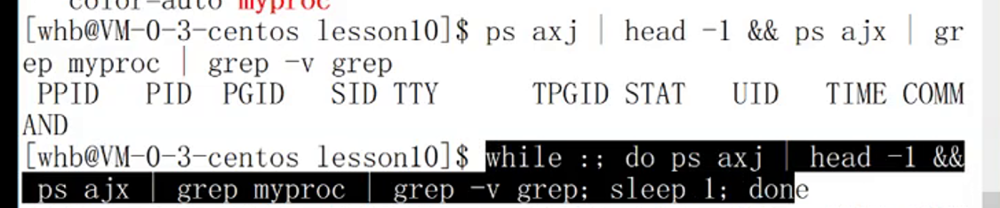

利用脚本监控进程状况；[hx@iZ2vcfg8i114ojucj4yd8uZ ~]$ while :;do  ps axj | head -1 && ps ajx | grep output | grep -v grep;sleep 1;done

一个父进程可以有多个子进程，一个子进程只有一个父进程；

创见一个子进程：创建一个task_struct{};而且以父进程的那个为模板（一部分）；


pid_t id = fork();返回不同的返回值，因为fork(){}内部，return id；之前父子进程都有了，会return 自己的id；

谁先运行，不一定；因为有抢占，上下文切换.....

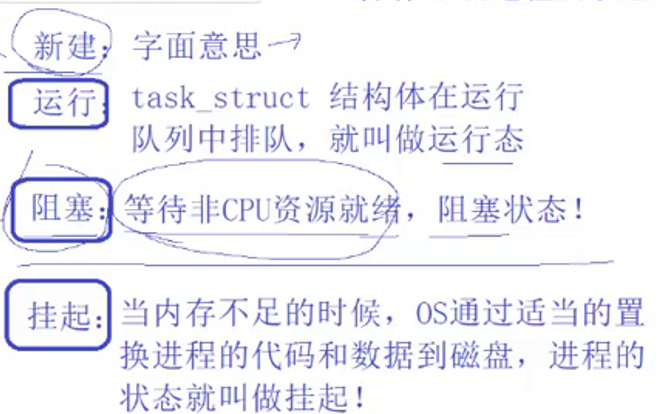

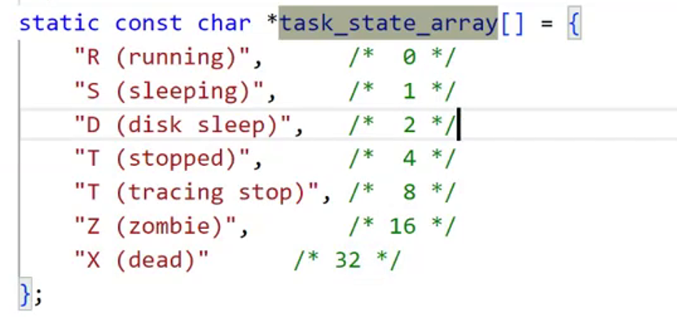

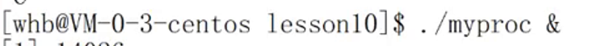

带一个&就是让这个进程在后台运行，你在bash命令行中输入什么都终止不了（输快点也可以），只能通过另一个会话，kill -9 该进程的pid；

不带&就是前台进程，它不会占用bash，ps打印进程状态的时候会有一个加号；

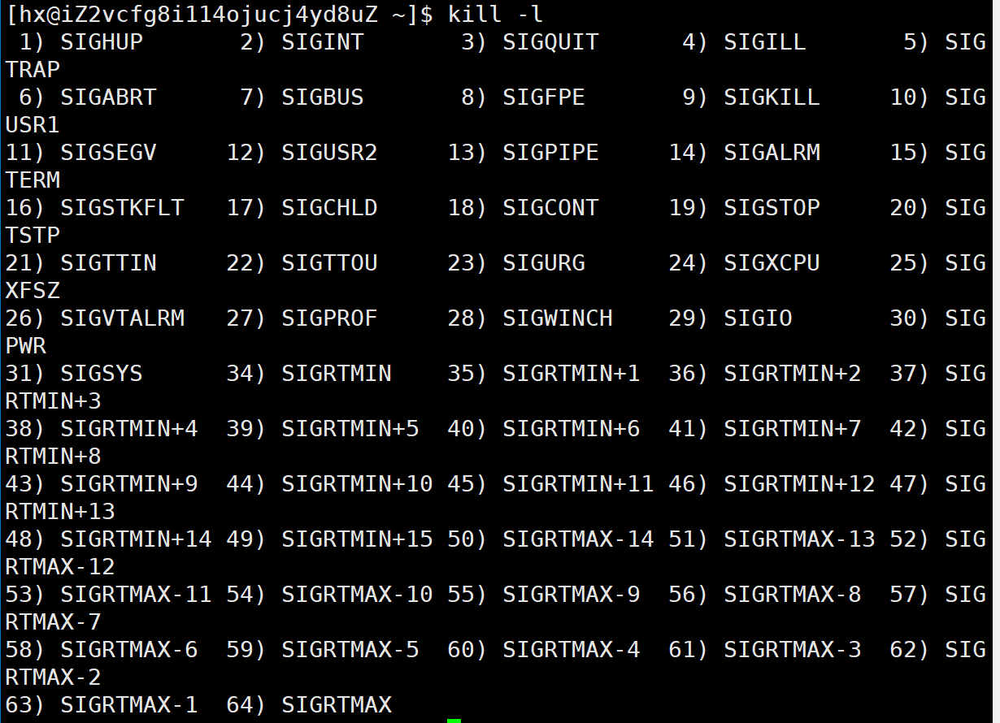

kill-l可以打印对应kill选项的命令信号，刚才用的是9号；

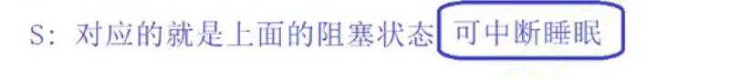

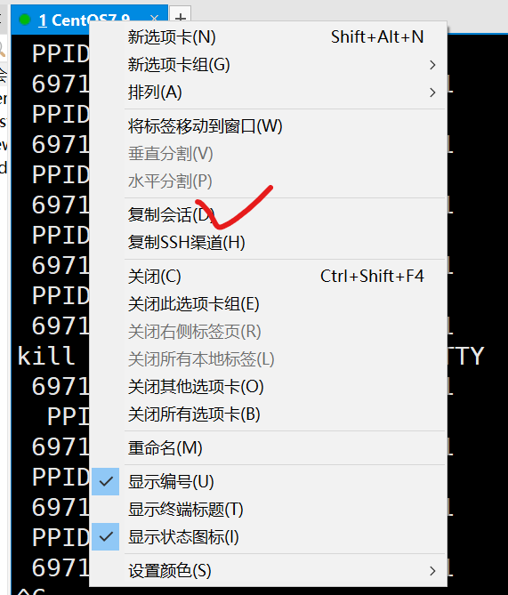

(复制会话可以再打开一个窗口，然后路径不变)；

D状态的进程（比如进程在等磁盘写入完成）OS不可啥杀掉它；

暂停状态（t）就是单纯的暂停（一般为了调试），阻塞是等资源；

X状态（终止）：表示自己可以被OS回收了；

Z状态（僵尸状态）：

一般是父进程/OS来检测；（父进程让子进程做任务，子进程退出了，父进程应该主动看什么原因）；如果父进程也挂了，就由OS来检测，查完了设为X状态；

我们在OS课上学的是什么挂起....上面这是具体OS中的进程状态；

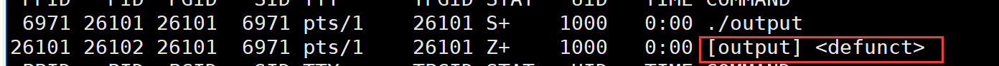

这个就是僵尸状态（子进程被我挂了，父进程活着）；（子进程先于父进程退出，同时父进程太忙了，无瑕回收子进程的资源，子进程残留资源（PCB）存放于内核中，变成僵尸（Zombie）进程，如下图所示：）

exit();需要#include<stdlib.h>

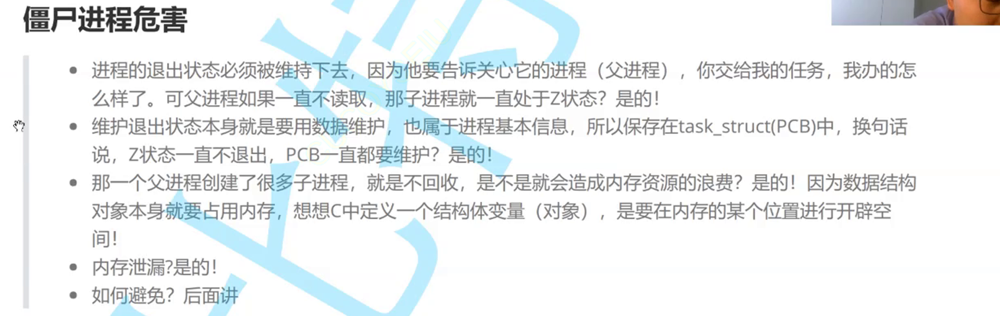

孤儿进程：父进程退出，子进程还在，它的父进程会是1号进程；为什么要领养：等这个进程退出时回收资源；

为什么有优先级：CPU资源有限，但进程太多；

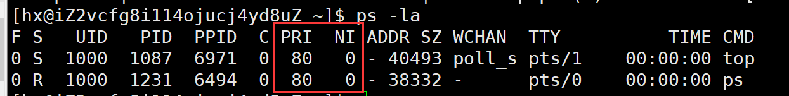

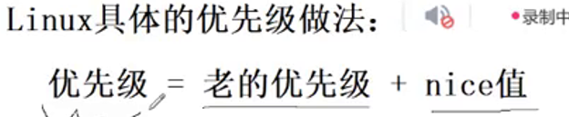

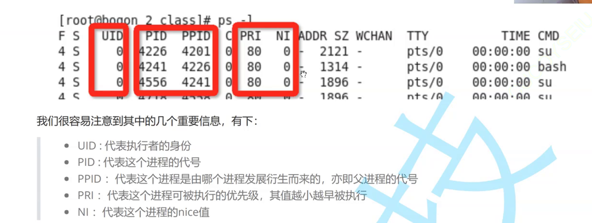

top命令中选项可以修改进程优先级数值；

renice；等也可以；

nice值有一定范围：怕有进程恶意调整自己的优先级来获取资源让被人饿死；而且OS会自己调度；

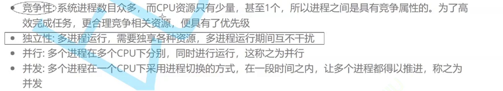

（并行就是真的在同时执行，并发是表面上同时推进，其实是有进程切换且切换时间很快，人无法察觉，给人感觉是同时执行的（同一个时间段内，多个进程在同时推进））；

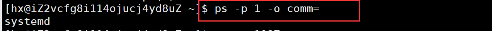

（通过pid查看进程名字）；


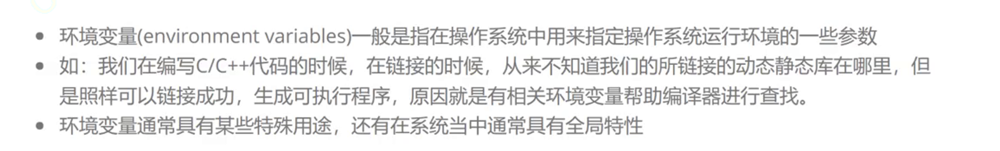

比如你在bash中运行ls，OS是怎么直到ls的呢？环境变量；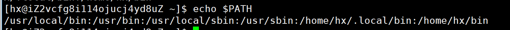

运行ls时，os会在这里找；你可以把自己的执行程序放在这个路径下；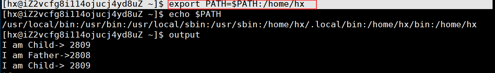

设置好环境变量，output就可以跑了；

[hx@iZ2vcfg8i114ojucj4yd8uZ ~]$ env（查看环境变量（所有））

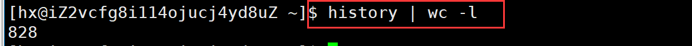

（查看历史命令行数）；

敲一个命令部分，TAB之后就可以看一下：都有什么命令；

僵尸进程与孤儿进程的区别：前者是一个父进程fork出子进程，但是它在子进程退出时没人读取状态，所以子进程一直在等，OS也认为会有父进程管他，所以没人成为它的父进程去回收它；

孤儿进程就是：父进程先于子进程退出，此时子进程就是孤儿进程，os会让1号进程成为它的父进程，处理它的退出；

[hx@iZ2vcfg8i114ojucj4yd8uZ ~]$ ps aux | grep Z | grep -v grep

查看僵尸进程是谁；

[hx@iZ2vcfg8i114ojucj4yd8uZ ~]$ ps -o ppid= -p [对应的僵尸进程ID]

查看僵尸进程的父进程是谁；然后kill掉父进程，释放僵尸进程（僵尸进程不再是Z而是Killed）；


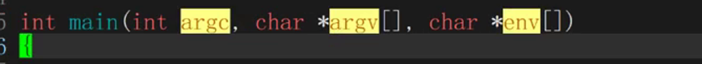

main函数最多带3个参数，第三个是环境变量参数；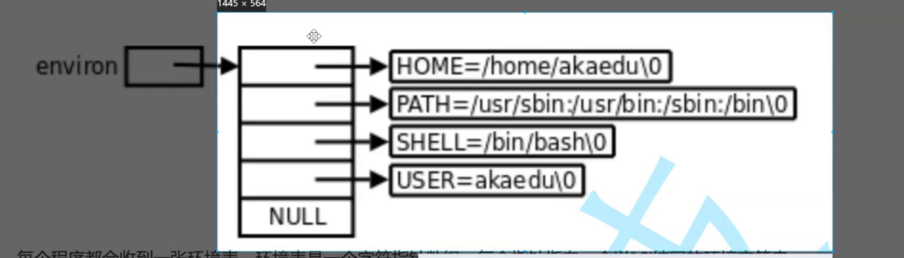

每个进程启动时都会收到一个环境表；我们可以使用代码打印出来；

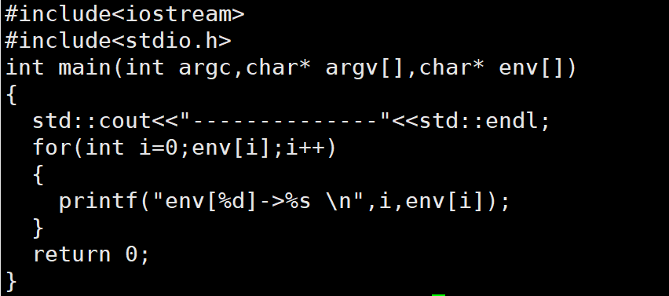

结果：
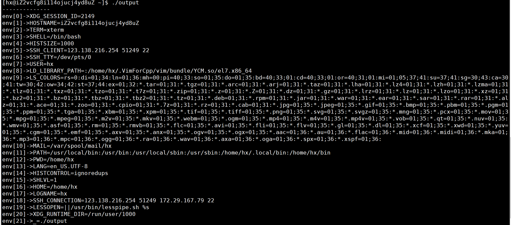

（每个env[i]都是一个字符串，以\0结尾，所以我们只需%s打印即可；只有env[i]是最后一个的时候是NULL，所以for循环判断条件是env[i]）;

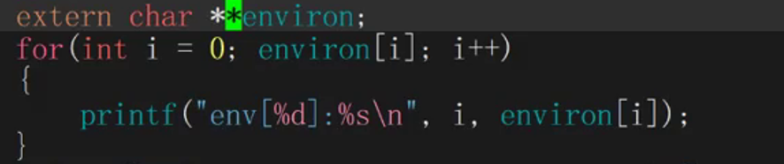

也可以用第三方变量来打印，这个二级指针指向环境表；


也可以用#include<stdlib.h>来使用getenv("....")来获取想要的环境变量，这种方法是最靠谱的；

子进程的环境变量是从父进程继承过来的；


（已知pid求进程）；

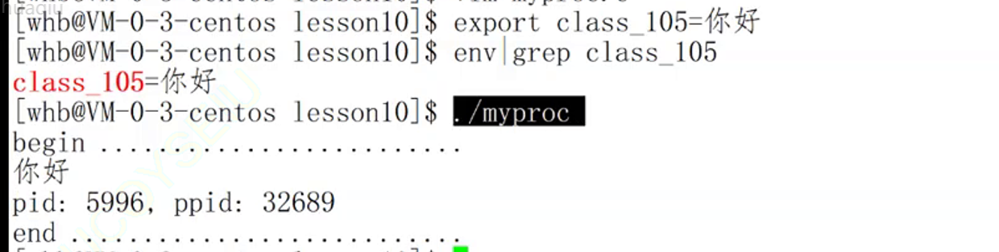

（给bash创建一个环境变量，用子进程打印，从而证明子进程继承了bash父进程的环境变量）；

环境变量可以被父子继承，所以它具有全局属性；

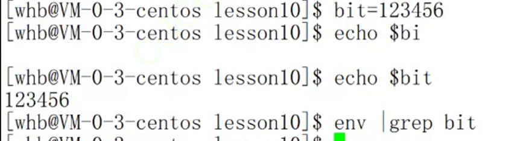

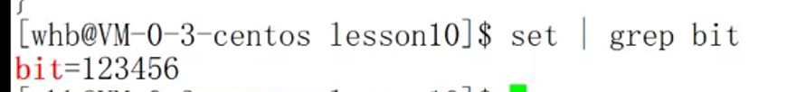

（不加export定义的是局部变量，在命令行中可以打印出来，但是在我们的代码中调用getenv（）来获取时候会报错，因为你那个是局部的，加了export就好了；另外就是set会打印所有的环境变量，不管你是局部还是全局）；

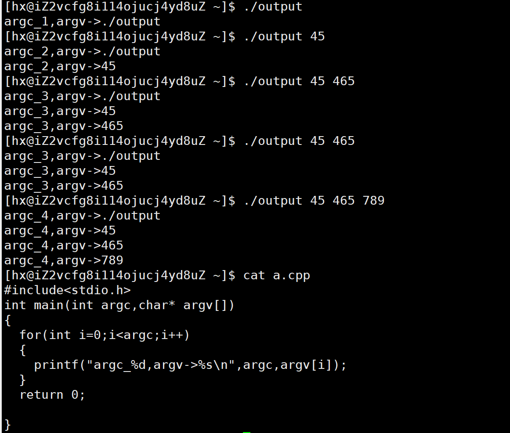

（argc是命令行参数个数，argv是命令行参数内容；你在命令行中加几个，他就有几个）；

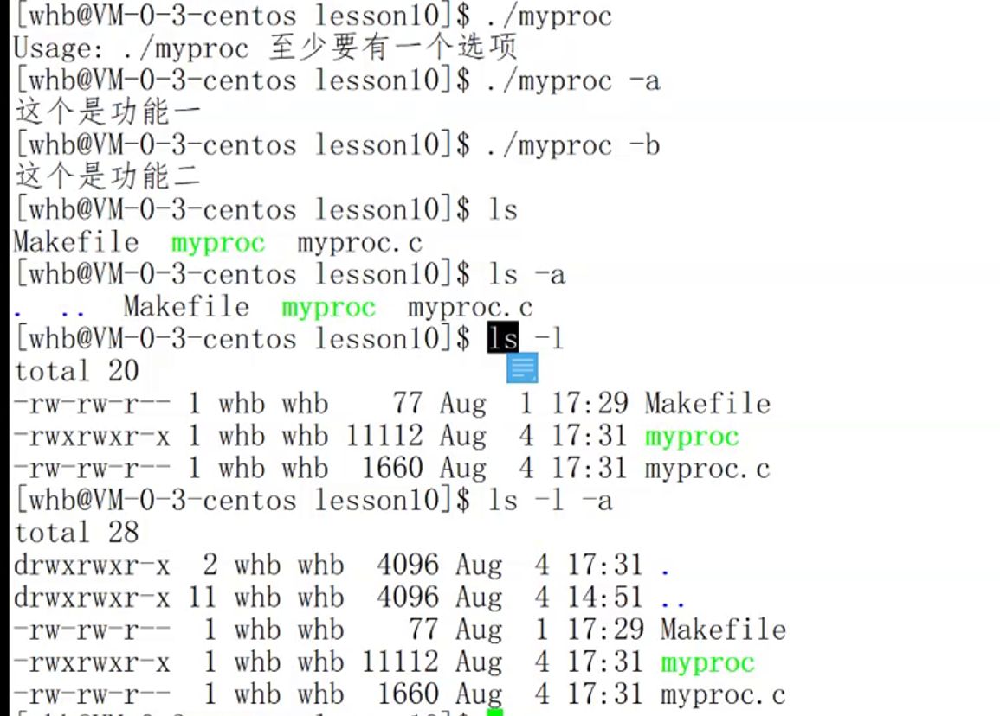

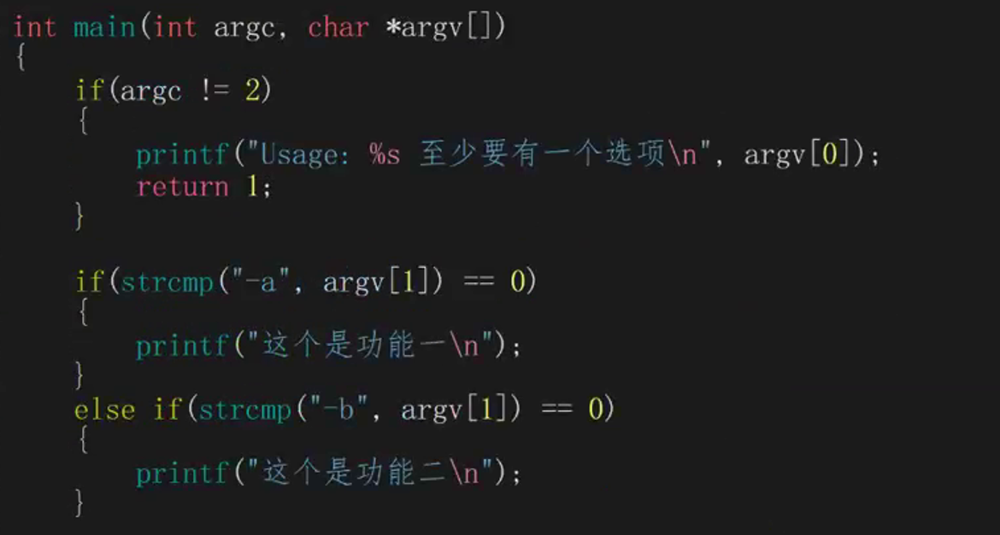

（我们在命令行中敲得命令带选项就是通过命令行输入，然后命令行进程拿到，子进程继承了命令行进程，拿到了对应的值）；

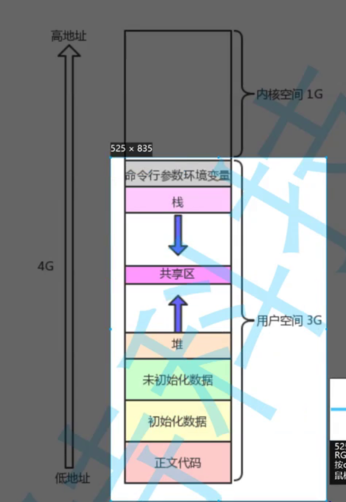

堆区向上增长，栈区是向下增长；

这不是内存，它是进程地址空间；

环境变量和命令行参数不是一个东西，环境变量更高；

可以做实验验证，fork（）后让子进程改全局变量，然后两者访问这个全局变量；

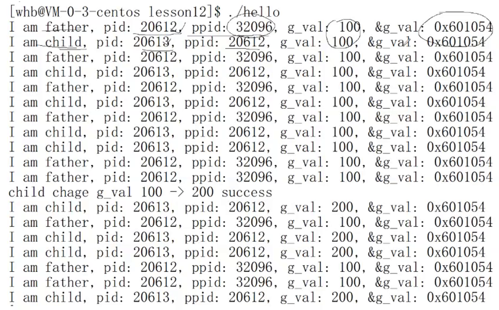

child改了后，但全局变量是不同的，地址是相同的；

所以这里的地址不是物理内存的地址，


注意%p打印的有可能没有对齐，请注意，实在不行用%d打印看；

还有一个char* p = (char*)malloc(16);此时的p中存的是堆的申请的地址，是在堆区，而&p是p变量自身的地址，在栈区；


进入一个目录需要x权限；

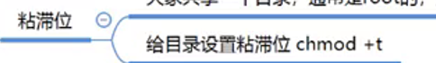


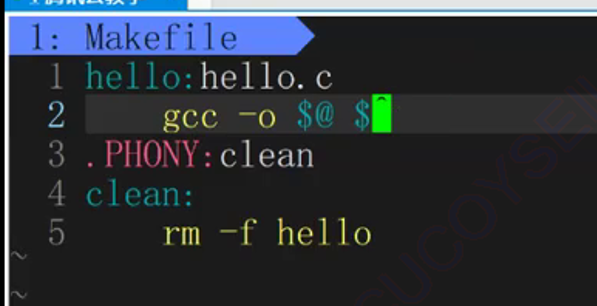

$@就是hello；$^就是冒号后面的所有（如果你有多个.c  .cpp文件的话），这样可以省代码；

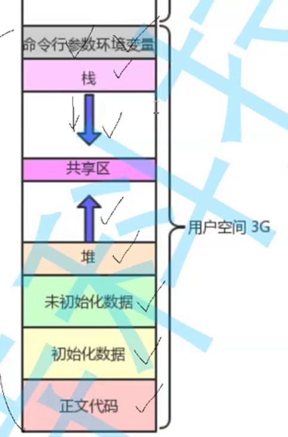

（进程地址空间，堆栈相对而生）；

malloc申请16字节，但是他会多申请一部分来记录一些属性，叫cookie信息；

static就是将局部变量变为全局变量（可以通过地址来看），但是只能局部访问，是用语法约束的；

vim可以在视图模式，批量注释；

const char*ptr = "hello";字符常量区在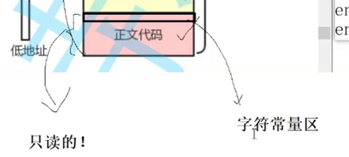

一般视为正文代码区；

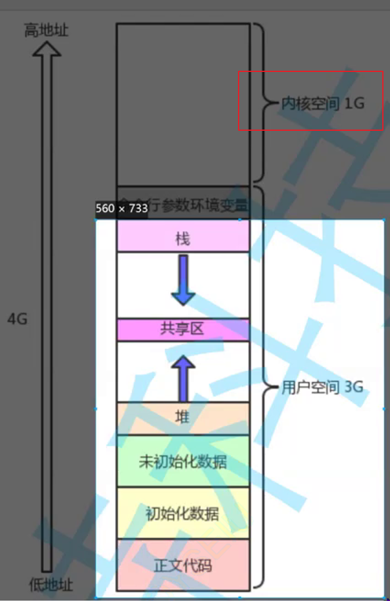

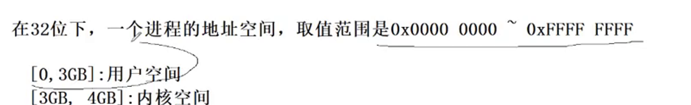

（用户空间就是上面这些图）；

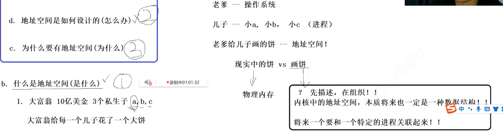

物理内存中当进程被加载进来后，如果一个进程试图访问不属于自己的内容，这就不安全，于是就有了虚拟地址空间；

虚拟地址空间于物理内存有一个映射；

每个进程都要有一个地址空间（内核数据结构）：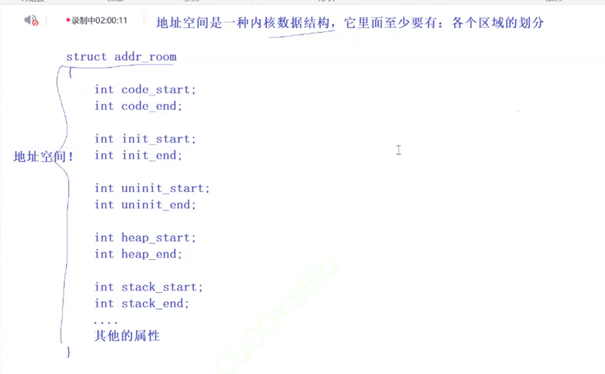

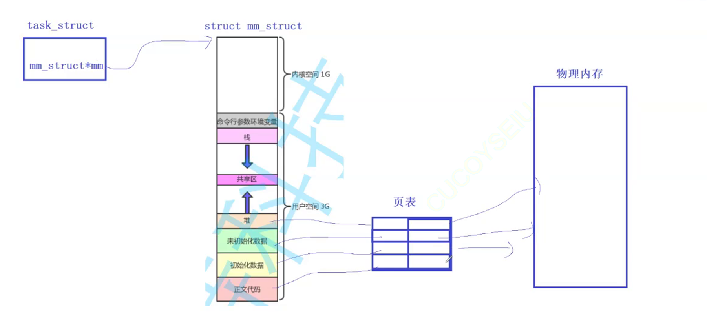


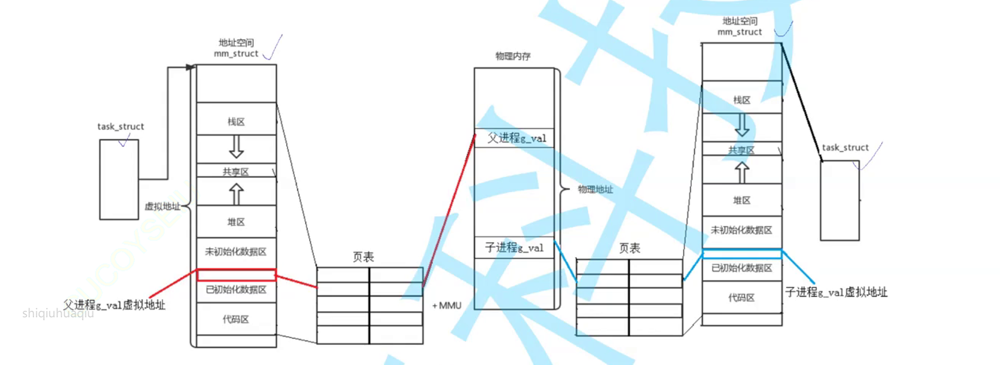

当子进程想改变量时，会写时拷贝；<**没理解**>

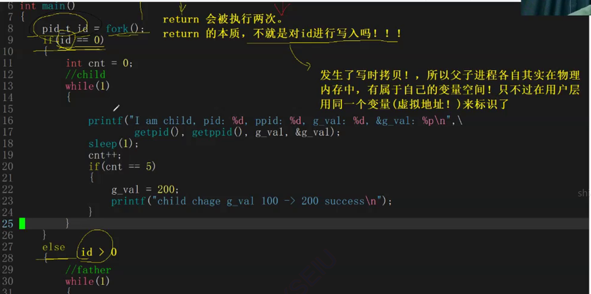

```cpp
int global = 0;
int main()
{
  pid_t id = fork();
  if(id==0)
  {
    global = 190;
    std::cout<<"Child-> "<<&id<<" "<<&global<<" "<<global<<std::endl;
  }
  else{
    std::cout<<"father-> "<<&id<<" "<<&global<<" "<<global<<std::endl;
  }
  return 0;
}

[hx@iZ2vcfg8i114ojucj4yd8uZ ~]$ ./output
father-> 0x7fff33094fec 0x601194 0
Child-> 0x7fff33094fec 0x601194 190
```


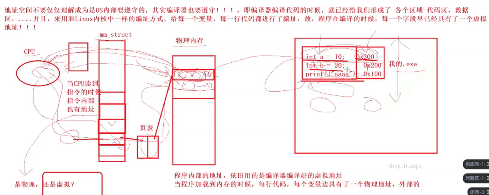

（CPU拿到的是指令，指令中的地址是虚拟地址，通过页表找到物理地址，然后去读对应的代码或者数据）；

（你的代码被编译之后已经有地址了，只不过是虚拟地址，加载到内存后放在哪里是OS决定的，但内部地址还是虚拟的，OS在将你调度时创建task_struct时候里面有个mm_struct，它会把这些地址对应填写到mm_struct中d的那些指针中去）；

我的理解：CPU看到的依然是你的代码编译好的，里面全是“假的”地址，怎么找？根据页表找，页表哪里来，每个进程都有一个，创建PCB块时就有了；

为什么要有地址空间？

1.保护物理内存，你如果非法访问，OS会识别到（线程？），并杀掉它（信号）；

2.

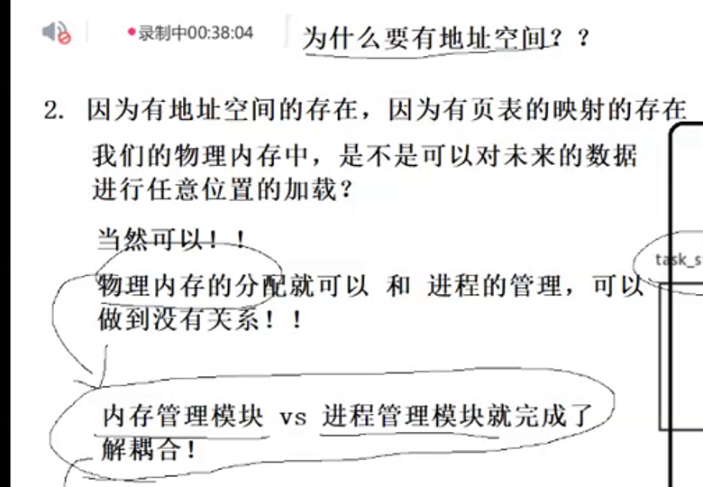

3.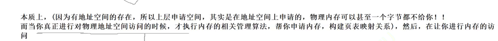


[hx@iZ2vcfg8i114ojucj4yd8uZ ~]$ cat /proc/7389/maps

可以查看pid=7389的进程的动态库与虚拟内存的映射；


（就是挂起）；

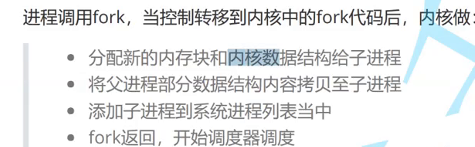

子进程创建出来时是完成任务的；它的代码用的是父进程的代码，数据有两种：直接拷贝一份，第二种：写时复制（用的时候拷贝，读不拷贝）；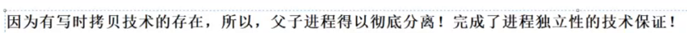

它还可以提升整机效率；

进程的上下文数据就是寄存器的数据；

一般子进程是完成任务的，所以一般fork之后直接exec；

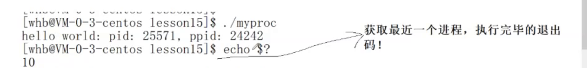

main函数返回值是0，是给上一级进程看的（即正确结束）；你如果关心它的返回值，你就return谁；

这可以对应父子进程中，父进程来获取子进程的退出码来看结果；

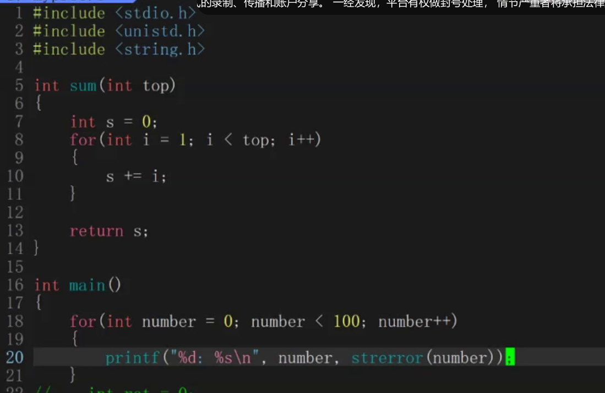

（strerror）

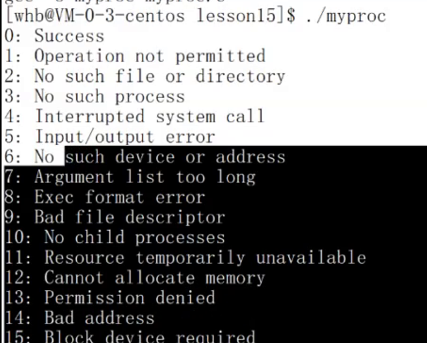


（ls也是一个进程，退出码2表明nosuch file）;

```
FILE* fp = fopen();
if(!fp){}
```


(程序崩溃后续代码不执行，退出码也就无意义)；

如何终止进程？main函数内return表明进程退出；return只有在main内才是终止进程，在函数是函数结束；

还有一个exit（int status）；但是exit在任何地方包括函数内也会终止进程；而且会刷新缓冲区；它是一个库函数，底层调用_exit();


还有_exit(int status);不会刷新缓冲区；它是一个系统调用；


进程等待：父进程获取子进程退出信息，并回收他的资源；

僵尸：父进程不管子进程（当子进程退出时）；


status的低7位（子进程终止信号，也就是下2图中的exit_signal )（status&0x7F）是0表示子进程正常退出；非零就是不对(与kill那个相对应)；非零时次8位无意义；

非零表明有外力杀死或者自己代码有问题（除0或者野指针）；


wait/waitpid就是读取子进程退出时变为僵尸进程时的退出结果；

waitpid/wait就是把这个值读出来；

```
#include <sys/wait.h>

int waitid(idtype_t idtype, id_t id, siginfo_t *infop, int options);
```

options=0则是阻塞等待，父进程不辞辛苦等你退出；如果是若在option中设置WNOHANG位，与那么该系统调用就是非阻塞的，也就是说会立刻返回而不是等待子进程的状态发生变化。


[【Linux】进程控制（wait 和 waitpid）的理解和使用 - 知乎 (zhihu.com)](https://zhuanlan.zhihu.com/p/484949219)

```
#include<stdio.h>
#include<iostream>
#include<stdlib.h>
#include <sys/types.h>
#include <unistd.h>
#include <sys/wait.h>
int main()
{
  pid_t id =  fork();
  if(id<0)
  {
    perror("fork error");
    exit(-1);//表示结果不正确；
  }
  else if(id == 0)
  {
    int cnt = 3;
    while(cnt--)
    {
      std::cout<<"my pid is "<<getpid()<<" my ppid is "<<getppid()<<std::endl;
    }
    std::cout<<"I am child process and wait five seconds!"<<std::endl;
    sleep(9);
    exit(100);
  }
  else if(id>0)
  {
    std::cout<<"I am father process and my pid is "<<getpid()<<std::endl;
    //pid_t res  = wait(NULL);
    int status = 0;
    while(1)
    {
    pid_t res =  waitpid(id,&status,WNOHANG);
    if(res>0)
    {
      std::cout<<"wait succeed! waitpid returns res= "<<res<<std::endl;

      std::cout<<" and the status is ";
      printf("%d \n ",(status>>8)&0xFF);
      printf("The signal is  %d\n",status&0x7F);
    }
    else if(res==0)
    {
      std::cout<<"child is busy and not exit "<<std::endl;
    }
    else if (res<0)
    {
      std::cout<<" The waitpid() is failed "<<std::endl;
    }
    sleep(1);
  }
    while(1)
    {
      sleep(3);
      std::cout<<"I am father process and I am not dead!"<<std::endl;
    }
  }
}
```

注意如果waitpid()中options=0时，父进程不会执行这个waitpid函数，它会等子进程退出，而上述代码Options=WNOHANG;所以它会直接执行这个函数；

waitpid()中第一个参数，==-1则等待任意子进程退出（相当于wait()），>0(即pid)则等待具体进程，;

使用waitpid()and wait()会使用到位运算，所以为了简化，我们引入了宏


WIFEXITED and WEXITSTATUS;


退出码就是子进程exit();的值；


找在系统层面的宏；

比如#define WNOHANG=1,故也可以waitipid(pid,&status,1);


waitpid();函数的返回值来判子进程现在的状态；


.cc就是.cpp


这里的main里面的可以放在waitpid()返回值表明子进程没退出时，父进程可以做一些事情，过段时间去获取下；


（查看进程父子关系）；

继承等待功能是什么？

进程替换：调用进程的上下文被重填，以执行新的程序；


批量注释：CTRL+V进入视图模式，然后shift+t再利用hjkl键选中区域。然后输入两个反斜杠，然后Esc

批量取消注释：。。。。。。。。。。。。。。。。。。。。。。。。d一下


（不要忘记usr前面那个反斜杠）；

理解进程程序替换的本质， 在深层次的理解程序员在 命令行当中启动一个程序， 本质上是bash程序启动了一个子进程， 子进程程序替换成为程序员启动的程序

- ork()系统调用是Unix下以自身进程创建子进程的系统调用，一次调用，两次返回，如果返回是0，则是子进程，如果返回值>0，则是父进程（返回值是子进程的pid），这是众为周知的。
- 还有一个很重要的东西是，在fork()的调用处，整个父进程空间会原模原样地复制到子进程中，包括指令，变量值，程序调用栈，环境变量，缓冲区，等等。
- 一般是系统调用让进程阻塞了，就像wait()一样；

加载器就用的exec();


哪个可以？


（makefile一般只扫描第一个，这样就可以一次make生成多个可执行文件）；


上面的绝对路径也可以用相对路径；


（myfile就是那个路径，让这个进程把环境变量传给另一个要执行的进程）；


底行模式下批量替换；

myshell：


myshell end；

但是这个shell无法执行内置命令（比如cd ..）;why?因为这个命令如果是cd的话，就被子进程执行了，但是父进程依然没有cd ..;


改动：


2022.09.21；


《默认》打开，所以你自己没有打开文件，你就可以往里边写东西（键盘，显示器都是你要打开的文件，你要往显示器写东西）；

编译后，变量名就没了；


根据名字删除进程；


（创建了几千个进程，最后fork失败，父进程打印error）;


进程替换的原理是进程地址空间的映射变化；

IDE也是调子进程，不然你写个代码把人家整崩了；像牛客这些也是，都是创建子进程；

**自主实现myshell；**（10.8日的上一次）；


环境变量具有全局属性；exec系列函数不会替换掉环境变量；


OS是硬件的管理者；


跨平台：Linux，windos...都可以跑；

****

（FILE就是文件指针或者文件句柄）；


（以w打开文件，他会先清空文件，哪怕你只是用w打开文件，什么都不做，然后关闭）；

fopen中以a打开是追加重定向；

读文件：fgets;

- 
- (运行：myfile makefile)（即两个命令行参数，第二个命令行参数是我们要打开的文件然后把它的内容打印在显示器上）；
- 

stdin stdout stderr 都是文件指针；Linux下一切皆文件；硬件统一被当作文件；

我们可以用位图来让设置标志位，用的是位操作；


（这个flags就是这样的）；

mode是你要创建的文件的权限，你可以直接在main函数中用umask（）；就近设置umask而不受系统的那个umask的影响；不然你open用的666的mode但是文件依然是664；


（用法是这样的！要位操作）；


（一般文件已经有了就用第二个，没有就用第一个）；


（打开后写）；


（他俩是等价的，fopen是封装的，open是底层的，这就是封装的好处）；


FILE*是一个结构体，他里面有多个成员，fileno就是那个fd（文件描述符）；只不过是C语言搞出来的；


（os如何看待打开的文件？fd）；


所以fd本质是这个指针数组的下标；

file是不断被创建的，创一个，给指针数组加一个元素（file的地址），每个PCB管理一个指针数组；所以你创建几个文件，一般它的fd是连着的；

每打开一个文件，OS创建一个struct file{};PCB中的这个指针数组把地址存储，它的这个下标就是fd；

像这样：


这个struct file：


（宏定义：就是上面的open等系统调用传入的参数，库函数做了封装，屏蔽了细节）；

fd的分配规则是就小原则；


第一个图：注释close（fd）；./output没有，但是cat log.txt有1；如果放开close(fd);两个啥都没了；我们知道./output没有显示是因为标准输出被关闭了；但是log.txt是为何呢？因为你前面把1号指向了这个文件，所以你如果不关闭，进程退出时，刷新缓冲区，会把1打印到fd=1那里（log.txt文件），但是你如果在进程退出前close(fd)了，那么1号和log.txt就断了链接，且没有指向标准输出，所以两个都啥也没有；、

第二个图是关闭前就刷新，所以log.txt是有的，但显示器没有，因为每人指向它；


你可以用上图这样，close掉fd，然后重定向到其他文件，你也可以使用dup2系统调用，这样子就省去close（fd）；


（它是拷贝oldfd->newfd,所以newfd就被覆盖了（关闭了））此时oldfd和newfd都是原来oldfd的内容；


如果你要追加的话，把

一切皆文件：每个硬件都是一个strcut file{};

C语言实现用的是函数指针（如下图，全是函数指针），比如read和write函数指针指向read();write();，你这个文件如果可以read，那就read，否则设置为空；


缓冲区刷新策略：


用户也可以强制刷新（fflush)或者进程退出也会刷新；


（这与缓冲区有关系；fork这个会把父进程的缓冲区也给复制过来；如下图：你直接运行这个可执行文件，默认往显示器上打印，显示器是行缓冲的，所以缓冲区不太停留，而重定向到文件中（实际上是往磁盘写的）的话，它是全缓冲的，结果被fork复制了）：


（C标准库为我们提供了（用户级）缓冲区）；

fork完，进程退出前，是要刷新缓冲区的，即写东西到显示器，会写时拷贝；


在上面那个fork之前fflush(stdout);会把用户级缓冲区刷出去，它是怎么找到的呢？stdout是一个结构体，这个结构体封装了读写缓冲区；


这里有一个自己实现的fflush-fclose-fopen

```
https://gitee.com/whb-helloworld/online-code---phase-105/blob/master/lesson21/myfile.c
```

标准错误和标准输出都是指向显示器，但是重定向是让1号重定向，2号的标准错误是不会重定向到文件中的，依然会打印在显示器中；

这是好事，有错误直接显出来而不是重定向让用户看不到；


如果你不想这样，也可以上图，重定向两次，第一次是默认的1号，2>代表是标准错误重定向；


（如果想要重定向到一个文件中，也可以这样上图）；


（把log.txt显示，然后拷到back,txt）;

open失败后会改掉errno


（自己实现perror）；

用了一个strerror();


每个磁盘的扇区是512字节？


（如上图，Block Group可以分为这样，这其实是格式化，格式化就是写文件系统.......）；

一个文件对应一个inode，但一个文件不一定对应一个data block，请问呢如何找全文件的内容？


（inode内部有一个数组，对应着block块的编号）；


（找一个文件，用inode编号，然后找分区，找分区的inode结构体，再找对应的data block，或者指向存有inode的块，然后逐步找）；

我们通常用的是是文件名找文件，但其实目录的inode对应的datablock中有一个映射（inode与文件名的对应）；

之前讲解权限时：在一个目录下创建文件需要w权限（实际是写目录的datablock块），执行ls需要（读权限，访问那个块）；


(分别是软硬连接)；

另外就是这个：2   1，


编写自己的库并使用：


（利用这个命令可以看二进制）；


（这是那个makefile）；

ldd a.out可以看这个可执行文件的库的情况；

下为动态库实现：


2022-11-5日东静态库结束；


make --version是有的，真正原因是自己没有进入对应目录；

进程间通信：进程具有独立性，想通信的话，比如父子间通信，还挺难的，因为有写时拷贝，本质是数据交换（让不同进程看到同样的资源（内存））；


管道：单向通信（不能全双工）；

管道的本质是文件；

[我的牛客-阿里2017实习（一）刷题之路 - 白嫖老郭 - 博客园 (cnblogs.com)](https://www.cnblogs.com/gtnotgod/p/13389281.html)

（上为笔试选择题，挺好的）；

进程间通信：多进程更好协同（消息通知，传输数据）；

进程间通信是内存级的，不会落盘（写入磁盘）；


pipe与fork密不可分；

父进程写的慢，子进程就等；

```cpp
#include<unistd.h>
#include<assert.h>
#include<sys/wait.h>
#include<string.h>
#include<sys/types.h>
#include<stdio.h>
#include<stdlib.h>
#include<string>
#include<iostream>
int main()
{
  int pipeArr[2];
  int res = pipe(pipeArr);
  #ifdef DEBUG
  std::cout << pipeArr[0] << " " << pipeArr[1] << '\n';
  #endif
  assert(res != -1);
  (void)res;
  pid_t pid = fork();
  if(pid==-1)
  {
    perror("fork error ");
    return -1;
  }
  if(pid==0)
  {
    close(pipeArr[1]);
    char buffer[1024];
    int cnt = 10;
    while (cnt--)
    {
      int ans = read(pipeArr[0], buffer, sizeof(buffer) - 1); // sizeof(buffer)返回buffer的字节大小，留一个出来接收'\0'来%s输出buffer;而strlen是计算字符串的长度的;
      if (ans > 0)
      {
        buffer[ans] = 0;
        printf("I am child process , read the[ %s ] ,and pid is %d \n", buffer, getpid());
      }
    }
    exit(0);
  }
  else if(pid>0)
  {
    close(pipeArr[0]);
    std::string message = "I am father process";
    char buffer[1024];
    int count = 0;
    while (1)
    {
      snprintf(buffer, sizeof(buffer), "%s : %d [%d] ", message.c_str(), getpid(),count++);
      write(pipeArr[1], buffer, strlen(buffer));
      sleep(1);
      int status;
      int ans = waitpid(pid, &status, WNOHANG);
      if (ans == -1)
      {
        std::cout << "waitpid error\n";
        return -1;
      }
      else if(ans ==0)
      {
        std::cout << "child is running " << '\n';
      }
      else
      {
        std::cout << "wait succeed and the pid is "<<WIFEXITED(status)<<'\n';
        break; // 此时子进程退出，也应该让父进程退出;
      }
    }
    close(pipeArr[1]);
  }
}
```

管道是具有访问控制的；写的慢，读的人就等，读的慢，写的就卡住了；

父进程写一年，子进程读一天就读完了？


（写端关闭了，read返回0）；

当管道的读写端都关了，管道文件释放；


（读端关，写端就被OS关了）；

hpp：是c++的头文件；

一般这个管道是用于父子...有关系的进程进行通信；所以他是匿名管道（这个文件没有名字），2个进程没有关系，怎么通信？用命名管道；

命名文件在内存里，不会刷盘；


这是命名管道，写的端口（左侧）写了后会阻塞住，等读的端口来读（右侧）才会结束；

例如：


这是写端口；


这是读口；


.h和.hpp 后者常用于开源（源码公开，所以hpp中可能有实现），前者是声明定义分开的，比如制作库时，实现文件不可能会给你的；

#include<cstdio>与#include<stdio.h>一样的，前者是c++写法；


（删除管道文件）；

[lesson26/fifo · whb-helloworld/线上代码-105期 - 码云 - 开源中国 (gitee.com)](https://gitee.com/whb-helloworld/online-code---phase-105/tree/master/lesson26/fifo)

(小的demo关于fifo)；

起2个窗口；

共享内存的创建：


同一个key就可以找到同一个共享内存；

返回值是一个标识符；


一方拿着key找OS找共享内存；

key值放在描述共享内存的结构体内；

key的生成：

有可能不成功（即key值已经有了）；


（查看系统共享内存）；


（删除用shmid（shmget的返回值））；


（即一个进程创建了共享内存，退出后还在）；

因：

所以需要你手动删除（如上），或者代码删除（使用shmctl）；


（使用脚本监控）；

perms是权限，创建时加选项shmget(,,0666);

nattch是


shmaddr一般是nullptr，shmflg是0；

key一般用于 创建共享内存时（内核），shmid用在用户层，比如说删除.....

[lesson27/shm · whb-helloworld/线上代码-105期 - 码云 - 开源中国 (gitee.com)](https://gitee.com/whb-helloworld/online-code---phase-105/tree/master/lesson27/shm)

（这部分代码都在这里）；


共享内存和过去的那个动态库一样是在共享区；

用户空间：不经过system call直接可以访问；那为什么管道文件要通过read write这些system call调用呢？它们不是就在共享区吗？答：因为管道是文件，是一种内核数据结构，属于内核空间，必须read write；

而共享内存是在堆栈之间的，属于用户空间，用户可以直接读写；

共享内存刚开始被初始化为字符零了，打印出来是空的；他和管道不一样；

```
结论1： 只要是通信双方使用shm，一方直接向共享内存中写入数据，另一方，就可以立马看到对方写入的数据。
    //         共享内存是所有进程间通信(IPC)，速度最快的！不需要过多的拷贝！！（不需要将数据给操作系统）
```


即：涉及4次拷贝（键盘+屏幕就是文件）；

还有一点：管道有访问控制，共享内存没有这个（读端不管你写没写，在不在）（两个人甚至不知道对方存在）；

没有访问控制：可能产生数据不一致行问题，比如我们分手吧+说错了，结果你看到了前半句，产生了UB；

代码还写了在共享内存中加了fifo；


查看这些资源...


信号量：
电影院买票就是申请信号量，座位总数是临界资源总数，信号量就像是一个计数器；

申请到信号量就可以访问临界资源，用完后，就可以释放信号量；

临界区中有访问临界区的代码，所以在临界区之前要申请信号量，在走出临界区后要释放信号量；

因为：


所以：这个信号量本身要被多个进程看到（就像是电影院中的人要看到还有多少个名额可以看电影一样），但访问又存在数据不安全性（不一致）；

所以需要对于信号量的访问是原子的，具体就是PV操作，都是原子的；

信号：

【注】：信号与信号量不是一个东西；


Linux信号：发一个事件通知给进程；Ctrl+C就是一个信号；

```
内核空间 用户空间的区别？
```

管道的容量仅受磁盘容量大小限制？

C.在创建子进程之后也可以通过创建匿名管道实现父子进程间通信？

D.必须在创建子进程之前创建匿名管道才能实现父子进程间通信？


kill -l查看信号列表；1-31是普通信号；其他是实时信号；

man 7 signal可以查看信号行为；


PCB（task_struct）中有位图，os才可以修改PCB（OS维护的数据结构）中的字段，发送信号其实就是OS修改了PCB的变量；

时钟中断：天然的中断（会让CPU停下来去执行OS的代码（调度.....）），这与主频有关；

信号的产生与进程是异步的，它可能一段时间后来处理；

信号的产生是OS向pcb中的位图改变数据；


signal是先买票，所以如果没有SIGINIT，就不会调用catchSig函数，当然它是遇到就捕捉，哪怕你已经到while循环了，另外就是它改变了SIGINIT的默认行为（中断）；如下：


信号的产生：1-键盘

2-

即：core dump标志位被设置后，如果进程收到了一个core类型的信号，会发生核心转储，即OS生成一个文件包含核心数据，这样方便调试（即利用这个文件可以使用gdb定位错误）反之不生成。ulimit -a可以看core size大小，-c选项可以更改大小，但只在本次会话中生效，云服务器默认关掉这个功能。core另外虚拟机这个core是开着的；

core-dump标志如果是系统层面关掉的话，比如云服务器，那么core类型信号也不会生成core文件；

生产环境（云服务器）会关闭core-dump：防止服务器生成太多core文件；

命令行中的kill -2 2798 这样其实底层调用了kill（）；


（上图利用了kill（）；实现了从命令行（./mykill 2 7280）中自己杀掉进程）；没有实现"-"；


(raise()也可以自己给自己发信号)；


（abort（）也可以；）；


（13号信号，也可以验证如下）；


（管道是文件，OS识别到管道读端关了，所以会给写端发一个信号）；


alarm相当于一个闹钟；会在seconds秒钟后终止进程，他其实可以作为一个验证：x秒钟CPU执行代码的次数，但是我们通过实验发现1seconds后。count++了一万多次，这是因为网络传输的延迟（云服务器）+cout输出到显示器太慢；

如果想单纯测一下：
```
int count = 0;
void test()
{
	std::cout<<count<<std::endl;
}
int main()
{
	alarm(1);
	signal(SIGALRM,test);//回调函数
	while(true)count++;
}
```

注意：这个闹钟会触发一次，如果想再触发，就需要利用另一个会话发送kill -14+对应的pid；然后这个进程就会调用一次test函数，然后又到了while循环去执行count++了，所以此时你还可以发....总之，alarm在1s后调用后然后被signal捕捉后就没了；

如果想循环设置闹钟就可以在test(){}中alarm(1);

另外这个可以这样：

```
// typedef function<void ()> func;
// vector<func> callbacks;

// uint64_t count = 0;

// void showCount()
// {
//     // cout << "进程捕捉到了一个信号，正在处理中： " << signum << " Pid: " << getpid() << endl;
//     cout << "final count : " << count << endl;
// }
// void showLog()
// {
//     cout << "这个是日志功能" << endl;
// }
// void logUser()
// {
//     if(fork() == 0)
//     {
//         execl("/usr/bin/who", "who", nullptr);
//         exit(1);
//     }
//     wait(nullptr);
// }
// void flushdata()
// {

// }

// // 定时器功能
// // sig: 
// void catchSig(int signum)
// {
//     for(auto &f : callbacks)
//     {
//         f();
//     }
//     alarm(1);
// }
// static void Usage(string proc)
// {
//     cout << "Usage:\r\n\t" << proc << " signumber processid" << endl;
// }
// signal(SIGALRM, catchSig);
    // // 1. 为什么我们只计算到1w+左右呢？cout + 网络发送 = IO
    // alarm(1); // 设定了一个闹钟，这个闹钟一旦触发，就自动移除了

    // callbacks.push_back(showCount);
    // callbacks.push_back(showLog);
    // callbacks.push_back(logUser);
    // while(true) count++;
    
```


```
void handler(int sig)
{	
	std::cout<<sig<<std::endl;
}
int main()
{	
	signal(SIGFPE,handler);
	while(1);
}
```

//他会疯狂打印除0错误，why？CPU中的状态寄存器中被标记了，所以OS一看一直是溢出标志，所以一直打印，一般都是打印错误后终止进程；

LinuxKernel中有一个指针指向正在运行的就进程；

```
signal(SIGSEGV,handler);
int*p = nullptr;
*p = 0;
while(1);
//野指针？越界？是11号错误
```


信号的本质：无论你是代码出现除0错误/野指针，都被OS识别到（包括但不限于硬件状态的读取），然后给进程修改PCB对应的位图；

```
https://gitee.com/whb-helloworld/online-code---phase-105/blob/master/lesson29/mykill.cc
```


上图是捕捉信号的方法，用了回调函数；


105期_2023-01-05信号:


他们的执行顺序是：OS发现进程有错误后，然后

挨着看，走到了handler这一步才：

OS会拿着信号编号，然后找到对应的handler[signum],然后(int)handler[signum] ==1 or 0 判断这里的值是不是0or1,他们俩一个是默认一个是忽略，如果不是，那么就会执行对应的函数handler[signum]（）；

？不定?

```\
C/C++ <string>  int string double.....
OS    <sys/type.h> pid_t sigset_t.....
```


上面的三个表：block pending handler 各自都有对应的方法，后者用signal更改，前者用sigprocmask更改（如上），中间用sigpending；

所以你可以自定义捕捉（signal）从而逃掉OS的信号捕捉？不会，9号码信号不可捕捉；


给该进程发送2号信号，它的pending比特位由0到1了；

也可以利用sigprocmask来恢复，当然你恢复后2号信号被接收了，然后进程没了。所以你要用signal自己捕捉；


```
pidof xxx//可以提取对应进程的pid
```


```
利用脚本方式按顺序屏蔽信号；当屏蔽到9号的时候进程就没了（9号信号不可被屏蔽）；
```

```
i = 1;
id = $(pidof mysignal);
while [ $i -le 31 ];
do kill -$i id;
let i++;
sleep 1;
done
```


- 注意9和19后又空格，不然执行不了；

也可以直接写到一个脚本文件（如上）中，除了9号后还有19号还有20不会被屏蔽，结果是0；


CPU内部有具体寄存器用来标识现在是什么态，你执行比如open系统调用，内部会有一个int 80H；然后就进入内核态，执行进程自己的3-4G的代码，通过内核页表映射到物理内存（OS对应的内核代码而不是用户写的数据和代码）中去；

内核态or用户态：用的页表不同，映射的空间不同（用户级页表只能访问用户数据和代码，内核级页表只能访问内核级的代码和数据）；

所谓的切换到内核态就是进程跳到3-4G然后去利用系统中的内核级页表（只有一个）找物理内存（自然对应的是一样的）中的系统函数；

关于内核态与用户态请看：https://bbs.huaweicloud.com/blogs/291914


这是啥？


（前两个是位图结构，后一个是函数指针数组）；

pending是信号是否被递达；

block是决定信号是否被阻塞；

handler是信号处理函数，你可以通过signal设置自定义；

它们的数组下标刚好是对应信号是多少号；


这些系统调用就是设置对应信号的；


```
几个处理信号集的函数：
int sigprocmask(int how, const sigset_t *set, sigset_t *oldset);//设置该进程对应的信号集中的内容(具体是上图)
sigismember();//测试一个指定信号是否被置位
sigemptyset();//把信号集中的所有信号都清0
sigfillset();//把信号集中所有信号都置1，即屏蔽所有信号，用得少 
```

信号：键盘Ctrl+C其实就是给当前进程发送了一个信号；进程执行异常，OS也会给该进程发送信号终止它；总之与OS密不可分；毕竟进程对应的PCB只有OS可以操作；

信号发送后并不是被立即处理的而是要在合适的时候来处理信号，那么进程就要有具有保存信号的能力，保存在哪里？就是PCB中的这个block pending handler,你要对它们进行设置或者修改，就需要用一些系统调用如上，

在信号发送后进程需要对信号进行一个处理，代码是处在用户状态的，要处理信号的话，要找到相应的系统函数所以要陷入内核进行调用，反之如果对于信号处理是默认的或者忽略的，调用返回时就进入用户状态，执行用户代码的下一行。

前面说了是有用户自定义捕捉信号的，此时涉及内核态和用户态切换，如下图，如果不是自定义，切换就是下去上来，如果是自定义捕捉，切换就是下去上来下去上来；


code中如果一直没有系统调用，那么也会周期性地陷入内核，因为时间片轮转；


内核态在返回用户态之前，会把接收到的信号处理了，其中如果你是自定义的信号（代码在用户态），就切到用户态（以用户态身份执行它自定义的代码），然后再回内核态，再回用户态；

```
信号捕捉方法：
signal();
sigaction();
```

20230108：


？

在处理一个信号时，其他信号会被屏蔽，包括同类信号；如下：
```
// void showPending(sigset_t *pending)
// {
//     for(int sig = 1; sig <= 31; sig++)
//     {
//         if(sigismember(pending, sig)) cout << "1";
//         else cout << "0";
//     }
//     cout << endl;
// }

// void handler(int signum)
// {
//     cout << "获取了一个信号： " << signum << endl;
//     cout << "获取了一个信号： " << signum << endl;
//     cout << "获取了一个信号： " << signum << endl;
//     cout << "获取了一个信号： " << signum << endl;
//     cout << "获取了一个信号： " << signum << endl;
//     cout << "获取了一个信号： " << signum << endl;
    
//     sigset_t pending;
//     int c = 20;
//     while(true)
//     {
//         sigpending(&pending);
//         showPending(&pending);
//         c--;
//         if(!c) break;
//         sleep(1);
//     }
// }

// int main()
// {
//     // signal(2, SIG_IGN);
//     cout << "getpid: " << getpid() << endl; 
//     // 内核数据类型，用户栈定义的
//     struct sigaction act, oact;
//     act.sa_flags = 0;
//     sigemptyset(&act.sa_mask);
//     act.sa_handler = handler;

//     sigaddset(&act.sa_mask, 3);
//     sigaddset(&act.sa_mask, 4);
//     sigaddset(&act.sa_mask, 5);
//     sigaddset(&act.sa_mask, 6);
//     sigaddset(&act.sa_mask, 7);

//     // 设置进当前调用进程的pcb中
//     sigaction(2, &act, &oact);

//     cout << "default action : " << (int)(oact.sa_handler) << endl;


//     while(true) sleep(1);
//     return 0;
// }
```


(如上，右侧发送2号信号，左侧自定义处理，你再发送信号（addset的），它直接屏蔽，等这个2号信号处理完后，再去处理对应信号)；


（这两个竟然不一样？）


（查看当前linux的默认shell）

shell脚本默认后缀是.sh，但是Linux对这个不要求，一般为了规范才写.sh


(不要忘记#号)


或者使用bash hello.sh也可以；


chmod加权限也可以；


（有了可执行的这个x权限，你可以用绝对路径或者相对路径直接执行）；

【注】：你要在当前路径下如果有一个脚本文件，那你就应该./hello.sh而不是直接hello.sh因为这样会被命令行当成命令行；

前者的bash ./hello.sh是给bash传一个参数，不需要可执行权限，后者直接赋予可执行权限后，是用当前敲命令的这个bash直接执行了，所以需要可执行权限；


（source这样也可以，source这种不起子shell，是在当前bash中执行的，这也是为什么有时配置好后，就需source xxxx让它在当前bash中生效一下，这与父子进程的环境变量继承有关系）；


（查看当前bash-pid）；


（这个exit退的是那个子bash）；

总结：bash sh方式是打开子shell，而./hello.sh 和. hello.sh是在当前bash中执行；

[千锋云计算Linux教程650集，linux系统运维从入门到精通教程（Linux安装极速入门，零基础必备）-Kitesxian-稍后再看-哔哩哔哩视频 (bilibili.com)](https://www.bilibili.com/list/watchlater?oid=583849417&bvid=BV1pz4y1D73n&spm_id_from=333.1007.top_right_bar_window_view_later.content.click)


elf格式？elf格式与编译原理有关；


内存中被分为4kb，如果是4gb，所以有100w个，linux用struct page{}来描述，用flag标记是否被分配；

把页帧装进页框里（前者对应磁盘，后者对应内存）；

缺页中断：内存中没有CPU要的页；

对于32位的地址，你有2的32次方个地址，页表是物理和虚拟之间的映射，那么每一组映射就需要4字节（虚拟地址）+4（物理地址）+flag标志位个地址，所以太大了，Linux是对于虚拟地址进行了拆分，比如32位拆成3份（10+10+12），对应1级页表，二级页表，也就是凭借前两份通过两个页表就可以找到具体物理内存的起始地址，后面那个12比特，刚好就是4KB，就是每一页中具体偏移；这样一来就是虚拟地址映射到内存中某一页的；这下页表所占内存就不大了；（具体如下）


线程在进程的地址空间内运行，


什么是进程？线程？

进程：内部具有多个执行流；

CPU只关心task_struct（运行队列里装的是task_struct）;


Linux没有真正的线程，它是用进程PCB模拟的线程，OS只认识进程，只认识进程级别的接口；


{因为，所以的关系，因为Linux没有真正的线程，所以有人在用户层实现了线程库}；

Linux中查看命令时，1代表语言，2代表OS接口，3就是第三方库；


第三方库不属于C++，所以编译链接时要加选项-lpthread


看到的LWP是轻量级进程的id；（主线程是PID和LWP一样的那个）；


线程id就是这个起始地址（库层面）（堆栈之间）；

锁自己其实就是共享资源，

```
#include <iostream>
#include <thread>
#include <cerrno>
#include <cstring>
#include <unistd.h>
#include <pthread.h>
#include <time.h>
#include <cassert>
#include <cstdio>

using namespace std;
// 如果多线程访问同一个全局变量，并对它进行数据计算，多线程会互相影响吗？
// 加锁保护：加锁的时候，一定要保证加锁的粒度，越小越好！！
// pthread_mutex_t mtx = PTHREAD_MUTEX_INITIALIZER; // pthread_mutex_t 就是原生线程库提供的一个数据类型(这种是全局锁，局部是pthread_mutex_init());

// 执行临界区代码一定是串行执行的
// 要访问临界资源，每一个线程都必须现申请锁，每一个线程都必须先看到同一把锁&&访问它，锁本身是不是就是一种共享资源？
// 谁来保证锁的安全呢？？所以，为了保证锁的安全，申请和释放锁，必须是 原子的！！！自己保证
int tickets = 10000;

#define THREAD_NUM 800

class ThreadData
{
public:
  ThreadData(const std::string &n, pthread_mutex_t *pm) : tname(n), pmtx(pm)
  {
  }

public:
  std::string tname;
  pthread_mutex_t *pmtx;
};

void *getTickets(void *args)
{
  // int myerrno = errno;
  ThreadData *td = (ThreadData *)args;
  while (true)
  {
    // 抢票逻辑
    int n = pthread_mutex_lock(td->pmtx);
    assert(n == 0);
    // 临界区
    if (tickets > 0) // 1. 判断的本质也是计算的一种
    {
      usleep(rand() % 1500);
      printf("%s: %d\n", td->tname.c_str(), tickets);
      tickets--; // 2. 也可能出现问题
      n = pthread_mutex_unlock(td->pmtx);
      assert(n == 0);
    }
    else
    {
      n = pthread_mutex_unlock(td->pmtx);
      assert(n == 0);
      break;
    }

    // 抢完票，其实还需要后续的动作
    usleep(rand() % 2000);
    //  errno = myerrno;
  }
  delete td;
  return nullptr;
}

int main()
{
  time_t start = time(nullptr);
  pthread_mutex_t mtx;
  pthread_mutex_init(&mtx, nullptr);

  srand((unsigned long)time(nullptr) ^ getpid() ^ 0x147);
  pthread_t t[THREAD_NUM];
  // 多线程抢票的逻辑
  for (int i = 0; i < THREAD_NUM; i++)
  {
    std::string name = "thread ";
    name += std::to_string(i + 1);
    ThreadData *td = new ThreadData(name, &mtx);
    pthread_create(t + i, nullptr, getTickets, (void *)td);
  }

  for (int i = 0; i < THREAD_NUM; i++)
  {
    pthread_join(t[i], nullptr);
  }

  pthread_mutex_destroy(&mtx);

  time_t end = time(nullptr);

  cout << "cast: " << (int)(end - start) << "S" << endl;
}

```

锁自己线程安全吗？安全，因为它的汇编的核心只有一行，是原子的；


寄存器是被共享的，每个人（线程）都可以存数据，但数据是属于每个线程的，属于它们的上下文；

重入是针对函数的，如果重入时没有出问题，那就是可重入函数；

线程安全是描述线程的，反之


（死锁了）

- （（）（）（）（）（）（）（）（）（）（））

```
#include <iostream>
#include <string>
#include <unistd.h>
#include <pthread.h>

#define TNUM 4
typedef void (*func_t)(const std::string &name, pthread_mutex_t *pmtx, pthread_cond_t *pcond);
volatile bool quit = false;

// pthread_cond_t cond = PTHREAD_COND_INITIALIZER;
// pthread_mutex_t mtx = PTHREAD_MUTEX_INITIALIZER;

class ThreadData
{
public:
  ThreadData(const std::string &name, func_t func, pthread_mutex_t *pmtx, pthread_cond_t *pcond)
      : name_(name), func_(func), pmtx_(pmtx), pcond_(pcond)
  {
  }

public:
  std::string name_;
  func_t func_;
  pthread_mutex_t *pmtx_;
  pthread_cond_t *pcond_;
};

void func1(const std::string &name, pthread_mutex_t *pmtx, pthread_cond_t *pcond)
{
  while (!quit)
  {
    // wait一定要在加锁和解锁之间进行wait！
    // v2:
    pthread_mutex_lock(pmtx);
    // if(临界资源是否就绪-- 否) pthread_cond_wait
    pthread_cond_wait(pcond, pmtx); // 默认该线程在执行的时候，wait代码被执行，当前线程会被立即被阻塞
    std::cout << name << " running -- 播放" << std::endl;
    pthread_mutex_unlock(pmtx);
  }
}

void func2(const std::string &name, pthread_mutex_t *pmtx, pthread_cond_t *pcond)
{
  while (!quit)
  {
    pthread_mutex_lock(pmtx);
    pthread_cond_wait(pcond, pmtx); // 默认该线程在执行的时候，wait代码被执行，当前线程会被立即被阻塞
    if (!quit)
      std::cout << name << " running  -- 下载" << std::endl;
    pthread_mutex_unlock(pmtx);
  }
}
void func3(const std::string &name, pthread_mutex_t *pmtx, pthread_cond_t *pcond)
{
  while (!quit)
  {
    pthread_mutex_lock(pmtx);
    pthread_cond_wait(pcond, pmtx); // 默认该线程在执行的时候，wait代码被执行，当前线程会被立即被阻塞
    std::cout << name << " running  -- 刷新" << std::endl;
    pthread_mutex_unlock(pmtx);
  }
}
void func4(const std::string &name, pthread_mutex_t *pmtx, pthread_cond_t *pcond)
{
  while (!quit)
  {
    pthread_mutex_lock(pmtx);
    pthread_cond_wait(pcond, pmtx); // 默认该线程在执行的时候，wait代码被执行，当前线程会被立即被阻塞
    std::cout << name << " running  -- 扫码用户信息" << std::endl;
    pthread_mutex_unlock(pmtx);
  }
}

void *Entry(void *args)
{
  ThreadData *td = (ThreadData *)args;         // td在每一个线程自己私有的栈空间中保存
  td->func_(td->name_, td->pmtx_, td->pcond_); // 它是一个函数，调用完成就要返回！
  delete td;
  return nullptr;
}

int main()
{
  pthread_mutex_t mtx;
  pthread_cond_t cond;
  pthread_mutex_init(&mtx, nullptr);
  pthread_cond_init(&cond, nullptr);

  pthread_t tids[TNUM];
  func_t funcs[TNUM] = {func1, func2, func3, func4};
  for (int i = 0; i < TNUM; i++)
  {
    std::string name = "Thread ";
    name += std::to_string(i + 1);
    ThreadData *td = new ThreadData(name, funcs[i], &mtx, &cond);
    pthread_create(tids + i, nullptr, Entry, (void *)td);
  }

  sleep(5);

  // ctrl new thread
  int cnt = 10;
  while (cnt)
  {
    std::cout << "resume thread run code ...." << cnt-- << std::endl;
    pthread_cond_signal(&cond);
    pthread_cond_broadcast(&cond);
    sleep(1);
  }

  std::cout << "ctrl done" << std::endl;
  quit = true;
  //pthread_cond_broadcast(&cond); // quit = true;之后要让所有的线程再执行一次，因为主线程sleep一秒导致其他线程进入了while循环，已经等待在了条件变量上，所以你要再唤醒一下，让他们停止等待，如果你不唤醒，主线程会阻塞在join上

  for (int i = 0; i < TNUM; i++)
  {
    pthread_join(tids[i], nullptr);
    std::cout << "thread: " << tids[i] << "quit" << std::endl;
  }

  pthread_mutex_destroy(&mtx);
  pthread_cond_destroy(&cond);
  return 0;
}

```

[线上代码-105期: 这是用于分享代码的链接，可以结合代码进行学习 - Gitee.com](https://gitee.com/whb-helloworld/online-code---phase-105/tree/master/lesson36)

基于阻塞队列的生产消费模型；

```
        // // pthread_cond_wait第二个参数是一个锁，当成功调用wait之后，传入的锁，会被自动释放！
```

生产者发送任务，消费者拿到任务；2023-1-14


写了一个栈上的指针管理锁，{}内加锁，出了{}就是析构函数了，自然会解锁；就不需要pthread_mutex_lock();pthread_mutex_unlock();这是RAII风格的加锁解锁；


20230208-基于环形队列的CP模型；

20230209线程池，用到了之前的task.hpp 还封装了thread.hpp；

还可以优化：


日志系统用：


（在main函数中调用logMessage函数，logMessage会处理；）；


具体日志详见如上图；


（两次if判断，第一次有锁保护，其余时候第一个if判断就会拦截大量线程抢锁但其实资源已经创建好了的行为（开销））；

第一个if不要也可以，只是为了减小开销；


（“我”通过不断检测锁的状态来检测资源什么时候到来：自旋）；

什么时候用自旋锁？由临界资源的就绪时间决定


（自旋锁）；

库会帮你决定等待资源到来还是被挂起；


## 网络编程


***

***


局域网与局域网之间用路由器，同一局域网用交换机；

通信的两台主机，约定好协议还不够，因为底层硬件和os、网卡不同，所以就出现了软硬件通信标准：网络协议；


（分层的好处，这样划分可以在每一层解耦，哪里需要变更就变更哪一层，哪里出问题就找哪一层）；

网络协议解决：


我们在应用层用的是传输层or网络层提供给我们的系统调用；

传输层是TCP协议，网络层是IP协议，这样的协议称为TCP/IP五层协议簇；


刚开始委员会定义的是OSI七层模型，后有了上面这个，后者有利于实际应用和落地；


（osi-tcp/ip-os）；


（现代路由器已经很发达了，不一定适用上述图片）；

同一局域网中两台主机就可以直接通信：手机投屏到电视（只要连接同一网络）或者在机房联机玩游戏；


报头就像是快递单，它的目的就是准确送达到目的地，报头就像是快递单，我们不需要，我们只要数据；

卖家封装，买家解包；

快递单中具体的内容都是协议规定好的；


有效数据就是有效载荷，没用的就是报头；


每一层都认为自己在和对方的这一层在直接通信；

两台局域网主机的通信就是这样封装-解包；


（局域网通信就像是在局域网中“开麦”，看起来像是对应两台主机在通信，但其实其他主机也听到了）；

如果多台主机同时通信，就会碰撞，此时就有对应的算法；

局域网中标识主机：MAC地址；，一般是唯一的，除非虚拟机...


内网ip与mac地址；

以太就是太阳光到地球传输过程中的介质；

不在同一局域网：用路由器（一个或者多个），两个子网；


（子网标准不一样：一个是以太网，一个是令牌环）；


根据目的IP决定下一站MAC地址；


（MAC在变，IP没变）；

另外，同一层看到的是一样的；


ipv4是32位，mac地址是48位；

在路由器也要解包封装；

ip不变，mac在变，mac就是解决下一步走向哪里；而目的ip就是目的地，一般不变；


所以有了公网IP就可以通过路由器不断路由，就可以把数据送到对方IP；比如你访问douyin.com得到IP地址后，对方主机（服务器）把内容送到你的浏览器；总的来说。是浏览器的客户端进程与服务端进程在通信，而不是两台主机，所以**网络通信的本质是进程间的通信；**IP地址只能交给目的主机，但是不能保证交给对应进程；所以出现了端口号！两个字节，TCP将报文交给对应报文；故：


***

端口号标识一台主机上的唯一确定的进程；IP地址标识主机的唯一性；

IP地址+端口号=网络间进程间通信；任何一个报文都包含这两个内容；


{源IP，源端口}--------{目的IP，目的端口}，这就是socket套接字编程；

***


私网IP可以重复；

***

TCPUDP都是传输层的协议；应用层使用好多它们提供的接口；


UDP不必建立连接，但是会出现丢包等错误，面向数据包；

TCP需要建立连接，面向字节流；

***

大小端：低权值在低地址。网络通信时不知道目的主机是大端还是小端，所以产生了大小端问题，故而规定，所有数据传输必须是大端；

所以写代码时有可能得做大小端转换；


***


原始socket可以跨层调用API，常常用来创建工具；

***


有的是域间通信，有的网络socket，所以做了抽象（sockaddr）:


（bind函数参数是const struct*sockaddr ※address，所以我们如果用sockaddr_in的话，需要强制转换，bind的参数类型设计成sockaddr是为了兼容右边的两个sockaddr_in和sockaddr_un）；

而要区分sockaddr_in和sockaddr_un则看前16位地址类型；


***


是为了包含这种结构体类型：


***


记得包含cstring,cerrno

***


为了可读性才转；


用htonl(即把本地小端转为网络字节序的大端)


此外，string转int这样的类型转换可以用atoi；大小端转换用hton至于是htonl还是htons就得看是4字节的longlong的IP地址，还是2字节的short的port了；

其实，已经封装好了：


***


这个可以清零一个结构体，也可以用memset；

***

记着，bind有三个参数，第二个参数是一个结构体，传参之前需要把结构体的内容填充了（如下）；


填充之后，还得做强转；

***

recvfrom（）；


上图两个函数分别用于将const char*的IP地址转为网络字节序的四字节的IP地址，将网络字节序来的大端地址的IP地址转为本地的char※的IP地址；

string与const char※之间的转换用c.str()或者to_string即可；

***

sudo netstat -anup

***


***

atoi

```
#include<stdlib.h>
int atoi(const char *str);
```


***

C++11有一个stoi更安全，因为失败会抛异常；

***


***


***


***

云服务器不能直接绑定公网IP以及非0.0.0.0和127.0.0.1的port；

***


***

INADDR_ANY可以让机器接受一切不同端口的来自我的IP地址的信息；把server的IP给大家，其他人直接发送即可；

***

cs之间通信，也可以让c发送命令，s执行命令，可以用popen；


但是要防止被人rm ，所以：


过滤一下子串；

***

此外，如果是多人操作且，有人top的话，top不会退出，就会卡住；

***


云服务器要实现cs，要开放一个端口比如8080，具体看视频；

***

服务器是一个常驻内存的周而复始的进程；

- 实现一个echo服务器，将S接收到C的string之后当作命令来执行。

套接字是成对出现的，如果你想通信的话，socket的翻译是插板和插座的意思；


管道有两个fd，一个缓冲区；

套接字是有一个fd，但是有两个缓冲区；


计算机采用小端法，网络数据流是大端法；所以有大小端的转换。


htonl：本地转网络，针对IP协议（四字节，32位，早期long就是32字节）；

htons:本地转网络，针对port（short是两字节）；

但：

192.168.1.110是string类型，要转为int是atoi();

只有转为了int之后，你再使用上述函数进行大小端转换。挺麻烦；

所以：


分别是ip转网络，网络转ip；

前者：

af指代协议类型（AF_INET或者AF_INET6，代表ipv4，ipv6）；


返回值成功1，如果src指向无效ip地址，则0；

后者：


即：把网络中的0101这种二进制转为点分十进制的ip地址（string类型）；

成功返回dst，失败返回NULL；

***

***

bind：
SYNOPSIS
       #include <sys/types.h>          /* See NOTES */
       #include <sys/socket.h>

       int bind(int sockfd, const struct sockaddr *addr,
                socklen_t addrlen);

sockaddr这种已经不常用了，要强转为struct sockaddr*;不仅bind，还有accept等，都要转；


记得初始化：


其中，sin_port是网络字节序的port，所以用htons;

sin_addr是网络字节序，所以要使用inet_pton 转换；

具体：


其中*上面三行可以用INADDR_ANY这个宏代替；

具体看：man 7 ip;

***


***

echo服务器中有三个套接字；

创建套接字用socket()函数，他会给你一个套接字；

bind就是往套接字上绑定ip地址和端口；

listen函数是设置监听上限（同时建立的连接数（C-S））；

accept函数是阻塞监听客户端连接；

插入：

【】

【服务器端】总结一下这个echo-demo的服务器端，它是先利用socket函数，创建一个套接字，然后利用bind函数绑定端口和ip地址，然后listen函数设置监听上限，accept函数通过传入的这个你创建的socket生成一个新的socket，用来和客户端建立连接，客户端写，你读，完成一些操作之后，你写，然后你再读到对面close了，你再close；

【客户端】：socket创建一个套接字，connect函数就能建立起和服务器端的socket的连接了，你先写，再读，完事后关闭；

***


【port的转换用htons或者ntohs,IP地址的转换不用这样的，因为存在string转int，为了避免转换两次，我们使用inet_pton或者inet_ntop函数】；

网络是大端法，PC是小端法，所以有了转换；

#### 108-2024-03-22网络原理done（看完了）；

IP层发现报文过大，会进行分片和组装，因为数据链路层有大小要求；

局域网发送一条消息，所有主机都会收到；抓包工具就是将以前无用的也交付上去；

交换机：划分碰撞域；


路由器根据子网掩码运算，发现这个消息要去主机B，但路由D知道主机B的IP地址，但不知道它的MAC地址；路由D怎么知道主机B的MAC地址？在局域网中，IP地址->MAC地址的做法叫做ARP协议；

路由D拿到了上一个路由器C的报文，这个报文包含：源IP，目的IP（B的IP），有效载荷；路由D在局域网中广播一条发送ARP请求包，

具体这样：


ARP报文：


ARP协议，归属MAC帧上层，但是算数据链路层；

路由D在局域网中广播时发的ARP报文格式如上，写好数据后，添加上图的以太网首部，CRC校验，其中以太网目的地址设为全F，代表广播，以太网源地址为D的MAC，帧类型填写0806（ARP请求和应答都填0806）；

比如另一个主机A收到这个报文，发现目的以太网地址全F和0806，所以交付给ARP软件层。人家一看op是1，表示请求，然后目的IP地址不是自己，所以明白了请求的不是自己，所以丢弃；

总之，只有主机B收到后，做报头和有效载荷分离，然后重复上一步，发现就是找自己，ARP软件层将进行ARP应答，op写2，发送端以太网地址，发送端ip地址填写自己，目的以太网地址和目的IP地址填D的，向下交付，准备封装为MAC帧，以太网目的地址填D，以太网源地址写自己，帧类型继续0806。R主机将收到这个报头+有效载荷。查完以太网首部后，然后看op，哦，这是ARP应答，然后看发送端的以太网地址，和ip地址。这样路由D就知道了B的IP地址；

注意：局域网中其他主机也会收到这个ARP应答，但是在数据链路层就丢弃了，因为都发现目的以太网地址不是自己；但是请求时是在ARP层丢弃的，因为那个时候以太网目的地址是全F；


而OP决定了看28字节ARP中的目的以太网地址目的IP地址，还是发送端以太网地址，发送端IP地址；


收到后，路由器会把IP地址和MAC地址一一对应会被缓存起来（每台主机都有ARP缓存表），大概几十分钟（缓存有限制，一是有消耗，二是人家MAC地址可能换掉）（所以如果几分钟后又收到了要发送给主机B的报文，就不用ARP了），arp -a查看；

有了这个东西，刚才的收到的远道而来的主机A的报文会被正确交付到主机B中，注意：我们只能发送ARP请求去获得IP对应的MAC。你总不能把有效数据带上去寻找；

主机A到主机B大浪涛涛，在路上可能就不知道下一跳了，也需要ARP了；

IP地址和子网掩码与一下得到网络号，然后根据剩余位数，填写1-254，从而构成IP地址，然后ping所有的IP地址，就可以得到所有的属于这个局域网的IP地址与对应的MAC地址；

收到多次ARP应答，会更新为最新的；所以我们可以用一个主机疯狂给主机A发送ARP应答，但是MAC地址和IP地址不是真的，所以主机A会被欺骗，误以为我这个主机是其他主机/路由器，这是ARP欺骗；

同样的，你也可以把路由器欺骗，这样我的主机就成了中间人，收到了主机A和Router之间所有的消息，我只转发即可；

RARP：已经知道MAC地址，直接定向问它的IP即可；

DNS：ping一下bilibili.com会得到它的ip地址，你可以直接用这个ip地址访问目标服务器，而不是用中文；总之，访问域名最后会到IP地址，但域名更好记，域名如何转为IP地址？浏览器内置了DNS服务器的IP地址，把你请求的域名发给DNS服务器，DNS查询自己的数据库，然后得到ip地址，然后再访问即可；如果缓存起来，下次就不用了；

**面试题：当你输入URL后，发生了什么？**越深越好；

【拿到IP地址，浏览器会用IP地址构建HTTP请求，要三次握手，到达目标主机，目标主机要响应，要发回来，浏览器得到后解析，然后渲染....HTTPS还有密钥协商...】边回答边商量；

ICMP是一个网络层协议；ping命令就是；对于网络出现问题，IP报文无法到达时，通知发送方主机；

比如这种情况：


ping的报文不会到网络层之上；


NAT技术：将内网私有IP发送消息写的他自己的源IP+它自己的port转为路由器的公网IP+路由器替换后的port，注意：源IP地址如果不一样，但它们的端口号都是比如7880的话，那么路由器就把端口号也换掉（这样收到来自这个port的内容也就知道发给哪个具体主机1的具体port了）；不同私网的IP地址可以重复，各自的运营商路由器向上转换时会把源地址替换为路由器的wan口地址；然后数据发回来后到了路由器这里；怎么到内网你那个主机呢？路由器内部有一个NAPT转换表：源IP+port+目的IP+目的port <------>路由器ip+替换port+目的IP+目的port；

内网穿透工具FRP：通过任一网络访问与服务器建立长连接的家中网络；太棒了：这样就可以在任意位置访问家里的电脑了；

要使用校园网，要浏览器登录和认证校园网（服务器上的登录认证服务进程会给你分配私有IP），之后你所有的请求会进到附近的路由器，然后到学校的服务器，学校替你去访问外边的运营商路由器....;

有时候ssh登陆不上，但是换成手机热点就可以登录了，因为校园服务器（正向代理路由器）忽略和屏蔽了这些ssh请求；


正向代理and反向代理


翻墙：运营商识别到了你访问了Google，就会屏蔽，如果是baidu，就允许你这个数据过去到国内服务器；如果你想要访问Google，我们可以假装访问香港的服务器，运营商一看是香港的服务器，放你过去，香港的服务器就可以去访问Google了，然后同样把数据拿回来；但是时至今日，运营商的侦察技术已经很强了，流量识别到不对后就封掉了，所以对于个人而言，应该加密利用socks5等技术；


#### 108-2024-03-25-select

I/O=读和写其实是往文件中写数据读数据（拷贝）+等待（等读写事件条件成立）；

IO=等+拷贝；

如何理解I/O就是拷贝？


怎么能做到高效率IO，即：拷贝的很快，等待的时间变短；比如：使用多线程，进行并行等待，并行写入；

五种I/O模型：

- 阻塞式IO（头也不抬一直钓鱼）

- 非阻塞式IO+非阻塞式轮询（挂好鱼饵，轮询查看）

- 信号驱动式IO（鱼上钩碰到了铃铛，铃铛想了）

- 多路复用/多路转接（买了很多鱼竿，不停轮询遍历检测）

- 异步IO（让手下（OS）去钓鱼，钓到鱼之后，把鱼放在用户缓冲区中，通知老板（））

前四种是同步IO，后一种是异步IO；前者参与了IO，后者不参与，只是发起了IO；

阻塞和非阻塞，等的方式不同，有的等的时候可以做其他事情，有的一直干等；

我们的重点是第二种+第五种；

******

【最后这几节我记了很多纸质笔记】**

***

面试题：epoll是怎么解决他俩的缺点的？

- select：拷贝数组到内核，内核也要拷贝到用户；

- poll：拷贝数组到内核态，只拷贝revents到用户态；


```
https://www.bilibili.com/video/BV12p4y1372v/?spm_id_from=333.337.search-card.all.click&vd_source=355fe13b62ac41072b7ac70adc02bd34
```

哪一种数据结构支持高效的增删改？红黑树！O(LogN);所以epoll使用了红黑树；内核中有一个eventpoll，它中有一个红黑树存储每个fd与对应的事件，它中还有一个rdllist是一个双向链表，它存储已经有事件发生时，就把红黑树的节点挂到那个链表去；

epoll_create会创建一个file与epollevent对应，即：通过前者的返回值就可以找到内核的数据结构（红黑树等）；

epoll_ctl的第一个参数就是epoll_create的返回值，它通过这个找到epollevent中的红黑树，根据其他参数增删改epollevent中的红黑树上的节点；

epoll_wait也不必拷贝，它通过第一个参数也可以找到eventpoll，它会查看rdllist是否有就绪事件，若有，就拷贝到用户空间（第二个参数），若没有，此进程会被休眠，被唤醒当且仅当：休眠时间超时被CPU重新调度/收到一个signal信号/有事件发生。我们回顾poll和select，它只要有事件发生，就会扫描所有的fd，时间复杂度O(N);

***

另：

一个文件可能会与多个fd对应某个文件struct file;

***

IO多路复用动画：
```
https://www.bilibili.com/video/BV1r94y1q7hT/?spm_id_from=333.788&vd_source=355fe13b62ac41072b7ac70adc02bd34
```


普通的client server连接如上，我们常常使用的fgets read write等系统调用，以阻塞式为例：在socket接受内核缓冲区时有数据过来时，第一次你read，然后客户端进入下一次等用户输入，准备给server发，但是我server另一条数据到了socket内核缓冲区了，你在等用户输入那里塞住了，就没法收我这个数据了【具体详见上述链接，总之一环套一环，你一直收到的是旧的数据】；所以我们建议改进，比如将等和拷贝分开；

所以我们要让read不依赖其他代码，防止出现上述问题：select等就可以这样做到；

***

另：

IO多路复用就是让有事件发生时，应用程序就去处理相应的事件，

***

fcntl可以将一个文件描述符或者具体一个socket设置为非阻塞，如果没有数据，它会立刻返回，所以我们可以把代码写为循环，让他轮询检查，这样比阻塞好一点。阻塞：你一直等（书店老板给你找书），非阻塞：过段时间看一下（书有没有找到）；后者还是可以提高一些性能的：你回家可以干一些事情。可是，后者轮询是占用CPU的，特别是多个人（进程）轮询（很麻烦书店老板）。

于是我们可以这样做：书店老板，书找到通知我（发信号）！我不想在这里一直等，也不想来来回回麻烦你；这就是信号驱动式IO；

他有缺点：多个信号同时到达时，可能产生竞态条件，需要仔细同步和处理。当多个进程等待同一个I/O事件时，如果I/O事件发生，所有等待的进程都会收到信号，导致多个进程同时被唤醒，这被称为“惊群效应”。
我们来看看异步IO：


异步IO资源消耗太大且很复杂，你想，它要帮进程把IO这个事弄完，再通知它。

综上，考虑多路复用：
多路复用IO是一种IO模型，它允许应用程序同时处理多个IO操作。这种模型使用一个单独的系统调用来监视多个IO操作，并在其中一个操作准备好时通知应用程序。

总图：


这个图不行，应该先讲解信号驱动IO，再引出多路复用IO；

***

另：redis底层用了epoll，所以前者高效也要说明后者高效；

火焰图就像一团燃烧的火焰，每个矩形代表一个函数调用。矩形的宽度表示该函数占用的CPU时间比例，高度表示调用栈的深度。颜色通常是随机的，目的是为了区分不同的函数。

火焰图只能反映程序在某一时刻的性能状况，无法展示程序的动态变化。

常用的火焰图生成工具有：

- **Brendan Gregg 的 FlameGraph 工具**：一个开源的工具，可以基于多种性能采样工具生成火焰图。
- **Linux 的 perf**：Linux 上强大的性能分析工具，结合 FlameGraph 可以生成火焰图。
- **DTrace**：适用于 FreeBSD 和 macOS 的动态追踪框架，可以用于捕捉堆栈跟踪数据。
- **eBPF (Extended Berkeley Packet Filter)**：现代 Linux 内核中的一种功能强大的性能分析工具，结合火焰图可以实现更高效的性能分析。

总结来说，火焰图是一个非常直观且强大的工具，能够帮助开发者快速定位性能问题，特别是在 C++ 等高性能应用的性能优化过程中，它的价值尤为明显。

***

#### 108-LINUX-倒数第二节课-28：30【2024.03.30】

epoll_wait的最后一个参数设置为0：非阻塞轮询；

-1：阻塞

_timeout(自己定义)：......

EpollServer类：本质是对三个system call的封装；它内部实例化了一个Epoller模型对象；

初始化：建立网络连接，拿到监听套接字；

启动：将这个监听套接字fd添加（epoll_ct）到epoll模型（Epoller对象）中，然后让后者去epoll_wait；根据epoll_wait的输入输出型参数（一个结构体数组+一个max值）去处理（accept/read），处理可以封装为一个Handler函数（把结构体数组和max值传进去），哪个文件描述符的哪个事件就绪了，struct结构体写的很清楚（按位与即可）；

另外：这个结构体数组大小自己定，epoll_wait会下内核（就绪队列）捞取已就绪的事件，如果有100个，但是你数组大小只有64个，它会先捞取64个，下次再捞；

另：删除一个fd在先还是先close(fd)？应该先删，再关，因为epoll模型会判断fd是否合法，你如果先关了，再删就报错了；

***

epoll工作模式：LT和ET【epoll_wait的通知两种机制】


LT:如果内核识别你epoll是LT模式，他在6 8描述符的事件就绪后，断开链表，拷贝他俩到用户空间后，还会重新把他俩重新添加到就绪队列里；下一次你调用epoll_wait时，还会拷贝，除非你读完了；【但啥时候就不添加回去了呢？？？？？？？？？？？】

ET则不再添加。6 8被移除了，那么万一我在用户空间没读完呢？那就没机会处理了呗。怎么解决ET模式的这个缺点呢？那你就调用epoll_ctl （把这两个fd添加回就绪队列中）/干脆一次读完算了，一直利用**非阻塞**方式到把fd数据读完（不能用阻塞IO，因为它会再读完最后一个数据后，会阻塞住，等下一个！，而非阻塞发现没了就返回了）。

总之：LT重复通知，对性能有浪费，还有会出现惊群现象。ET性能更好也有缺点：你得多做一些工作来保证数据读完（非阻塞IO）；

Epoll模式默认LT；

```
https://www.bilibili.com/video/BV1ce4y137nC/?spm_id_from=333.337.search-card.all.click&vd_source=355fe13b62ac41072b7ac70adc02bd34
```

***

epoll_create创建一个epoll实例；

epoll_ctl：对epoll实例中红黑树添加/修改/删除某个fd对应的事件；它的某个参数可以修改LT、ET模式；

epoll_wait：有就绪的，就返回，否则阻塞；


***

# 图论部分


管道要求：两个进程必须同时打开这个管道，而且一个是写，一个是读。必须开两个窗口；

if(read（）==0)认为写端已经关闭；


//读端


//写端

管道可以循环复用，有两个指针，可以覆盖已经读过的地方；

对于fifo，管道若空，管道则阻塞，管道若满，写端阻塞；

如果读端关闭，你再写，写端会接收到信号SIGPIPE并关闭；【你也可以忽略该信号利用signal】

```
void fun(int sig){std::cout<<sig<<std::endl;}
signal(SIGPIPE,fun);
//
strncmp(buff,"end",3)==0{std::cout<<"说明buff中前三个字母是end";}

```


此处close两次，但是fork会复制打开的文件指针，你只关闭了父进程的读写，子进程的读写fd呢？exit（-1）；会关闭**？？？**

***

信号量：

有一些资源无法被多个进程同时使用【资源竞争】，所以需要控制，用信号量控制，同步【对程序的控制】；


P可能会阻塞，V不会阻塞；初始值代表资源数量【>=0】;

面试题：让三个进程【或者线程】分别打印abc，如何做到abcabc这样打印？

如何判断AABBAABB？而不是ABBA这样；


相同的key可以保证两个进程拿到同一个信号量；


这一行，后两个参数是占位符，因为已经有人已经创建了，所以你用1234就可以获取到这个信号量；

semctl【初始化/销毁】

semget【创建】

semop【PV操作】

以上为信号量三大函数；


该函数会创建并初始化信号量，如果有人已经创建了，你就获取semid就行了；否则进行初始化；


若进程异常退出，OS会帮你释放你p的信号量；


对于信号量的pv操作都是上述函数；


semctl不同参数也可以是销毁信号量；


【如果不适用信号量，就会出错】；

编译：【sem.c实现了sem.h封装的PV操作，a.c和b.c是两个进程，他们是对于资源的争夺者】；


拓展：如果三个进程要打印ABC，且按照顺序打印呢？

***

共享内存：


使用了同一块物理内存，所以一个进程可以利用它给另一个进程传数据，但是需要信号量来通知B进程我A写了东西；


使用ipcs查看；


【%s遇到\0就结束了，而""这种字符串遇到\0就结束了】；

共享内存四步走：创建/获取，映射，分离，使用shmctl删除【重启系统也可以，ipcrm -m shmid命令也可以】；

A进程循环往共享内存写数据，B进程把共享内存读到stdout；并使用信号量；

***


A进程；


B进程；

**发生了什么**？

无法配合，所以使用信号量来控制节奏；


这里用了相同的key来创建两个信号量，在semctl初始化的时候，用第一个参数找到以key为key的这一组信号量，然后用i来标识初始化那个信号量；semop也是如此， 他里面struct sembuf buf;中的 buf.sem_num也是这个作用；

共享内存往往有break的代码，PV操作要注意写的顺序，比如，你break了但是忘记V另一个进程了，它一直阻塞；

[信号量用完一定要删掉，若有残留的则不初始化了，可以用ipcs查看]；

共享内存和信号量的键是可以一样的，但是semid/shmid是可以不一样的。

共享内存是覆盖式写入；

- ipcrm -s xxx【semid】可以删除信号量；

- 使用共享内存时，需要自行实现同步机制（如信号量或互斥锁）来避免数据竞争和确保数据一致性。
- shmid 是共享内存段的标识符（Shared Memory Identifier）。它是一个整数，用于唯一标识一个共享内存段。

***

***

消息队列


//发送1号消息


//接受消息


四步走：

1. 使用 msgget 创建或获取消息队列
2. 使用 msgsnd 发送消息到队列
3. 使用 msgrcv 从队列接收消息
4. 使用完毕后，可以用 msgctl 删除队列

你要读几号消息，你要发送几号消息；比如都是1号消息，你却要2号消息，那它就阻塞；


消息队列中，有很多结构体，一个结构体包含消息类型，和数据本身；

收消息时第四个参数，可以写0，表示不介意消息类型，直接读，除非没有数据了，我阻塞；但是发消息时必须明确消息类型；

***


此出struct定义可以用.h文件来声明，这两个文件直接初始化结构体变量即可；

***

***

面试：IPC【进程间通信】都有哪些？共享内存+消息队列+信号量+管道【有名管道，匿（无）名管道】+套接字，其中前三个很重要；

有名管道/匿名管道的区别？

写入管道的数据在_内存_中；管道是半双工的；

什么是信号量？什么是PV操作【原子操作，分别是获取资源/释放资源】？

临界资源？【同一时刻同一进程访问】；

临界区：访问临界资源的代码；

共享内存的实现？

**什么是进程【程序中正在运行的程序】/线程【进程内部的执行路径【至少一条（main函数）是主线程】，函数多了就有了其他的且同时执行】？**

为什么有多线程？【回答QQ那个例子】；

***

***

ipcs -m/-q/-s分别查看共享内存+消息+信号量，不带选项是都查看；

ipcsrm再加上选项可以删除对应的；

***

***

***

线程

#include<pthread.h>

这是头文件，具体实现在pthread库中，所以makefile中需要-lpthread

主线程结束，会默认调用exit，线程函数执行不了；


子线程pthread_exit,主线程pthread_join等他，其中如果仅仅只是等，pthread_join第二个参数NULL，否则用二级指针；

exit是退出进程的，pthread_exit是退出线程的；


用户级线程：OS无法感知，不能。。。；

内核级线程：可以感知，可以分配到多个CPU上执行；

并行：特殊的并发；


***


【这段代码的执行结果是什么?】

想象一种情况：pthread_create执行5次很快，当第一个线程创建后，i++，然后创建第二个线程，此时第一个线程才执行fun函数，但是此时i已经变为1了，所以i=0就没机会打印了，同理,在下一个for循环中，i的值依然做出了改变，所以如果fun函数执行较慢的话，也会遇到这个问题；

怎么修改？


这是一种方法，还可以把pthread_create之前i的值存起来；


***

***


```
for(i= 0;i<5;i++)
{
	pthread_join(;;;;)
}
```


多个线程对于一个全局变量++，注意，对于一个val的++是分为好多步的，我加到一半，结果你要++，你去拿val，但是这个val是旧的；

```
uniq -d a.txt//可以打印a.txt中重复的行；
```

***

***

 //进程同步使用信号量，线程同步可以使用互斥锁+信号量+条件变量+读写锁


```
#include <pthread.h>
#include <iostream>
#include <stdio.h>
#include <string.h>
#include <semaphore.h>
sem_t sem;
int g = 1;
void* fun(void* arg){
  for (int i = 0; i < 1000;i++){
    sem_wait(&sem);
    printf("%d\n", g++);
    sem_post(&sem);
  }
}
int main(){
  sem_init(&sem,0,1);
  pthread_t tid[5];
  for (int i = 0; i < 5;i++){
    pthread_create(&tid[i], NULL, fun, NULL); //&tid[i];
  }
  for (int i = 0; i < 5;i++){
    pthread_join(tid[i], NULL); // 这和pthread_create不一样，没有取地址;
  }
  sem_destroy(&sem);
}
```

***

互斥锁：
可以和值等于1的信号量互换；


```
#include <pthread.h>
#include <iostream>
#include <stdio.h>
#include <string.h>
#include <semaphore.h>
pthread_mutex_t mutex;
int g = 1;
void* fun(void* arg){
  for (int i = 0; i < 1000;i++){
    pthread_mutex_lock(&mutex);
    printf("%d\n", g++);
    pthread_mutex_unlock(&mutex);  
  }
}
int main(){
  pthread_mutex_init(&mutex, NULL);
  pthread_t tid[5];
  for (int i = 0; i < 5;i++){
    pthread_create(&tid[i], NULL, fun, NULL); //&tid[i];
  }
  for (int i = 0; i < 5;i++){
    pthread_join(tid[i], NULL); // 这和pthread_create不一样，没有取地址;
  }
  pthread_mutex_destroy(&mutex);
}
```

读写锁：读读可以一起，写必须互斥，读写也得互斥；


int pthread_rwlock_destroy(pthread_rwlock_t *rwlock);


***

条件变量：


有一个等待队列，好多线程等待在这个条件变量上，wait获取资源，signal可以唤醒一个线程，broadcast可以唤醒所有等待的线程；

条件变量需要用互斥锁来保证唤醒时没有人正在进出队列，保证wait进入队列时，一个一个进入，所以条件变量需要与锁配合；


对于上述代码，第一行加锁，第二行解锁加锁，第三行解锁；、


执行结果：


使用信号量按顺序打印ABC；

```
#include <pthread.h>
#include <iostream>
#include <stdio.h>
#include <string.h>
#include<semaphore.h>

sem_t s1;
sem_t s2;
sem_t s3;
void* fun1(void*arg){
  for (int i = 0; i < 5;i++){
    sem_wait(&s1);
    printf("%c", 'A');
    fflush(stdout);
    sem_post(&s2);
  }
}
void* fun2(void* arg){
  for (int i = 0; i < 5; i++)
  {
    sem_wait(&s2);
    printf("%c", 'B');
    fflush(stdout);
    sem_post(&s3);
  }
}
void* fun3(void* arg){
  for (int i = 0; i < 5; i++)
  {
    sem_wait(&s3);
    printf("%c", 'C');
    fflush(stdout);
    sem_post(&s1);
  }
}
int main(){
  sem_init(&s1, 0, 1);
  sem_init(&s2, 0, 0);
  sem_init(&s3, 0, 0);
  pthread_t t1, t2, t3;
  pthread_create(&t1, NULL, fun1, NULL);
  pthread_create(&t2, NULL, fun2, NULL);
  pthread_create(&t3, NULL, fun3, NULL);
  pthread_join(t1, NULL);
  pthread_join(t2, NULL);
  pthread_join(t3, NULL);

  sem_destroy(&s1);
  sem_destroy(&s2);
  sem_destroy(&s3);
  return 0;
}
```

面试：怎么保证线程安全？答：其实问的是你是如何利用条件变量等来保证线程之间的同步的？

线程安全的函数：在多线程的程序中，该函数依然正确运行；

### ?（TODO）

```
char buff[128] = {"h a n xi an "};//??
```

线程安全的函数


结果：


出现两次f的原因是：主线程和子线程并行执行，结果在那一时刻同时访问到strtok函数中的那个静态变量（唯一的）的值都是f的地址，所以char* s拿到了这个地址，接下来%s打印了出来；但这种概率比较小；

我们期望：打印123456 abcdef，可能按照不同顺序，但是相对位置可以改变；

我们认为他不是线程安全的；`strtok()` 在内部使用静态变量来保存它在字符串中的位置。也就是说只有一块区域来记录字符串的下一个位置；**加互斥锁也不行？**

所以我们有一个可重入的版本：


即：让各自的ptr来记住自己的strtok到底分割到了哪里？

cp模型

多一个缓冲区使得程序更好，一个人A从箱子中取书，一个人B往箱子里放书，这是很麻烦的，比如A得等B放完，他才能取，或者同理，B得等A取完他才放，这很耽误。所以搞一个cp模型，它是一个缓冲，B不管A何时取。只关心放，同理，A不关心B怎么放，只关心缓冲区有没有书即可；这是cp模型的来源；

例：对于多生产者多消费者对于一个数组的cp：cp各自需要一个信号量，并且需要对数组的互斥访问；并且mutex的lock应该放在对信号量P操作的后边。因为要先看能不能写，再拿锁，反之死锁；

死锁：由于对于锁的获取和释放不当，导致程序如果没有外力干预，程序就无法执行下去的现象；

cp——code：


线程池省略了线程的创建和销毁，你用完还给线程池即可。不像我们创建-办事-完成-join；

主线程执行一些任务，子线程执行任务，fork函数位置无论位于主线程执行这些任务之前还是子线程执行之前，我们都会发现执行路径是唯一的。

```
#include <stdio.h>
#include <stdlib.h>
#include <unistd.h>
#include <pthread.h>
#include <sys/wait.h>

void* thread_function(void* arg) {
    printf("Thread: Before sleep\n");
    sleep(2);
    printf("Thread: After sleep\n");
    return NULL;
}

int main() {
    pthread_t thread;

    // 创建线程
    if (pthread_create(&thread, NULL, thread_function, NULL) != 0) {
        perror("Failed to create thread");
        exit(1);
    }

    printf("Main: Before fork\n");

    pid_t pid = fork();

    if (pid < 0) {
        perror("Fork failed");
        exit(1);
    } else if (pid == 0) {
        // 子进程
        printf("Child: I'm the child process\n");
        sleep(1);
        printf("Child: Exiting\n");
        exit(0);
    } else {
        // 父进程
        printf("Parent: I'm the parent process\n");
        wait(NULL);
        printf("Parent: Child has exited\n");
    }

    // 等待线程结束
    pthread_join(thread, NULL);

    printf("Main: Exiting\n");

    return 0;
}
```


这是主线程创建了一个子线程，上为4787，下为创建的线程，共用pid4787，4788为线程id，2说明内部有两个执行路径；


ps -eLf查看进程id和线程id；

面试；在LINUX中线程如何实现？


### 网络编程0910日

两个PC/服务器 或者 网络设备（路由器/交换机等）传数据：同轴电缆+双绞线+光纤+电磁波......只是速度差异；

IPv4中，IP地址用四字节表示，每个字节换算为十进制是0-255，0-255，0-255，0-255，用点分十进制，人看起来很好看；电脑看到的是一个数；


接入技术：共享IP，80人只有十个🌂，谁出去谁用；

端口（两个字节）是软件层面的概念：电脑上有多个软件（进程）运行，网络数据过来送给谁？用端口标识即可；再加上IP地址（网络号+主机号）标识了主机，所以一个进程的“地址”就被确定了。所以网络通信的本质是不同地理位置之间的不同的进程间的通信；

有了这些之后，我们只需要对发送的信息进行协议规定即可；TCP协议等；他们代表规则；

网络分层（面试考！）：


OSI复杂；仅用于教学；实际使用TCP；

why分层：


关键还是解耦，分离危险；

不分层就相当于一个小的饭店，什么活自己干；

HTTP？TCP？UDP?


socket():相当于买了手机，他有通过网络通信的能力；但光有手机还不行，还得办卡：bind（）；


inet_aton是to n，即目标是网络字节序，即把点分十进制IP转为网络可用的字节序，cp为转谁，第二个参数是转去哪里；

inet_ntoa是n to,意味着是从网络来的，即把网络字节序的IP转为人类可看的点分十进制形式，返回到buffer中；


虚拟机连接网络的依据；


关掉防火墙；


【把xxx存储到caddr】；


server accept一个新的连接，就会产生一个新的fd；门迎是sockfd，有client连接我，我就产生一个新的fd；

sockfd是监听套接字，c开头的是连接套接字；


可换；


常用如上：IP的本地到网络。网络到本地的相互转换；

### 0912日网络编程

server：socket-bind-listen-accept-recv-send-close

client:    socket-connect-send-recv-close

先运行server，再client，否则client就connect失败了；

listen会创建两个队列（已完成三次握手的+没有完成得），accept发现已完成队列没数据，就会阻塞；反之，它会accept

之后返回fd，然后你和client就可以通信了；

TCP要通信，要先建立连接（使用TCP报文）：


SYN-FIN标志位：抽象地理解可以这样：SYN表示“打个招呼Hi”；FIN表示：“再见兄弟”；在三次握手时，起手就是SYN，在四次挥手中，起手就是FIN；

三次握手：


ACK j+1收到后，未完成的连接将移动到已完成队列，这样accept就不阻塞了；

队列大小不能太大，不然accept处理不过来；

SYN泛洪攻击：恶意疯狂建立连接；

close时进行四次挥手：


close是【通知】对方关闭；

可以变成三次挥手吗？除非我client也恰好准备关闭，ACK n+1 and FIN m这两条消息同时发送给对方；否则不行；

同样地，TCP可以是两次握手吗？不行，可能会出现几种情况：（任何一次SYN包在网络中延迟，客户端以为连接失败了，导致客户端重新发起连接）或（第二次的SYN包直接丢失了，服务端以为连接建立了其实并没有）或（发起方发送SYN后关闭了，server两次握手后以为连接建立了其实对面已经关闭了），总之，这些不仅会导致连接失败，也会增加网络资源的消耗；

server端有一个“门迎”（监听套接字），所以如果client有n个套接字，则server有至少n+1个套接字；

网络编程面试是重点！

socket第二个参数：TCP用stream，UDP用DGREAM；第一个AF_INET;基本固定；

然后创建ipv4地址结构；填写时，端口尽量用5000以上；

inet_addr可以把点分十进制转为网络字节序；

127.0.0.1不经过路由器，但如果用自己的ip地址（自己的IP地址肯定不是127.0.0.1）就会经过路由器，前者抓包别用，不然啥也没有，抓包请用后者；

client端口你如果指定了端口，但是你指定了端口，可是常常需要多个client测试，此时只有第一个可以跑通，其他都不行，因为port都被占用了，所以应该让系统为我们分配；

accept()到底干了什么：

````
好的，让我详细解释一下 `accept` 函数在服务器端的作用，以及它与TCP三次握手的关系。

1. TCP三次握手和连接队列

当客户端发起连接请求时，服务器端会经历以下过程：

a) 服务器通过 `listen()` 函数创建两个队列：
   - SYN队列（半连接队列）：存放完成了二次握手的连接。
   - Accept队列（全连接队列）：存放完成了三次握手的连接。

b) 三次握手过程：
   - 客户端发送SYN
   - 服务器回复SYN+ACK，连接进入SYN队列
   - 客户端回复ACK，连接从SYN队列移到Accept队列

2. accept函数的作用

`accept` 函数主要完成以下工作：

a) 从Accept队列中取出一个已完成三次握手的连接。

b) 创建一个新的文件描述符（socket），用于与该客户端通信。

c) 将客户端的地址信息填充到传入的 `sockaddr` 结构体中（在你的代码中是 `caddr`）。

d) 返回新创建的文件描述符。

3. 数据的处理

`accept` 本身不处理任何实际的数据传输。它只是提供了一个新的文件描述符，用于后续的数据收发。实际的数据写入是在 `accept` 之后，使用accept返回的新文件描述符进行的。

4. 代码解析

```
int len = sizeof(caddr);
int c = accept(sockfd, (struct sockaddr *)&caddr, (socklen_t*)&len);
```

- `sockfd` 是监听socket。
- `caddr` 是用来存储客户端地址信息的结构体。
- `len` 是 `caddr` 结构体的大小。
- `accept` 返回一个新的socket描述符 `c`，用于与该特定客户端通信。

5. 内部工作流程

a) 当 `accept` 被调用时，它会检查Accept队列。

b) 如果队列非空，它会从队列头部取出一个连接。

c) 内核会创建一个新的文件描述符，并关联到这个连接。

d) 客户端的地址信息被复制到 `caddr` 结构体中。

e) 新的文件描述符被返回给应用程序。

6. 阻塞与非阻塞

- 在阻塞模式下，如果Accept队列为空，`accept` 会阻塞直到有新连接可用。
- 在非阻塞模式下，如果Accept队列为空，`accept` 会立即返回，通常返回 -1 并设置 errno 为 EAGAIN 或 EWOULDBLOCK。

总结：`accept` 函数是从已完成三次握手的连接队列中取出一个连接，创建新的文件描述符，并返回客户端信息。它为后续的数据通信铺平道路，但本身不涉及实际的数据传输。
````


```
int n = recv(c, buff, 127, 0);//home/hx/0912/TEST
```

源代码只要把server的recv的大小改为1，将会出现缓冲区剩余字符的问题；

recv他一看缓冲区有数据，就会读进来，然后client就会执行下面的代码，在我们的程序中，在fgets那里就阻塞住了，所以有些字符后续来了后被安顿到接受缓冲区中，我们却因为阻塞就读不到了；


你可以通过：


这个命令可以看缓冲区的字符个数；


粘包：多次发送的数据被对方一次收走；如上，send了三次，对方recv了一次就完事了；这可能会出现问题，比如你下载一个文件：发了50次，对方收了10次，这没事；但是如果我们要得到长宽高，对方发了三次 1 7 3 ，结果你一次收了1，第二次收了73，然后我们一直recv等第三个，这就麻烦了；怎么解决？发的数据字节数早早告诉对方/我发一次，对方收到请给我回复一下/添加一些标志在信息中；

所谓字节流就是如此，recv的单位是字节。

***

面试题：TCP如何确保连接可靠？

TCP有：

- 应答确认：对方给我发了hello，我发一个ACK表示收到，然后发一个ok，对方会回复一个ACK。

- 超时重传：一定时间没有收到ACK，就重新发；

- 去重：32序列号一样的，丢弃。因为对方给我的ACK回复可能丢了，所以我重新再发一次，结果对面得到了两个一样的报文；但底层协议会去重；

- 乱序重排：发送的多个报文，对面会重排？

- 滑动窗口：流量控制；


***


连接是有状态的，如上；

established表示已经完成三次握手，可以收发数据了；

listen表示没有人连接；


此时TIME_WAIT会持续一段时间，此时你运行server会binderror，因为端口会被占用；


为什么有TIME_WAIT?为啥不直接回到初始态？

因为这样会把在路上的数据全耗尽，路上的数据收到后会丢弃，确保几分钟后重新服务器，一切都是干净的，不会收到旧数据；


所以关闭时先关客户端，因为它即使处于TIME_WAIT的话，端口被占用，但是我们的代码是选可用的端口的；但如果你关闭server，会出现server处于TIME_WAIT，端口被占用了；

启动时要先启动服务端，让client能connect上；

**TIME_WAIT状态存在的意义？面试重点；**

- 如果你发了ACK但是可能会丢包，所以TIME_WAIT一下对面如果重传了FIN，你再发一遍；
- 进程没了，但是OS把这个链接再维持一段时间。把陆续后来的报文被接受并丢弃掉；

观察某个进程关联的端口号？使用什么命令？


TCP连接的各个状态？这是重点；

TCP和UDP区别？

### 0919图论线下

#### 复习

重点：明白server client各个函数阻塞还是执行，都到哪一步了?

***


第二个client.cc发送了abc，但是server正忙于和第一个client.cc通话。

只有第一个退出后，第二个abc从服务端的接收缓冲区收到屏幕上；

图中红色部分是第二个client.cc运行起来且敲下去abc的结果；

****


多进程中，c==4？都等于4？

***

要能快速写出单进程-多进程-多线程的echoserver代码；

****


？

***

#### UDP


无连接：收或发的时候得明确直到ip+port；他不像TCP，只要确定了那个套接字，就明确直到对面就是你；

server跑起来，client连接，前者退出，后者再发数据，就在recvfrom阻塞了，**数据就丢了**（所以微信视频通话中，udp就可以，丢了就丢了，只要下一个数据跟上就不影响），前者如果再回来，此client还可以继续给发数据，因为是无连接的，client只要瞄准ip+port就可以发成功；其实，多个client跑起来，只要瞄准ip+port，你们随便发，谁先发过来，我server就给你回复；这就是天生并发的UDP；

一般下载是用TCP，否则丢字节，校验失败，.exe就执行不起来了；

微信视频电话：UDP；

TCP：打电话，udp：发短信；

前者建立连接只针对server和某个client；

后者只要server起来，多个client随便发，瞄准ip+port；

***

recvfrom第五个参数什么时候可以传空？client必然收到server的？所以可以写空？

***


***

ello和bc都丢了；

原因：


注意：udp的这个sendto和tcp的send不一样，前者并不会把数据合起来，一人一个UDP数据报，为什么？因为udp不是建立连接的，无法保证两个sendto是去往相同的进程，若相同，可以合起来，反之，你合起来干啥？他不像TCP，连接好连接之后，第一个报文和第二个报文是必然去同一个进程，tcp只要瞄准这个socket就行了。

所以udp没有占包，tcp才会；

udp的不可靠：接收端一次recvfrom没收完我的某个udp报文中的信息，那就没了，下一次recvfrom就是下一个udp数据报了；

总之：tcp建立连接后，瞄准fd即可；

udp中，recvfrom和sendto每次都瞄准ip+port;

如何理解udp的尽力传？

tcp：两次send，对面一次收了；udp：sendto两次，对面recvfrom必然两次；

**面试：能快速实现tcp代码+tcp面经+tcp/udp区别+什么时候用tcp/udp?**

### 0924图论线下

面试：

- TCP有粘包，UDP没有。原因？
- 代码快速复现

udp发送次数和收次数是一样的（只要没有丢包），tcp收次数小于等于发次数。


tcp：监听套接字是socket创建的那个，连接套接字是accept返回的那个；

udp两个端都只有一个；

tcp和udp都是传输层；ip协议都是网络层；

http是应用层，他在传输层使用TCP，；常用端口是：80（小于1024，所以需要root）；

https拥有ce证书，常用端口：xxx；


短连接：


长连接：
大量减少握手和挥手的开销....................

具体：xxxx

***

HTTP server：


### 0924下午


即让这些函数阻塞去等待事件就绪，好了通知我，然后我并发处理它；

epoll是Linux特有的；


select看源码得知它最多支持0-1023共1024个描述符；


具体操作select的中间三个参数用上图方法，因为位图不好操作；

**能快速复现select从键盘读取数据的过程。**0924下午群里code；

此外，select的最后一个参数可以直接使用struct大括号初始化：


代码：


注意：在select返回值大于0后，你得遍历select的第一个参数次FD_ISSET，看是哪些fd被设置了；

这段代码放在了一个while循环中：


****

******

如果把select推广到cs这种代码中，让多个人连接，每个连接有一个连接套接字，这样select发挥作用了，我们用一个数组来存储。待会儿select返回我们使用FD_ISSET来检测哪个fd有事件就绪了：
具体代码：

```
#include <stdio.h>
#include <stdlib.h>
#include <unistd.h>
#include <string.h>
#include <sys/socket.h>
#include <arpa/inet.h>
#include <netinet/in.h>
#include <sys/time.h>
#include <sys/select.h>

#define MAXFD 10

int socket_init();

void fds_init(int fds[])
{
  for (int i = 0; i < MAXFD; i++)
  {
    fds[i] = -1;
  }
}

void fds_add(int fds[], int fd)
{
  for (int i = 0; i < MAXFD; i++)
  {
    if (fds[i] == -1)
    {
      fds[i] = fd;
      break;
    }
  }
}

void fds_del(int fds[], int fd)
{
  for (int i = 0; i < MAXFD; i++)
  {
    if (fds[i] == fd)
    {
      fds[i] = -1;
      break;
    }
  }
}

void Accept_Client(int sockfd, int fds[])
{
  int c = accept(sockfd, NULL, NULL);
  
  
  //虽然accept函数提供了存储客户端信息的功能，但这并不是必需的。我们完全可以忽略这些信息，直接使用返回的新socket与客户端通信
  //存储客户端信息主要是为了:
a. 日志记录：服务器可能需要记录连接的客户端IP地址和端口号。
b. 访问控制：服务器可能需要根据客户端的地址信息来决定是否允许连接。
c. 网络诊断：在调试网络问题时，知道客户端的地址信息很有帮助。
d. 特定应用需求：某些应用可能需要根据客户端的地址信息来提供不同的服务。
//实际上，很多简单的服务器程序就是这么做的
  
  
  
  if (c < 0)
  {
    return;
  }
  printf("accept c=%d\n", c);
  fds_add(fds, c);
}

void Recv_Date(int c, int fds[])
{
  char buff[128] = {0};
  int n = recv(c, buff, 127, 0);
  if (n <= 0)
  {
    fds_del(fds, c);
    printf("client close\n");
    close(c);
    return;
  }

  printf("recv(%d)=%s\n", c, buff);
  send(c, "ok", 2, 0);
}
int main()
{
  int sockfd = socket_init();
  if (sockfd == -1)
  {
    exit(1);
  }

  int fds[MAXFD]; // 空的 -1
  fds_init(fds);

  fds_add(fds, sockfd);
  fd_set fdset;
  while (1)
  {
    FD_ZERO(&fdset);
    int maxfd = -1;

    for (int i = 0; i < MAXFD; i++)
    {
      if (fds[i] == -1)
      {
        continue;
      }

      if (fds[i] > maxfd)
      {
        maxfd = fds[i];
      }

      FD_SET(fds[i], &fdset);
    }
    struct timeval tv = {5, 0};
    int n = select(maxfd + 1, &fdset, NULL, NULL, &tv);
    if (n == -1)
    {
      printf("select err\n");
    }
    else if (n == 0)
    {
      printf("time out\n");
    }
    else
    {
      for (int i = 0; i < MAXFD; i++)
      {
        if (FD_ISSET(fds[i], &fdset))
        {
          if (fds[i] == sockfd)
          {
            // accept
            Accept_Client(sockfd, fds);
          }
          else
          {
            // recv
            Recv_Date(fds[i], fds);
          }
        }
      }
    }
  }
}
int socket_init()
{
  int sockfd = socket(AF_INET, SOCK_STREAM, 0);
  if (sockfd == -1)
  {
    return -1;
  }

  struct sockaddr_in saddr;
  memset(&saddr, 0, sizeof(saddr));
  saddr.sin_family = AF_INET;
  saddr.sin_port = htons(6000); // root
  saddr.sin_addr.s_addr = inet_addr("127.0.0.1");
  int res = bind(sockfd, (struct sockaddr *)&saddr, sizeof(saddr));
  if (res == -1)
  {
    printf("bind err\n");
    return -1;
  }

  res = listen(sockfd, 5);
  if (res == -1)
  {
    return -1;
  }

  return sockfd;
}
```

这个代码最难的是：
		接到select返回且大于0之后，你循环遍历一遍fds数组，然后发现某个fd就绪了（不等于-1），此时你需要判断它是不是sockfd，若是，说明“监听”套接字迎进来了客人，此时要调用Accept_Client函数中的  `int c = accept(sockfd, NULL, NULL);`（本来要存客户端信息到caddr中，但我们现在假设存起来，你下来肯定要recv，但人家不一定刚连上就给你发消息，你就阻塞住了，干脆不存了，拿到fd就行了，继续让select帮我们去等，c那个文件有内容，我们肯定就进入Recv_Date然后recv了），注意参数，我们并不需要把它放到caddr中，直接拿到一个c然后继续放到fds中，让伟大的select来给我们处理即可，注意：select每次循环都会把fds中的不为-1的添加到fd_set中，所以你不用担心。。反之，说明对面发数据过来了，你要recv了，recv时再判断以下recv函数返回值（如果是0，说明对端关闭了，此时你收到数据也没用啊，所以把这个fd删掉，并在屏幕打印提醒程序员，然后close这个socket）；

​		select返回值大于0，只能说明有这么多个fd就绪了，但是是谁我们不知道，所以全遍历；poll也一样；


***


time_wait状态server启动会bind error；

****

**epoll是重点中的重点，而不是poll和select**：

poll里面有个结构体，结构体中有个short，占用16位，大量的宏其实是位运算。


使用方法：直接往某个结构体的events赋宏：


poll里面有要写个struct pollfd类型的数组，每个元素是一个结构体，其中有某一个fd对应的请求的事件（用户填充）和就绪的是事件（内核填充）。他与select的区别其实显而易见：后者能管理的fd有限1024个，前者就比较猛了，你疯狂创建结构体数组就行了；

poll是加强版的select；

poll的第三个参数是毫秒，你写5000就是等5秒，写-1就是永久阻塞；


如上，select返回我们用&运算判断是不是读事件就绪了；

但是读事件分两种：监听套接字/连接套接字；所以判断fds[i].fd是不是与sockfd相等，分别对应accept和recv，我们把他俩封装一下；但是这两个数组的传参很值得一谈，前者你要把sockfd传进去，然后我们进去肯定还要继续让poll帮我们接受client的数据，所以把结构体数组传进去。后者：你得把描述符传进去，但是recv有可能返回0，表示client关闭了，所以我们要把那个fd从数组中删掉，所以结构体数组还是要传进去；


如上，我们在select中写上accept(sockfd,NULL,NULL);此时我们写了caddr，但是我们发现这个caddr屁用没有，我们只会用到c这个文件描述符；

******

epoll：
三个接口，Linux特有，在描述符数目比较多的时候性能很好，红黑树查询是logN的；

poll和select是轮询（一个一个去找的）查找事件是否有发生，时间复杂度O(N)。特别在N比较大的时候；

**epoll是主动让内核给我们说的?**

**epoll poll select三者区别？面试重点**


connection：短连接；

HTTP/1.0:协议及版本；


面试考；特别是GET和POST；


具体看[Linux高性能服务器编程.pdf](file:///C:/Users/chunhuaqiushi/Desktop/Linux高性能服务器编程.pdf)


****

***

*****

******


## other：

在使用 `cin.getline` 读取输入时，行末并不会存储换行符 `\n`


