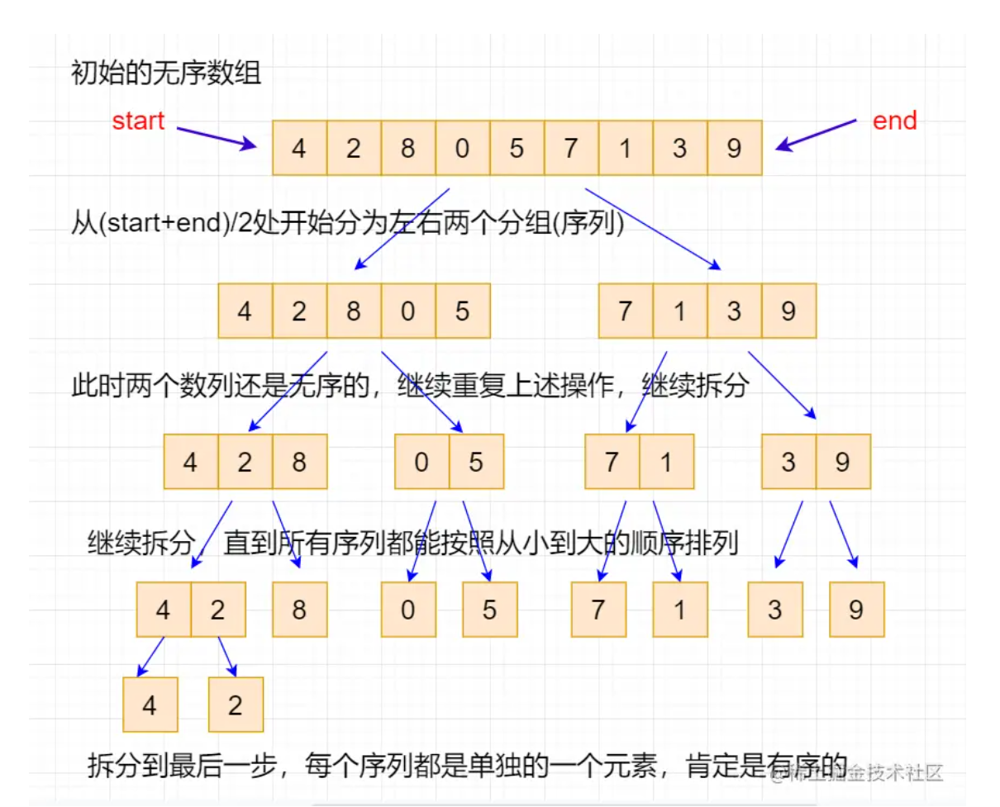
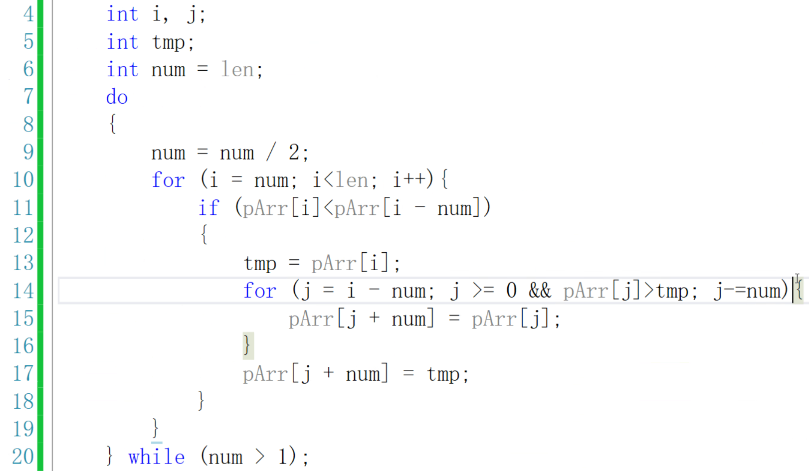

# 图论数据结构


## 0831日

### 1.笔试题：翻转数组


笔试题：【能利用C语言实现反转函数】；

```
E:\Code\vs2019_code\0831\Debug\0831.exe
#include<iostream>
#include<algorithm>
using namespace std;
void Swap(int* pa, int* pb) {
	int temp;
	temp = *pa;
	*pa = *pb;
	*pb = temp;
}
void Reverse(int* p, int start, int stop) {
	while (start < stop) {//不要逞强，在这里while(start++<stop--)，否则还没有交换，start和stop就更改了;
		Swap(&p[start], &p[stop]);
		start++, stop--;
	}
}
void Rotate(int* p, int len, int k) {
	Reverse(p, 0, len - 1);
	Reverse(p,0, len - 1 - k);
	Reverse(p,len - k, len - 1);
}
int main() {
	int arr[] = { 1,2,3,4,5,6,7,8,9,10 };
	int len = sizeof(arr) / sizeof(arr[0]);
	int k;
	cin >> k;//输入一个下标
	k %= len;//也可以if判断k是否合法
	for (int i = 0; i < len; i++) {
		printf("%d\t", arr[i]);
	}
	printf("\n");
	Rotate(arr,len,k);
	for (int i = 0; i < len; i++) {
		printf("%d\t", arr[i]);
	}
	printf("\n");
	return 0;
}
```

### 2.合并两个有序数组

两种思路：

1-创建新的数组（在堆上）

2-不创建新的数组？？？？？？？？？


```
#include<iostream>
#include<stdlib.h>
int main() {
	int a[] = { 1,5,9,10,15 };
	int b[] = { 2,3,4,5,11,16 };
	int len1 = sizeof(a) / sizeof(a[0]);
	int len2 = sizeof(b) / sizeof(b[0]);
	int len3 = len1 + len2;
	int* c = (int*)malloc(sizeof(int) * len3);
	int i = 0,j = 0,k = 0;
	memset(c, 0, sizeof(int) * len3);
	while (i < len1 && j < len2) {
		if (a[i] < b[j]) {
			c[k++] = a[i++];
		}
		else {
			c[k++] = b[j++];
		}
	}
	if (i >= len1) {
		for (int i = j; i < len2; i++) {
			c[k++] = b[i];
		}
	}
	else {
		for (; i < len1; i++) {
			c[k++] = a[i];
		}
	}
	for (int i = 0; i < len3; i++) {
		printf("%d\t", c[i]);
	}
	free(c);
	return 0;
}
```

### 3.合并链表


### 4.单链表的逆序

【面试中的笔试题不太容易的地方用注释】；

1.一个指针指向第二个节点，第一个结点的next指向NULL；将第二个节点插入头结点和第一个结点的中间.....即头插法；

## 0904日

### 栈

栈的应用：后缀表达式求值+数值转换+括号匹配+迷宫问题+


顺序栈和链式栈的代码实现，前者更重要；

```
//0904
#include"link.h"
Stack* CreateStack() {
	Stack* p = (Stack*)malloc(sizeof(Stack));
	if (p == NULL)return NULL;
	//void* memset(void* ptr, int value, size_t num);所以说malloc后面的括号有多大就memset多大

	memset(p, 0, sizeof(Stack));//memset(p,0,sizeof(p));error
	p->iTop = -1;
	return p;
}
int Push(Stack* pStack, data_t tdata) {
	if (pStack == NULL)return TYPE_ERR;
	if (IsFull(pStack) == TYPE_FULL)
	{
		printf("栈满了\n");
		return TYPE_FULL;
	}
	pStack->data[++pStack->iTop] = tdata;
	printf("插入了%d\n", pStack->data[pStack->iTop]);
	return TYPE_OK;
}
int Pop(Stack* pStack, data_t* pData) {
	if (pStack == NULL)return TYPE_ERR;
	if (IsEmpty(pStack) == TYPE_EMPTY)
	{
		printf("栈为空\n");
		return TYPE_EMPTY;
	}
	*pData = pStack->data[pStack->iTop--];
	printf("%d出栈\n", *pData);
	return TYPE_OK;
}
int GetTop(Stack* pStack) {
	if (pStack == NULL)return TYPE_ERR;
	return pStack->iTop;
}
int IsEmpty(Stack* pStack) {
	if (pStack == NULL)return TYPE_ERR;
	return pStack->iTop == -1 ? TYPE_EMPTY : TYPE_OK;
}
int IsFull(Stack* pStack) {
	if (pStack == NULL)return TYPE_ERR;
	return pStack->iTop == SIZE-1 ? TYPE_FULL : TYPE_OK;
}
void Print(Stack* pStack) {
	for (int i = 0; i <= pStack->iTop; i++) {
		printf("%d\t", pStack->data[i]);
	}
	printf("\n");
}

```

### 队列

队列应用：消息队列+网络数据传输

队列是**尾插头删**

应用：排队机的设计，消息队列，缓冲队列；

头删除尾插入+先进先出；

底层是线性表；存储结构分为：顺序存储+链式存储；

循环队列是队列中最常见的；

重点是出队+入队；

**出队操作队头指针，入队操作队尾指针；**

顺序存储：在SIZE的大小的连续空间上，利用head,tail指针，控制入队和出队；


这就是顺序存储的队列；

下面开始链式存储的队列；


下面是循环队列：它是用循环链表实现的；

## 快速排序Acwing

```
//1.理解代码模板
//2.背诵代码模板
//3.能快速复现代码模板
//4.不时地复习by模板题
//5.写完一个题之后，删掉重新写至少三遍

//快速排序基于分治，选择一个分界点x，保证左侧的数都小于等于x，右侧都大于等于x；
//递归处理左右两端，落实到算法上就是i在左边，j在右边，然后往中间移动；
#define _CRT_SECURE_NO_WARNINGS -1
#include<iostream>
using namespace std;
const int N = 1e6 + 10;
int n;
int q[N];
void quick_sort(int q[], int l, int r) {
	if (l >= r)return;
	int x = q[(l+r)/2], i = l - 1, j = r + 1;
	while (i < j) {
		do i++; while (q[i] < x);
		do j--; while (q[j] > x);
		if (i < j)swap(q[i], q[j]);
	}
	quick_sort(q, l, j);
	quick_sort(q, j + 1, r);
}
int main() {
	scanf("%d", &n);
	for (int i = 0; i < n; i++)scanf("%d", &q[i]);//&q[i];
	quick_sort(q, 0,n-1);
	for (int i = 0; i < n; i++)printf("%d ", q[i]);
	return 0;
}
```


上述为快排的那种不好记忆的模板，不能随意更换字母，会造成边界问题从而带来死循环问题；最好记忆开头那种；

代码模板以最标准的为例子记忆，这是经过考验的；

## 归并排序Acwing

```
#include<iostream>
using namespace std;
const int N = 1e6 + 10;
int q[N];
int n;
int tmp[N];
void merge_sort(int q[], int l, int r) {
	if (l >= r)return;//此时说明数组中只有一个数或者，没有数，就不必排序了；
	int mid = l + r >> 1;
	merge_sort(q, l, mid), merge_sort(q, mid + 1, r);
	int i = l, j = mid + 1, k = 0;
	while (i <= mid && j <= r) {
		if (q[i] <= q[j])tmp[k++] = q[i++];
		else tmp[k++] = q[j++];
	}
	while (i <= mid)tmp[k++] = q[i++];
	while (j <= r)tmp[k++] = q[j++];
	for (int i = 0, j = l; j <= r; i++, j++)q[j] = tmp[i];
}
int main() {
	scanf("%d", &n);
	for (int i = 0; i < n; i++)scanf("%d", &q[i]);
	merge_sort(q, 0, n - 1);
	for (int i = 0; i < n; i++)printf("%d ", q[i]);
	return 0;
}
```


它的关键是归并，也就是说第一次对left right两个数组排序之后，然后要把两个数组合起来【两个有序的数组合并成一个更有序的数组】，此时开一个tmp数组，两个原来数组作为基础按小进行写入，然后再写回到q数组中去；

## 字符串匹配（TODO）


字符串匹配是在计算机科学和信息检索领域中的一个基本问题。它涉及在一个较长的文本字符串（通常称为"主串"或"文本"）中查找一个较短的字符串（通常称为"模式串"或"模式"）的过程。


```
https://www.bilibili.com/video/BV14E411G7d5/?spm_id_from=333.337.search-card.all.click&vd_source=355fe13b62ac41072b7ac70adc02bd34
```

```
https://blog.csdn.net/qq_44695386/article/details/119494204
[xun'haun'd]
```

## 0906日

数据结构分为：线性结构，非线性结构

### 递归


【上述循环，是while循环，但是在一个while中，right，left需要改变】；


【上述代码，不是while循环，但是需要return】，

```
#include<iostream>
//int BinaryFind(int q[], int l, int r,int key) {
//    if (l > r)return -1;
//    int mid = (l + r) >> 1;
//    if (key < q[mid]) return BinaryFind(q, l, mid, key);
//    else if (key > q[mid]) return BinaryFind(q, mid + 1, r, key);
//    else return mid;
//}
//int main() {
//    int q[] = { 1, 2, 4, 5, 6, 8, 9, 10, 12 };  // 确保数组是有序的
//    int len = sizeof(q) / sizeof(q[0]);
//    int key = 6;
//    int ret = BinaryFind(q, 0, len - 1,key);
//    std::cout << ret << std::endl;
//}
int fun(int q[], int l, int r, int key) {
    while (l < r) {
        int mid = (l + r+1) >> 1;
        if (key < q[mid])r = mid - 1;
        else if (key > q[mid]) l = mid;
        else return mid;
    }
    return -1;
}
int main() {
    int q[] = { 1, 2, 4, 5, 6, 8, 9, 10, 12 };  // 确保数组是有序的
    int len = sizeof(q) / sizeof(q[0]);
    int key = 99;
    int ret = fun(q, 0, len - 1, key);
    std::cout << ret << std::endl;
}
```


【我认为：y总那种是迭代版本的实现，】


### 快速排序_杨老师版本


找一个值作为标记，一轮结束让小于49的往左，反之往右；

但是此时，以标记为分界，两边还是无序的，所以继续排：左边排序，右边排序；

快排的时间复杂度是O(N*logN);


### 归并排序_杨老师版本

划分到每组只有一个元素，然后合并；动图如下：


或者也可以看：


两小时15min后；

总的来说：递归分割为单个元素的序列,然后按照递归过来的相反的顺序merge回去，期间需要借用临时数组存一下，然后kao'bei





如上，归并排序是需要占用额外空间的，我们上一个图将数组拆分为一个一个的小的序列之后呢。就要自底向上归并了：
```
int i = l,j = mid+1,k = 0;//k为额外数组的起始位置；
```


### 希尔排序_杨老师版本


简单来说：选间隔(刚开始可以选择0，mid...作为刚开始要排的数字)，让这几个数插入排好序，然后这几个数紧挨着的右边的这几个数（下标为1,mid+1,....）进行插入排序，一轮完毕后；缩小间隔.....最后间隔变为1，相当于对于原来数组进行了一次插入排序；所以我们说它是插入排序的扩展；

杨老师版本：


这个代码其实不好阅读，注意一点：num就是gap就是间隔，刚开始gap就是长度的一半，然后从那里开始往后走，遍历一轮之后换间隔即可；在一轮中：如果发现遇到的元素比较小，比前一个间隔那里的还小，那就先存起来到tmp中，然后从前一个间隔那里开始一直往前走，走的步伐是间隔，谁比我大，你就往我这儿放，反正我在tmp保存着.....然后找到tmp合适的位置for循环就跳出来了，此时把tmp元素给贴上去即可。然后返回到第一层for循环中去，继续循环。

### 希尔排序_网络版本：

```
void shell_sort(int arr[], int len) {
    int gap, i, j;
    int temp;
    for (gap = len >> 1; gap > 0; gap >>= 1) {  // 循环控制间隔的缩小
        for (i = gap; i < len; i++) {  // 对每个子序列进行插入排序
            temp = arr[i];
            for (j = i - gap; j >= 0 && arr[j] > temp; j -= gap) {
                arr[j + gap] = arr[j];
            }
            arr[j + gap] = temp;  // 插入元素到正确位置
        }
    }
}

作者：Pigwantofly
链接：https://www.acwing.com/solution/content/199138/
来源：AcWing
著作权归作者所有。商业转载请联系作者获得授权，非商业转载请注明出处。
```

### 基数排序_杨老师版本

基本思路：每一位0-9共10位，所以需要10个桶，第一轮，根据末位数字大小分别放入桶中，然后按照顺序拿出来，循环往复，直到比较到最高位的数字；这种排序不需要比较大小，只需要开辟额外空间，不断地放入取出即可；

```
#include <stdio.h>
#include <stdlib.h>
#include <string.h>

int getCnt(int n) {//求解一个数有多少位
    int ret = 0;
    if (n == 0)return 1;
    while (n!=0) {
        n /= 10;
        ret++;
    }
    return ret;
}
void Print(int q[], int len) {
	for (int i = 0; i < len; i++) {
		std::cout << q[i] << " ";
	}
	puts("");
}
int getMax(int q[], int len) {//求解数组中最大值
	int ret = q[0];
	for (int i = 1; i < len; i++) {
		if (q[i] > ret)ret = q[i];
	}
	return ret;
}
void Base_sort(int q[], int len) {//基数排序（桶排序？）
	int Y = 1;
	int max_val = getMax(q,len);//最大值
	int n = max_val, m = len + 1;
	int cnt = getCnt(max_val);//最大值的位数
	int mem[10][100];//需要10个桶，每个桶元素最多存放所有元素，加上1个存放数量的，即len+1;
	while(cnt--) {//循环最大值的位数次，最后从桶里拿出来的数据就是答案
		memset(mem, 0, sizeof(mem));//切记：每轮次都得初始化桶
		for (int i = 0; i < len; i++) {
			int tmp = q[i] / Y % 10;
			mem[tmp][++mem[tmp][0]] = q[i];
		}
		int k = 0;
		for (int i = 0; i < 10; i++) {
			for (int j = 1; j <= mem[i][0]; j++) {
				q[k++] = mem[i][j];
			}
		}
		Print(q, len);//可以打印一轮下去排序的结果
		Y *= 10;
	}
	
}
int main()
{
	int a[] = { 614, 38, 921, 485, 101, 5, 530, 790, 306 };
	int len = sizeof(a) / sizeof(int);
	Base_sort(a, len);
	Print(a, len);
	return 0;
}
```

## 冒泡-选择排序已经讲了（TODO）

### TODO

```
https://juejin.cn/post/6844903778387230734
//计数排序vs基数排序vs桶排序
```

## 哈希表-yxc第三章

哈希函数：将-10^9-10^9的数字映射到0-10^5;

一般直接取模即可；当然了产生了冲突（将两个不一样的数字映射到了同一个数字），怎么解决冲突？分为两种方法：开放寻址法+拉链法；

离散化是特殊的哈希；

一般算法是对于数的查找+添加；一般删除很少，若遇到则开一个bool数组标记一下；

### 拉链法：


开一个数组，然后在下面挂值；


此代码可以找到大于等于100000的第一个质数，然后const int N = 100003;其中N量级为题目中告诉映射的大小；

```
https://www.acwing.com/problem/content/842/
```


第12行，先模再加再模，从而可以把很小的数映射到哈希表上，且避免了爆int；


### 开放寻址法：

对于一个数，hash后为k，插入的话，看一下h[k]有没有人，若有，下一个人；

查找：若当前坑位有人，看看是不是x，若不是，找下一个，若没人，则x没有；

删除：同上，找到后对x标记；

它只需要开一个数组，但是长度是2-3倍，且质数；

null初始化为0x3f3f3f3f；用来表示一个不在区间中的数，用来区分找到了x的位置还是x不在h数组，你返回了他应该的位置；

12行算出了x这个数字应该放的下标，但是这个下标有可能是有人的，所以利用while循环去寻找是否有人，while循环的条件应该是朝着进入while循环的方向努力，比如你这个数不是null（我们memset的值）而且还不是x，那说明有人了，所以k++，反之有一个条件不成立，说明找到了x或者找到了x的位置，17是防止k走到了结尾，所以做了一个判断；

//find函数：若x存在，则返回x的位置，若不存在，则返回它应该存储的位置；

```
#include<iostream>
#include<cstring>
using namespace std;
const int N = 200003,null = 0x3f3f3f3f;
int h[N];
int n;
int find(int x){
    int k = (x%N+N)%N;
    while(h[k]!=null&&h[k]!=x){
        ++k;
        if(k==N)k = 0;
    }
    return k;
}
int main(){
    scanf("%d",&n);
    memset(h,0x3f,sizeof(h));
    while(n--){
        char op[2];
        int x;
        scanf("%s%d",op,&x);
        int k = find(x);
        if(*op=='I'){
            h[k] = x;
        }
        else{
            if(h[k]!=null){//h[k]
                puts("Yes");
            }
            else{
                puts("No");
            }
            
        }
        
    }
    
    
}
```

### 字符串哈希


h[i]存储前i个字母的哈希值；前i个字母每个看作一位，然后转为十进制，当然了这个十进制可能很大，所以需要对Q取模；

至此，我们把任何一个字符串映射到0-Q-1的数字；

经验：P取131或者13331，Q取2^64次方的话，不太可能会哈希冲突；


```
01:08:37 problem/content/843
```

应用：当要判断两个字符串是否相等的时候就可以用这个做法；本来比较两个字符串是否相等需要一个一个字符比较，O(N)的，但字符哈希是O(1);

KMP可以用来求解循环节，但是这个不行，其他的，这个都可以；

它的本质是把字符串看做数字，然后比较是否相等；从而判断字符串是否相等；

## STL-Acwing


### vector

vector<int> a[10]定义了10个vector；

a.size()返回元素个数而非大小，empty（）返回是否为空，这几个容器都有；时间复杂度是O（1）的，他有一个变量存储；

vector还有clear，其他不一定有；


所以vector应该减少申请次数，你甚至可以多申请一点；它基于倍增的思想；每次数组长度不够的时候，申请长度*2，然后把元素拷贝过来；


vector也支持比较运算，按照字典序来比较；

### pair

pair存储一个二元组；

如pair<int ,string> p; 取第一个元素p.first()  p.second ，它也可以按照字典序（以first为第一关键字）来比较


make_pair用来构造pair，C++11中还可以像第二种；

还可以pair<int ,pair<int,string>> p;

### string

string a = "yxc"; cout<<a.substr(1,2)<<endl;//返回从1开始两个字符；如果第二个参数省略或者超过了结尾，那么会输出到结束停止；

string s = "hianxian";

printf("%s\n",s.c_str());//输出hianxian，注意printf无法直接输出string类型，所以使用这种方法让printf输出string；

### queue

push插入队尾；pop弹出对头；他没有clear；有front，back，empty；

没有clear，怎么清空?queue<int> q; q = queue<int>();即可

优先队列（用堆实现）priority_queue

push top pop ，默认大根堆；


如上为小根堆；你也可以插入时把-x插入进去，沉到下边；


### deque

size empty clear front back push_back pop_back push_front pop_front [] begin end

deque比较慢，比vector，慢；

C++中substr（x,y）y是长度而不是截至位置；

### set

非常适合去重；

```
#include<set>

set<int> s;

s.insert(val);

s.erase(val);

s.size();

s.find(x);

s.count(x);//要么是1，要么是0

s.empty();

//#include<set>
//#include<iostream>
//using namespace std;
//int main() {
//	set<int> s;
//	s.insert(24);
//	s.insert(241);
//	s.insert(240);
//	s.insert(240);
//	s.insert(240);
//	s.insert(240);
//	s.insert(240);
//	s.insert(240);
//	for (auto i = s.begin(); i != s.end(); i++) {//s!=s.end()
//		cout << *i << " ";
//	}
//	puts("");
//	s.erase(240);
//	cout << s.size() << endl;
//	for (auto i = s.begin(); i != s.end(); i++) {//s!=s.end()
//		cout << *i << " ";
//	}//它会按照大小输出;
//	puts("");
//}
```

set中如果插入重复元素，那么这个元素会被忽略掉，multiset是可以的；

set支持insert logN的，支持find查找，count返回某一个数字的个数；erase，

set最常用的是lower_bound(x)返回大于等于x的最小的那个数的迭代器

upper_bound()返回大于x的最小的那个数的迭代器；

### map/multimap

insert  输入一个pair参数

erase，输入一个pair或者迭代器，

find

[]


时间复杂度是O(LOgN)的；

### unordered_map _set _multiset _multimap

和下划线右侧的容器基本对应，但好处是增删改查是O（1）的，但不支持lower_bound and upper_bound;

```
#include<iostream>
#include<unordered_set>//和set功能大体一致，内部存储不同；内部是哈希且内部存储无序;
using namespace std;
int main() {
	unordered_set<int> s;
	s.insert(758);
	s.insert(58);
	s.insert(7);
	for (auto i = s.begin(); i != s.end(); i++) {
		cout << *i << " ";//758 58 7
	}
}
```


```
#include<iostream>
#include<unordered_map>
#include<string>
using namespace std;
int main() {
	unordered_map<string, int> h;
	h["apple"] = 10;
	h["orange"] = 20;
	h["banana"] = 30;
	string key = "banana";
	if (h.find(key) != h.end()) {//find返回迭代器
		cout << key << "的值是" << h[key] << endl;
	}
	else {
		cout << "Not Find" << endl;
	}
	for (const auto& pair : h) {
		cout << pair.first << ": " << pair.second << endl;
	}
	h.erase("apple");
	for (const auto& pair : h) {
		cout << pair.first << ": " << pair.second << endl;
	}
	return 0;
}
```


它是将索引经散列函数转换为一个int，通过int作为下标来找对应的值；当然了，可能会存在哈希冲突......分为拉链法+蹲坑法......具体详见：

[【数据结构】散列表(哈希表)_哔哩哔哩_bilibili](https://www.bilibili.com/video/BV1if4y1x7QB/?spm_id_from=333.337.search-card.all.click&vd_source=355fe13b62ac41072b7ac70adc02bd34)


### bitset

bool [1024];需要1024字节，就是1KB，但是bitset可以压位，让一个字节中的八位都用来存储状态，那么就需要1024/8 = 128字节了；

bitset<10000> s;

支持位运算，移位运算，[] ,count（），any（）返回是否至少有一个1，none（）返回是否全为0；set（）把所有位置1；set(k,v)将第k位变为v；

## 时间复杂度（总）

```
https://www.acwing.com/file_system/file/content/whole/index/content/4859/
```

1.可以通过数据范围倒推这道题使用什么算法；

2.能够写出给定代码的时空复杂度；

用O记号表示算法的时间性能；


所以时间复杂度是O(N)的；


稳定性：排序前后，数组原来值的相对位置不变；

## BF算法（TODO）与前面的‘字符串匹配’结合起来：


第一种如上；

第二种如下，它是找第一次能匹配上的下标：


## KMP算法（TODO）

## 哈希表（图论）、

### 模拟哈希表


```
代码详见0911_vs2019_code
我们可以在栈上或者堆上开辟一个HASH*的指针指向我们创建的哈希表，它由N个元素组成，每个元素都是一个LINK*（也就是struct node*）的地址，要么为空，要么存储一个地址，指向一个node，而这个node->next也可能指向下一个node.....
它主要采用传入的num的末位作为索引，然后插入到对应的位置。这是最初级的哈希表模拟；
```

### 面试：怎么解决哈希冲突？

### TODO？？：


为啥？为什么不直接改动?


### 作业（哈希表实践）

利用哈希表实现输入英文，输出汉语；0911作业：


二级哈希解决某一个哈希值过多的问题（比如：学校中张姓学生太多）；


## 二叉树（就业）

笔试题：

### 判断子树是否存在：

```
https://www.nowcoder.com/practice/4b91205483694f449f94c179883c1fef?tpId=60&&tqId=29483&rp=1&ru=/activity/oj&qru=/ta/tsing-kaoyan/question-ranking
```

```
#include <stdio.h>
struct TreeNode{
    struct TreeNode* left;
    struct TreeNode* right;
    char val;
};
struct TreeNode* CreateTree(char a[],int *pi){
    if(a[*pi]=='#'){//如果不是'#'就不要急着++，不然把一个字符就跳过去了;
        (*pi)++;
        return NULL;
    }
    struct TreeNode*root = (struct TreeNode*)malloc(sizeof(struct TreeNode));//root是局部的变量，但是下一层返回的时候会把它的地址返回给上一层，然后他自己就销毁了，但是上一层会有一个left or right来接受这个值从而把它挂在这一层的左/右子树上，然后接着去构建本层的右树或者return root给本层的上一层；
    root->val = a[*pi];
    (*pi)++;
    root->left = CreateTree(a ,pi);
    root->right = CreateTree(a ,pi);
    return root;
}
void postorderTree(struct TreeNode*root){//函数名应该是Inorder();
    if(root==NULL)return;
    postorderTree(root->left);
    if(root->val!='#')//这个可以不要，因为前面有if(root==NULL)return;
    printf("%c ",root->val);
    postorderTree(root->right);
}
int main() {
    char a[100];
    scanf("%s",a);
    int i = 0;
    struct TreeNode* root = CreateTree(a,&i);
    postorderTree(root);
    return 0;
}
```

### 二叉树层序遍历

```
https://leetcode.cn/problems/binary-tree-level-order-traversal/description/
```

```
class Solution {
public:
    vector<vector<int>> levelOrder(TreeNode* root) {
        vector<vector<int>> res;
        if (root == NULL)
            return res;
        queue<TreeNode*> q;//queue<struct TreeNode*> q;写两个都可以，为什么？？？
        q.push(root);
        while (!q.empty()) {
            int sz = q.size();
            vector<int> subVector;
            for(int i = 0;i<sz;i++){
                TreeNode* tmp = q.front();
                q.pop();
                subVector.push_back(tmp->val);
                if(tmp->left)
                    q.push(tmp->left);
                if(tmp->right)
                    q.push(tmp->right);
            }
            res.push_back(subVector);
        }
        return res;
    }
};
```


完全二叉树要求：前k-1层是满的，第k层也要从左到右连续；

满二叉树是特殊的完全二叉树；

### 判断一棵树是不是完全二叉树（TODO）

采用队列存储二叉树的节点，首先把root入队，while如果队列不为空，让front指向队列首元素，然后pop，然后让front的左右孩子进队，然后继续循环，直到这个front节点是空，此时break。出去判断队列剩余元素是是否存在非空元素，若有，则清空队列，并返回不是完全二叉树，反之都是NULL，则是；这道题依赖二叉树的层序遍历来完成；

代码（TODO）

## 销毁一棵二叉树（TODO）

采用后续遍历的方式，递归销毁，如果传入一级指针，则出去后还要销毁root，如果是二级指针，则在此函数内就销毁包括root在内的所有在堆上开辟的内存；

二叉树的前序遍历可以认为是DFS（中序后序原则上也可以）；层序遍历是BFS；


## GCC10.0安装 

### 本应该正确的方法：

以下是创建新用户并安装新版本 GCC 的步骤：

1. 创建新用户：

```bash
sudo adduser testuser
sudo passwd testuser
```

2. 为新用户添加 sudo 权限（如果需要）：

```bash
sudo usermod -aG wheel testuser
```

3. 切换到新用户：

```bash
su - testuser
```

4. 现在，作为新用户，安装 SCL 和新版本的 GCC：

```bash
sudo yum install centos-release-scl
sudo yum install devtoolset-10
```

5. 启用新版本的 GCC：

```bash
scl enable devtoolset-10 bash
```

6. 验证 GCC 版本：

```bash
gcc --version
g++ --version
```

7. 如果您希望在这个用户下默认使用新版本的 GCC，可以将以下行添加到新用户的 .bashrc 文件中：

```bash
echo "source scl_source enable devtoolset-10" >> ~/.bashrc
```

8. 测试新版本 GCC：
   创建一个简单的 C++ 程序来测试新特性，例如：

```cpp
#include <iostream>

int main() {
    auto lambda = [](auto x, auto y) { return x + y; };
    std::cout << "Sum: " << lambda(5, 3) << std::endl;
    return 0;
}
```

   保存为 test.cpp，然后编译和运行：

```bash
g++ -std=c++20 test.cpp -o test
./test
```

这样，您就可以在新用户环境下安全地测试新版本的 GCC 了。如果遇到任何问题，它不会影响到您的主系统环境。

如果一切正常，并且您决定在主用户账户中也使用这个新版本的 GCC，您可以重复这些步骤（除了创建新用户的部分）在您的主账户中进行安装。

记住，当您完成测试后，可以使用 `exit` 命令退出新用户的 shell 环境，回到您的主用户账户。

### 国内方法(无法使用)：

```
wget https://ftp.gnu.org/gnu/gcc/gcc-10.2.0/gcc-10.2.0.tar.gz

tar zxvf gcc-10.2.0.tar.gz

cd gcc-10.2.0

#下载依赖

./contrib/download_prerequisites

mkdir build-dir

cd build-dir

../configure --prefix=/home/xx/app/gcc102 --enable-bootstrap  --enable-checking=yes --enable-languages=c,c++  --disable-multilib

make -j14

make install
```


## scanf和cin的区别

前者会把回车和空格当字符读进去，cin不会；

char op[2];  那么*op相当于op[0] ;

在数学上，余数都是正的，但是在C++里。余数不一定是正数；


memset()是按照字节来操作的，常见的memset（xxx，0，xxx）和memset（xxx，-1，xxx）；是因为，0和-1的每一个字节都是0和-1；一个int如果是0x3f3f3f3f的话，那么每一个字节也都是0x3f，所以memset写作memset(xxx,0x3f,xxx);


红黑树是平衡二叉树的一种；

***

***


## 把算法基础课所有习题做完+基础课看完


## 第三章的最短路和DFSBFS重点学习；重要的是把例题做了

## 二叉树（图论）


叶子结点的度为零；

能分清楚二叉树，多叉树，森林；

所有树都能转换为二叉树；


二叉树有好多性质：

- 二叉树的第i层最多有2^（i-1）个节点；最少有一个（不是0，如果是0那么就没这一层）；
- 深度为k的二叉树，最多有（2^k）-1个节点；这也就是说满二叉树如果深度为k的话，节点有（2^k）-1个节点；
- 叶子节点数目=度为2的节点数目+1；
- k层的完全二叉树，问有多少个节点？深度为k-1的二叉树节点最多有（2^(k-1）-1)节点，第k层在此加上1个或者2^(k-1)节点即可；
- 
- 怎么算出来的？
- n个节点的完全二叉树，依次编号，请问：编号为i的节点的双亲序号是多少？

二叉树的顺序存储（使用数组的话）很浪费空间，所以一般使用链式存储；

能快速写出给定二叉树的三种遍历过程：


前：ABDGCEHF

中：DGBAEHCF

后：GDBHEFCA

前缀表达式又叫波兰表达式

后缀表达式又叫逆波兰表达式

知道某二叉树的某序遍历结果（带NULL），请你构建二叉树，并给出另外两种遍历结果；我记得上面有这样一道OJ题；

另外一类题：根据两种结果，求另一类结果：


注：先序+后序不能求出结构；


